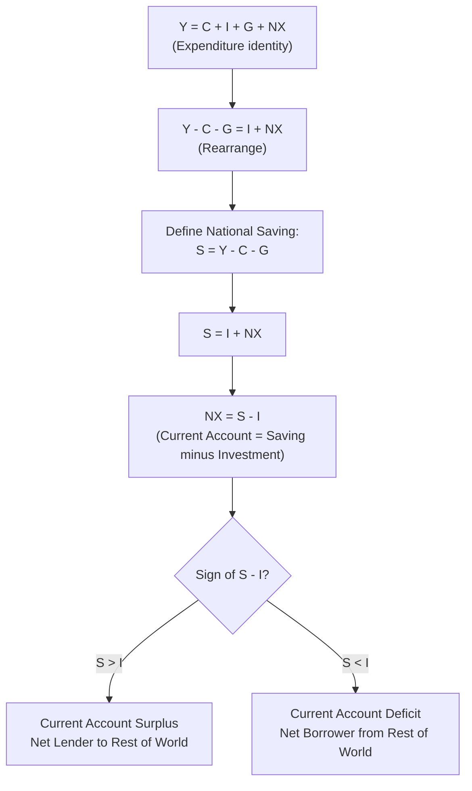

## National Income Identities in an Open Economy

### Overview

National income accounting identities describe the mechanical relationships among aggregate output, expenditure, and income in an economy. In an open economy, these identities must incorporate transactions with the rest of the world — exports, imports, and international income flows — linking domestic macroeconomic aggregates directly to the balance of payments. Understanding these identities is foundational to open-economy macroeconomics because they reveal, as a matter of accounting logic rather than behavioral theory, how a country's saving, investment, and government budget decisions are mechanically connected to its current account balance.

### The Basic Open-Economy Output Identity

Gross Domestic Product (GDP), from the expenditure side, is defined as:

$$Y = C + I + G + NX$$

where:

- $C$ = private consumption expenditure
- $I$ = private investment expenditure (including inventory changes)
- $G$ = government spending on goods and services
- $NX = EX - IM$ = net exports (exports minus imports)

This differs from the closed-economy identity ($Y = C + I + G$) only by the addition of $NX$, but this addition is what opens the model to the entire apparatus of exchange rates, capital flows, and international policy interdependence covered elsewhere in this course.

### From GDP to GNP/GNI: Incorporating Factor Income

**Gross Domestic Product (GDP)** measures output produced *within* a country's borders, regardless of who owns the factors of production. **Gross National Product (GNP)**, or equivalently **Gross National Income (GNI)**, adjusts for cross-border ownership of factors of production:

$$GNP = GDP + NFIA$$

where $NFIA$ = **Net Factor Income from Abroad** (income earned by domestic residents on foreign-owned assets and labor, minus income earned by foreign residents on domestically-owned assets and labor).

- If domestic residents earn more from foreign investments/labor than foreigners earn domestically, $NFIA > 0$ and $GNP > GDP$.
- This distinction matters for countries with large stocks of foreign assets or liabilities, or significant labor remittance flows. [Inference — the practical size of this gap varies enormously by country; some small economies with large multinational presence show substantial GDP-GNP divergence]

### The Current Account and Its Components

The **Current Account (CA)** is a broader balance-of-payments concept than $NX$ alone:

$$CA = NX + NFIA + NUT$$

where $NUT$ = **Net Unilateral Transfers** (e.g., foreign aid, remittances, and other one-way transfers not linked to a factor payment or good/service exchange).

In many simplified textbook treatments, $NFIA$ and $NUT$ are set aside or assumed small, allowing $CA \approx NX$; however, the full identity is important for countries with substantial remittance inflows/outflows or foreign asset income. [Inference]

### Deriving the Saving-Investment-Current Account Identity

Starting from the expenditure identity and rearranging to isolate $NX$ (or $CA$, under the simplifying assumption $CA \approx NX$):

$$Y - C - G = I + NX$$

The left-hand side, $Y - C - G$, is **national saving** $S$ (the sum of private saving $S_p = Y - T - C$ and public saving $S_g = T - G$, since $T$ cancels):

$$S = S_p + S_g = (Y - T - C) + (T - G)$$

Substituting back:

$$S = I + NX$$

Rearranging gives the **fundamental open-economy saving identity**:

$$NX = S - I \equiv CA$$

**This is a cornerstone identity in open-economy macroeconomics**: a country's current account balance is, by definition, equal to the excess of national saving over domestic investment. A country running a **current account surplus** ($CA > 0$) is a net saver relative to its investment needs and is a net lender to the rest of the world; a country running a **current account deficit** ($CA < 0$) is investing more than it saves domestically and is a net borrower from the rest of the world.

### Diagram: Flow of the National Income Identity Derivation

### Decomposing National Saving: Private and Public

$$S = S_{private} + S_{public} = (Y - T - C) + (T - G)$$

Substituting into $NX = S - I$:

$$NX = (Y - T - C) - I + (T - G)$$

This decomposition connects the current account directly to **fiscal policy**: holding private saving and investment behavior constant, a larger government budget deficit ($G > T$, so $S_{public} < 0$) mechanically implies a smaller $NX$ (all else equal) — this is the accounting basis for the **"twin deficits" hypothesis**, which links government budget deficits to current account deficits (though the empirical strength of this link depends on how private saving responds, a matter of behavioral economics rather than pure accounting). [Inference — the twin deficits relationship is an empirical regularity/hypothesis, not a strict identity, since private saving can offset fiscal changes]

### The Balance of Payments: Current Account and Financial Account

The full **Balance of Payments (BOP)** identity states that the current account and the capital/financial account must sum to (approximately) zero, since every international transaction generates an offsetting financial flow:

$$CA + KA + FA = 0$$

(where $KA$ = capital account, typically small, covering items like debt forgiveness and non-produced non-financial assets; $FA$ = financial account, covering cross-border asset transactions — direct investment, portfolio investment, and reserve asset changes)

In simplified treatments where $KA \approx 0$:

$$CA \approx -FA$$

A current account deficit is thus definitionally matched by a **net financial inflow** (foreign purchases of domestic assets, borrowing from abroad, or reserve depletion) — this is the accounting mirror image of the $NX = S - I$ identity: a country investing more than it saves domestically must finance the gap by attracting foreign capital.

### Diagram: The Balance of Payments Circular Flow (svg_diagram)

<svg viewBox="0 0 640 400" xmlns="http://www.w3.org/2000/svg" font-family="Arial, sans-serif">
<text x="320" y="26" text-anchor="middle" font-size="15" font-weight="bold">Current Account and Financial Account Linkage (svg_diagram)</text>
<rect x="60" y="80" width="220" height="100" rx="8" fill="#e8f0fe" stroke="#1f77b4" stroke-width="2"/>
<text x="170" y="115" text-anchor="middle" font-size="13" font-weight="bold">Current Account (CA)</text>
<text x="170" y="135" text-anchor="middle" font-size="11">Trade in goods/services</text>
<text x="170" y="152" text-anchor="middle" font-size="11">+ Factor income + Transfers</text>
<rect x="360" y="80" width="220" height="100" rx="8" fill="#fdece8" stroke="#d62728" stroke-width="2"/>
<text x="470" y="115" text-anchor="middle" font-size="13" font-weight="bold">Financial Account (FA)</text>
<text x="470" y="135" text-anchor="middle" font-size="11">Foreign direct investment</text>
<text x="470" y="152" text-anchor="middle" font-size="11">Portfolio flows + Reserves</text>
<line x1="280" y1="130" x2="360" y2="130" stroke="black" stroke-width="2" marker-end="url(#a1)" marker-start="url(#a2)"/>
<defs>
<marker id="a1" markerWidth="10" markerHeight="10" refX="8" refY="3" orient="auto"><path d="M0,0 L0,6 L9,3 z" fill="black"/></marker>
<marker id="a2" markerWidth="10" markerHeight="10" refX="1" refY="3" orient="auto"><path d="M9,0 L9,6 L0,3 z" fill="black"/></marker>
</defs>

<text x="320" y="115" text-anchor="middle" font-size="11">CA + FA ≈ 0</text>

<text x="170" y="230" text-anchor="middle" font-size="12">CA deficit (S < I)</text>

<text x="170" y="248" text-anchor="middle" font-size="11" fill="#555">→ net borrowing needed</text>

<text x="470" y="230" text-anchor="middle" font-size="12">Financed by</text>

<text x="470" y="248" text-anchor="middle" font-size="11" fill="#555">net capital inflow (FA surplus)</text>

</svg>

### Worked Numerical Example

Suppose a country reports (in billions of currency units):

- $Y = 20{,}000$
- $C = 14{,}000$
- $I = 3{,}500$
- $G = 4{,}000$

**Step 1 — Solve for NX using the output identity:**

$$NX = Y - C - I - G = 20{,}000 - 14{,}000 - 3{,}500 - 4{,}000 = -1{,}500$$

The country runs a trade deficit of $1{,}500$.

**Step 2 — Verify via the saving-investment identity.** Suppose $T = 4{,}200$ (tax revenue):

$$S_{private} = Y - T - C = 20{,}000 - 4{,}200 - 14{,}000 = 1{,}800$$

$$S_{public} = T - G = 4{,}200 - 4{,}000 = 200$$

$$S = S_{private} + S_{public} = 1{,}800 + 200 = 2{,}000$$

**Step 3 — Compute $NX$ from $S - I$:**

$$NX = S - I = 2{,}000 - 3{,}500 = -1{,}500$$

Both methods agree: $NX = -1{,}500$, confirming the identity holds exactly as an accounting matter (this is definitional, not an empirical result). This country is investing $3{,}500$ but saving only $2{,}000$, financing the $1{,}500$ gap through net borrowing from abroad (a financial account inflow of $1{,}500$).

### Intertemporal Interpretation

The saving-investment-current account identity connects directly to intertemporal trade concepts (developed further elsewhere in this chapter): a current account deficit represents a country "borrowing from the future" — importing more goods and services today than it exports, financed by issuing claims (debt or equity) to foreigners, which must eventually be serviced through future net exports (a future current account surplus) or continued rollover of external debt. [Inference — this framing is standard in intertemporal open-economy models such as those following Obstfeld and Rogoff]

### Common Pitfalls and Clarifications

- **NX vs. CA**: Many introductory treatments use $NX$ and $CA$ interchangeably, but they are only approximately equal when net factor income and net transfers are small or ignored. For countries with large remittance flows or substantial foreign asset holdings, this approximation can be materially inaccurate. [Inference]
- **Accounting identity vs. causal theory**: $NX = S - I$ is **always true by construction** — it does not by itself explain *why* saving or investment change, or which variable adjusts to restore the identity following a shock. Behavioral theories (e.g., how the exchange rate, interest rate, or income responds to a fiscal shock) are needed to determine causation. [Inference — this is a standard methodological caveat in open-economy textbooks]
- **Twin deficits are not guaranteed**: A rising government deficit does not mechanically require a worsening current account if private saving rises to offset it (a idea associated with Ricardian equivalence, discussed elsewhere) — the identity only holds ex post for the sum of all saving components. [Inference]

### Key Points

- The open-economy output identity, $Y = C + I + G + NX$, extends the closed-economy identity with net exports.
- GNP/GNI adjusts GDP for net factor income from abroad; the Current Account further broadens this to include net unilateral transfers.
- The fundamental identity $NX = S - I$ shows that the current account balance equals national saving minus domestic investment, by accounting construction.
- The balance of payments identity, $CA + FA \approx 0$, shows that a current account deficit must be financed by an offsetting net financial account inflow.
- These are accounting identities, not behavioral theories — they constrain outcomes but do not by themselves explain adjustment mechanisms.

**Related Topics**

- The current account and net foreign asset accumulation over time
- Intertemporal budget constraint and the current account
- Twin deficits hypothesis: government and current account balances
- Ricardian equivalence in an open economy
- Balance of payments accounting in detail (current, capital, financial accounts)
- Net International Investment Position (NIIP)
- Sustainability of current account deficits