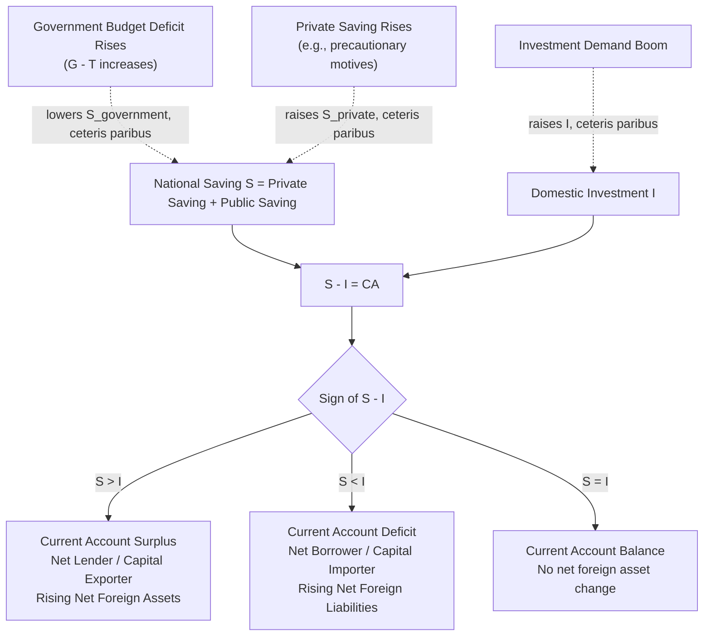
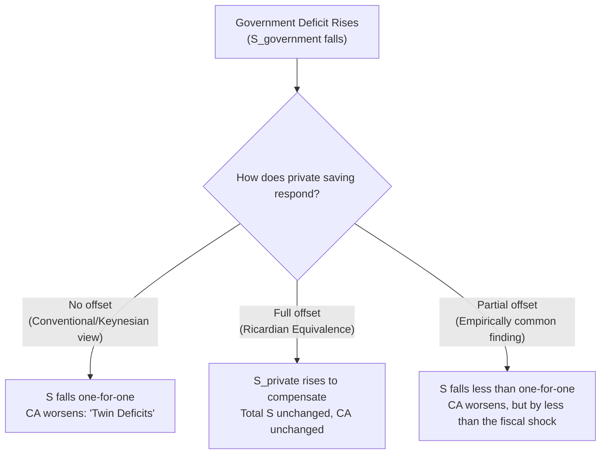

## Saving, Investment, and the Current Account Balance

### Overview

The relationship between national saving, domestic investment, and the current account balance is one of the most important accounting frameworks in open-economy macroeconomics. It establishes that a country's current account position is not an independent phenomenon but a mechanical reflection of the gap between how much a nation saves and how much it invests domestically. This framework reframes discussions of "trade deficits" and "trade surpluses" away from a narrow focus on trade competitiveness and toward the macroeconomic determinants of aggregate saving and investment behavior.

### The Core Identity

Starting from the national income identity $Y = C + I + G + NX$ and defining national saving as $S = Y - C - G$:

$$S = I + NX \quad \implies \quad NX \equiv CA = S - I$$

This identity states that the **current account balance equals national saving minus domestic investment**. It holds as a matter of definition — it is not a testable hypothesis but an accounting tautology that must hold given how the underlying variables are defined.

**Interpretation:**

- $S > I$: the country saves more than it invests domestically; the surplus saving is lent abroad, resulting in a **current account surplus** and net foreign asset accumulation.
- $S < I$: the country invests more than it saves domestically; the shortfall is financed by borrowing from abroad, resulting in a **current account deficit** and net foreign liability accumulation.
- $S = I$: the current account is balanced.

### Decomposing National Saving

National saving separates into private and public components:

$$S = S_{private} + S_{government} = \underbrace{(Y - T - C)}_{S_{private}} + \underbrace{(T - G)}_{S_{government}}$$

Substituting into the core identity:

$$CA = (Y - T - C) + (T - G) - I$$

This decomposition is the analytical bridge to several major policy debates:

- **Fiscal policy and the current account**: Holding $S_{private}$ and $I$ constant, an increase in the government deficit ($G - T$ rises, so $S_{government}$ falls) mechanically reduces $CA$ — this is the accounting foundation of the **twin deficits hypothesis**.
- **Private saving behavior**: A rise in private saving (e.g., due to precautionary motives, demographic shifts, or financial deepening), holding $I$ and fiscal policy constant, raises $CA$.
- **Investment demand**: A rise in domestic investment demand (e.g., from an investment boom or productivity shock), holding saving constant, reduces $CA$ — the country absorbs more resources than it produces, financed by foreign borrowing.

### Diagram: Saving-Investment-Current Account Relationships

### Diagram: The Loanable Funds View of an Open Economy (svg_diagram)

<svg xmlns="http://www.w3.org/2000/svg" viewBox="0 0 640 420" font-family="Arial, sans-serif">
<text x="320" y="24" text-anchor="middle" font-size="15" font-weight="bold">Saving and Investment in an Open Economy (svg_diagram)</text>
<line x1="80" y1="370" x2="580" y2="370" stroke="black" stroke-width="2" />
<line x1="80" y1="370" x2="80" y2="50" stroke="black" stroke-width="2" />
<text x="590" y="375" font-size="13">S, I (quantity)</text>
<text x="45" y="45" font-size="13">r (real interest rate)</text>

<path d="M 150 340 Q 300 220 480 90" stroke="#2ca02c" stroke-width="2.5" fill="none" />
<text x="485" y="85" font-size="12" fill="#2ca02c">S (National Saving)</text>

<path d="M 500 90 Q 350 220 170 340" stroke="#d62728" stroke-width="2.5" fill="none" />
<text x="175" y="355" font-size="12" fill="#d62728">I (Investment)</text>

<line x1="80" y1="180" x2="580" y2="180" stroke="#888" stroke-dasharray="6,4" stroke-width="1.5" />
<text x="90" y="172" font-size="12" fill="#555">r* (world interest rate)</text>

<circle cx="290" cy="180" r="5" fill="black" />
<text x="260" y="200" font-size="11">I at r*</text>
<circle cx="390" cy="180" r="5" fill="black" />
<text x="395" y="200" font-size="11">S at r*</text>

<line x1="290" y1="180" x2="390" y2="180" stroke="#1f77b4" stroke-width="3" />
<text x="300" y="150" font-size="12" fill="#1f77b4">Gap = S - I = CA surplus</text>
</svg>

The domestic interest rate is pinned to $r^*$ under capital mobility (as established in the Mundell-Fleming framework); at this rate, whatever gap exists between desired national saving and desired domestic investment is automatically the current account balance, financed by international capital flows.

### Worked Numerical Example: Fiscal Shock and the Current Account

Assume a small open economy with:

- Private saving function: $S_{private} = 0.2(Y - T)$
- Investment function: $I = 3{,}000 - 100r$, with $r$ pinned at $r^* = 4$
- $Y = 15{,}000$, $T = 3{,}000$, $G = 3{,}000$ initially

**Step 1 — Compute initial saving and investment:**

$$S_{private} = 0.2(15{,}000 - 3{,}000) = 0.2(12{,}000) = 2{,}400$$

$$S_{government} = T - G = 3{,}000 - 3{,}000 = 0$$

$$S = 2{,}400 + 0 = 2{,}400$$

$$I = 3{,}000 - 100(4) = 2{,}600$$

**Step 2 — Compute the initial current account:**

$$CA = S - I = 2{,}400 - 2{,}600 = -200$$

The economy starts with a current account deficit of $200$.

**Step 3 — Government increases spending to $G = 3{,}500$ (holding $T$ constant), worsening the government balance.**

$$S_{government} = 3{,}000 - 3{,}500 = -500$$

$$S = 2{,}400 + (-500) = 1{,}900$$

**Step 4 — Investment is unchanged ($I = 2{,}600$, since $r$ remains pinned at $r^*=4$ under perfect capital mobility):**

$$CA_{new} = 1{,}900 - 2{,}600 = -700$$

**Result**: The current account deficit widens from $-200$ to $-700$ — an exact one-for-one pass-through of the $500$ increase in the government deficit, since neither private saving behavior nor investment demand adjusted to offset it. This illustrates the **strong (Ricardian-neutral) version of the twin deficits hypothesis**; in practice, private saving often responds partially to fiscal changes, dampening (but rarely eliminating) this pass-through. [Inference — the degree of offset is an empirical and behavioral question, not determined by the identity itself]

### The Twin Deficits Hypothesis: Theoretical Debate

The twin deficits hypothesis proposes that government budget deficits and current account deficits move together. Two opposing theoretical benchmarks bound this debate:

**Conventional (non-Ricardian) view**: Consumers do not fully internalize future tax liabilities implied by government borrowing; a tax cut financed by deficit spending raises disposable income and consumption, lowering private saving less than one-for-one against the falling public saving, so $S$ falls and $CA$ worsens — deficits are indeed "twins."

**Ricardian equivalence view**: Forward-looking consumers recognize that a government deficit today implies higher future taxes; they raise private saving one-for-one to prepare for that future tax liability, leaving **total national saving $S$ and the current account unchanged**. Under strict Ricardian equivalence, deficits are *not* twins — the identity $CA = S - I$ still holds, but $S_{private}$ moves to exactly offset $S_{government}$.

- Empirical studies have generally found **partial, not full, Ricardian offset**, meaning fiscal deficits tend to be associated with at least some current account deterioration in practice, though the magnitude and consistency of this relationship vary considerably across countries, time periods, and empirical methodologies. [Unverified — the empirical twin-deficits literature shows mixed results and is sensitive to specification and sample; results should be checked against current studies for precise magnitudes]

### Current Account and Net Foreign Assets: The Dynamic Link

The current account balance is the flow that drives the change in a country's stock of **Net Foreign Assets (NFA)**:

$$NFA_t = NFA_{t-1} + CA_t$$

A persistent current account deficit implies a continuously deteriorating (more negative) NFA position — the country is accumulating external debt or selling off domestic assets to foreigners. This raises long-run sustainability questions (discussed further under intertemporal budget constraints in this chapter): a country cannot run current account deficits indefinitely without limit, since foreign creditors will eventually require rising risk premiums or refuse to continue financing the gap. [Inference — the precise sustainability threshold depends on growth rates, interest rates, and creditor confidence, and is not given by the accounting identity alone]

### Life-Cycle and Intertemporal Perspectives

The saving-investment-current account framework connects to intertemporal consumption smoothing:

- **Countries with young, growing populations or temporary income shocks** may rationally run current account deficits, borrowing against expected future income growth to smooth consumption and fund productive investment.
- **Countries with aging populations or temporarily high income** (e.g., due to a commodity price boom) may run current account surpluses, saving for future retirement-driven dissoaving or income normalization.
- This perspective reframes current account imbalances as potentially **efficient intertemporal trade** rather than inherently problematic, though large or persistent imbalances can also reflect distortions (e.g., underdeveloped financial systems, exchange rate misalignment, or unsustainable fiscal policy). [Inference — this "consumption smoothing" view is a standard intertemporal-approach interpretation, associated with economists such as Obstfeld and Rogoff, but is one lens among several used to interpret real-world imbalances]

### Common Pitfalls and Clarifications

- **Correlation is not causation in the identity**: $CA = S - I$ does not specify which variable moves in response to a shock. Behavioral and general-equilibrium models are required to determine, e.g., whether a fiscal deficit lowers $S$, raises $r$ (crowding out $I$), or some combination, and how the exchange rate mediates the adjustment. [Inference]
- **"Trade deficits are bad" is not implied by the identity alone**: A current account deficit driven by an investment boom (high $I$) financed by foreign capital can be a sign of a productive, growing economy attracting investment, rather than a sign of weakness — context and the underlying driver matter more than the sign of $CA$ itself. [Inference]
- **Global current accounts must sum to approximately zero**: Because one country's current account surplus is definitionally another's deficit (plus statistical discrepancies and measurement errors in global data), persistent global imbalances (e.g., large surpluses in some economies matched by deficits in others) are a recurring subject of international policy debate. [Unverified — precise global imbalance figures should be checked against current IMF/World Bank data]

### Key Points

- The identity $CA = S - I$ shows the current account balance equals national saving minus domestic investment, as an accounting matter.
- National saving decomposes into private and public saving; fiscal deficits mechanically reduce public saving, providing the basis for the twin deficits hypothesis.
- The strength of the fiscal deficit → current account deficit link depends on the degree of Ricardian offset in private saving behavior — a debated empirical question.
- Current account deficits drive a corresponding decline in a country's Net Foreign Asset position over time, raising eventual sustainability considerations.
- Current account imbalances can reflect efficient intertemporal trade (consumption/investment smoothing) rather than automatically indicating a problem.

**Related Topics**

- National income identities in an open economy
- Intertemporal budget constraint and current account sustainability
- Twin deficits hypothesis: empirical evidence
- Ricardian equivalence in open-economy contexts
- Net International Investment Position (NIIP) dynamics
- Life-cycle consumption smoothing and the current account
- Global current account imbalances and policy debates