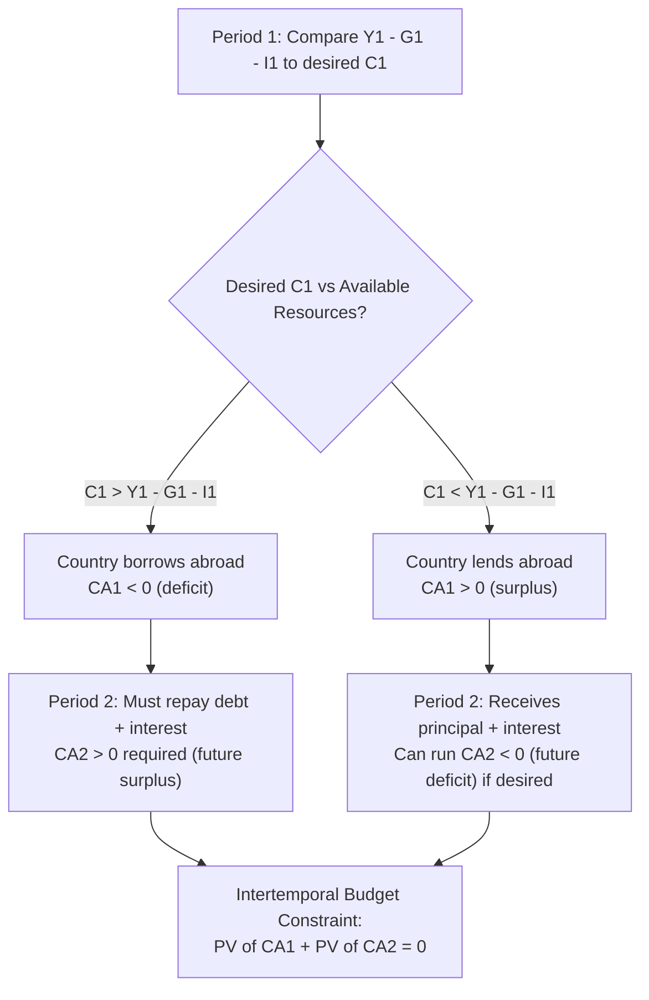
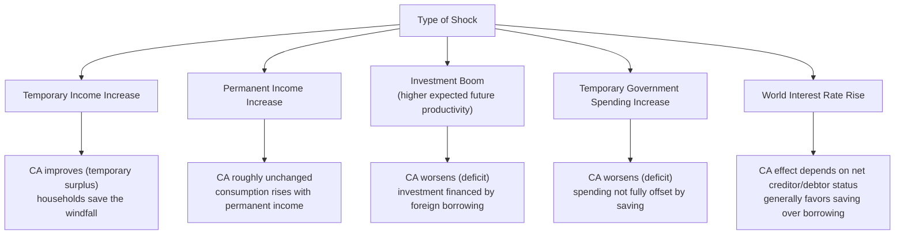

## The Intertemporal Approach to the Current Account

### Overview

The intertemporal approach reframes the current account not merely as an accounting residual ($CA = S - I$) but as the outcome of forward-looking optimizing behavior by households, firms, and governments who choose consumption, saving, and investment paths across time to maximize welfare subject to a lifetime (intertemporal) budget constraint. Under this lens, current account imbalances are understood as the aggregate result of a country's optimal borrowing and lending decisions in response to expected future income, investment opportunities, and the world interest rate — effectively, international trade in goods "across time" rather than only across space. This framework, developed extensively by economists such as Obstfeld and Rogoff, provides the microeconomic foundations underlying the saving-investment identity discussed elsewhere in this chapter.

### Core Idea: Trade Across Time

In a closed economy, a representative household must consume exactly what it produces each period — it cannot borrow or lend to reallocate consumption across time in aggregate. In an **open economy**, a country can trade goods intertemporally with the rest of the world: it can consume more than it produces today (running a current account deficit, effectively "importing" future consumption into the present via foreign borrowing) or consume less than it produces today (running a current account surplus, "exporting" present consumption to the future via foreign lending).

$$CA_t = Y_t - C_t - I_t - G_t$$

A current account deficit today is a claim that foreigners hold against the country's future output; a current account surplus today represents a claim the country holds against foreigners' future output.

### The Two-Period Intertemporal Model

The canonical intertemporal current account model uses a two-period framework (period 1 = "today," period 2 = "future"):

**Period budget constraints:**

$$C_1 + I_1 = Y_1 - CA_1 \cdot (-1) \quad \text{i.e.,} \quad CA_1 = Y_1 - C_1 - I_1 - G_1$$

**Lifetime (intertemporal) budget constraint**, obtained by combining both periods and using the fact that period-1 borrowing must be repaid with interest in period 2:

$$C_1 + \frac{C_2}{1+r} = Y_1 - G_1 + \frac{Y_2 - G_2}{1+r} - I_1 - \frac{I_2}{1+r} \cdot (1+r) \; \text{[simplified form]}$$

More cleanly, defining **permanent (present-value) income** as the discounted sum of net output:

$$PV(\text{net output}) = (Y_1 - G_1 - I_1) + \frac{Y_2 - G_2 - I_2}{1+r}$$

The household/country chooses $C_1, C_2$ to maximize lifetime utility $U(C_1) + \beta U(C_2)$ subject to:

$$C_1 + \frac{C_2}{1+r} = PV(\text{net output})$$

The **Euler equation** governing optimal intertemporal consumption allocation is:

$$U'(C_1) = \beta(1+r) U'(C_2)$$

This says the marginal utility cost of reducing consumption today must equal the discounted marginal utility benefit of higher consumption tomorrow, adjusted for the interest rate return on saving.

### Diagram: Two-Period Intertemporal Trade

### Diagram: Consumption Smoothing via the Current Account (svg_diagram)

<svg xmlns="http://www.w3.org/2000/svg" viewBox="0 0 640 420" font-family="Arial, sans-serif">
<text x="320" y="24" text-anchor="middle" font-size="15" font-weight="bold">Intertemporal Consumption Smoothing (svg_diagram)</text>
<line x1="80" y1="370" x2="580" y2="370" stroke="black" stroke-width="2" />
<line x1="80" y1="370" x2="80" y2="50" stroke="black" stroke-width="2" />
<text x="590" y="375" font-size="13">C2 (Future consumption)</text>
<text x="35" y="45" font-size="13" transform="rotate(0 35 45)">C1</text>

<line x1="150" y1="330" x2="500" y2="90" stroke="#1f77b4" stroke-width="2.5" />
<text x="510" y="85" font-size="11" fill="#1f77b4">Budget line (slope = -(1+r))</text>

<circle cx="280" cy="220" r="6" fill="#d62728" />
<text x="220" y="240" font-size="12" fill="#d62728">Endowment (Y1-G1-I1, Y2-G2-I2)</text>

<circle cx="380" cy="160" r="6" fill="#2ca02c" />
<text x="390" y="150" font-size="12" fill="#2ca02c">Optimal (C1, C2) — borrows in period 1</text>

<line x1="280" y1="220" x2="380" y2="220" stroke="#555" stroke-dasharray="4,3" />
<line x1="380" y1="220" x2="380" y2="160" stroke="#555" stroke-dasharray="4,3" />
<text x="300" y="238" font-size="10">CA1 &lt; 0 (borrow)</text>

<path d="M 300 340 Q 380 200 480 130" stroke="#9467bd" stroke-width="1.5" fill="none" stroke-dasharray="2,2" />
<text x="420" y="200" font-size="10" fill="#9467bd">Indifference curve</text>
</svg>

### Determinants of the Current Account Under the Intertemporal Approach

Given the Euler equation and budget constraint framework, the model predicts the current account responds systematically to:

**1. Temporary vs. Permanent Income Shocks**

- A **temporary** positive income shock (e.g., a one-year commodity price boom) raises $Y_1$ without raising expected $Y_2$ proportionally. Consumption-smoothing households save most of the temporary windfall, raising $S_1$ and improving $CA_1$ — a temporary surplus that will partially reverse as saved wealth is drawn down later.
- A **permanent** positive income shock raises both $Y_1$ and expected $Y_2$ together, so consumption rises roughly in proportion in both periods, leaving the current account **largely unaffected**. [Inference — this is the standard permanent-income-hypothesis prediction applied to the open economy]

**2. Investment Opportunities**

- An increase in expected future productivity (raising the expected return on investment) leads a country to invest more today, financed partly by foreign borrowing, worsening $CA_1$ temporarily. This is consistent with — and provides the intertemporal micro-foundation for — the framework where a domestic investment boom widens the current account deficit.

**3. World Interest Rate Changes**

- A rise in $r^*$ raises the return to saving and the cost of borrowing, inducing households to shift consumption toward the future (lower $C_1$, higher future consumption), which tends to **improve** the current current account (raise saving today) for net lenders, and reduces borrowing for net debtors, though the exact sign depends on income and substitution effects and whether the country is initially a net creditor or debtor. [Inference]

**4. Government Spending Timing**

- **Temporary** government spending increases (e.g., wartime spending) are typically financed partly through borrowing, worsening the current account, since households do not fully reduce consumption to offset a spending shock they perceive as transitory.
- **Permanent** government spending increases have a smaller current account effect, since the associated tax burden is also expected to be permanent, and consumption-smoothing households adjust their spending more fully within the period rather than borrowing against a temporary shock. [Inference]

### Diagram: Intertemporal Predictions Summary

### The Present-Value (Intertemporal) Budget Constraint in General Form

Extending to an infinite horizon, a country's intertemporal budget constraint requires that the present value of all future current account balances (net of interest) sum to (approximately) zero, given the initial net foreign asset position $NFA_0$:

$$NFA_0 + \sum_{t=1}^{\infty} \frac{CA_t}{(1+r)^t} = 0 \quad \text{(no-Ponzi-game / transversality condition)}$$

This is a **solvency condition**: a country cannot run current account deficits forever without eventually generating offsetting surpluses (or being forced into default/restructuring) — this ties the intertemporal approach directly to questions of **current account and external debt sustainability**. [Inference — the precise formal transversality condition and its economic interpretation follow standard open-economy dynamic optimization models]

### Worked Simplified Example

Assume a two-period small open economy where $r = r^* = 5\%$, and a country experiences a temporary negative income shock in period 1 due to a natural disaster:

- $Y_1 = 8{,}000$ (temporarily depressed from a normal level of $10{,}000$)
- $Y_2 = 10{,}000$ (expected to return to normal)
- $G_1 = G_2 = 1{,}500$; $I_1 = I_2 = 1{,}500$ (unaffected by the shock)

**Step 1 — Compute present value of net output:**

$$PV = (Y_1 - G_1 - I_1) + \frac{Y_2 - G_2 - I_2}{1.05} = (8{,}000 - 1{,}500 - 1{,}500) + \frac{10{,}000 - 1{,}500 - 1{,}500}{1.05}$$

$$= 5{,}000 + \frac{7{,}000}{1.05} = 5{,}000 + 6{,}666.67 = 11{,}666.67$$

**Step 2 — Under consumption smoothing (assume the household seeks equal consumption in present-value-adjusted terms, illustratively $C_1 = C_2 / (1+r)$ leading to roughly equal per-period consumption for simplicity):**

If the household smooths to consume the annuity-equivalent amount each period [Inference — exact split depends on the utility function and discount factor; this example uses a simplifying assumption of consumption smoothing toward a stable path for illustration], consumption in period 1 might be set well above the temporarily depressed net output of $5{,}000$, e.g., around $5{,}682$ (an illustrative smoothed value close to the annuity equivalent of the PV over the constraint). [Speculation — exact numbers require specifying the full utility function; presented as illustrative of the direction and magnitude of the mechanism]

**Step 3 — Resulting Current Account:**

$$CA_1 = (Y_1 - G_1 - I_1) - C_1 \approx 5{,}000 - 5{,}682 = -682$$

The country runs a **current account deficit** in period 1 despite (or rather, because of) the temporary income shortfall — it borrows against expected future recovery to smooth consumption, exactly as the intertemporal model predicts. This deficit will reverse into a corresponding surplus in period 2 as the borrowed funds are repaid.

### Empirical Assessment of the Intertemporal Approach

- The intertemporal approach has been influential in shifting current account analysis from a "competitiveness" framing toward a saving-investment, forward-looking framing. [Inference]
- **Empirical tests** (e.g., testing whether actual current accounts track the model's predicted "optimal" path based on estimated permanent income and investment opportunities) have found **mixed support**: the model captures some directional patterns (e.g., current accounts responding to terms-of-trade shocks in the predicted direction) but often performs poorly in matching the precise magnitude and volatility of observed current accounts. [Unverified — specific empirical results vary substantially across countries, time periods, and model specifications and should be checked against current research]
- **Criticisms** include the model's reliance on strong assumptions (perfect capital markets, rational expectations, representative-agent aggregation) that may not hold well empirically, particularly for developing economies facing borrowing constraints or sudden stops in capital flows. [Inference]

### Key Points

- The intertemporal approach interprets the current account as the outcome of forward-looking consumption-smoothing and investment decisions, framing international borrowing/lending as "trade across time."
- The Euler equation governs the optimal intertemporal allocation of consumption, linking the current account to the gap between the world interest rate and the household's rate of time preference.
- Temporary shocks (to income, investment opportunities, or government spending) generate larger current account responses than permanent shocks, since consumption-smoothing behavior dampens the response to shocks perceived as permanent.
- The infinite-horizon intertemporal budget constraint imposes a solvency condition linking the present value of future current accounts to the initial net foreign asset position.
- Empirical support for the model's precise predictions is mixed, though its qualitative reframing of the current account remains highly influential.

**Related Topics**

- Saving, investment, and the current account balance
- Current account sustainability and solvency conditions
- Permanent income hypothesis in open-economy contexts
- Sudden stops and capital flow reversals
- Net foreign asset dynamics and valuation effects
- Terms-of-trade shocks and the current account (Harberger-Laursen-Metzler effect)
- Borrowing constraints and current account behavior in developing economies