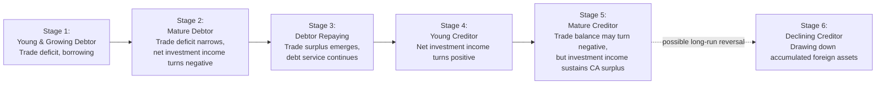

## Stages of the Balance of Payments

### Overview

The **Stages of the Balance of Payments** framework (sometimes called the "stages theory" or "balance of payments life cycle") is a descriptive model tracing how a country's external position — its current account, net foreign asset stance, and the composition of that position — tends to evolve systematically as the country develops economically. Rooted in the intertemporal and life-cycle logic of borrowing and lending, the framework was historically developed to explain the typical sequence of a nation's transition from young debtor to mature creditor (or, in some formulations, describes cyclical patterns observable in trade and investment income balances). It provides a useful organizing narrative for interpreting cross-country and historical balance-of-payments patterns, though it is best understood as a stylized heuristic rather than a rigid law of economic development. [Inference — the framework is a long-standing pedagogical device in international economics with historical roots in early 20th-century writing on international lending cycles]

### The Six (or Five) Classic Stages

The classic formulation identifies distinct stages, distinguished by the signs and relative magnitudes of the trade balance, net investment income, and net capital flows:

**Stage 1 — Young and Growing Debtor**

- The country imports more than it exports (trade deficit) to fund domestic investment exceeding domestic saving.
- It borrows from abroad, accumulating a growing stock of external liabilities.
- Net investment income is roughly balanced or the country pays out a small amount of interest/dividends on its still-modest external debt.
- Historically associated with early-industrializing economies attracting foreign capital for infrastructure and industrial development. [Inference]

**Stage 2 — Mature Debtor**

- The trade deficit persists or narrows as the economy develops export capacity, but the country's stock of external debt has grown large enough that **net investment income turns negative** (interest and dividend payments to foreign creditors become a significant outflow).
- The current account deficit may now be driven as much by debt-service obligations as by the underlying trade imbalance.

**Stage 3 — Debtor Repaying (or "New Creditor")**

- The trade balance turns into **surplus**, generating enough export earnings to begin servicing and repaying accumulated external debt.
- Net investment income may still be negative (debt service continues) but the overall current account moves toward balance or surplus as the trade surplus outweighs remaining interest obligations.

**Stage 4 — Young Creditor**

- The country has repaid enough external debt (or accumulated enough foreign assets) that it becomes a **net creditor** — net investment income turns **positive**.
- The trade balance may remain in surplus, reinforcing continued net foreign asset accumulation, or may begin to narrow.

**Stage 5 — Mature Creditor**

- The country now earns substantial positive net investment income from its large stock of accumulated foreign assets.
- The trade balance may turn toward **deficit** even while the **overall current account remains in surplus**, because investment income receipts are large enough to more than offset a trade deficit — the country effectively "lives off" the returns on its accumulated foreign wealth.

**Stage 6 (in some formulations) — Declining Creditor / Debt Liquidation**

- The country begins running down its net foreign asset position, spending more (including on imports) than it earns, gradually returning toward balance as accumulated assets are consumed — some formulations treat this as a longer-run cyclical return toward Stage 1-like characteristics, or simply as a mature economy in relative economic decline drawing on accumulated wealth. [Speculation — this final stage is less consistently included across textbook presentations and is more schematic than empirically well-documented]

### Diagram: The Balance of Payments Stages Cycle

### Diagram: Trade Balance vs. Net Investment Income Across Stages (svg_diagram)

<svg xmlns="http://www.w3.org/2000/svg" viewBox="0 0 680 420" font-family="Arial, sans-serif">
<text x="340" y="24" text-anchor="middle" font-size="15" font-weight="bold">Trade Balance and Net Investment Income by Stage (svg_diagram)</text>
<line x1="80" y1="230" x2="620" y2="230" stroke="black" stroke-width="2" />
<text x="630" y="235" font-size="12">Stage →</text>
<text x="30" y="80" font-size="12">Positive</text>
<text x="20" y="380" font-size="12">Negative</text>
<line x1="80" y1="60" x2="80" y2="400" stroke="black" stroke-width="2" />

<text x="130" y="410" font-size="11" text-anchor="middle">1</text>

<text x="220" y="410" font-size="11" text-anchor="middle">2</text>

<text x="320" y="410" font-size="11" text-anchor="middle">3</text>

<text x="420" y="410" font-size="11" text-anchor="middle">4</text>

<text x="520" y="410" font-size="11" text-anchor="middle">5</text>

<path d="M 130 320 L 220 300 L 320 200 L 420 160 L 520 280" stroke="#1f77b4" stroke-width="2.5" fill="none" />
<text x="530" y="270" font-size="11" fill="#1f77b4">Trade Balance</text>

<path d="M 130 235 L 220 260 L 320 245 L 420 150 L 520 100" stroke="#d62728" stroke-width="2.5" fill="none" />
<text x="530" y="95" font-size="11" fill="#d62728">Net Investment Income</text>

<path d="M 130 290 L 220 290 L 320 225 L 420 155 L 520 190" stroke="#2ca02c" stroke-width="2" stroke-dasharray="5,3" fill="none" />
<text x="530" y="185" font-size="11" fill="#2ca02c">Current Account (sum)</text>
</svg>

### Analytical Linkage to the Intertemporal and Saving-Investment Frameworks

The stages framework is a **descriptive, dynamic elaboration** of the identities and optimizing behavior covered elsewhere in this chapter:

- **Stage 1–2** correspond to a phase where $I > S$ domestically (investment outpaces saving, e.g., due to high expected returns to capital in a developing economy), generating a current account deficit and driving foreign borrowing — consistent with the intertemporal model's prediction that countries with strong investment opportunities but limited domestic saving should borrow internationally.
- **Stage 3–4** correspond to a phase where the country generates enough saving/export capacity ($S > I$ increasingly) to service and then repay accumulated debt, and net foreign assets ($NFA$) begin rising.
- **Stage 5** reflects the compounding dynamic discussed earlier: $CA_t = NX_t + r \cdot NFA_{t-1}$ — a large positive $NFA_{t-1}$ can sustain a positive current account even when $NX_t$ turns negative, since investment income $r \cdot NFA_{t-1}$ is large enough to offset it.

### Historical and Illustrative Examples

- **United States (19th to early-mid 20th century)**: Frequently cited as a historical illustration of transition from Stage 1 (young debtor, attracting British and European capital to fund railroads and industrialization) through to becoming a major creditor nation by the mid-20th century, though precise dating and the applicability of the "stages" narrative to specific historical episodes is a matter of economic-historical interpretation rather than a precise, universally agreed-upon periodization. [Unverified — the exact historical narrative is debated among economic historians and simplified for pedagogical purposes]
- **United Kingdom (19th century)**: Often cited as an example of a mature creditor nation (Stage 5) during the height of the British Empire, with substantial income from overseas investments (in railways, government bonds, and colonial enterprises) sustaining the country's external position even as its domestic manufacturing trade balance evolved. [Unverified — specific figures should be checked against economic-historical data]
- **Contemporary developing economies attracting FDI**: Many present-day emerging markets are often analyzed through a Stage 1/2 lens, running current account deficits to fund investment-led growth financed by foreign direct investment and portfolio inflows. [Inference]
- **Japan and Germany (post-WWII to present)**: Frequently discussed as examples of economies that moved through the stages relatively rapidly post-war and have exhibited characteristics associated with mature-creditor status (persistent current account surpluses, substantial net foreign asset positions, and meaningful net investment income) in recent decades. [Unverified — current-period specifics on any country's stage classification should be checked against up-to-date balance-of-payments data, as classifications can shift]

### Critiques and Limitations of the Stages Framework

- **Not a rigid law**: The framework describes a stylized, idealized sequence; real countries do not always progress linearly through the stages, and some skip stages, reverse direction, or remain in a given stage indefinitely depending on policy choices, demographic factors, and global capital market conditions. [Inference]
- **Policy and institutional factors matter**: The framework, as a purely accounting-descriptive device, does not account for how exchange rate regimes, capital controls, financial crises, and structural economic transformation interact with and can disrupt the "natural" progression it describes. [Inference]
- **Data and measurement challenges**: Precisely classifying a country's current "stage" requires careful decomposition of the current account into trade balance and net investment income (and increasingly, digital services and intangible flows), which can be measured inconsistently across countries and time periods, and modern globalized production (e.g., multinational transfer pricing) can distort naive readings of trade and income balances. [Unverified]
- **Relationship to modern "global imbalances" debates**: The stages framework offers one lens for interpreting why some mature, high-income economies run persistent current account deficits (arguably behaving like debtors despite high income) while some emerging economies run surpluses (behaving like creditors) — a pattern sometimes termed "uphill capital flows," which sits in some tension with the framework's traditional development-stage narrative and is the subject of ongoing research and debate. [Speculation — "uphill flows" and their relationship to the stages theory is a genuinely contested topic in the literature, not a settled classification]

### Key Points

- The stages of the balance of payments framework describes a stylized progression from young debtor through mature debtor, repaying debtor, young creditor, to mature creditor, based on the evolving relationship between the trade balance and net investment income.
- Early stages are characterized by trade deficits funding investment-led growth via foreign borrowing; later stages are characterized by trade surpluses funding debt repayment, and eventually by positive investment income sustaining the current account even amid trade deficits.
- The framework connects descriptively to the intertemporal and saving-investment identities but should be treated as a heuristic narrative rather than a strict empirical law.
- Real-world country experiences often deviate from the idealized sequence, and modern patterns of global imbalances (e.g., "uphill" capital flows from developing to developed economies) complicate the traditional development-stage story.

**Related Topics**

- The intertemporal approach to the current account
- Net International Investment Position (NIIP) measurement and dynamics
- Global imbalances and "uphill" capital flows
- Foreign direct investment and multinational enterprises
- Sovereign debt cycles and debt sustainability
- Historical patterns of international lending (19th and 20th century capital flows)
- Balance of payments accounting: current, capital, and financial accounts