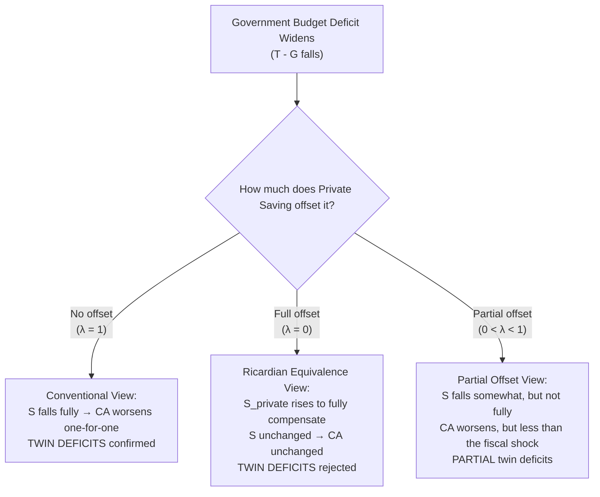

## The Twin Deficits Hypothesis

### Overview

The **twin deficits hypothesis** proposes a causal or strongly correlated relationship between a government's fiscal budget deficit and a country's current account (or trade) deficit — the idea that "deficits travel in pairs." The hypothesis derives directly from the national saving-investment identity ($CA = S_{private} + S_{government} - I$) but extends it into a behavioral claim about how private saving and investment respond (or fail to respond) to fiscal policy changes. It has been an especially prominent and politically salient topic in discussions of U.S. macroeconomic policy, though it applies as a general framework to any open economy.

### Theoretical Foundation: From Identity to Hypothesis

Recall the decomposition of the current account:

$$CA = (Y - T - C) + (T - G) - I = S_{private} + S_{government} - I$$

This is an **accounting identity** — it is always true. The twin deficits *hypothesis* is the additional behavioral claim that when the government budget balance ($T - G$) deteriorates, this **passes through, at least partially, to a deterioration in $CA$**, rather than being fully absorbed by an offsetting change in $S_{private}$ or $I$.

$$\Delta CA \approx \lambda \cdot \Delta(T-G), \quad 0 < \lambda \leq 1$$

where $\lambda$ (the "pass-through" coefficient) is an empirical parameter: $\lambda = 1$ implies a full one-for-one link (naive twin deficits); $\lambda = 0$ implies complete Ricardian offsetting (no link); most empirical estimates fall somewhere between. [Inference — $\lambda$ notation is a pedagogical simplification to express the hypothesis, not standard universal notation]

### Three Theoretical Benchmarks

**1. Conventional (Mundell-Fleming / Keynesian) View — Twin Deficits Confirmed**

In the standard Mundell-Fleming framework (covered elsewhere in this course), an expansionary fiscal policy under floating exchange rates with high capital mobility raises the domestic interest rate above $r^*$, attracting capital inflows, causing currency appreciation, and reducing net exports — directly linking the fiscal deficit to a widening current account deficit through the exchange rate channel. This is the textbook mechanism generating "twin deficits" as a *causal* prediction, not just a correlation.

**2. Ricardian Equivalence View — Twin Deficits Rejected**

Under the Ricardian Equivalence proposition (developed by Barro, building on earlier insights attributed to Ricardo), forward-looking, unconstrained households recognize that a government deficit today (financed by debt) implies higher future taxes with the same present value. Rational households therefore raise private saving today by exactly enough to prepare for that future liability, leaving **total national saving $S$ unchanged** and consumption unchanged in present-value terms.

$$\Delta S_{private} = -\Delta S_{government} \quad \implies \quad \Delta S = 0 \quad \implies \quad \Delta CA = 0$$

Under strict Ricardian equivalence, government deficits and current account deficits are **not** systematically linked — the method of financing government spending (taxes vs. debt) is irrelevant to real economic outcomes ("Ricardian neutrality" or "debt neutrality").

**3. Partial Offset View — the Empirically Common Middle Ground**

Most researchers find that Ricardian equivalence does not hold in its strict form, due to factors such as liquidity-constrained households (who cannot borrow against future tax liabilities to smooth consumption), finite planning horizons or myopia, and uncertainty about the timing/incidence of future tax increases. This produces a **partial pass-through**: private saving rises somewhat in response to a government deficit, but not enough to fully offset it, so $CA$ still deteriorates, but by less than the full fiscal shock. [Inference]

### Diagram: The Three Theoretical Views

### Mundell-Fleming Transmission Mechanism (Detailed)

The conventional twin-deficits mechanism, worked through the Mundell-Fleming apparatus (floating exchange rate, high capital mobility):

1. Government increases $G$ (or cuts $T$) → IS* curve shifts right
2. At the initial exchange rate, this pushes $r$ above $r^*$
3. Capital inflows respond to the higher domestic return
4. Currency appreciates ($e$ rises)
5. Net exports fall as domestic goods become relatively more expensive
6. $CA$ deteriorates — the fiscal deficit is "exported" via the trade channel

This is the identical transmission mechanism analyzed in the fiscal-policy-under-floating-rates material earlier in this course, applied here specifically to interpret the twin-deficits linkage.

### Diagram: Fiscal-to-Current-Account Transmission Channel (svg_diagram)

<svg xmlns="http://www.w3.org/2000/svg" viewBox="0 0 680 300" font-family="Arial, sans-serif">
<text x="340" y="24" text-anchor="middle" font-size="15" font-weight="bold">Twin Deficits Transmission Channel (svg_diagram)</text>
<rect x="20" y="60" width="140" height="60" rx="6" fill="#e8f0fe" stroke="#1f77b4" stroke-width="2" />
<text x="90" y="95" text-anchor="middle" font-size="12">Budget Deficit ↑</text>
<rect x="200" y="60" width="140" height="60" rx="6" fill="#fdf3e8" stroke="#ff7f0e" stroke-width="2" />
<text x="270" y="95" text-anchor="middle" font-size="12">Interest Rate r ↑</text>
<rect x="380" y="60" width="140" height="60" rx="6" fill="#e8fdf0" stroke="#2ca02c" stroke-width="2" />
<text x="450" y="95" text-anchor="middle" font-size="12">Capital Inflow / Currency Appreciates</text>
<rect x="560" y="60" width="105" height="60" rx="6" fill="#fdece8" stroke="#d62728" stroke-width="2" />
<text x="612" y="88" text-anchor="middle" font-size="11">Net Exports ↓</text>
<text x="612" y="103" text-anchor="middle" font-size="11">CA Deficit ↑</text>
<line x1="160" y1="90" x2="200" y2="90" stroke="black" stroke-width="2" marker-end="url(#tw1)" />
<line x1="340" y1="90" x2="380" y2="90" stroke="black" stroke-width="2" marker-end="url(#tw1)" />
<line x1="520" y1="90" x2="560" y2="90" stroke="black" stroke-width="2" marker-end="url(#tw1)" />
<text x="340" y="200" text-anchor="middle" font-size="12" fill="#555">Alternative path: if private saving rises to offset the deficit</text>

<text x="340" y="220" text-anchor="middle" font-size="12" fill="#555">(Ricardian response), this chain is interrupted before it starts</text>

</svg>

### Worked Numerical Example

Using the identity-based approach, suppose an economy has:

- $Y = 20{,}000$, $I = 4{,}000$ (fixed, unaffected by the shock for simplicity)
- Initial: $T = 4{,}000$, $G = 4{,}000$ (balanced budget), $C = 13{,}500$

**Step 1 — Compute initial saving and CA:**

$$S_{private} = Y - T - C = 20{,}000 - 4{,}000 - 13{,}500 = 2{,}500$$

$$S_{government} = T - G = 0$$

$$S = 2{,}500; \quad CA = S - I = 2{,}500 - 4{,}000 = -1{,}500$$

**Step 2 — Government cuts taxes to $T = 3{,}000$ (a $1{,}000$ tax cut), financed by borrowing; $G$ unchanged at $4{,}000$.**

$$S_{government} = 3{,}000 - 4{,}000 = -1{,}000 \quad (\text{deteriorated by } 1{,}000)$$

**Case A — Conventional view (no Ricardian offset)**: Households treat the tax cut as extra disposable income and raise consumption; assume $C$ rises to $14{,}300$ (spending 80% of the tax cut, saving 20%):

$$S_{private} = (20{,}000 - 3{,}000) - 14{,}300 = 2{,}700 \quad (\text{rose by only } 200)$$

$$S = 2{,}700 + (-1{,}000) = 1{,}700; \quad CA = 1{,}700 - 4{,}000 = -2{,}300$$

The current account deficit **widens from $-1{,}500$ to $-2{,}300$** — an $800$ deterioration from the $1{,}000$ fiscal shock ($\lambda = 0.8$), illustrating partial (not full) twin-deficits pass-through.

**Case B — Ricardian view (full offset)**: Households save the entire tax cut in anticipation of future tax increases; $C$ remains at $13{,}500$:

$$S_{private} = (20{,}000 - 3{,}000) - 13{,}500 = 3{,}500 \quad (\text{rose by the full } 1{,}000)$$

$$S = 3{,}500 + (-1{,}000) = 2{,}500; \quad CA = 2{,}500 - 4{,}000 = -1{,}500 \quad (\text{unchanged})$$

The current account is **completely unaffected** by the tax cut under strict Ricardian equivalence.

### Empirical Evidence

- Empirical studies testing the twin deficits hypothesis (using time-series and panel data across various countries, particularly focused on U.S. experience across different fiscal episodes) have generally found evidence for a **positive but less-than-one relationship** between fiscal and current account balances, i.e., support for the "partial offset" view rather than either polar theoretical benchmark. [Unverified — findings vary considerably depending on time period, country sample, and econometric methodology; specific coefficient estimates should be checked against current literature]
- Evidence often shows the relationship is **not stable across time or countries**: some studies find a strong link during specific episodes (e.g., certain U.S. periods in the 1980s associated with large fiscal and trade deficits occurring together) while other periods or countries show a weaker or statistically insignificant relationship. [Unverified]
- **Complicating factors identified in the literature** include exchange rate regime (the mechanism is theoretically stronger under floating rates with high capital mobility, per Mundell-Fleming), the state of the business cycle (deficits arising from automatic stabilizers during recessions may behave differently than discretionary structural deficits), and whether the fiscal shock is perceived as temporary or permanent (connecting to the consumption-smoothing framework discussed elsewhere in this chapter). [Inference]

### Critiques and Extensions

- **The "twin divergence" phenomenon**: Some episodes show fiscal deficits widening while current accounts *improve* (or vice versa) — sometimes labeled "twin divergence" — highlighting that other factors (private investment swings, terms-of-trade shocks, exchange rate movements unrelated to the fiscal position) can dominate the simple twin-deficits mechanism in any given period. [Unverified — specific historical episodes cited as "twin divergence" should be checked against current data before being used as definitive examples]
- **Reverse causality concerns**: Some research questions whether the causal arrow may sometimes run from external conditions to fiscal outcomes (e.g., a capital inflow surge appreciating the currency and widening the trade deficit, which then affects growth and tax revenue, indirectly affecting the fiscal balance) rather than exclusively from fiscal policy to the current account. [Speculation]
- **Role of the exchange rate regime**: Under a fixed exchange rate (or currency union, as in the Eurozone), the interest-rate/appreciation transmission channel does not operate the same way, so the "twin deficits" mechanism, if present, would need to operate through different channels (e.g., inflation differentials rather than nominal appreciation). [Inference]

### Key Points

- The twin deficits hypothesis links government fiscal deficits to current account deficits, resting on the underlying accounting identity $CA = S_{private} + S_{government} - I$.
- The Mundell-Fleming model provides a causal mechanism (via interest rates, capital flows, and currency appreciation) supporting the hypothesis under floating rates with high capital mobility.
- Ricardian equivalence provides the theoretical counter-case: if private saving fully offsets fiscal deficits, no link exists.
- Most empirical evidence supports a partial, not full, pass-through from fiscal deficits to current account deficits, with the relationship varying by country, time period, and economic conditions.
- The relationship is not a strict law and can diverge in specific episodes due to other dominant macroeconomic forces.

**Related Topics**

- Saving, investment, and the current account balance
- Fiscal policy under floating exchange rates
- Ricardian equivalence: theory and empirical tests
- The intertemporal approach to the current account
- Exchange rate regimes and fiscal policy transmission
- Global imbalances and the U.S. current account deficit
- Liquidity constraints and consumption behavior