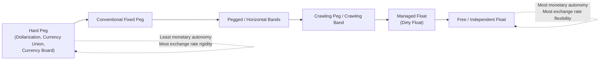
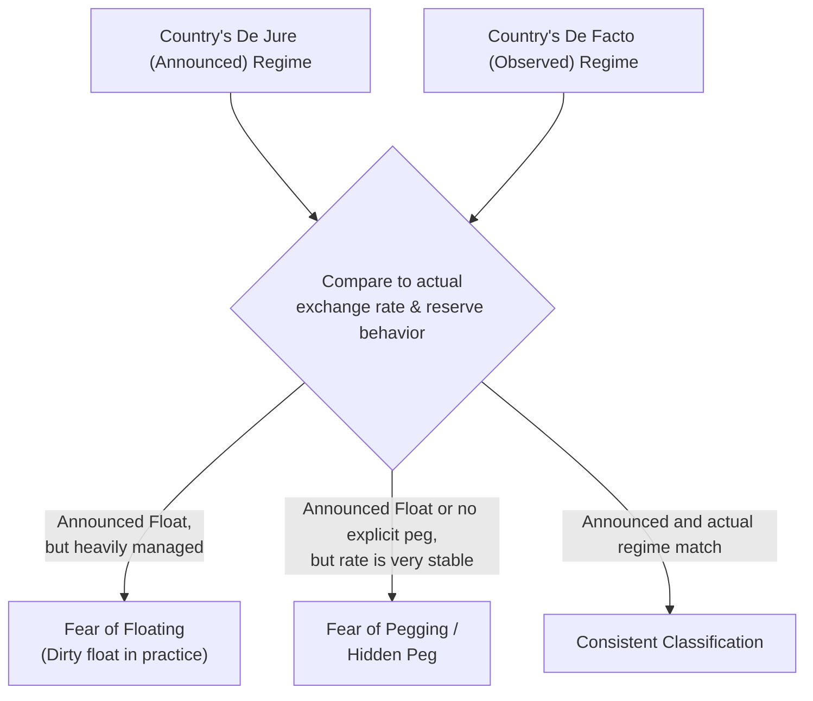

## Classifying Exchange Rate Regimes

### Overview

Exchange rate regime classification is the systematic categorization of the arrangements countries use to determine the value of their currency relative to others. While the theoretical literature often presents a stark dichotomy between "fixed" and "floating" regimes (as in the core Mundell-Fleming apparatus), real-world exchange rate arrangements span a continuum with numerous intermediate forms. Accurately classifying regimes matters both for applying the correct theoretical predictions (e.g., regarding monetary policy effectiveness) and for empirical research, since a country's *de jure* (officially announced) regime frequently diverges from its *de facto* (actually observed) behavior.

### The Classical Continuum: Hard Peg to Free Float

Exchange rate regimes are conventionally arrayed along a spectrum of decreasing exchange rate rigidity:

**1. Hard Pegs (No Separate Legal Tender / Currency Union / Currency Board)**

- **Dollarization/Currency Substitution**: The country adopts another country's currency entirely as legal tender (e.g., Ecuador and Panama using the US dollar), forfeiting any independent monetary policy.
- **Currency Union**: Multiple countries share a single currency and a single monetary authority (e.g., the Eurozone's use of the euro).
- **Currency Board**: The domestic currency is issued only against foreign reserve backing at a fixed, legally mandated rate, with the monetary authority holding minimal discretion (e.g., Hong Kong's currency board arrangement pegging the HKD to the USD).

**2. Conventional (Soft) Pegs**

- **Conventional Fixed Peg**: The currency is pegged to a single currency or basket, adjustable only occasionally through discrete devaluation/revaluation, with the central bank retaining reserves and some (limited) monetary policy discretion.
- **Pegged within Horizontal Bands**: The exchange rate is allowed to fluctuate within a specified band around a central parity (e.g., the European Exchange Rate Mechanism, ERM/ERM II).
- **Crawling Peg**: The central parity is adjusted periodically (often according to a pre-announced rule, such as tracking inflation differentials) rather than remaining fixed indefinitely.
- **Crawling Band**: Combines a crawling central parity with permitted fluctuation bands around it.

**3. Floating Arrangements**

- **Managed Float (Dirty Float)**: The exchange rate is primarily market-determined, but the central bank intervenes periodically (without a pre-announced path or target) to influence its level or reduce volatility.
- **Free (Independent) Float**: The exchange rate is left to market forces with intervention limited to smoothing excessive short-term volatility, if any, and no attempt to target a particular rate level.

### Diagram: The Exchange Rate Regime Spectrum

### The IMF's De Facto Classification System

Because officially announced (*de jure*) regimes often do not match actual central bank behavior, the International Monetary Fund maintains a **de facto classification system**, based on observed exchange rate and reserve behavior rather than official policy statements.

Searched the webIMF de facto exchange rate regime classification categories 2024

This confirms the standard framework and adds useful current detail (the IMF's "stabilised" vs. "crawl-like" categories and margin thresholds). Continuing with the full content:

### The IMF's De Facto Classification System (Continued)

The IMF's current framework (revised in 2009, still the basis of its ongoing *Annual Report on Exchange Arrangements and Exchange Restrictions*) classifies regimes primarily using **observed** behavior of the exchange rate and reserves, rather than relying solely on official government announcements, because many countries whose exchange rate arrangements are officially described as floating in fact intervene in ways that make them behave more like fixed regimes, and vice versa. The IMF's classification distinguishes categories including: [business-standard](https://www.business-standard.com/amp/opinion/columns/how-consistent-is-imf-s-exchange-rate-regime-classification-data-adequacy-125121001390_1.html)

- **No separate legal tender / Currency union**
- **Currency board arrangement**
- **Conventional (fixed) peg**
- **Stabilized arrangement**: the exchange rate stays within a roughly 2% band for six months or longer without being classified as floating [business-standard](https://www.business-standard.com/amp/opinion/columns/how-consistent-is-imf-s-exchange-rate-regime-classification-data-adequacy-125121001390_1.html)
- **Crawling peg**
- **Crawl-like arrangement**: the exchange rate stays within a narrow band relative to a statistically identified trend for six months or more, again not counted as floating [business-standard](https://www.business-standard.com/amp/opinion/columns/how-consistent-is-imf-s-exchange-rate-regime-classification-data-adequacy-125121001390_1.html)
- **Pegged exchange rate within horizontal bands**
- **Other managed arrangement**
- **Floating**
- **Free floating**

A live illustration of how fine these distinctions can be in practice: the IMF recently reclassified India's exchange rate arrangement from "stabilised" to "crawl-like," even though India's regime had previously been treated as some form of floating arrangement from 1999 to 2022 across various sub-categories. This kind of reclassification—based purely on statistical behavior of the currency rather than any policy announcement—illustrates why de facto classification can diverge meaningfully from a country's own description of its regime, and can also change over time even without an explicit policy shift. [Inference — the underlying statistical trigger for such reclassifications is technical and sensitive to the precise measurement window and trend-detection methodology used] [business-standard](https://www.business-standard.com/amp/opinion/columns/how-consistent-is-imf-s-exchange-rate-regime-classification-data-adequacy-125121001390_1.html)

### Academic De Facto Classification: The Levy-Yeyati/Sturzenegger Approach

A prominent academic alternative to the IMF's approach is the classification developed by Levy-Yeyati and Sturzenegger, who constructed a de facto classification based on data on exchange rates and international reserves from all IMF-reporting countries, providing an alternative to the standard IMF de jure classification based on self-reported government announcements. Their approach uses cluster analysis techniques to group regimes according to behavior along three dimensions: the level of the nominal exchange rate, changes in the nominal exchange rate, and the volatility of international reserves. This methodology has been extended over time — a follow-up study extended the original classification through 2021, more than doubling the number of country-year observations, and introduced a methodology for keeping the classification updated in real time. [Classifying exchange rate regimes: deeds vs. words +2](https://repositorio.utdt.edu/handle/20.500.13098/6278)

Key empirical findings from this line of research include two now-famous stylized facts:

- **"Fear of Floating"**: the increase in the number of countries officially declaring a floating regime has gone hand-in-hand with an increase in de facto "dirty floats," where central banks intervene far more than a pure float would suggest — countries that claim to float often behave, in practice, much like managed or even fixed-rate regimes because they fear the domestic consequences (inflation pass-through, balance-sheet effects on foreign-currency debt) of large currency swings. [siu](https://bdu3.siu.edu.ar/bdu/Record/todo:paper_00142921_v49_n6_p1603_LevyYeyati/Description)
- **"Fear of Pegging" / "Hidden Pegs"**: an increasing number of de facto pegs have avoided making an explicit commitment to a fixed regime, a phenomenon described as "fear of pegging" or "hidden pegs" — countries that behave like they have a peg but do not want to publicly commit to defending one, possibly to retain flexibility to abandon it without the reputational cost of an official devaluation announcement. [Inference — the strategic reasoning behind "fear of pegging" is a common interpretation offered in this literature, not a directly observable motive] [uba](https://bibliotecadigital.exactas.uba.ar/collection/paper/document/paper_00142921_v49_n6_p1603_LevyYeyati)

### Diagram: De Jure vs. De Facto Classification Mismatch

### Classification Dimensions Used in Practice

Modern classification schemes (both IMF and academic) typically rely on some combination of:

1. **Exchange rate volatility**: How much does the nominal exchange rate actually move over a given period?
2. **Volatility of exchange rate changes**: Is the *rate of change* itself volatile, or does it follow a smooth, predictable trend (as in a crawling peg)?
3. **Reserve volatility / intervention intensity**: How actively does the central bank buy/sell foreign currency, inferred from changes in official reserve holdings? High reserve volatility alongside low exchange rate volatility is a signature of a *managed* regime disguised as a float.
4. **Margin width and duration**: As illustrated by the IMF's own quantitative thresholds, a specific margin of fluctuation (such as 2 percent) sustained over a specific duration (such as six months) is used as an explicit trigger for regime classification, with any movement beyond that margin causing a change in the assigned category. [business-standard](https://www.business-standard.com/amp/opinion/columns/how-consistent-is-imf-s-exchange-rate-regime-classification-data-adequacy-125121001390_1.html)

### Why Classification Matters for Applying Theory

Accurately identifying a country's *actual* (de facto) regime is essential for correctly applying the Mundell-Fleming and Impossible Trinity frameworks covered elsewhere in this course:

- A country *announcing* a float but *actually* running a tightly managed exchange rate ("fear of floating") will **not** exhibit the monetary policy autonomy the floating-rate theory predicts, because its central bank is implicitly constraining interest rate policy to defend an unannounced target.
- A country *announcing* a peg but *actually* allowing meaningful de facto flexibility will have **more** monetary independence than a naive fixed-rate analysis would suggest.
- Empirical tests of exchange rate regime effects on growth, inflation, or trade **must use de facto, not de jure, classifications** to avoid significant measurement error and misleading conclusions. [Inference — this is a widely-cited methodological point in the empirical exchange-rate-regime literature, following directly from the Levy-Yeyati/Sturzenegger critique]

### Real-World Considerations and Limitations

- **Classification instability over time**: A single country can shift categories multiple times as its behavior (or the classifying methodology) changes, as illustrated by India's 2025 reclassification — this means regime classification datasets require regular updating and careful vintage-tracking for research purposes. [Inference]
- **Political economy of classification**: Governments may have incentives to mischaracterize their regime publicly (e.g., claiming a float to avoid the political stigma or IMF conditionality sometimes associated with certain peg types), which is precisely why de facto measures were developed as an alternative. [Inference]
- **Boundary/threshold sensitivity**: Because classification often depends on statistical thresholds (e.g., the specific percentage band and time window used to define "stabilized" versus "floating"), a country can be classified differently depending on precisely which methodology or vintage of data is applied — as shown by the ambiguity noted in India's case, where observers questioned whether the rupee's actual behavior better matched a broader managed-float description than the newly assigned narrower category. [Unverified — the specific critique in that case is a contemporaneous commentary and reflects one analyst's interpretation, not a settled resolution]

### Key Points

- Exchange rate regimes span a continuum from hard pegs (dollarization, currency boards, currency unions) through soft pegs and crawling arrangements to managed and free floats.
- The IMF maintains an official de facto classification system based on observed exchange rate and reserve behavior, using specific quantitative thresholds (e.g., margin width and duration) rather than relying solely on government self-reporting.
- Academic alternatives, notably the Levy-Yeyati/Sturzenegger classification, use cluster analysis on exchange rate and reserve volatility data and have identified influential empirical patterns like "fear of floating" and "fear of pegging."
- De jure (announced) and de facto (actual) regime classifications frequently diverge, which is critical to account for when applying Mundell-Fleming-style theoretical predictions or conducting empirical research.
- Classification is dynamic and methodology-sensitive: countries can be reclassified over time even without explicit policy changes, as recent examples illustrate.

**Related Topics**

- The Impossible Trinity / Policy Trilemma
- "Fear of floating" and its causes in emerging markets
- Currency boards and dollarization case studies
- The European Exchange Rate Mechanism (ERM) and ERM II
- Optimal Currency Area theory and currency unions
- Speculative attacks and the collapse of pegged regimes
- Balance sheet effects and currency mismatch in emerging markets