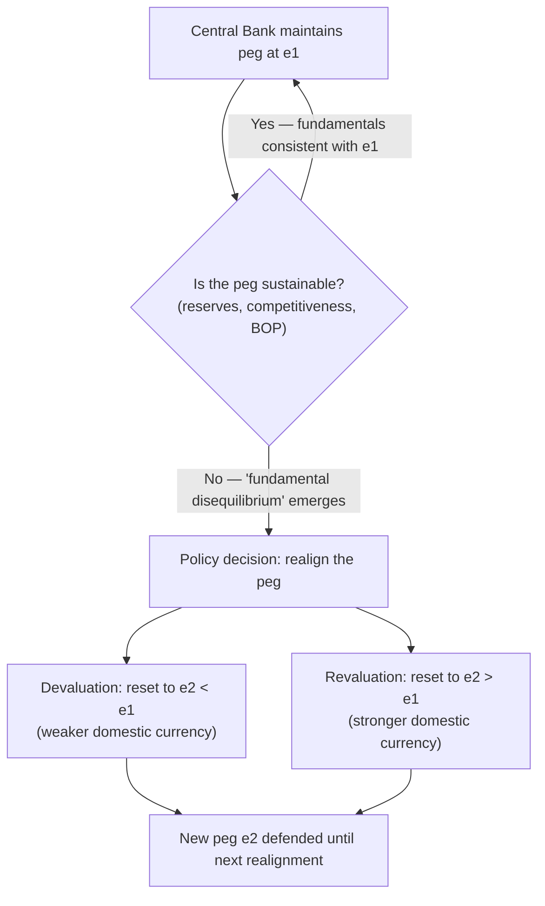
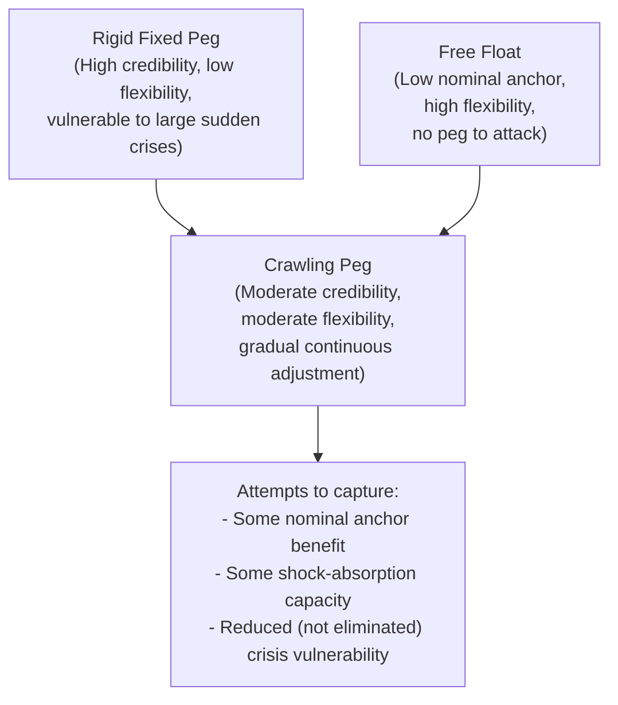

## Adjustable Pegs and Crawling Pegs

### Overview

Adjustable pegs and crawling pegs occupy an important intermediate position on the exchange rate regime spectrum, designed to capture some benefits of both fixed and floating regimes: the nominal anchor and credibility benefits of a peg, combined with a mechanism for periodic or gradual adjustment that avoids the rigidity and crisis-proneness of a strictly immutable fixed rate. These regimes were central to the Bretton Woods international monetary system and remain in use today, particularly among emerging market and developing economies managing high or persistent inflation differentials with trading partners.

### Adjustable Pegs: Definition and Mechanics

An **adjustable peg** is a fixed exchange rate arrangement in which the central bank commits to defending a specific parity ($\bar{e}$) against a reference currency or basket, but retains the *explicit, officially sanctioned* option to change that parity through a discrete **devaluation** (lowering $\bar{e}$, i.e., weakening the domestic currency) or **revaluation** (raising $\bar{e}$, i.e., strengthening the domestic currency) when the peg becomes unsustainable or misaligned with underlying economic fundamentals.

$$e = \bar{e}_1 \quad \text{until a policy decision resets it to} \quad e = \bar{e}_2 \quad (\bar{e}_2 \neq \bar{e}_1)$$

This differs from a purely rigid peg in that realignment is a recognized, legitimate part of the system's design — not a crisis outcome or system failure — though in practice devaluations under adjustable peg systems have often been triggered by (and are frequently associated with) exactly the kind of balance-of-payments pressure and speculative attacks the system was partly designed to avoid. [Inference]

### The Bretton Woods System as the Canonical Adjustable Peg

The **Bretton Woods system** (1944–1973) is the most historically significant example of an adjustable peg arrangement: member countries fixed their currencies to the US dollar (which was itself convertible to gold at a fixed rate), but were permitted to adjust their parities in the case of a "fundamental disequilibrium" in their balance of payments, subject to International Monetary Fund oversight and approval for larger changes.

- **Design intent**: Provide exchange rate stability to promote international trade and investment (learning from the competitive devaluations and exchange rate chaos of the interwar period) while avoiding the perceived rigidity of the classical gold standard, which offered no adjustment mechanism short of costly internal deflation.
- **In practice**: Parity changes were relatively infrequent (partly due to the political and reputational costs of an explicit devaluation announcement, and partly due to IMF approval requirements), and speculative pressure often built up in anticipation of a widely expected realignment — a phenomenon closely related to the concept of "one-way bets" in currency crisis theory (discussed further under currency crisis models elsewhere in this course).

### Diagram: The Adjustable Peg Mechanism

### Crawling Pegs: Definition and Mechanics

A **crawling peg** replaces the discrete, occasional realignments of an adjustable peg with **small, frequent (often pre-announced or rule-based) adjustments** to the central parity, typically implemented on a daily, weekly, or monthly basis rather than through large one-off jumps.

$$e_t = e_{t-1} \times (1 + \rho_t)$$

where $\rho_t$ is the pre-set or rule-based rate of crawl for period $t$.

Crawling pegs are generally implemented using one of two design philosophies:

**1. Backward-looking (Passive) Crawl**

- The rate of crawl is set to match recently observed inflation differentials between the domestic economy and its main trading partner(s) or peg currency, aiming to preserve real exchange rate competitiveness even in the presence of persistent domestic inflation.

  $$\rho_t \approx \pi_{domestic, t-1} - \pi_{foreign, t-1}$$

**2. Forward-looking (Active / Pre-announced) Crawl**

- The rate of crawl is announced in advance as a target or ceiling for domestic inflation (sometimes called a "tablita" in the context of certain Latin American disinflation programs), intended to serve as a **nominal anchor** to help bring down inflation expectations by pre-committing to a declining, and eventually zero, rate of depreciation.

### Diagram: Backward-Looking vs. Forward-Looking Crawl (svg_diagram)

<svg xmlns="http://www.w3.org/2000/svg" viewBox="0 0 660 380" font-family="Arial, sans-serif">
<text x="330" y="24" text-anchor="middle" font-size="15" font-weight="bold">Crawling Peg: Two Design Philosophies (svg_diagram)</text>
<line x1="80" y1="330" x2="600" y2="330" stroke="black" stroke-width="2" />
<line x1="80" y1="330" x2="80" y2="60" stroke="black" stroke-width="2" />
<text x="610" y="335" font-size="12">Time</text>
<text x="40" y="55" font-size="12">e (exchange rate)</text>

<path d="M 100 300 L 200 270 L 300 235 L 400 195 L 500 150" stroke="#1f77b4" stroke-width="2.5" fill="none" />
<text x="500" y="140" font-size="11" fill="#1f77b4">Backward-looking crawl (tracks past inflation gap)</text>

<path d="M 100 300 L 200 250 L 300 215 L 400 195 L 500 185" stroke="#d62728" stroke-width="2.5" stroke-dasharray="6,3" fill="none" />
<text x="500" y="205" font-size="11" fill="#d62728">Forward-looking (pre-announced) crawl — decelerating rate</text>

<text x="140" y="350" font-size="11">Goal: preserve competitiveness</text>

<text x="400" y="365" font-size="11">Goal: anchor inflation expectations</text>

</svg>

### Crawling Bands

A **crawling band** combines the crawling peg's moving central parity with a permitted **fluctuation band** around that parity, allowing the exchange rate some short-term market-driven flexibility within the band while the band's center itself moves gradually over time. This design offers a partial answer to the "one-way bet" problem of a purely rigid peg — a moving band with two-sided uncertainty about the exact rate within it can, in principle, deter pure one-directional speculative betting on a single anticipated realignment date, since the timing and magnitude of movement within the band is less predictable. [Inference — the effectiveness of this deterrence in practice depends heavily on band width and market credibility, and empirical experience with such bands has been mixed]

### Trade-Offs: Credibility vs. Flexibility

Adjustable and crawling pegs sit at an inherent tension point in the credibility-flexibility trade-off central to exchange rate regime choice:

| Feature | Rigid Fixed Peg | Adjustable Peg | Crawling Peg | Free Float |
| --- | --- | --- | --- | --- |
| **Nominal anchor / credibility** | Highest (if credible) | Moderate — credibility erodes near expected realignment dates | Moderate — depends on rule transparency and commitment | Lowest (in the pure inflation-anchor sense) |
| **Flexibility to absorb shocks** | Lowest | Moderate — but only via discrete, disruptive jumps | Higher — continuous small adjustments | Highest |
| **Vulnerability to speculative attack** | High if misaligned | High, especially just before an anticipated realignment ("one-way bet") | Lower than adjustable peg, but not eliminated | Low (no peg to defend) |
| **Suitability for high-inflation economies** | Poor (rapid real appreciation if inflation persists) | Poor to moderate | Good — designed to accommodate ongoing inflation differentials | Good, but may itself contribute to inflation via pass-through if credibility is weak |

### The "One-Way Bet" Problem

A key vulnerability of the adjustable peg (less so, but not entirely absent, in crawling variants) is the **one-way bet** dynamic: as market participants come to expect an eventual realignment (typically a devaluation, since pegs facing pressure are usually overvalued rather than undervalued), they face an asymmetric payoff — betting against the currency ahead of a widely anticipated devaluation carries very limited downside (if the peg holds, losses are small transaction costs) and a large potential upside (if the devaluation occurs as expected). This asymmetry can itself accelerate capital flight and hasten the very devaluation the peg was meant to postpone, a dynamic closely related to models of self-fulfilling currency crises discussed in later chapters. [Inference]

### Historical and Illustrative Examples

- **Bretton Woods parity realignments**: Various member countries undertook periodic devaluations or revaluations during the Bretton Woods era in response to persistent balance-of-payments pressures, with the system's eventual breakdown in 1971–1973 often attributed in part to the difficulty of managing timely, credible realignments under growing capital mobility. [Unverified — the collapse of Bretton Woods had multiple contributing causes and precise attribution is debated among economic historians]
- **Latin American "tablita" programs (late 1970s–1980s)**: Several countries (frequently cited examples include Argentina, Chile, and Uruguay in this period) used pre-announced, forward-looking crawling pegs (tablitas) as a disinflation tool, aiming to use the announced deceleration of currency depreciation as a credible nominal anchor; these programs have been extensively studied (and frequently critiqued) in the literature on exchange-rate-based stabilization. [Unverified — specific programs, timing, and outcomes vary by country and should be checked against detailed country-level economic history for precise claims]
- **Chile's crawling band system**: Chile operated versions of a crawling band exchange rate policy for an extended period before transitioning toward a fully floating regime, often cited as an example of a gradual transition from a managed to a market-determined exchange rate. [Unverified — specific dates and band parameters should be verified against current sources if needed for precise citation]
- **China's managed crawl**: China's exchange rate policy has, at various points, been described by outside observers and by IMF classification as exhibiting characteristics of a managed or crawling arrangement relative to the US dollar or a currency basket, reflecting a gradual, controlled approach to exchange rate flexibility. [Unverified — China's specific exchange rate arrangement has evolved over time and current classification should be checked against up-to-date IMF or official sources]

### Diagram: Crawling Peg as a Middle Path

### Modern Relevance and Critiques

- **The "hollowing out" / "bipolar view" hypothesis**: An influential line of thinking in international finance (particularly prominent following the emerging market currency crises of the late 1990s) argued that intermediate regimes like adjustable and crawling pegs are inherently crisis-prone under conditions of high capital mobility, and that countries would increasingly be pushed toward the "corner solutions" of either hard pegs/currency unions or fully free floats — a claim often referred to as the "bipolar view" or "hollowing out" hypothesis. [Unverified — this hypothesis was influential but has also faced substantial empirical pushback, since many countries continue to operate intermediate regimes; academic consensus on its validity has evolved and should be checked against current literature]
- **Continued relevance of intermediate regimes**: Despite the bipolar view's predictions, IMF classification data continue to show a substantial number of countries operating crawling pegs, crawl-like arrangements, and other intermediate regimes, suggesting the intermediate category has proven more durable in practice than the strongest versions of the hollowing-out hypothesis anticipated. [Inference — based on the general pattern that current IMF regime classification schemes retain multiple intermediate categories as actively used, in-use classifications]

### Key Points

- Adjustable pegs commit to a fixed rate but retain an explicit, sanctioned option for discrete devaluation/revaluation when fundamentals require it — the Bretton Woods system is the canonical historical example.
- Crawling pegs replace discrete realignments with small, frequent adjustments, either tracking past inflation differentials (backward-looking) or pre-announcing a declining depreciation path to anchor expectations (forward-looking, as in "tablita" programs).
- Crawling bands add a fluctuation range around the moving central parity, offering a partial defense against one-way speculative bets.
- These intermediate regimes attempt to balance the credibility benefits of a peg against the flexibility benefits of a float, but remain vulnerable to speculative pressure, especially around anticipated realignment dates.
- The "bipolar view" predicted a decline of intermediate regimes under high capital mobility, but such regimes have persisted in practice, and remain in active use and classification today.

**Related Topics**

- Classifying exchange rate regimes
- Currency crises and speculative attacks (first- and second-generation models)
- The Bretton Woods system: rise and collapse
- Exchange-rate-based stabilization programs and their track record
- The "fear of floating" phenomenon
- Optimal Currency Area theory and hard pegs
- Real exchange rate misalignment and competitiveness