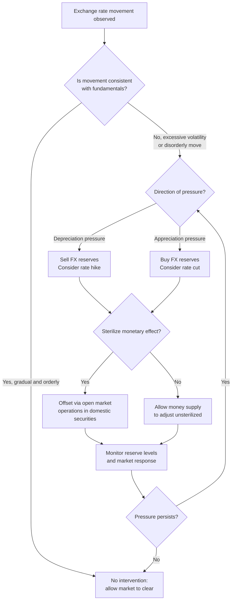

## Managed Floating and Dirty Floats

### Definition and Conceptual Overview

A **managed float** (also called a **dirty float**) is an exchange rate regime in which a currency's value is primarily determined by market forces of supply and demand, but the central bank or monetary authority intervenes periodically and discretionarily to influence the exchange rate's level, path, or volatility, without committing to a specific target or pre-announced parity.

This regime occupies the middle ground of the exchange rate continuum, between two polar extremes:

$$\text{Hard Peg} \leftrightarrow \text{Fixed Peg} \leftrightarrow \text{Crawling Peg} \leftrightarrow \textbf{Managed Float} \leftrightarrow \text{Free Float}$$

The term "dirty float" is descriptive rather than pejorative in most technical usage: it distinguishes the regime from a "clean float," in which the authorities never intervene and the rate is left entirely to market forces. In practice, very few floating regimes are perfectly clean; some degree of intervention, even if only occasional smoothing operations, is common. This makes managed floating one of the most prevalent de facto regimes in the global economy.

### Distinguishing Managed Float from Related Regimes

| Regime | Intervention Rule | Rate Determination | Pre-announced Target |
| --- | --- | --- | --- |
| Free (clean) float | None | Fully market-determined | No |
| Managed (dirty) float | Discretionary, no fixed rule | Mostly market, occasionally guided | No |
| Crawling peg | Rule-based, pre-set path | Adjusted incrementally to a formula | Yes (path or band) |
| Adjustable peg | Fixed until realignment | Fixed | Yes (parity) |
| Currency board / hard peg | Automatic, rule-bound | Fixed by law | Yes (fixed parity) |

The defining feature of a managed float is the **absence of a publicly committed target level or band**. The central bank retains full discretion over when, how much, and in which direction to intervene, and it does not promise to defend any particular rate.

### Mechanisms of Intervention

**1. Direct (Official) Foreign Exchange Intervention**

The central bank buys or sells foreign currency (typically US dollars, euros, or a reserve basket) against the domestic currency in the FX market.

- **Sterilized intervention**: The central bank offsets the effect of FX operations on the domestic money supply by conducting an equal and opposite operation in domestic assets (e.g., selling government bonds to absorb liquidity created by dollar purchases). This isolates the exchange rate effect from the money supply/interest rate effect.
- **Unsterilized intervention**: The central bank allows the FX operation to change the domestic money supply, which reinforces the intended exchange rate effect through both a direct FX flow effect and an indirect monetary/interest rate effect.

**2. Interest Rate Policy**

Adjusting the policy rate to attract or repel capital flows, indirectly influencing the exchange rate through uncovered interest parity dynamics.

**3. Verbal Intervention (Open Mouth Operations)**

Public statements by central bank officials intended to shift market expectations without immediate actual transactions. Often used as a low-cost first line of defense.

**4. Capital Controls and Administrative Measures**

Restrictions on capital inflows/outflows, differential reserve requirements on foreign currency deposits, or macroprudential FX-related rules that indirectly affect exchange rate pressure.

**5. Reserve Accumulation/Decumulation**

Systematic buying of foreign reserves during appreciation pressure (common in export-oriented emerging markets) to resist currency strength, or selling reserves to resist depreciation.

### The Balance of Payments and Intervention Mechanics

When a central bank intervenes, it operates directly on the balance of payments identity:

$$BOP = CA + KA + \Delta FR = 0$$

Where $CA$ is the current account, $KA$ is the capital/financial account, and $\Delta FR$ is the change in official foreign reserves. Under a managed float, $\Delta FR \neq 0$ periodically, unlike a pure free float where reserves theoretically remain constant because the exchange rate alone clears the FX market.

**Example (Sterilized Intervention Mechanics):**

Suppose the peso is depreciating rapidly. The central bank sells $500 million of US dollar reserves and buys pesos.

1. Dollar reserves fall by $500 million; domestic currency in circulation contracts by the peso equivalent.
2. This contraction would tighten domestic liquidity and raise interest rates unless offset.
3. To sterilize, the central bank simultaneously purchases $500 million-equivalent of domestic government bonds in the open market, injecting back the peso liquidity.
4. Net effect: FX reserves fall, domestic money supply is unchanged, and the exchange rate effect is achieved without an unintended monetary policy tightening.

### Rationale for Managed Floating

**Key Points:**

- **Reducing excessive volatility**: Smoothing short-term, disorderly fluctuations that may not reflect fundamentals (often justified by "leaning against the wind").
- **Preventing overshooting**: Exchange rates in free floats can overshoot equilibrium due to sticky prices in goods markets relative to fast-adjusting asset markets (Dornbusch overshooting model), and intervention can dampen this.
- **Competitiveness management**: Resisting appreciation to protect export competitiveness (common among export-led emerging economies), sometimes controversially labeled "currency manipulation."
- **Inflation control**: Resisting depreciation to limit imported inflation, particularly relevant in economies with high exchange rate pass-through.
- **Financial stability**: Avoiding disorderly moves that could destabilize balance sheets with foreign-currency-denominated liabilities (the "fear of floating" phenomenon).
- **Preserving some monetary autonomy**: Unlike a hard peg, a managed float allows the central bank to retain an independent, if constrained, monetary policy.

### The "Fear of Floating" Phenomenon

Emerging market economies frequently claim to float but intervene heavily and adjust interest rates in response to exchange rate movements far more than developed floating economies. This gap between de jure (declared) and de facto (actual) regimes was documented extensively in the literature (notably Calvo and Reinhart, 2002), which found many countries officially classified as "floating" behaved statistically like peggers when reserve volatility and interest rate responses were examined.

**Key Points — Causes of Fear of Floating:**

- **Liability dollarization**: Firms, banks, or governments holding foreign-currency debt suffer balance sheet damage from depreciation, creating strong incentive to prevent large currency swings.
- **High exchange rate pass-through to inflation**: In economies where import prices quickly feed into consumer prices, depreciation is costly in inflation terms.
- **Underdeveloped domestic financial markets**: Limited hedging instruments for firms to manage FX risk.
- **Credibility concerns**: Weak central bank credibility makes any depreciation quickly interpreted as loss of policy control, risking self-fulfilling capital flight.

### The Trilemma (Impossible Trinity) and Managed Floats

The open-economy trilemma states that a country cannot simultaneously achieve all three of:

1. Fixed exchange rate
2. Free capital mobility
3. Independent monetary policy

A managed float is typically framed as a **partial, discretionary compromise**: by not fully fixing the rate, the country retains more monetary policy space than under a hard peg, while still exercising a degree of exchange rate influence that a clean float forgoes. It does not eliminate the trilemma's trade-offs but blurs the corner solutions into a continuum, at the cost of policy transparency and predictability.

(svg_diagram) Exchange Rate Regime Spectrum

<svg xmlns="http://www.w3.org/2000/svg" viewBox="0 0 760 230">
<text x="380" y="28" text-anchor="middle" font-size="17" font-weight="bold" fill="#1a1a1a">Exchange Rate Regime Spectrum (svg_diagram)</text>
<line x1="60" y1="120" x2="700" y2="120" stroke="#333" stroke-width="3" marker-end="url(#arrow)" />
<circle cx="90" cy="120" r="7" fill="#8B0000" />
<text x="90" y="95" text-anchor="middle" font-size="12" font-weight="bold" fill="#8B0000">Hard Peg</text>
<text x="90" y="150" text-anchor="middle" font-size="10" fill="#555">Currency board,</text>
<text x="90" y="163" text-anchor="middle" font-size="10" fill="#555">dollarization</text>
<circle cx="230" cy="120" r="7" fill="#B8860B" />
<text x="230" y="95" text-anchor="middle" font-size="12" font-weight="bold" fill="#B8860B">Adjustable Peg</text>
<text x="230" y="150" text-anchor="middle" font-size="10" fill="#555">Fixed until</text>
<text x="230" y="163" text-anchor="middle" font-size="10" fill="#555">realignment</text>
<circle cx="370" cy="120" r="7" fill="#556B2F" />
<text x="370" y="95" text-anchor="middle" font-size="12" font-weight="bold" fill="#556B2F">Crawling Peg/Band</text>
<text x="370" y="150" text-anchor="middle" font-size="10" fill="#555">Rule-based</text>
<text x="370" y="163" text-anchor="middle" font-size="10" fill="#555">pre-set path</text>
<circle cx="520" cy="120" r="9" fill="#00008B" />
<text x="520" y="90" text-anchor="middle" font-size="13" font-weight="bold" fill="#00008B">Managed Float</text>
<text x="520" y="103" text-anchor="middle" font-size="13" font-weight="bold" fill="#00008B">(Dirty Float)</text>
<text x="520" y="150" text-anchor="middle" font-size="10" fill="#555">Discretionary</text>
<text x="520" y="163" text-anchor="middle" font-size="10" fill="#555">no announced target</text>
<circle cx="660" cy="120" r="7" fill="#006400" />
<text x="660" y="95" text-anchor="middle" font-size="12" font-weight="bold" fill="#006400">Free Float</text>
<text x="660" y="150" text-anchor="middle" font-size="10" fill="#555">Clean, market-</text>
<text x="660" y="163" text-anchor="middle" font-size="10" fill="#555">determined</text>

<text x="90" y="200" text-anchor="middle" font-size="11" fill="#444">Less flexible</text>

<text x="660" y="200" text-anchor="middle" font-size="11" fill="#444">More flexible</text>

<text x="380" y="200" text-anchor="middle" font-size="11" fill="#444">More monetary autonomy →</text>

</svg>

### IMF Classification Framework

The IMF's *Annual Report on Exchange Arrangements and Exchange Restrictions* (AREAER) uses a de facto classification system that includes "floating" and "free floating" as distinct categories, with managed/dirty floats generally captured under "floating" (as opposed to "free floating," reserved for regimes with intervention only in exceptional circumstances, verifiable and limited to preventing disorderly market conditions).

**Key Points — IMF De Facto Criteria for "Floating" (non-free) classification:**

- Exchange rate is largely market-determined without a predetermined path.
- Intervention may be direct or indirect and aims to moderate the pace of change and prevent undue fluctuations, without targeting a specific level.
- Foreign exchange market intervention may be more frequent and of larger magnitude than under "free floating," and may include indirect intervention tools such as interest rate policy or capital controls.

[Inference] Precise categorization of a given country's regime is judgment-dependent and can shift over time as intervention patterns change; the IMF re-evaluates classifications periodically and disagreements between "de jure" and "de facto" status are common in the empirical literature.

### Advantages of Managed Floating

**Key Points:**

- Combines shock-absorbing flexibility of floating rates (buffering terms-of-trade shocks, external demand shocks) with a degree of crisis-prevention discretion.
- Avoids the credibility and reserve-defense burden of an announced peg, reducing vulnerability to speculative attacks targeting a known "line in the sand."
- Retains partial monetary policy independence, unlike hard pegs or currency unions.
- Allows gradual, non-disruptive adjustment to changing fundamentals (e.g., productivity differentials, terms of trade) without abrupt devaluation/revaluation episodes.
- Provides flexibility to respond to short-term speculative or liquidity-driven volatility that may not reflect economic fundamentals.

### Disadvantages and Criticisms

**Key Points:**

- **Lack of transparency and predictability**: Absence of an announced rule makes it harder for firms and investors to hedge or form expectations, potentially raising the risk premium on the currency and instruments.
- **Time inconsistency and credibility problems**: Discretion can be exploited for short-term political objectives (e.g., pre-election currency support), leading to suboptimal long-run outcomes.
- **Moral hazard**: Implicit expectation of central bank support can encourage under-hedging of FX exposure by firms and banks ("one-way bet" perception).
- **"Currency manipulation" accusations**: Persistent one-directional intervention (especially to prevent appreciation) can provoke trade tensions and formal designation under frameworks such as the US Treasury's semiannual currency practices report.
- **Reserve depletion risk**: Defending against sustained depreciation pressure can rapidly drain foreign reserves, potentially precipitating a crisis if reserves are perceived as insufficient (as in various emerging market crises historically, e.g., 1997 Asian Financial Crisis dynamics).
- **Sterilization costs**: Sterilized intervention often requires issuing domestic debt at interest rates that may exceed returns on foreign reserves held, generating fiscal quasi-costs.
- **Reduced effectiveness under free capital mobility**: With highly integrated capital markets, sustained one-way intervention against market pressure may be overwhelmed by private capital flows, consistent with trilemma logic. [Inference] The scale of capital flows relative to a country's reserve base is often the practical determinant of how long intervention can be sustained.

### Empirical Indicators Used to Detect "Dirty" Floating

Researchers and the IMF use several empirical proxies to determine whether a de jure floating regime is in practice managed:

1. **Reserve volatility relative to exchange rate volatility**: Low exchange rate volatility combined with high reserve volatility suggests active intervention (the core Calvo-Reinhart test).
2. **Exchange Market Pressure (EMP) Index**: Combines exchange rate changes, reserve changes, and sometimes interest rate changes into a composite pressure measure.

$$EMP_t = \frac{\Delta e_t}{e_{t-1}} - \alpha \frac{\Delta FR_t}{M_{t-1}} + \beta \Delta i_t$$

Where $e$ is the exchange rate, $FR$ is foreign reserves, $M$ is a monetary base scaling factor, $i$ is the interest rate, and $\alpha, \beta$ are weighting parameters (often calibrated to equalize variance contributions).

3. **Interest rate response to exchange rate movements**: Frequent, exchange-rate-motivated policy rate changes inconsistent with pure inflation targeting.
4. **Statistical distribution tests**: Comparing the frequency of small daily exchange rate changes (or exact zero changes) — an unusually high frequency of near-zero movements suggests informal pegging behavior even under a "floating" label.

### Illustrative Example: Stylized Intervention Episode

**Example:**

Consider an emerging market economy with a managed float regime. Strong capital inflows (driven by favorable interest rate differentials) create appreciation pressure on the currency.

1. **Trigger**: Currency appreciates from 50.0 to 47.5 per USD over two weeks (5% appreciation), threatening export competitiveness in manufacturing.
2. **Central bank response**: Begins daily USD purchases of $100 million, accumulating reserves and injecting domestic currency.
3. **Sterilization**: To prevent excess liquidity from fueling inflation, the central bank issues short-term sterilization bonds, absorbing the injected liquidity.
4. **Outcome**: Exchange rate stabilizes around 48.5–49.0 per USD (a partial, not full, reversal), reserves rise by several billion dollars over the episode, and the central bank's balance sheet shows increased holdings of both foreign reserves (asset side) and sterilization securities (liability side).
5. **Trade-off realized**: Higher domestic interest rates paid on sterilization bonds relative to the yield earned on foreign reserves (often US Treasuries) generates a quasi-fiscal cost, sometimes called the "cost of sterilization" or "carry cost" of reserve accumulation.

### Historical and Regional Context

[Unverified] Specific country classifications change over time and are best confirmed against current IMF AREAER reports rather than treated as fixed facts; the following reflects general, widely documented historical patterns rather than a real-time snapshot.

- Many emerging market and developing economies (e.g., in Latin America and parts of Asia) have historically operated de facto managed floats even while nominally declaring free floating, especially in the aftermath of the 1990s emerging market currency crises, which discredited hard pegs without fully eliminating the desire for some exchange rate stability.
- Export-oriented economies with large current account surpluses have at times been associated with sustained one-sided intervention to resist currency appreciation, a pattern central to debates over global current account imbalances and "competitive devaluation" concerns.
- Advanced economy central banks (e.g., in the context of G7 currencies) intervene far less frequently and, when they do, often via **coordinated, publicly announced interventions** aimed at signaling rather than sustained rate management — a materially different pattern from persistent, discreet emerging-market dirty floating.

### Managed Float Decision Process (Illustrative)

### Relationship to Monetary Policy Frameworks

Managed floating is often paired with **inflation targeting** in modern emerging market frameworks, sometimes termed "flexible inflation targeting with FX intervention" or, more critically, "inflation targeting with fear of floating." The central bank's primary rule-based commitment is to an inflation target, while FX intervention is used as a supplementary, non-rule-bound tool to manage volatility or financial stability risks — creating a de facto **dual mandate** in practice, even where inflation targeting is the de jure singular objective. [Inference] The extent to which FX intervention undermines the credibility of an inflation-targeting framework depends heavily on the transparency and consistency of the intervention rule actually followed, even if not publicly announced.

### Conclusion

Managed floating (dirty floating) represents the pragmatic middle path of exchange rate regime choice, combining market-based price discovery with discretionary official intervention aimed at moderating volatility, resisting undesired trends, or supporting broader macroeconomic and financial stability objectives. Its central analytical tension lies in balancing the flexibility and shock-absorption benefits of floating rates against the transparency, credibility, and moral hazard costs of unrule-bound discretion. Empirically, it is far more common than pure free floating, particularly among emerging market economies exhibiting "fear of floating," making it one of the most practically relevant regimes for understanding real-world international monetary arrangements.

**Related Topics:**

- Fear of floating and the Calvo-Reinhart empirical framework
- Sterilized vs. unsterilized intervention and quasi-fiscal costs
- The impossible trinity (trilemma) and policy trade-offs
- Exchange Market Pressure (EMP) Index construction and interpretation
- Currency manipulation designation and the US Treasury FX report
- Dornbusch overshooting model and exchange rate volatility
- Crawling pegs and crawling bands as related intermediate regimes
- Capital controls and macroprudential FX measures
- IMF de facto exchange rate classification methodology (AREAER)
- Balance sheet effects of liability dollarization in emerging markets