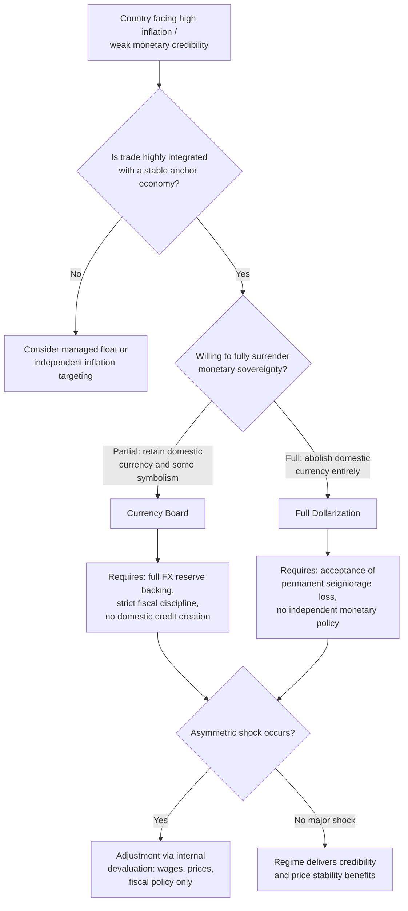

## Currency Boards and Dollarization

### Definition and Conceptual Overview

**Currency boards** and **dollarization** represent the two most rigid forms of fixed exchange rate arrangements, positioned at the extreme "hard peg" end of the exchange rate regime spectrum. Both regimes involve a country surrendering independent monetary policy in exchange for maximal exchange rate credibility and stability, but they differ fundamentally in institutional structure and the degree of sovereignty relinquished.

$$\text{Free Float} \leftrightarrow \text{Managed Float} \leftrightarrow \text{Adjustable Peg} \leftrightarrow \textbf{Currency Board} \leftrightarrow \textbf{Full Dollarization}$$

### Currency Boards: Core Mechanics

A **currency board** is a monetary institution that issues domestic currency (notes and coins) fully backed by, and freely convertible at a fixed rate into, a designated foreign "anchor" currency (commonly the US dollar or euro), with the backing typically required by law to be at or near 100% of the monetary base.

**Key Points — Defining Institutional Rules:**

- **Fixed legal parity**: The exchange rate is fixed by law or constitutional provision, not merely by policy discretion, making realignment far more costly politically and legally than under an adjustable peg.
- **Full (or near-full) foreign reserve backing**: Domestic monetary base liabilities (currency in circulation plus, in many designs, bank reserves) must be backed by foreign reserve assets, typically at a ratio at or above 100%.
- **Automatic convertibility**: The currency board is legally obligated to buy and sell the anchor currency on demand at the fixed rate, with no discretion to refuse.
- **No discretionary monetary policy**: The board cannot conduct open market operations, set independent interest rates, act as lender of last resort in the traditional sense, or monetize government deficits.
- **Passive money supply determination**: The domestic money supply expands or contracts automatically based on balance of payments flows (foreign reserve inflows/outflows), rather than being set by policy.

**The Currency Board Balance Sheet Identity:**

$$\text{Domestic Monetary Base} \leq \text{Foreign Reserves} \times \text{Fixed Exchange Rate}$$

Formally, for a currency board with reserve ratio $\rho \geq 1$:

$$MB_t = \frac{FR_t}{\rho} \times e_{fixed}$$

Where $MB_t$ is the monetary base, $FR_t$ is foreign reserves held by the board, and $e_{fixed}$ is the legally fixed exchange rate.

### How a Currency Board Differs from a Central Bank

| Feature | Traditional Central Bank | Currency Board |
| --- | --- | --- |
| Money supply determination | Discretionary, policy-driven | Passive, driven by BOP flows |
| Domestic asset holdings | Can hold government bonds, extend credit | Minimal or no domestic assets |
| Lender of last resort | Yes, can create liquidity freely | Severely limited or absent |
| Interest rate setting | Independent policy tool | Determined by market, anchored to foreign rate |
| Foreign reserve backing | Partial, discretionary | Full or near-full, legally mandated |
| Exchange rate flexibility | Regime-dependent | None (fixed by law) |
| Seigniorage from money creation | Retained by domestic authority | Limited to interest earned on backing reserves |

### Mechanics of Automatic Adjustment

Under a currency board, balance of payments adjustment operates through an automatic, quasi-classical mechanism resembling the gold standard's price-specie-flow logic:

1. **Reserve inflow (e.g., export boom or capital inflow)**: Foreign currency flows in; the public exchanges it for domestic currency at the board.
2. **Monetary base expansion**: Because the board must issue domestic currency 1:1 (or per its reserve ratio) against the new reserves, the money supply automatically expands.
3. **Domestic credit and price effects**: Expanded money supply lowers domestic interest rates and/or raises domestic prices/spending, which over time erodes competitiveness and induces imports, self-correcting the external surplus.
4. **Reserve outflow (deficit or capital flight)**: The reverse occurs — domestic currency is presented for conversion, reserves fall, the money supply automatically contracts, tightening liquidity and raising interest rates until external balance is restored.

**Example:**

Hong Kong's currency board (Linked Exchange Rate System) pegs the Hong Kong dollar to the US dollar within a narrow band (historically around HK$7.75–7.85 per USD). When capital inflows push the HKD toward the strong side of the band, the Hong Kong Monetary Authority (HKMA) is obligated to sell HKD and buy USD, automatically expanding the HKD monetary base; the reverse occurs at the weak-side convertibility undertaking.

### Advantages of Currency Boards

**Key Points:**

- **High credibility and low transaction costs**: The legal/constitutional commitment reduces devaluation risk premia embedded in interest rates, potentially lowering borrowing costs.
- **Anti-inflationary discipline**: Eliminates the possibility of monetizing fiscal deficits (no domestic credit creation capacity), which historically curbs hyperinflation in countries with weak monetary institutions.
- **Simplicity and transparency**: The mechanical rule is easy to monitor and verify, reducing time-inconsistency problems associated with discretionary policy.
- **Reduced currency risk for trade and investment**: Fixed, credible parity facilitates cross-border trade and FDI planning with reduced exchange rate uncertainty (relative to floating or adjustable peg regimes).

### Disadvantages and Risks of Currency Boards

**Key Points:**

- **Complete loss of independent monetary policy**: Domestic interest rates are effectively imported from the anchor currency country, which may be entirely inappropriate for the domestic business cycle (a classic asymmetric shock problem under the trilemma).
- **No lender of last resort function**: In a banking crisis, the currency board cannot freely create liquidity to rescue distressed banks without violating the reserve backing rule, increasing vulnerability to banking panics.
- **Vulnerability to external shocks**: Because the money supply passively adjusts to BOP flows, a sudden capital outflow forces painful, automatic monetary contraction (higher interest rates, credit crunch, recession) with no discretionary buffer — a dynamic often described as forcing "internal devaluation" instead of external devaluation.
- **Exit costs are very high**: Abandoning a currency board (as opposed to an ordinary peg) is typically far more disruptive because of the strength of the legal commitment and the credibility built around it; abrupt exits have historically triggered severe financial and banking crises.
- **Fiscal discipline is necessary but not sufficient**: A currency board constrains monetary financing of deficits, but does not by itself prevent unsustainable fiscal policy financed through external borrowing, which can still precipitate crisis (as illustrated by Argentina's 1991–2001 convertibility regime).

### Historical Case Study: Argentina's Convertibility Plan (1991–2001)

[Unverified] The following reflects widely documented historical consensus but exact figures vary slightly by source; consult primary IMF/central bank sources for precise statistics.

Argentina's *Ley de Convertibilidad* (1991) pegged the peso 1:1 to the US dollar via a currency-board-like arrangement (not a textbook pure currency board, as some domestic asset holdings were permitted). It succeeded initially in ending hyperinflation and restoring credibility. However:

- Persistent fiscal deficits financed by external borrowing built up unsustainable dollar-denominated debt.
- A strong dollar in the late 1990s (to which the peso was tied) caused real effective appreciation, eroding export competitiveness, especially after Brazil's 1999 devaluation.
- Lack of monetary policy flexibility meant Argentina could not use devaluation or independent interest rate cuts to respond to recession.
- The regime collapsed in December 2001–January 2002 amid banking system collapse, sovereign default, and a subsequent sharp devaluation, illustrating the exit-cost and asymmetric-shock risks inherent to hard pegs.

This episode is a central case study in international economics for both the disciplinary benefits and the structural fragilities of currency-board-style arrangements.

### Dollarization: Definition and Types

**Dollarization** refers to the use of a foreign currency (most commonly, but not exclusively, the US dollar) in place of, or alongside, the domestic currency. It exists on a spectrum of formality and completeness.

**1. Official (Full) Dollarization**

The country legally adopts a foreign currency as its sole official legal tender, abolishing its domestic currency entirely (or retaining it only for subsidiary coinage). The country has **no domestic currency to manage** and therefore no exchange rate policy at all — the "exchange rate" ceases to be a policy variable.

**2. Semi-Official (Bimonetary) Dollarization**

Foreign currency is legal tender and widely used alongside a domestic currency, both circulating in parallel, often with the foreign currency dominant in larger or formal-sector transactions.

**3. Unofficial (De Facto) Dollarization**

Residents voluntarily hold and use foreign currency for savings, contracts, or transactions (currency substitution) despite the domestic currency remaining the sole official legal tender — typically emerging organically in response to high domestic inflation or currency instability, without government sanction.

### Currency Board vs. Full Dollarization

| Feature | Currency Board | Full Dollarization |
| --- | --- | --- |
| Domestic currency | Retained (backed 1:1 by reserves) | Abolished entirely |
| Seigniorage | Retained (interest income on reserve backing) | Forfeited to the anchor country (unless revenue-sharing negotiated) |
| Reversibility | Possible, though costly | Extremely difficult; requires reintroducing a new currency |
| Symbolic sovereignty | Domestic currency and central bank identity preserved | Complete loss of monetary sovereignty symbolism |
| Lender of last resort | Constrained, theoretically possible via reserve buffer | Effectively absent unless external backstop arranged |
| Exchange rate risk | Eliminated versus anchor currency | Eliminated entirely (no domestic currency exists) |

### Seigniorage and the Economics of Dollarization

**Seigniorage** is the revenue a monetary authority earns from issuing currency (the difference between the face value of money and its cost of production, or more broadly, the resources obtained through money creation).

Under full dollarization, the domestic country **forfeits seigniorage** to the country whose currency it adopts (e.g., the United States earns seigniorage from dollars circulating abroad), unless a formal seigniorage-sharing agreement is negotiated (rare in practice, though discussed in some proposals, e.g., Ecuador and Panama's dollarization arrangements).

$$\text{Seigniorage} \approx \frac{\Delta M}{P}$$

Where $\Delta M$ is the change in the monetary base and $P$ is the price level; under dollarization this revenue stream accrues to the anchor country's central bank rather than the dollarizing economy.

**Example:**

Ecuador officially dollarized in 2000 following a severe banking and currency crisis (the sucre had lost roughly two-thirds of its value against the US dollar in the preceding year). By adopting the US dollar, Ecuador eliminated exchange rate risk and rapidly restored price stability and confidence, but permanently gave up independent monetary policy, seigniorage revenue, and the ability to use exchange rate depreciation as an adjustment tool for external shocks (such as swings in oil prices, a major determinant of Ecuador's terms of trade).

### Advantages of Full Dollarization

**Key Points:**

- **Eliminates currency risk entirely**: No possibility of devaluation against the anchor currency because no separate domestic currency exists.
- **Maximum credibility**: Removes any temptation or ability for domestic authorities to inflate away debt or manipulate the exchange rate, often the strongest possible anti-inflation commitment device.
- **Lower risk premia and interest rates**: [Inference] Historically associated with meaningfully lower borrowing costs in previously high-inflation economies, though the magnitude varies by country and time period and is influenced by many co-occurring factors, making precise causal attribution difficult.
- **Reduced transaction costs**: Eliminates currency conversion costs for trade and financial transactions denominated in the anchor currency.
- **Insulation from domestic monetary mismanagement**: Removes the domestic political economy risk of central bank capture or fiscal dominance over monetary policy.

### Disadvantages of Full Dollarization

**Key Points:**

- **Total loss of monetary policy autonomy**: The country imports the anchor country's monetary policy stance regardless of domestic cyclical conditions — an extreme version of the trilemma trade-off.
- **No exchange rate as a shock absorber**: Terms-of-trade or demand shocks must be absorbed entirely through internal price and wage adjustment ("internal devaluation") or fiscal policy, which tends to be slower and more socially costly than nominal exchange rate adjustment.
- **Permanent loss of seigniorage revenue**: A direct, ongoing fiscal cost transferred to the anchor currency's issuing country.
- **No domestic lender of last resort**: Absent external credit lines or negotiated backstop facilities, the domestic financial system lacks a natural liquidity provider in a banking crisis (partially mitigated in some dollarized economies by international financial institution support arrangements).
- **Irreversibility and political economy costs**: Reintroducing a domestic currency after full dollarization is technically and politically difficult, involves significant credibility costs, and has rarely been attempted successfully.
- **Loss of national monetary symbolism**: Currency is often tied to national identity and sovereignty; its abolition carries political and symbolic costs beyond pure economics.

### Optimum Currency Area (OCA) Theory and Dollarization/Currency Boards

The decision to adopt a currency board or dollarize is closely related to **Optimum Currency Area** criteria (Mundell, 1961), which specify conditions under which it is economically efficient for a region to share a single currency (or in this context, peg irrevocably to another country's currency):

**Key Points — Relevant OCA Criteria:**

- **Degree of trade integration** with the anchor currency country (higher integration reduces the cost of forgoing independent exchange rate adjustment).
- **Business cycle synchronization** with the anchor country (higher synchronization means the anchor's monetary policy is more likely to suit domestic conditions).
- **Labor mobility** between the two economies (higher mobility provides an alternative adjustment channel to nominal exchange rate changes).
- **Fiscal transfer mechanisms** available to cushion asymmetric shocks (in the absence of exchange rate flexibility).
- **Price and wage flexibility** (greater flexibility reduces reliance on the exchange rate as an adjustment tool).

[Inference] Countries that dollarize or adopt currency boards without meeting favorable OCA criteria (e.g., low trade integration or asynchronous business cycles with the anchor economy) are generally considered, in the theoretical literature, more exposed to painful internal adjustment costs when asymmetric shocks occur, though real-world outcomes depend on many additional country-specific factors.

### Illustrative Comparison: Adjustment Under Different Regimes Following a Negative Export Shock

**Example:**

Consider a small open economy facing a sudden 20% decline in its main export commodity price.

- **Under a floating regime**: The currency depreciates, partially restoring competitiveness and cushioning the real economy; nominal GDP and employment effects are moderated by the exchange rate absorbing part of the shock.
- **Under a currency board**: The exchange rate cannot move. Reserve outflows automatically contract the money supply, raising interest rates and tightening credit; the economy must adjust via falling wages, prices, and employment (internal devaluation), typically a slower and more painful process.
- **Under full dollarization**: The adjustment mechanism is identical in nature to the currency board case (no nominal exchange rate to absorb the shock) but even more rigid, since there is no domestic currency or monetary base to expand even marginally, and no theoretical possibility of a future currency board exit/devaluation as a last resort.

### Currency Board and Dollarization Decision Framework

### Conclusion

Currency boards and dollarization represent the most rigid points on the exchange rate regime spectrum, trading away monetary policy independence and, in the case of dollarization, seigniorage revenue and reversibility, in exchange for maximal exchange rate credibility and inflation discipline. Currency boards preserve a domestic currency under strict automatic rules, while full dollarization eliminates the domestic currency altogether. Both regimes are best suited, per Optimum Currency Area logic, to economies with strong trade and business cycle linkages to the anchor currency country, sound fiscal institutions, and flexible labor/price markets capable of absorbing shocks internally in the absence of exchange rate adjustment. Historical episodes — notably Hong Kong's durable currency board and Argentina's collapsed convertibility regime, alongside Ecuador's and Panama's dollarization experiences — illustrate both the disciplinary benefits and structural fragilities inherent to hard-peg arrangements.

**Related Topics:**

- Optimum Currency Area (OCA) theory and the Mundell criteria
- The impossible trinity (trilemma) and monetary sovereignty trade-offs
- Seigniorage and inflation tax as fiscal revenue sources
- Argentina's 2001–2002 convertibility crisis as a case study
- Lender of last resort function and banking crisis management under fixed regimes
- Internal devaluation versus external devaluation as adjustment mechanisms
- Eurozone membership as a quasi-currency-board/monetary union comparison
- Balance of payments crises and speculative attacks on fixed regimes
- Exit strategies and risks of abandoning hard pegs
- Panama and Ecuador as comparative dollarization case studies