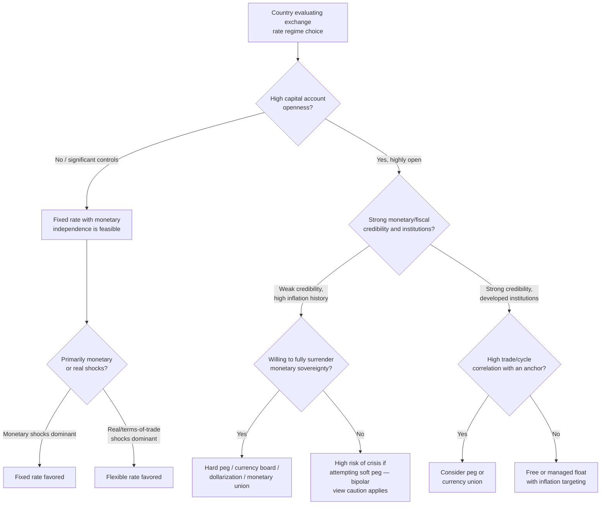

## Choosing an Exchange Rate Regime

### Definition and Conceptual Overview

The choice of an exchange rate regime is one of the most consequential decisions in international macroeconomic policy, determining how a country's currency value is set, how external shocks are absorbed, and how much monetary policy autonomy is retained. There is no universally optimal regime; the appropriate choice is contingent on a country's structural characteristics, institutional strength, shock exposure, and policy objectives. This synthesizes the trade-offs across the full regime spectrum previously examined (hard pegs, currency boards, dollarization, adjustable pegs, crawling pegs, managed floats, and free floats).

### The Trilemma as the Organizing Framework

All exchange rate regime choices are constrained by the **open-economy trilemma (impossible trinity)**: a country cannot simultaneously have (1) a fixed exchange rate, (2) free capital mobility, and (3) independent monetary policy. Only two of the three are achievable at once.

$$\text{Fixed Rate} + \text{Capital Mobility} + \text{Monetary Independence} = \text{Impossible}$$

**Key Points — The Three Corner Solutions:**

- **Hard peg / monetary union corner**: Fixed rate + capital mobility, sacrificing monetary independence (e.g., currency boards, eurozone membership, dollarization).
- **Free float corner**: Capital mobility + monetary independence, sacrificing exchange rate stability (e.g., US, UK, Japan, Australia).
- **Financial autarky corner**: Fixed rate + monetary independence, sacrificing capital mobility (e.g., China historically, various capital-controlled economies).

Most real-world regimes are **intermediate compromises** along the edges of this triangle rather than pure corner solutions, which is why managed floats, crawling pegs, and adjustable pegs are so prevalent despite theoretical arguments (the "bipolar view") favoring corner solutions.

(svg_diagram) The Trilemma Triangle

<svg xmlns="http://www.w3.org/2000/svg" viewBox="0 0 700 480">
<text x="350" y="28" text-anchor="middle" font-size="17" font-weight="bold" fill="#1a1a1a">The Impossible Trinity (svg_diagram)</text>
<polygon points="350,70 100,420 600,420" fill="none" stroke="#333" stroke-width="2.5" />
<circle cx="350" cy="70" r="8" fill="#00008B" />
<text x="350" y="50" text-anchor="middle" font-size="13" font-weight="bold" fill="#00008B">Fixed Exchange Rate</text>
<circle cx="100" cy="420" r="8" fill="#8B0000" />
<text x="100" y="450" text-anchor="middle" font-size="13" font-weight="bold" fill="#8B0000">Monetary Independence</text>
<circle cx="600" cy="420" r="8" fill="#006400" />
<text x="600" y="450" text-anchor="middle" font-size="13" font-weight="bold" fill="#006400">Free Capital Mobility</text>

<text x="225" y="255" text-anchor="middle" font-size="11.5" fill="#444" transform="rotate(-58 225 255)">Capital controls</text>

<text x="225" y="270" text-anchor="middle" font-size="11.5" fill="#444" transform="rotate(-58 225 270)">(e.g. China, historically)</text>

<text x="475" y="255" text-anchor="middle" font-size="11.5" fill="#444" transform="rotate(58 475 255)">Free float</text>

<text x="475" y="270" text-anchor="middle" font-size="11.5" fill="#444" transform="rotate(58 475 270)">(e.g. USA, UK, Japan)</text>

<text x="350" y="410" text-anchor="middle" font-size="11.5" fill="#444">Currency board / dollarization / monetary union</text>

<text x="350" y="395" text-anchor="middle" font-size="11.5" fill="#444">(e.g. Hong Kong, Ecuador, Eurozone)</text>

</svg>

### Key Determinants Guiding Regime Choice

**1. Economic Size and Openness**

- Small, highly open economies (high trade-to-GDP ratios) generally benefit more from exchange rate stability, since exchange rate volatility disproportionately affects prices and transaction costs relative to a large, relatively closed economy.
- Large, diversified economies (e.g., the United States) can more readily absorb the costs of exchange rate flexibility and typically favor floating regimes to preserve monetary autonomy.

**2. Trade Structure and Partner Concentration**

- Economies with trade heavily concentrated with a single large partner (e.g., small Caribbean or Central American economies trading predominantly with the US) benefit more from pegging to that partner's currency, reducing transaction costs and uncertainty in the dominant trade relationship.
- Diversified trade across multiple currency areas reduces the benefit of any single peg and favors flexibility or a basket peg.

**3. Business Cycle Synchronization (Optimum Currency Area Logic)**

- If domestic business cycles are highly correlated with the anchor country's cycles, importing that country's monetary policy via a peg is less costly, since the "one-size-fits-all" interest rate is more likely to suit domestic conditions.
- Asynchronous cycles make fixed regimes costly, since the anchor's monetary policy may be procyclical or countercyclical to actual domestic needs.

**4. Nature and Source of Shocks**

- Economies facing primarily **nominal/monetary shocks** (e.g., volatile money demand) benefit more from fixed rates, which insulate the real economy from monetary instability.
- Economies facing primarily **real shocks** (e.g., terms-of-trade shocks, commodity price swings) benefit more from flexible rates, which allow the nominal exchange rate to absorb the shock rather than forcing painful internal price/wage adjustment.

**5. Institutional and Policy Credibility**

- Countries with weak central bank credibility, a history of high inflation, or fiscal dominance over monetary policy often adopt hard pegs, currency boards, or dollarization as a **credible commitment device** to import discipline.
- Countries with strong, credible, independent central banks (able to run effective inflation targeting) can sustain floating regimes without excessive inflation or volatility risk.

**6. Financial Sector Characteristics (Liability Dollarization)**

- Economies with extensive foreign-currency-denominated debt in the corporate, household, or government sector face "fear of floating" risk: a large depreciation would severely damage balance sheets. This pushes such economies toward managed floats or pegs even when floating might otherwise be theoretically preferable.
- Economies with well-developed domestic capital markets and largely local-currency-denominated debt can tolerate floating exchange rates with less systemic risk.

**7. Reserve Adequacy**

- Fixed and managed regimes require sufficient foreign exchange reserves to defend the rate against speculative pressure or BOP shocks; countries with limited reserve buffers are more vulnerable to costly, crisis-prone peg collapses.
- A common reserve adequacy benchmark is the **Guidotti-Greenspan rule**: reserves should cover at least short-term external debt (debt maturing within one year), providing a rough liquidity buffer against sudden stops.

$$\text{Reserve Adequacy Ratio} = \frac{\text{Foreign Reserves}}{\text{Short-Term External Debt}} \geq 1$$

**8. Capital Account Openness**

- Highly open capital accounts make fixed exchange rates increasingly difficult to sustain (per the trilemma), as speculative capital flows can overwhelm central bank intervention capacity.
- Countries maintaining significant capital controls have more room to sustain fixed rates with independent monetary policy, though at the cost of forgoing the benefits of financial integration (investment, risk-sharing, efficient capital allocation).

**9. Labor and Price Flexibility**

- Economies with flexible wages and prices can absorb shocks internally even under fixed rates, reducing the relative need for exchange rate flexibility as an adjustment tool.
- Economies with rigid wages/prices (due to strong unions, indexation, or regulation) rely more heavily on the exchange rate as the primary adjustment channel, favoring flexibility.

**10. Fiscal Policy Space and Discipline**

- Fixed regimes (especially hard pegs) require strong fiscal discipline, since the government cannot rely on the central bank to monetize deficits or use devaluation to reduce the real value of domestic-currency debt.
- Weak fiscal institutions undermine the sustainability of any peg, regardless of the initial monetary commitment (as illustrated by Argentina's 2001 convertibility collapse).

### Summary Table: Regime Choice by Structural Characteristics

| Country Characteristic | Regime More Likely to Suit |
| --- | --- |
| Small, highly open, trade concentrated with one partner | Fixed peg, currency board, or dollarization |
| Large, diversified economy | Free or managed float |
| High business cycle correlation with anchor | Peg or currency union |
| Low business cycle correlation with anchor | Float |
| Primarily monetary/nominal shocks | Fixed rate |
| Primarily real/terms-of-trade shocks | Flexible rate |
| Weak monetary policy credibility, high inflation history | Hard peg, currency board, dollarization |
| Strong, credible independent central bank | Float with inflation targeting |
| High foreign-currency liability exposure | Managed float or peg (fear of floating) |
| Low reserve adequacy | Flexible rate (fixed regimes hard to defend) |
| Open capital account with large flows | Float (per trilemma) or very hard peg/union |
| Rigid wages and prices | Flexible rate |
| Weak fiscal discipline | Flexible rate (peg unlikely to survive) |

### The "Bipolar View" (Corner Solutions Hypothesis)

Following the emerging market currency crises of the 1990s (Mexico 1994–95, Asia 1997–98, Russia 1998, Brazil 1999, Argentina 2001–02), a body of academic and policy opinion — often called the **bipolar view** or **two-corner solution hypothesis** — argued that intermediate regimes (adjustable pegs, narrow bands, loosely managed floats without credible commitment) were inherently crisis-prone and unsustainable under conditions of high capital mobility, because they present speculators with a clear, defensible target (the announced parity or band) without the institutional rigidity to make defense fully credible.

**Key Points — Bipolar View Argument:**

- Intermediate regimes are vulnerable to speculative attacks: once market participants doubt a peg's sustainability, one-way bets against the currency become highly profitable with limited downside, inviting attack.
- Countries should therefore choose either a **hard peg/monetary union** (maximal credibility, effectively unattackable) or a **freely floating rate** (no fixed target to attack), avoiding the fragile middle ground.
- This view gained prominence in IMF and academic circles in the early 2000s but has since been substantially qualified.

**Key Points — Critiques and Qualifications of the Bipolar View:**

- Empirically, most countries continued to operate intermediate regimes (especially managed floats) despite the theoretical argument, suggesting the "fear of floating" and practical benefits of some exchange rate management outweigh the crisis-vulnerability concerns for many economies.
- [Inference] The bipolar view's predictive power appears strongest for economies with very high capital account openness and shallow domestic financial markets; for economies with more moderate capital mobility or capital controls, intermediate regimes may remain viable and even preferable, though this remains a subject of ongoing empirical debate rather than settled consensus.
- Hard pegs are not immune to crisis either, as Argentina's 2001–02 collapse demonstrated; credibility depends on more than regime classification alone, including fiscal sustainability and banking sector health.

### Costs and Benefits Trade-off Summary

**Key Points — Benefits of Fixed/Hard Regimes:**

- Lower exchange rate uncertainty and transaction costs for trade and investment.
- Strong nominal anchor for inflation expectations.
- Reduced risk of competitive devaluation and currency crises originating from domestic monetary mismanagement.
- Can act as a credible commitment device against time-inconsistent monetary policy.

**Key Points — Costs of Fixed/Hard Regimes:**

- Loss of monetary policy independence (per the trilemma).
- No exchange rate shock absorber for asymmetric or real shocks.
- Vulnerability to speculative attack if credibility is doubted (for pegs short of full currency boards/dollarization).
- Requires costly reserve accumulation and defense capacity.
- Risk of costly, disorderly exit if the peg becomes unsustainable.

**Key Points — Benefits of Floating Regimes:**

- Preserves monetary policy autonomy for domestic stabilization objectives.
- Automatic shock absorption via exchange rate adjustment.
- No need to defend a specific rate, reducing speculative attack risk and reserve requirements.
- Allows gradual adjustment to changing fundamentals without discrete crisis episodes.

**Key Points — Costs of Floating Regimes:**

- Exchange rate volatility can raise trade and investment transaction costs and uncertainty.
- Risk of overshooting and disorderly market dynamics, particularly in shallow or illiquid FX markets.
- "Fear of floating" pressures (via liability dollarization or pass-through inflation) may undermine the credibility or practical viability of a genuinely free float, especially in emerging markets.
- Weaker nominal anchor if not paired with a credible alternative framework (e.g., inflation targeting).

### Regime Choice Decision Framework

### Illustrative Example: Comparing Two Hypothetical Economies

**Example:**

- **Country A**: Small island economy, 70% of trade with a single large neighbor, minimal domestic financial market depth, history of high inflation and weak central bank credibility, significant foreign-currency household debt. → Structural characteristics point toward a **hard peg or dollarization** relative to the neighbor's currency: high trade concentration reduces the cost of forgoing flexibility, weak credibility makes a hard commitment device valuable, and liability dollarization makes floating risky (fear of floating).
- **Country B**: Large, diversified economy with trade spread across many partners, deep and liquid domestic capital markets, strong independent central bank with a track record of low, stable inflation, primarily commodity-driven terms-of-trade shocks. → Structural characteristics point toward a **floating regime with inflation targeting**: diversification reduces the value of any single peg, strong credibility supports monetary independence, and real shocks are better absorbed through exchange rate adjustment than internal wage/price adjustment.

### Practical Sequencing Considerations for Regime Transitions

**Key Points:**

- **Exiting a peg**: Best undertaken during periods of relative calm (strong reserves, no active speculative pressure) rather than under crisis conditions, to avoid a disorderly, high-cost transition; gradual widening of bands or crawling arrangements can serve as a transitional step toward greater flexibility.
- **Adopting a hard peg or dollarization**: Requires prior fiscal consolidation and, ideally, adequate reserve buffers, since the regime removes the safety valve of devaluation and monetary financing going forward.
- **Sequencing capital account liberalization**: The trilemma implies that opening the capital account while maintaining a fixed rate erodes monetary independence; many policy frameworks (including IMF guidance) recommend developing strong domestic financial regulation and macroprudential tools before full capital account liberalization under any exchange rate regime.

### Conclusion

Choosing an exchange rate regime is a multidimensional decision shaped by economic size and openness, trade partner concentration, business cycle synchronization, the nature of shocks an economy faces, institutional credibility, financial sector currency exposure, reserve adequacy, capital account openness, and fiscal discipline. The trilemma establishes the fundamental constraint that no regime can deliver fixed rates, free capital mobility, and monetary independence simultaneously, forcing every country to make an explicit or implicit trade-off among these objectives. While the bipolar view once argued for corner solutions (hard pegs or free floats) as the only sustainable options under high capital mobility, real-world practice shows a continued and pragmatic reliance on intermediate regimes, particularly managed floats, reflecting the genuine and persistent trade-offs involved. There is no single "correct" regime in the abstract; optimal choice is a function of a country's specific structural, institutional, and historical circumstances, and can appropriately change over time as those circumstances evolve.

**Related Topics:**

- The impossible trinity (trilemma) in depth
- Optimum Currency Area (OCA) theory and the Mundell criteria
- Fear of floating and liability dollarization
- The bipolar view / two-corner solutions hypothesis and its critiques
- Speculative attacks and first- and second-generation currency crisis models
- Guidotti-Greenspan reserve adequacy rule
- Sequencing of capital account liberalization
- Case studies: Mexico 1994, Asian Financial Crisis 1997–98, Argentina 2001–02
- Inflation targeting as a complementary monetary framework to floating regimes
- Regional monetary unions (e.g., Eurozone, CFA franc zone) as collective regime choices