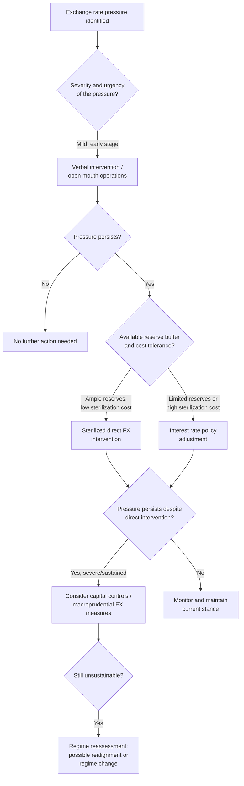

## The Mechanics of Central Bank Intervention

### Definition and Conceptual Overview

Central bank intervention refers to the deliberate actions taken by a monetary authority in the foreign exchange market, money market, or via policy signaling, to influence the level, path, or volatility of its currency's exchange rate. It is the operational toolkit underlying fixed, managed float, and crawling regimes, and even features occasionally in nominally free-floating regimes during periods of disorderly market conditions.

### Categories of Intervention

**Key Points — Primary Dimensions of Classification:**

- **Direct vs. indirect**: Direct intervention involves actual FX market transactions; indirect intervention works through interest rates, capital controls, or verbal signaling.
- **Sterilized vs. unsterilized**: Determines whether the domestic money supply effect of FX operations is offset.
- **Unilateral vs. coordinated**: Single central bank acting alone versus multiple central banks acting jointly (as in the 1985 Plaza Accord or 2011 post-earthquake yen intervention).
- **Secret vs. announced**: Whether the intervention is publicly disclosed at the time or only revealed later (if at all) through official reserve/data reporting.

### Direct Foreign Exchange Market Intervention

**Mechanics:**

The central bank enters the spot (or sometimes forward/swap) FX market and buys or sells its domestic currency against a foreign reserve currency (commonly USD, EUR, or a basket).

- **To support/appreciate the domestic currency**: Central bank sells foreign reserves and buys domestic currency, reducing domestic currency supply in the market.
- **To weaken/depreciate the domestic currency**: Central bank buys foreign reserves and sells (issues) domestic currency, increasing domestic currency supply in the market.

**Balance Sheet Effect (Unsterilized Intervention):**

$$\Delta MB = \Delta DA + \Delta FR$$

Where $MB$ is the monetary base, $DA$ is net domestic assets held by the central bank, and $FR$ is net foreign reserve assets. An unsterilized FX purchase increases $FR$ and, with $DA$ unchanged, increases $MB$ one-for-one, expanding the domestic money supply.

**Example:**

A central bank sells $1 billion of USD reserves to support its depreciating currency. This unsterilized operation removes domestic currency from circulation equal to the peso value of $1 billion, simultaneously tightening domestic liquidity and raising short-term interest rates — reinforcing the currency-supportive effect through both the direct FX flow and the indirect monetary tightening channel.

### Sterilized Intervention Mechanics in Detail

Sterilization is the process of neutralizing the domestic monetary base impact of an FX operation through an offsetting operation in domestic assets, typically via open market operations (OMOs).

**Step-by-Step Process:**

1. Central bank conducts FX operation (e.g., buys $500 million in the spot market, paying with newly issued domestic currency).
2. This initial operation increases the monetary base by the domestic-currency equivalent of $500 million.
3. To sterilize, the central bank simultaneously sells domestic government securities (or issues its own sterilization bills/central bank paper) of equivalent value in the open market.
4. This absorbs the injected domestic currency liquidity, returning the monetary base to its pre-intervention level.
5. Net result: Foreign reserves have increased by $500 million (asset side of central bank balance sheet), domestic securities held by the public have increased correspondingly (a liability-side substitution), and the money supply is approximately unchanged.

**Sterilized Intervention Balance Sheet Identity:**

$$\Delta MB = \Delta DA + \Delta FR = 0 \implies \Delta DA = -\Delta FR$$

**Key Points — Why Sterilize:**

- Prevents unwanted inflationary or deflationary monetary effects from FX operations conducted purely for exchange rate purposes.
- Allows the central bank to pursue exchange rate and domestic monetary/inflation objectives somewhat independently in the short run — though this independence is limited and temporary under high capital mobility (per the trilemma and uncovered interest parity arbitrage).
- Common in emerging markets managing large, volatile capital inflows without wanting those inflows to translate into unwanted domestic credit or inflation expansion.

**Key Points — Limits and Costs of Sterilization:**

- **Quasi-fiscal cost**: If domestic interest rates on sterilization securities exceed the yield earned on foreign reserves (often low-yielding US Treasuries), the central bank incurs an ongoing carrying cost, which can erode its capital or require fiscal transfers.
- **Continual sterilization can become self-defeating**: Higher domestic interest rates from sterilization bond issuance can attract further capital inflows (seeking the interest rate differential), requiring even more intervention and sterilization — a phenomenon sometimes called the "sterilization trap" or "vicious circle" of intervention.
- **Effectiveness diminishes with capital account openness**: Under high capital mobility, sterilized intervention primarily affects the exchange rate through a "portfolio balance channel" (changing relative supplies of domestic vs. foreign currency assets) or a "signaling channel" (conveying information about future policy intent), both of which tend to have more limited and less persistent effects than unsterilized intervention, according to a substantial body of empirical research. [Inference] The precise magnitude of sterilized intervention's exchange rate effect is contested in the literature and appears highly context-dependent, varying with market conditions, credibility, and the size of intervention relative to market turnover.

### Channels Through Which Intervention Affects the Exchange Rate

**1. Monetary Channel (Unsterilized Intervention Only)**

Directly changes the money supply and, via money market equilibrium, short-term interest rates, which affects the exchange rate through interest parity and monetary models of exchange rate determination.

**2. Portfolio Balance Channel**

Changes the relative supply of domestic-currency versus foreign-currency-denominated assets available to investors. If domestic and foreign bonds are imperfect substitutes (due to differing risk characteristics), changing relative supplies changes the required risk premium, affecting the exchange rate even when sterilized.

**3. Signaling Channel**

Intervention conveys information about the central bank's private information, future policy intentions, or resolve, shifting market expectations of future exchange rates or interest rates, thereby affecting the current exchange rate through expectations formation, even when the immediate money supply effect is sterilized.

**4. Coordination/Confidence Channel**

Intervention (especially large, coordinated, publicly announced operations) can shift market sentiment or break a self-reinforcing speculative dynamic, particularly effective when markets are testing the credibility of a stated policy stance.

### Uncovered Interest Parity and the Limits of Sterilized Intervention

$$i_{domestic} = i_{foreign} + E[\%\Delta e] + \rho$$

Where $i_{domestic}$ and $i_{foreign}$ are domestic and foreign interest rates, $E[\%\Delta e]$ is the expected rate of depreciation, and $\rho$ is a risk premium. If domestic and foreign assets are close substitutes and capital is highly mobile, sterilized intervention (which leaves both interest rates unchanged) has little room to durably affect the exchange rate independent of $E[\%\Delta e]$ or $\rho$, unless it operates via the portfolio balance or signaling channels described above.

### Indirect Intervention Tools

**1. Interest Rate Policy**

Raising the policy rate attracts capital inflows (all else equal, per UIP logic), supporting the currency; cutting rates has the opposite effect. This is often the most powerful tool available but carries direct domestic macroeconomic consequences unrelated to the exchange rate objective, creating potential conflicts with domestic inflation or output stabilization goals.

**2. Verbal Intervention ("Open Mouth" Operations)**

Officials issue public statements signaling discomfort with current exchange rate levels or trends, hinting at possible future action. Effective primarily through the signaling and confidence channels, at minimal direct financial cost, though credibility erodes with repeated unfulfilled threats ("crying wolf" problem).

**3. Reserve Requirements and Macroprudential FX Measures**

Differential reserve requirements on foreign-currency-denominated bank liabilities, limits on banks' open FX positions, or taxes on short-term capital inflows (e.g., historically, Chile's encaje in the 1990s, Brazil's IOF tax on portfolio inflows) can indirectly reduce speculative pressure without direct FX market transactions.

**4. Capital Controls**

Direct restrictions on the volume, type, or duration of cross-border capital flows, used to reduce the scale of flows that would otherwise need to be met with direct FX intervention.

**5. Forward Market and Derivatives Intervention**

Central banks can intervene in FX forward, swap, or non-deliverable forward (NDF) markets rather than (or in addition to) the spot market, which can influence expectations and pricing without an immediate spot reserve transaction, and is sometimes used to manage intervention when spot reserves are limited or when signaling future intent is the primary goal.

### Sequencing and Effectiveness of Intervention Tools

### Empirical Effectiveness of Intervention

**Key Points — Factors Influencing Intervention Effectiveness:**

- **Size relative to market turnover**: Intervention is more effective when large relative to the depth and daily turnover of the relevant FX market; in highly liquid major currency pairs (e.g., EUR/USD), single-country intervention has historically had limited and often short-lived effects.
- **Consistency with underlying fundamentals**: Intervention that pushes against fundamental economic trends tends to be less effective and less durable than intervention that smooths short-term volatility around a fundamentally justified trend.
- **Credibility and coordination**: Coordinated multi-central-bank intervention (e.g., G7 coordinated action) tends to have larger and more persistent effects than unilateral action, due to combined firepower and stronger signaling of shared policy intent.
- **Transparency vs. secrecy**: [Inference] The relative effectiveness of announced versus secret intervention is debated in the empirical literature; announced intervention maximizes the signaling channel but risks credibility damage if not sustained, while secret intervention may allow probing of market conditions without triggering speculative bandwagon effects, though this trade-off is context-dependent and not resolved by a general consensus.
- **Underlying capital account openness**: Per the trilemma, intervention effectiveness (especially sterilized) diminishes as capital mobility increases, since private capital flows can offset official intervention in scale.

### Historical Examples of Notable Intervention Episodes

[Unverified] The following are widely cited historical episodes; specific figures and characterizations should be verified against primary central bank and IMF documentation for precise detail.

- **Plaza Accord (1985)**: Coordinated intervention by the G5 (US, Japan, West Germany, France, UK) to deliberately depreciate the US dollar, which had appreciated sharply in the early 1980s; widely regarded as a successful example of coordinated intervention working with, rather than against, underlying market and policy fundamentals.
- **Louvre Accord (1987)**: Follow-up coordinated effort to stabilize the dollar after the Plaza Accord's depreciation, with more mixed and debated effectiveness.
- **Bank of Japan yen interventions (various periods, including 2011 and 2022)**: Japan has periodically intervened both to weaken an overly strong yen (e.g., post-2011 earthquake, when a strong yen threatened export competitiveness during reconstruction) and to support a weakening yen (e.g., 2022, amid a large interest rate differential with the US), illustrating that a single country may intervene in both directions across different periods depending on prevailing pressure.
- **Swiss National Bank EUR/CHF floor (2011–2015)**: The SNB committed to an explicit floor of 1.20 CHF per EUR, backed by a commitment to unlimited intervention; the floor was abruptly abandoned in January 2015 when the SNB judged continued defense unsustainable, causing an extreme one-day appreciation of the franc — a widely studied example of the risks of an announced, seemingly credible commitment that ultimately proved unsustainable.

### Central Bank Balance Sheet Considerations

**Key Points:**

- Large-scale, sustained intervention (particularly to resist depreciation) can significantly deplete foreign reserves, raising concerns about reserve adequacy relative to short-term external debt and import coverage benchmarks.
- Sustained intervention to resist appreciation (reserve accumulation) expands the central bank's balance sheet indefinitely if not sterilized, or requires ever-larger sterilization bond issuance if sterilized, both of which carry longer-run fiscal, financial stability, or balance-sheet risk implications.
- Valuation effects matter: reserves held in foreign currency fluctuate in domestic-currency terms with exchange rate movements themselves, meaning intervention operations interact with the central bank's own balance sheet risk exposure.

### Illustrative Numerical Example

**Example:**

A central bank holds $50 billion in FX reserves and observes disorderly depreciation pressure pushing its currency down 8% in two weeks amid a broader risk-off capital flight episode.

1. **Initial response**: Verbal intervention by the central bank governor, stating the depreciation is "not warranted by fundamentals." Pressure persists.
2. **Escalation**: The central bank raises its policy rate by 150 basis points to increase the attractiveness of domestic-currency assets, per UIP logic.
3. **Direct intervention**: Simultaneously, the central bank begins daily spot market sales of $200 million, sterilized via short-term repo operations to avoid excessive tightening beyond the intended rate hike.
4. **Outcome assessment**: After two weeks, reserves have fallen by $2 billion (from $50 billion to $48 billion, roughly 4% of the total buffer), and depreciation pressure moderates to a more orderly pace. The central bank assesses reserve adequacy remains within acceptable bounds relative to short-term external debt coverage and continues to monitor, ready to escalate to capital flow management measures if pressure resumes.

### Conclusion

Central bank intervention encompasses a spectrum of tools — from costless verbal signaling to large-scale sterilized or unsterilized FX operations, interest rate adjustments, and capital flow management measures — each carrying distinct transmission channels, costs, and effectiveness profiles. Unsterilized intervention operates through direct monetary base and interest rate effects, while sterilized intervention relies on more contested portfolio balance and signaling channels, with effectiveness diminishing as capital account openness increases, consistent with the constraints imposed by the trilemma. The choice and sequencing of intervention tools in practice reflects a central bank's assessment of shock severity, available reserve buffers, sterilization costs, and credibility considerations, with historical episodes such as the Plaza Accord and the Swiss franc floor collapse illustrating both the potential and the limits of intervention as a policy instrument.

**Related Topics:**

- Uncovered interest parity (UIP) and covered interest parity (CIP) conditions
- Portfolio balance and signaling channels of intervention in depth
- Reserve adequacy benchmarks (Guidotti-Greenspan rule, import coverage ratios)
- Capital flow management measures and macroprudential FX tools
- Speculative attacks and first-generation currency crisis models (Krugman 1979)
- The Swiss National Bank's 2015 franc floor abandonment as a case study
- Coordinated multilateral intervention (Plaza Accord, Louvre Accord)
- Central bank balance sheet risk and quasi-fiscal costs of sterilization
- Fear of floating and its link to intervention frequency
- Forward and non-deliverable forward (NDF) market intervention techniques