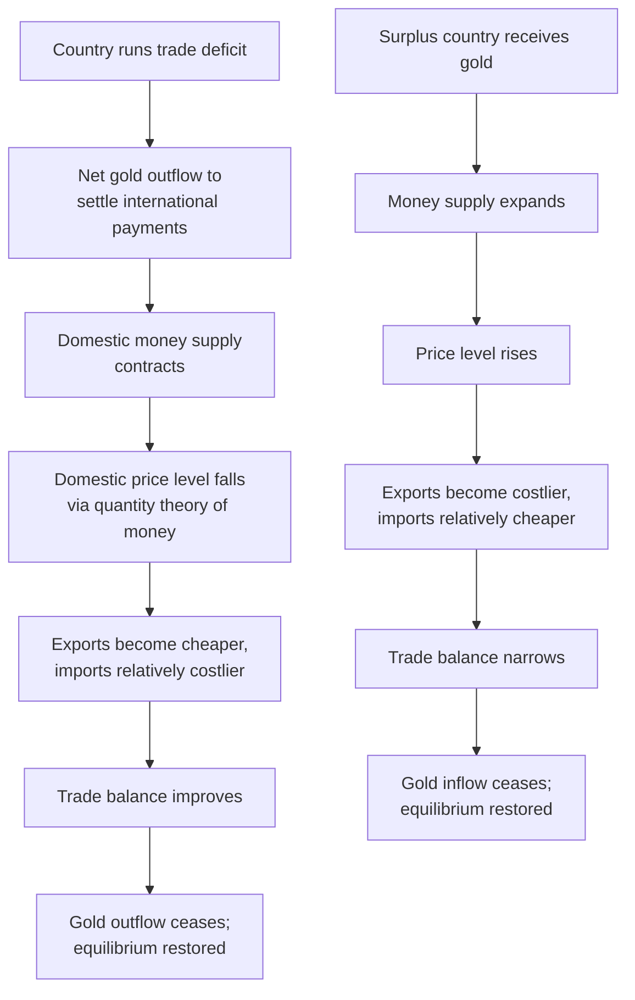

## The Classical Gold Standard

### Definition and Historical Overview

The classical gold standard was an international monetary system, operative in its most widely recognized form from approximately 1870/1880 to 1914, under which participating countries defined their national currencies in terms of a fixed weight of gold, maintained free convertibility between paper currency and gold at that fixed rate, and permitted unrestricted import and export of gold. It represents the historical archetype of a rule-based, fixed exchange rate international monetary system and remains a central reference point in international economics for analyzing automatic balance-of-payments adjustment mechanisms.

### Core Institutional Rules

**Key Points — Defining Features:**

- **Fixed gold parity**: Each country's central bank or treasury defined its currency's value as a specific weight of gold (e.g., historically, the British pound was defined at a fixed gold content, as was the US dollar).
- **Free convertibility**: Domestic currency was freely convertible into gold on demand at the fixed official parity, both for residents and, critically, for foreign holders.
- **Free international gold flows**: No restrictions existed on the import or export of gold across borders, allowing gold to move freely in response to balance of payments imbalances.
- **Fixed exchange rates between gold standard countries**: Since each currency was pegged to gold, exchange rates between any two gold standard currencies were automatically fixed (within narrow bands defined by the costs of shipping gold, known as "gold points").
- **Domestic money supply loosely tied to gold reserves**: Central banks were expected (though not always strictly bound by law in every country) to maintain a link between the domestic money supply and gold reserve holdings, constraining discretionary monetary expansion.

### Determining Bilateral Exchange Rates Under Gold

If Currency A is defined as $g_A$ units of gold per unit of currency, and Currency B is defined as $g_B$ units of gold per unit of currency, the implied fixed exchange rate (the **mint parity**) is:

$$e_{A/B} = \frac{g_B}{g_A}$$

**Example:**

Historically, if the US dollar was defined as containing a certain weight of gold and the British pound was defined as containing a proportionally greater weight of gold, the implied mint parity between the two currencies followed directly from the ratio of their gold contents, yielding the well-known historical par value of approximately $4.86 per pound sterling in the late classical gold standard period. [Unverified] Exact historical parity figures and dates of adoption varied somewhat by source and by the precise legal gold content definitions in force at different times; this figure reflects widely cited historical convention rather than a claim requiring independent verification here.

### Gold Points and the Bands of Fixity

Exchange rates under the gold standard were not perfectly rigid but fluctuated within narrow bands defined by the transaction costs of physically shipping gold between countries (insurance, freight, and financing costs).

$$e_{gold\ export\ point} = e_{mint\ parity} + \text{shipping/insurance cost}$$

$$e_{gold\ import\ point} = e_{mint\ parity} - \text{shipping/insurance cost}$$

If the market exchange rate moved beyond the gold export point, it became profitable for arbitrageurs to convert domestic currency to gold, ship it abroad, and convert to foreign currency for a profit — an arbitrage flow that would push the exchange rate back within the band. This self-correcting arbitrage mechanism kept exchange rates within a narrow range around mint parity without requiring active central bank intervention, unlike modern managed regimes.

(svg_diagram) Gold Points Arbitrage Band

<svg xmlns="http://www.w3.org/2000/svg" viewBox="0 0 700 300">
<text x="350" y="28" text-anchor="middle" font-size="17" font-weight="bold" fill="#1a1a1a">Gold Points and Arbitrage Band (svg_diagram)</text>
<line x1="80" y1="150" x2="620" y2="150" stroke="#333" stroke-width="2" />
<line x1="150" y1="100" x2="150" y2="200" stroke="#8B0000" stroke-width="2" stroke-dasharray="5,3" />
<text x="150" y="90" text-anchor="middle" font-size="12" font-weight="bold" fill="#8B0000">Gold Export Point</text>
<text x="150" y="220" text-anchor="middle" font-size="10" fill="#555">Ship gold abroad</text>
<text x="150" y="233" text-anchor="middle" font-size="10" fill="#555">(currency too weak)</text>
<circle cx="350" cy="150" r="7" fill="#00008B" />
<line x1="350" y1="100" x2="350" y2="200" stroke="#00008B" stroke-width="2" />
<text x="350" y="90" text-anchor="middle" font-size="12" font-weight="bold" fill="#00008B">Mint Parity</text>
<line x1="550" y1="100" x2="550" y2="200" stroke="#006400" stroke-width="2" stroke-dasharray="5,3" />
<text x="550" y="90" text-anchor="middle" font-size="12" font-weight="bold" fill="#006400">Gold Import Point</text>
<text x="550" y="220" text-anchor="middle" font-size="10" fill="#555">Import gold from abroad</text>
<text x="550" y="233" text-anchor="middle" font-size="10" fill="#555">(currency too strong)</text>
<rect x="150" y="145" width="400" height="10" fill="#D3D3D3" opacity="0.5" />
<text x="350" y="260" text-anchor="middle" font-size="11" fill="#444">Exchange rate fluctuates freely within this band</text>
<text x="350" y="273" text-anchor="middle" font-size="11" fill="#444">width determined by gold shipping/insurance costs</text>
</svg>

### The Price-Specie-Flow Mechanism (Hume's Adjustment Model)

The classical theoretical explanation for automatic balance-of-payments adjustment under the gold standard, originally articulated by David Hume (1752), describes a self-correcting mechanism operating through gold flows and domestic price levels.

**Step-by-Step Mechanism:**

1. **Trade deficit emerges**: A country imports more than it exports, requiring net payment to foreigners.
2. **Gold outflow**: The deficit is settled via net gold export, since gold is the ultimate international means of payment under the standard.
3. **Domestic money supply contracts**: As gold (the reserve backing) leaves the country, the domestic money supply (assumed tied to gold reserves via the quantity theory of money) falls.
4. **Domestic price level falls**: Following the quantity theory of money, a lower money supply leads to lower domestic prices (deflation).
5. **Competitiveness improves**: Lower domestic prices make exports cheaper and imports relatively more expensive, improving the trade balance.
6. **Symmetric process abroad**: The surplus country receiving gold experiences the mirror-image process — money supply expansion, rising prices, declining competitiveness — reinforcing the adjustment from the other side.
7. **Equilibrium restored**: The process continues until the trade imbalance is eliminated and gold flows cease.

**Quantity Theory of Money Formalization:**

$$MV = PY$$

Where $M$ is the money supply, $V$ is velocity of money (assumed constant in the classical framework), $P$ is the price level, and $Y$ is real output (assumed at or near full employment in the classical model). A change in $M$ (from gold flows) directly translates into a proportional change in $P$, holding $V$ and $Y$ fixed.

### Rules of the Game

The **"rules of the game"** refers to the informal (and historically imperfectly followed) convention that central banks should reinforce, rather than counteract, the automatic price-specie-flow adjustment mechanism.

**Key Points:**

- Central banks losing gold (deficit countries) were expected to raise domestic interest rates and allow monetary contraction, reinforcing the deflationary adjustment.
- Central banks gaining gold (surplus countries) were expected to lower domestic interest rates and allow monetary expansion, reinforcing the inflationary adjustment.
- Historical research (notably by economic historians examining central bank archives) has found that adherence to the "rules of the game" was inconsistent in practice; some central banks, particularly the Bank of England, at times **sterilized** gold flows (offsetting their domestic monetary effect) to smooth domestic conditions, partially undermining the theoretical automaticity of the mechanism. [Inference] The extent of rule adherence versus violation varied significantly by country and period, and remains a subject of ongoing historical-empirical research rather than a single settled figure.

### The Role of the Bank of England and Confidence

**Key Points:**

- London functioned as the de facto center of the classical gold standard system, with the Bank of England's discount rate ("Bank Rate") serving as a key policy lever with international ripple effects, given London's role as the world's leading financial and trade center.
- The system's stability during 1870–1914 is often attributed partly to strong mutual confidence among core participating countries (particularly Britain, France, Germany, and the United States) that gold convertibility would be maintained, reducing speculative pressure relative to systems lacking such credibility.
- [Inference] Historical analyses commonly attribute the system's relative stability during this period to a combination of hegemonic stability (Britain's central financial role), strong political commitment to gold convertibility as a matter of national prestige, and relatively limited international capital mobility by modern standards, though the relative weight of each factor remains debated among economic historians.

### Advantages of the Classical Gold Standard

**Key Points:**

- **Strong nominal anchor and long-run price stability**: Because money supply growth was constrained by gold discovery and production rather than discretionary policy, long-run price levels in gold standard countries tended to be relatively stable across multi-decade horizons (though subject to significant medium-term fluctuation tied to gold discoveries, such as the California and Australian gold rushes of the mid-19th century, or later the South African and Klondike discoveries).
- **Elimination of exchange rate uncertainty**: Fixed parities among gold standard countries substantially reduced exchange rate risk for international trade and investment, arguably facilitating the substantial expansion of global trade and capital flows during this era.
- **Automatic adjustment mechanism**: In principle, the price-specie-flow mechanism provided a rule-based, self-correcting process for balance of payments adjustment without requiring discretionary policy intervention or negotiation.
- **Constraint on fiscal and monetary indiscipline**: Convertibility requirements limited governments' ability to finance deficits through unconstrained money creation, providing indirect fiscal discipline.

### Disadvantages and Structural Weaknesses

**Key Points:**

- **Adjustment burden fell heavily on the real economy**: Because nominal exchange rates could not adjust, balance of payments adjustment required domestic price and wage deflation (or inflation), which — particularly deflation in deficit countries — often meant painful reductions in output and employment, especially where wages and prices were not fully flexible downward.
- **No independent monetary policy for domestic stabilization**: Countries could not use monetary policy to address domestic unemployment or business cycle conditions if doing so conflicted with maintaining gold convertibility, an early historical illustration of the trilemma constraint.
- **Dependence on gold supply**: The world money supply was fundamentally constrained by the physical supply of newly mined gold, creating a structural deflationary bias during periods of slow gold discovery relative to global economic growth (as was notably the case in parts of the 1870s–1890s, contributing to the "Long Depression" era of persistently falling prices in several major economies).
- **Asymmetric adjustment burden**: In practice, deficit countries often faced stronger pressure to adjust (via the threat of reserve depletion and convertibility crisis) than surplus countries, which faced no equivalent binding constraint forcing them to expand and share the adjustment burden — an asymmetry later echoed in Keynes's critiques during the design of the Bretton Woods system.
- **Vulnerability to gold discoveries and mining shocks**: Sudden major gold discoveries could generate significant, exogenous global inflationary episodes unrelated to underlying economic fundamentals or productivity.
- **Peripheral country vulnerability**: Countries outside the core (Britain, France, Germany, US) with less developed financial systems, greater reliance on volatile commodity exports, or weaker access to international capital markets often experienced greater strain and more frequent departures from gold convertibility than core countries.

### The Gold Standard and the Trilemma in Historical Perspective

Although the term "trilemma" is a later analytical construct, the classical gold standard is widely understood retrospectively as one of the historical "fixed rate + capital mobility" corner solutions, achieved by sacrificing independent monetary policy: countries subordinated domestic monetary conditions to the requirement of maintaining gold convertibility and stable exchange rates, in an era of comparatively high (for the time) international capital mobility among core financial centers.

### Suspension and Collapse: World War I and Aftermath

The classical gold standard effectively collapsed with the outbreak of World War I in 1914, as major belligerent countries suspended gold convertibility to finance war expenditures through money creation, which was incompatible with maintaining fixed gold backing.

**Key Points — Post-War Attempts and Final Breakdown:**

- Several countries attempted to restore a **gold exchange standard** in the 1920s (a modified system where countries could hold convertible foreign currencies, particularly sterling and dollars, as reserves alongside gold), but this proved considerably less stable than the pre-1914 system.
- Britain's return to the gold standard in 1925 at the pre-war parity (widely associated with the economist John Maynard Keynes's contemporaneous criticism that the pound was overvalued) is frequently cited as contributing to deflationary pressure and competitiveness problems in the British economy during the later 1920s.
- The system definitively collapsed during the Great Depression of the early 1930s, as countries progressively abandoned gold convertibility (Britain in 1931, the United States effectively in 1933–34, France and the remaining "gold bloc" countries by 1936) in order to regain monetary policy flexibility to combat severe domestic deflation and unemployment.
- [Inference] A substantial body of economic history research (including influential work by Barry Eichengreen) argues that countries which abandoned the gold standard earlier during the Great Depression generally experienced faster economic recovery than those which adhered to gold convertibility longer, consistent with the view that the gold standard constrained necessary countercyclical monetary policy responses during the crisis; this remains an influential but not universally unchallenged interpretation within economic history.

### Comparison: Classical Gold Standard vs. Later Gold-Based Systems

| Feature | Classical Gold Standard (c.1870–1914) | Gold Exchange Standard (1920s) | Bretton Woods System (1944–1971) |
| --- | --- | --- | --- |
| Reserve asset | Gold directly | Gold plus convertible foreign currencies | US dollar (convertible to gold) plus gold |
| Convertibility | Full, for residents and foreigners | Partial, less consistently enforced | Officially dollar-gold convertible for foreign central banks only |
| Capital mobility | Relatively high for the era | Moderate, disrupted by war legacy | Restricted, capital controls common |
| Adjustment mechanism | Automatic price-specie-flow | Weakened automaticity | Adjustable pegs with IMF oversight |
| Stability | Relatively stable pre-1914 | Unstable, collapsed in Depression | Stable initially, collapsed 1971–73 |

### Illustrative Numerical Example

**Example:**

Suppose Country X's currency is defined at a gold content implying a mint parity of 5.00 units of Country X's currency per unit of Country Y's currency, with a gold shipping/insurance cost equivalent to 0.5% of parity in each direction.

- Gold export point (weak-side band): approximately 5.025 (X depreciates to this level before gold export arbitrage becomes profitable).
- Gold import point (strong-side band): approximately 4.975.
- If Country X runs a persistent deficit and its currency depreciates toward 5.025, arbitrageurs find it profitable to convert Country X currency to gold, ship the gold to Country Y, and convert to Country Y's currency, realizing a small arbitrage profit net of shipping costs. This gold outflow from Country X contracts its money supply, initiating the price-specie-flow adjustment process described above, while simultaneously the arbitrage flow itself pushes the exchange rate back toward parity.

### Conclusion

The classical gold standard (c.1870–1914) stands as the historical archetype of a fully fixed, rule-based international monetary system, in which fixed gold parities, free convertibility, and unrestricted gold flows combined to produce automatically fixed exchange rates among participating countries and a theoretically self-correcting balance-of-payments adjustment mechanism via the price-specie-flow model. While it delivered substantial exchange rate stability and long-run nominal anchoring during its operative period, it did so at the cost of subordinating domestic monetary policy to external balance considerations, imposing painful deflationary adjustment burdens (particularly on deficit countries), and remaining structurally dependent on the vagaries of global gold supply. Its collapse amid World War I, and the failure of subsequent attempts to restore a workable gold-based system through the interwar period, set the stage for the design of the Bretton Woods system, which sought to retain some benefits of exchange rate stability while providing greater flexibility and coordination mechanisms than the classical gold standard had allowed.

**Related Topics:**

- The price-specie-flow mechanism and the quantity theory of money in depth
- The interwar gold exchange standard and Britain's 1925 return to gold at pre-war parity
- The Great Depression and the role of gold standard adherence in delaying recovery (Eichengreen's research)
- The Bretton Woods system as the successor international monetary order
- David Hume's original 1752 essay on the balance of trade
- Asymmetric adjustment burden: deficit versus surplus country obligations
- Hegemonic stability theory and Britain's role in the classical gold standard
- Gold discoveries and their macroeconomic effects (California, Klondike, South Africa)
- The "rules of the game" and central bank sterilization behavior historically
- Comparing the trilemma's corner solutions across historical eras