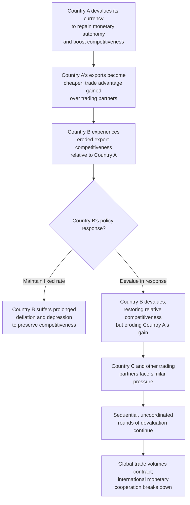

## The Interwar Period and Competitive Devaluation

### Definition and Historical Overview

The interwar period (1918–1939) refers to the two decades between World War I and World War II, during which the international monetary system underwent repeated, largely unsuccessful attempts to restore pre-1914 gold standard stability, culminating in the breakdown of international monetary cooperation and a wave of **competitive devaluations** — successive rounds of currency depreciation by multiple countries each seeking to gain a trade advantage, often described pejoratively as "beggar-thy-neighbor" policies. This period is a critical case study in international economics for understanding the fragility of uncoordinated exchange rate policy and the origins of post-WWII efforts to build cooperative international monetary institutions.

### Phase One: Post-War Disorder (1918–1925)

**Key Points:**

- World War I forced the suspension of gold convertibility across most major belligerent countries, as war financing required money creation incompatible with gold backing.
- The immediate post-war years were characterized by highly volatile floating exchange rates, large fiscal deficits, and in several cases (most notably Germany) extreme hyperinflation driven by unconstrained money creation to finance government spending and war reparations obligations.
- Currency values diverged sharply from pre-war parities, reflecting differing degrees of wartime inflation across countries, complicating any straightforward return to previous fixed exchange rates.

**Example:**

Germany's hyperinflation of 1921–1923 is among the most extreme currency depreciation episodes in modern economic history, with the mark's value collapsing so severely that the currency became practically worthless for savings purposes, ultimately requiring a fundamental currency reform (the introduction of the Rentenmark in late 1923) to restore monetary stability. [Unverified] Precise hyperinflation statistics vary by source and measurement methodology; the broad magnitude and qualitative severity of the episode, however, is well established in the historical literature.

### Phase Two: Attempted Restoration of the Gold Standard (Mid-to-Late 1920s)

Following post-war disorder, major economies sought to restore exchange rate stability by returning to a **gold exchange standard**, a modified version of the classical gold standard in which countries could hold convertible foreign currencies (chiefly the British pound and US dollar) as reserves, alongside or instead of gold itself.

**Key Points — Structural Differences from the Classical Gold Standard:**

- Reduced automaticity: unlike the classical price-specie-flow mechanism, central banks under the gold exchange standard retained greater scope for discretionary sterilization of gold flows.
- Reserve currency concentration: reliance on sterling and the dollar as reserve assets created new vulnerabilities, since confidence in those reserve currencies' own convertibility became a systemic concern (a "confidence problem" later echoed in Bretton Woods' Triffin dilemma).
- Return parities often did not reflect post-war economic realities, since many countries returned to gold at pre-war par values despite substantially different relative price levels after wartime inflation.

**Britain's Return to Gold (1925):**

Britain returned to the gold standard in 1925 at the pre-war parity of $4.86 per pound, a decision associated with Winston Churchill as Chancellor of the Exchequer and famously criticized at the time by John Maynard Keynes (in his essay "The Economic Consequences of Mr. Churchill") as overvaluing the pound by a significant margin relative to competitors, given the relative price level changes since 1914.

**Key Points — Consequences of Britain's Overvalued Return:**

- The overvalued pound undermined British export competitiveness, particularly in traditional industries such as coal, textiles, and shipbuilding.
- Persistent deflationary pressure was required domestically to maintain competitiveness at the fixed overvalued rate, contributing to elevated unemployment and labor unrest (including the 1926 General Strike, though multiple factors contributed to that episode).
- [Inference] Many economic historians view Britain's 1925 return to gold at the pre-war parity as a significant contributing factor to Britain's relatively weak economic performance during the later 1920s, though the precise quantitative contribution relative to other structural factors remains a subject of historical debate.

**France's Contrasting Experience:**

France stabilized the franc in 1926 (formally returning to gold in 1928) at a rate widely regarded as **undervalued** relative to pre-war purchasing power, which — in notable contrast to Britain's experience — supported French export competitiveness and contributed to substantial gold reserve accumulation by the Banque de France through the late 1920s and into the early 1930s.

### Phase Three: The Great Depression and Systemic Collapse (1929–1933)

**Key Points — Transmission of the Depression Through the Gold Standard:**

- The US stock market crash of October 1929 and subsequent US economic contraction reduced American demand for imports and international lending, transmitting deflationary pressure globally through trade and capital flow channels.
- Under the gold exchange standard's fixed parities, countries experiencing balance of payments deficits faced the classical adjustment dilemma: either accept painful domestic deflation to maintain gold convertibility, or abandon gold convertibility to regain monetary policy flexibility.
- The 1931 banking and currency crises in Central Europe (notably the collapse of Austria's Creditanstalt bank in May 1931) triggered a cascading loss of confidence that spread to Germany and, critically, to Britain.
- **Britain abandoned the gold standard in September 1931**, allowing the pound to float (and depreciate substantially), a decisive turning point signaling the practical unworkability of the restored gold exchange standard under Depression-era conditions.
- The United States effectively left the gold standard for domestic purposes in 1933–34 under the Roosevelt administration, devaluing the dollar's gold content (raising the official gold price from $20.67 to $35.00 per ounce) as part of broader New Deal recovery efforts.
- France and the remaining "**gold bloc**" countries (including Switzerland, Belgium, and the Netherlands) maintained gold convertibility considerably longer, into the mid-1930s, generally experiencing more prolonged and severe deflationary depression as a consequence of maintaining an increasingly overvalued exchange rate relative to countries that had already devalued.

### The Mechanics and Logic of Competitive Devaluation

As individual countries abandoned gold convertibility and allowed their currencies to depreciate — whether to regain monetary policy autonomy, boost export competitiveness, or both — other countries faced strong incentive to follow suit, since remaining on a fixed or overvalued parity while trading partners devalued implied a significant loss of relative competitiveness.

**Key Points — The Competitive Devaluation Dynamic:**

- **Beggar-thy-neighbor logic**: A depreciating country gains a trade competitiveness advantage (cheaper exports, more expensive imports) at the direct expense of its trading partners' competitiveness, without necessarily expanding global aggregate demand if pursued purely for relative advantage rather than genuine monetary easing.
- **Retaliatory dynamics**: Countries whose competitiveness was eroded by a trading partner's devaluation faced pressure to devalue in response, simply to restore their prior relative competitive position, rather than to achieve any absolute economic benefit.
- **Compounding with protectionism**: Competitive devaluations occurred alongside a broader wave of protectionist trade measures (most notably the US Smoot-Hawley Tariff Act of 1930), compounding the contraction of international trade during the Depression, as countries pursued both currency and tariff-based measures to protect domestic industry and employment.
- **Sequential, uncoordinated rounds**: Devaluations occurred in a largely uncoordinated, sequential fashion through the early-to-mid 1930s (Britain 1931, US 1933–34, France and the gold bloc by 1936), rather than through any negotiated, simultaneous international realignment, reflecting the absence of institutional mechanisms for monetary policy coordination at the time.

### Whether Devaluation Was "Beneficial" — The Debated Verdict

**Key Points — The Nuanced Empirical View:**

- [Inference] A substantial body of economic history research, notably associated with Barry Eichengreen and collaborators, argues that abandoning the gold standard and devaluing generally allowed countries to pursue more accommodative domestic monetary policy (lower interest rates, monetary expansion), which supported faster domestic recovery from the Depression — meaning the *domestic monetary policy autonomy* gained from devaluation, rather than the *competitive trade advantage* per se, was the primary channel of benefit.
- Under this view, competitive devaluation's negative "beggar-thy-neighbor" trade-diversion effects were real but were often outweighed, especially for early movers, by the positive effect of regained monetary policy flexibility allowing domestic reflation.
- However, if most or all countries eventually devalue in sequence, the relative competitiveness gains of any individual devaluation are substantially eroded or eliminated over time, while the disruptive effects on trade, uncertainty, and international cooperation persist — meaning **early movers benefited disproportionately relative to late movers** (the "gold bloc" countries), who both suffered prolonged deflation AND ultimately still had to devalue.
- This asymmetric-timing dynamic is a key reason economic historians generally regard the interwar competitive devaluation episode as illustrating a **coordination failure**: had countries devalued in a coordinated, simultaneous fashion (or better, had the system allowed monetary policy flexibility without triggering beggar-thy-neighbor dynamics at all), the costly sequential deflationary pressure on late movers could have been avoided.

### Capital Flight and Speculative Attacks

**Key Points:**

- As confidence in specific countries' ability to maintain gold convertibility eroded, capital flight (accelerated by relatively open capital markets among major financial centers of the era) placed direct pressure on reserves and exchange rates, in patterns recognizable as precursors to modern speculative attack dynamics analyzed in later currency crisis models.
- The interconnectedness of European banking systems meant that banking crises in one country (such as Austria's Creditanstalt collapse) could rapidly transmit to others through cross-border banking exposures and confidence contagion, compounding pure currency pressure with banking sector fragility — a dynamic with clear parallels to later "twin crises" (banking and currency crises occurring together) studied in modern emerging market crisis literature.

### Attempts at International Cooperation and Their Failure

**Key Points:**

- The **London Economic Conference of 1933** was convened in an attempt to achieve international coordination on currency stabilization and economic recovery policy but ultimately failed, notably after the United States (under the newly inaugurated Roosevelt administration) declined to commit to currency stabilization, prioritizing domestic reflation policy instead — an episode often cited as emblematic of the era's broader failure of international monetary cooperation.
- The **Tripartite Agreement of 1936** among the United States, Britain, and France represented a modest, late-stage attempt at limited monetary cooperation (including consultation on exchange rate policy and gold transactions) as France finally devalued and left the gold bloc, but it came too late in the decade to reverse the broader damage already done to international trade and monetary stability, and was soon overtaken by the outbreak of World War II.

### Consequences for International Trade and the Global Economy

**Key Points:**

- The combination of competitive devaluations, protectionist tariffs, and bilateral/regional trade and currency blocs (such as the Sterling Area, which grouped Britain and many of its trading partners around the depreciated pound after 1931) led to a fragmentation of the global trading and monetary system into competing currency and trade blocs.
- Global trade volumes contracted substantially during the early 1930s, reflecting the combined effect of the Depression's demand collapse, protectionist tariffs, and the uncertainty generated by volatile, uncoordinated exchange rate movements.
- The interwar experience — particularly its demonstration of the dangers of uncoordinated, beggar-thy-neighbor currency policy combined with protectionism — directly informed the design principles of the post-WWII Bretton Woods system, which sought to establish rule-based exchange rate stability alongside an institutional framework (the IMF) for international monetary cooperation and orderly, consultative currency adjustment, explicitly to avoid repeating the interwar pattern.

### Summary Table: Interwar Exchange Rate Regime Phases

| Phase | Approximate Period | Key Characteristics |
| --- | --- | --- |
| Post-war disorder | 1918–1925 | Suspended convertibility, floating rates, German hyperinflation |
| Gold exchange standard restoration | 1925–1929 | Return to gold at often-mismatched parities (Britain overvalued, France undervalued) |
| Depression-era collapse | 1929–1933 | Banking crises, Britain leaves gold (1931), US devalues (1933–34) |
| Competitive devaluation wave | 1931–1936 | Sequential, uncoordinated devaluations; gold bloc holds out, then collapses |
| Late cooperation attempts | 1933–1936 | London Economic Conference (failed), Tripartite Agreement (limited, late) |

### Illustrative Example: The Cost of Being a Late Mover

**Example:**

Consider a stylized comparison of two "gold bloc" and "early mover" countries during the early 1930s.

- **Early-mover Country (analogous to Britain, 1931)**: Abandons gold convertibility, allows currency depreciation of roughly 25–30% against gold-bloc currencies, and gains scope to cut domestic interest rates and pursue reflationary monetary policy. Export competitiveness improves, and domestic recovery from the Depression begins relatively sooner.
- **Late-mover, gold-bloc Country (analogous to France before 1936)**: Maintains gold convertibility at the original parity for several additional years, resulting in a currency that becomes increasingly overvalued relative to countries that have already devalued. Domestic deflation deepens as the country attempts to restore competitiveness through falling wages and prices rather than currency adjustment, prolonging economic contraction. Eventually, mounting economic and political pressure forces devaluation anyway (France in 1936), but only after several additional years of avoidable deflationary hardship relative to the early movers.

### Conclusion

The interwar period stands as a formative cautionary case study in international economics, illustrating how the attempted restoration of a rigid, gold-based fixed exchange rate system — undertaken without adequately addressing post-war economic realities, reserve currency confidence issues, and the absence of institutional coordination mechanisms — collapsed under the pressure of the Great Depression into a fragmented pattern of sequential, uncoordinated competitive devaluations. While individual early-mover devaluations plausibly conferred genuine domestic monetary policy benefits (primarily by permitting reflationary policy rather than through pure trade-competitiveness gains), the overall episode is widely regarded as a coordination failure, imposing disproportionate and largely avoidable costs on late-adjusting "gold bloc" countries and contributing to a broader collapse in international trade and monetary cooperation. This experience directly shaped the design of the post-WWII Bretton Woods system and its supporting institution, the IMF, which sought explicitly to enable orderly, consultative exchange rate adjustment and avoid a repeat of the interwar beggar-thy-neighbor dynamic.

**Related Topics:**

- The classical gold standard and price-specie-flow mechanism (predecessor system)
- The Bretton Woods system as the direct institutional response to interwar failures
- Germany's 1921–1923 hyperinflation as a monetary policy case study
- Keynes's critique of Britain's 1925 return to gold
- Barry Eichengreen's research on gold standard adherence and Depression severity
- The Smoot-Hawley Tariff Act and interwar protectionism
- Twin crises: the interaction of banking and currency crises
- The Sterling Area and interwar currency/trade bloc formation
- The Triffin dilemma and reserve currency confidence problems
- International policy coordination mechanisms in modern exchange rate management