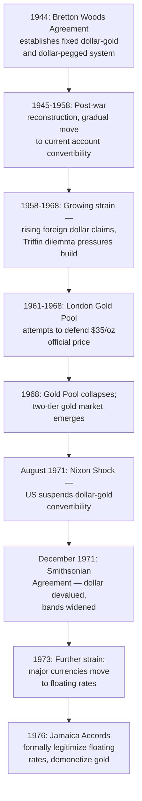

## Design and Operation of the Bretton Woods System

### Definition and Historical Overview

The Bretton Woods system was the international monetary framework established at the United Nations Monetary and Financial Conference held in Bretton Woods, New Hampshire, in July 1944, and operative from the mid-1940s until its effective collapse in 1971–1973. It created a system of fixed but adjustable exchange rates centered on the US dollar (itself convertible into gold), backed by newly created multilateral institutions — the International Monetary Fund (IMF) and the International Bank for Reconstruction and Development (World Bank) — explicitly designed to avoid repeating the interwar period's competitive devaluations, protectionism, and lack of international monetary cooperation.

### Historical Context and Design Objectives

**Key Points — Lessons the Architects Sought to Address:**

- Avoid the interwar experience of uncoordinated, beggar-thy-neighbor competitive devaluations.
- Avoid the rigidity and deflationary adjustment burden of the classical gold standard, which had forced painful internal deflation on deficit countries with no flexibility.
- Provide a mechanism for orderly, consultative exchange rate adjustment rather than either permanent rigidity or destabilizing unilateral action.
- Establish an institutional framework for international monetary cooperation and short-term balance of payments financing, reducing the incentive for countries to resort to trade restrictions or competitive devaluation when facing temporary external deficits.
- Facilitate the reconstruction of the post-war international trading and payments system, including eventual restoration of current account convertibility.

**The Two Principal Architects:**

- **John Maynard Keynes** (representing Britain) proposed the "**Bancor**" plan: a new international reserve currency (Bancor) managed by an International Clearing Union, with symmetric adjustment pressure placed on both deficit and surplus countries (including a mechanism effectively penalizing persistent surplus countries for failing to help rebalance the system).
- **Harry Dexter White** (representing the United States, then the dominant creditor nation) proposed a plan centered on national currencies and a more modest fund of contributed resources, without a new supranational reserve currency, more closely reflecting US interests as the world's largest gold holder and creditor.
- The final agreement substantially reflected the White Plan's framework, given the United States' dominant economic and negotiating position at the time, though it incorporated some elements addressing Keynes's concerns about adjustment symmetry and available financing.

### Core Structural Design

**Key Points — Defining Features of the System:**

- **Dollar-gold convertibility**: The US dollar was defined as convertible into gold at a fixed official price of $35 per ounce, with this convertibility guaranteed by the US Treasury to foreign monetary authorities (not to private individuals or firms).
- **Fixed but adjustable pegs**: All other member countries defined their currencies' par values in terms of the US dollar (or equivalently, gold), creating a system of fixed exchange rates against the dollar, adjustable only under specific, IMF-sanctioned conditions.
- **Narrow fluctuation bands**: Member currencies were permitted to fluctuate within a narrow band (typically ±1%) around their declared par value against the dollar, requiring central bank intervention to maintain the band.
- **The "fundamental disequilibrium" adjustment clause**: Par value changes (devaluation or revaluation) were permitted, but only in cases of "fundamental disequilibrium" in the balance of payments, and in most cases required IMF consultation/approval for changes beyond a specified threshold — an explicit departure from the classical gold standard's rigid permanence and the interwar period's unconstrained unilateral devaluation.
- **The dollar as the system's "key currency"**: Because the dollar alone was directly convertible into gold at a fixed official rate, and other currencies were pegged to the dollar, the dollar effectively functioned as the world's primary reserve and intervention currency, with the US occupying a uniquely asymmetric position in the system (the "**Nth country problem**": with N countries in the system, only N-1 exchange rates need to be independently set, leaving one country — the US — without an explicit exchange rate policy of its own, its dollar-gold rate instead serving as the system's anchor).

(svg_diagram) Bretton Woods System Structure

<svg xmlns="http://www.w3.org/2000/svg" viewBox="0 0 700 380">
<text x="350" y="28" text-anchor="middle" font-size="17" font-weight="bold" fill="#1a1a1a">Bretton Woods System Structure (svg_diagram)</text>
<rect x="270" y="60" width="160" height="60" rx="8" fill="#FFD700" stroke="#8B6508" stroke-width="2" />
<text x="350" y="85" text-anchor="middle" font-size="13" font-weight="bold" fill="#333">Gold</text>
<text x="350" y="103" text-anchor="middle" font-size="11" fill="#333">$35 / ounce</text>
<line x1="350" y1="120" x2="350" y2="160" stroke="#333" stroke-width="2" marker-end="url(#a1)" />
<line x1="350" y1="160" x2="350" y2="120" stroke="#333" stroke-width="2" marker-end="url(#a2)" />
<text x="400" y="145" font-size="10" fill="#555">official convertibility</text>
<text x="400" y="157" font-size="10" fill="#555">(central banks only)</text>
<rect x="270" y="160" width="160" height="60" rx="8" fill="#00008B" opacity="0.85" />
<text x="350" y="185" text-anchor="middle" font-size="13" font-weight="bold" fill="white">US Dollar</text>
<text x="350" y="203" text-anchor="middle" font-size="11" fill="white">Key/Reserve Currency</text>
<line x1="270" y1="190" x2="120" y2="270" stroke="#333" stroke-width="1.5" />
<line x1="300" y1="220" x2="200" y2="280" stroke="#333" stroke-width="1.5" />
<line x1="400" y1="220" x2="500" y2="280" stroke="#333" stroke-width="1.5" />
<line x1="430" y1="190" x2="580" y2="270" stroke="#333" stroke-width="1.5" />
<rect x="60" y="270" width="120" height="45" rx="6" fill="#D3D3D3" />
<text x="120" y="297" text-anchor="middle" font-size="11" fill="#333">Currency B</text>
<rect x="160" y="280" width="120" height="45" rx="6" fill="#D3D3D3" />
<text x="220" y="307" text-anchor="middle" font-size="11" fill="#333">Currency C</text>
<rect x="440" y="280" width="120" height="45" rx="6" fill="#D3D3D3" />
<text x="500" y="307" text-anchor="middle" font-size="11" fill="#333">Currency D</text>
<rect x="540" y="270" width="120" height="45" rx="6" fill="#D3D3D3" />
<text x="600" y="297" text-anchor="middle" font-size="11" fill="#333">Currency E</text>

<text x="350" y="350" text-anchor="middle" font-size="11" fill="#444">Member currencies peg to the dollar (±1% band);</text>

<text x="350" y="365" text-anchor="middle" font-size="11" fill="#444">only the dollar is directly convertible into gold</text>

</svg>

### The International Monetary Fund (IMF): Role and Governance

**Key Points — Original IMF Functions Under Bretton Woods:**

- **Surveillance and consultation**: Member countries agreed to consult with the IMF before changing their currency's par value beyond a small threshold, providing multilateral oversight intended to prevent unilateral, disruptive devaluations.
- **Short-term balance of payments financing**: Members contributed resources (a **quota** subscription, paid partly in gold and partly in domestic currency) into a pool from which countries facing temporary balance of payments deficits could borrow, reducing the pressure to resort to devaluation, trade restrictions, or deflationary domestic policy for what might be a temporary external shock.
- **Quota-based access and voting**: Borrowing access (in tranches) and voting power within the IMF were both linked to a country's quota subscription, giving larger economies (particularly the United States) proportionally greater influence.
- **Promotion of current account convertibility**: The IMF's Articles of Agreement encouraged members to move toward full convertibility of their currencies for current account transactions (trade-related payments), progressively dismantling the extensive wartime and immediate post-war exchange controls (most major European currencies achieved current account convertibility by 1958).

**Quota-Based Borrowing Structure (Tranches):**

Member countries could draw upon IMF resources in successive tranches, with increasing conditionality (policy adjustment commitments) typically attached to larger drawings:

$$\text{Total Access} = \text{Reserve Tranche} + \text{Credit Tranches (1st, 2nd, 3rd, 4th)}$$

The **reserve tranche** (drawing against the portion of the quota paid in gold/reserve assets) was generally available with minimal conditionality, while successive **credit tranches** typically involved progressively greater IMF oversight and policy conditionality.

### The World Bank's Complementary Role

While distinct in mandate from the IMF's short-term balance of payments focus, the **International Bank for Reconstruction and Development (World Bank)**, established alongside the IMF at the same conference, focused on long-term development and reconstruction financing (initially European post-war reconstruction, later shifting toward developing country development financing), complementing the IMF's monetary stability mandate within the broader Bretton Woods institutional architecture.

### The Adjustable Peg Mechanism in Practice

**Key Points — How Par Value Changes Operated:**

- A member country experiencing a **"fundamental disequilibrium"** (a term left deliberately somewhat undefined in the Articles of Agreement, generally understood to mean a persistent, structural balance of payments imbalance not correctable through normal financing or minor domestic policy adjustment) could propose a change to its par value.
- Small changes (originally up to 10% from the initial par value) could be made without formal IMF approval; larger changes required IMF consultation and, in principle, approval.
- In practice, several major devaluations and revaluations occurred during the system's operation, including Britain's 1949 and 1967 devaluations of the pound, and periodic adjustments by other members, illustrating the system's intended flexibility relative to the classical gold standard's rigidity.
- **Key operational tension**: In practice, the "fundamental disequilibrium" adjustment mechanism proved to function less smoothly than intended; governments were often reluctant to devalue due to domestic political costs (associating devaluation with policy failure or national prestige loss) and fears of provoking speculative attacks once markets anticipated a possible realignment — a pattern of delayed, crisis-triggered adjustment that later became a central focus of first-generation currency crisis models (e.g., Krugman, 1979) analyzing speculative attacks on adjustable peg regimes.

### Capital Controls Under Bretton Woods

**Key Points:**

- Unlike the classical gold standard's relatively open capital mobility, the Bretton Woods system explicitly permitted, and in practice relied heavily upon, **capital controls** to help sustain the fixed exchange rate regime alongside domestic monetary policy autonomy.
- This reflected a deliberate trilemma trade-off choice by the system's architects: prioritizing fixed exchange rates and domestic monetary policy autonomy (for domestic full-employment and reconstruction objectives) over free capital mobility, in explicit contrast to the pre-1914 classical gold standard's emphasis on open capital flows.
- Capital controls helped limit the scale of speculative capital flows that might otherwise have overwhelmed central bank intervention capacity defending adjustable peg parities, at least during the system's earlier, more robust decades.

### The Triffin Dilemma

An influential structural critique of the Bretton Woods system, articulated by economist Robert Triffin in the late 1950s/early 1960s, identified an inherent long-run contradiction in relying on a national currency (the US dollar) as the world's primary reserve asset.

**Key Points — The Core Contradiction:**

- Global trade and reserve growth required a steadily growing supply of dollar reserves held by foreign central banks, meaning the US needed to run persistent balance of payments deficits (supplying dollars to the world) to meet growing global liquidity demand.
- However, as US dollar liabilities held by foreign official institutions grew relative to the fixed US gold stock backing dollar convertibility, confidence in the US's ability to maintain gold convertibility at $35/ounce would inevitably erode.
- This created an unavoidable long-run tension: **either** the US restrained its balance of payments deficits (risking insufficient global liquidity growth to support expanding world trade), **or** it continued running deficits to supply adequate liquidity (progressively undermining confidence in dollar-gold convertibility as foreign dollar claims increasingly exceeded available US gold reserves).
- [Inference] The Triffin dilemma is widely regarded by economic historians and international economists as having correctly diagnosed a fundamental long-run structural flaw in the dollar-centered Bretton Woods design, and is frequently cited as a key structural (as opposed to purely political or cyclical) cause of the system's eventual 1971 collapse, though the precise timing and proximate triggers of the collapse also involved specific US policy decisions and market dynamics of the late 1960s.

$$\text{US Gold Stock (fixed)} \quad vs. \quad \text{Foreign Official Dollar Claims (growing)}$$

As foreign dollar claims grew relative to the fixed gold stock, the implicit convertibility ratio deteriorated, eroding the credibility of the $35/ounce commitment over time.

### Strains and Pressures Through the 1960s

**Key Points:**

- Growing US balance of payments deficits through the 1960s (reflecting a combination of factors including Vietnam War spending, Great Society domestic program expenditures, and relative US competitiveness decline as Europe and Japan recovered and grew rapidly) steadily increased foreign-held dollar claims relative to the US gold stock.
- The **London Gold Pool** (1961–1968), a coordinated arrangement among several major central banks to intervene jointly in the London gold market to maintain the official $35/ounce price against growing private market pressure, represented an attempt to manage mounting strain, but was ultimately abandoned in 1968 as pressure proved unsustainable, leading to a two-tier gold market (official transactions at $35, private market price allowed to float above it).
- Periodic speculative pressure on specific currencies (notably the pound sterling, devalued in 1967, and later pressure on the French franc and German mark) illustrated the system's growing vulnerability to speculative attack as international capital mobility gradually increased despite formal capital controls.

### Collapse: The Nixon Shock and Aftermath (1971–1973)

**Key Points — The Terminal Sequence:**

- On **August 15, 1971**, US President Richard Nixon announced the unilateral suspension of the US dollar's convertibility into gold (an event widely referred to as the "**Nixon Shock**"), effectively ending the core mechanism underpinning the Bretton Woods system's fixed exchange rate structure.
- The **Smithsonian Agreement** (December 1971) represented an attempt to salvage a modified fixed-rate system through a coordinated realignment (devaluing the dollar against gold to $38/ounce and widening fluctuation bands to ±2.25%), but this arrangement proved short-lived.
- Continued pressure and a further dollar devaluation (to $42.22/ounce) in early 1973 failed to restore stability, and major currencies progressively moved to floating exchange rates through 1973, marking the definitive end of the Bretton Woods fixed exchange rate system.
- The subsequent **Jamaica Accords** (1976) formally amended the IMF's Articles of Agreement to legitimize floating exchange rates and demonetize gold's formal role in the international monetary system, codifying the transition to the current, more flexible international monetary non-system.

### Achievements of the Bretton Woods System

**Key Points:**

- Provided approximately two decades of relatively stable, predictable exchange rates among major economies during a critical post-war reconstruction and rapid growth period, widely associated with the strong global trade and output growth of the 1950s–1960s (sometimes referred to as part of the post-war "Golden Age" of capitalism, though many other factors also contributed to that growth).
- Successfully avoided a repeat of the interwar pattern of uncoordinated competitive devaluation and collapsing international trade, providing an institutionalized framework for consultation and orderly (if imperfect) adjustment.
- Established durable international institutions (the IMF and World Bank) that persisted and evolved well beyond the collapse of the fixed exchange rate system itself, continuing to play significant roles in international monetary and development policy into the present.
- Facilitated the restoration of current account currency convertibility across major economies, supporting the substantial expansion of international trade during the period.

### Structural Weaknesses and Ultimate Failure

**Key Points:**

- The Triffin dilemma represented an unresolved structural contradiction at the heart of the dollar-gold-centered design, arguably making long-run system failure close to inevitable absent a fundamental redesign (such as the Keynes Bancor-style supranational reserve asset that had been rejected at the 1944 negotiations).
- The "fundamental disequilibrium" adjustment mechanism, while more flexible than the classical gold standard in principle, proved politically difficult to operate smoothly in practice, with governments frequently delaying necessary adjustments until forced by acute speculative pressure, generating the "peso problem" pattern of delayed-but-anticipated devaluation crises.
- Reliance on capital controls to sustain the system became progressively less effective as international capital markets deepened and became more interconnected through the 1960s, eroding the trilemma trade-off the system's architects had relied upon.
- The system's stability was also asymmetrically dependent on specific US macroeconomic policy choices (fiscal deficits, monetary policy), meaning US domestic political and economic decisions had outsized, and not fully controllable, consequences for global monetary stability — an early illustration of the tensions inherent in relying on a national currency for global reserve functions.

### Comparative Summary: Bretton Woods vs. Classical Gold Standard

| Feature | Classical Gold Standard | Bretton Woods System |
| --- | --- | --- |
| Reserve asset | Gold directly, symmetric across countries | US dollar (convertible to gold) as key currency |
| Adjustment mechanism | Automatic price-specie-flow | Adjustable peg with IMF-sanctioned realignment |
| Capital mobility | Relatively open | Substantially restricted via capital controls |
| Institutional oversight | None (informal "rules of the game") | Formal IMF surveillance and financing facility |
| Adjustment symmetry | Asymmetric burden on deficit countries | Also asymmetric (US uniquely privileged/constrained) |
| Duration of stability | ~1870–1914 (core period) | ~1945–1971 (with growing strain from late 1950s) |
| Cause of collapse | World War I financing needs | Triffin dilemma, US deficits, loss of gold confidence |

### Conclusion

The Bretton Woods system represented an ambitious and largely successful attempt, for approximately two decades, to construct a rule-based international monetary order combining fixed exchange rate stability with adjustment flexibility and multilateral institutional support — explicitly designed to avoid the twin failures of the classical gold standard's rigidity and the interwar period's uncoordinated competitive devaluation. Its dollar-centered design, anchored by US gold convertibility and supported by the newly created IMF, delivered substantial exchange rate stability and facilitated post-war trade and reconstruction, but contained an inherent long-run structural contradiction — the Triffin dilemma — between supplying adequate global dollar liquidity and maintaining credible gold convertibility. This tension, compounded by growing US balance of payments deficits, deepening international capital mobility that eroded the system's reliance on capital controls, and the political difficulty of timely adjustable-peg realignments, ultimately culminated in the 1971 Nixon Shock and the system's definitive collapse into floating exchange rates by the mid-1970s, formally codified by the 1976 Jamaica Accords.

**Related Topics:**

- The Triffin dilemma in depth and its modern echoes in reserve currency debates
- The Nixon Shock (1971) and the Smithsonian Agreement
- The Jamaica Accords (1976) and the transition to floating rates
- Keynes's Bancor plan versus the White Plan: the road not taken
- First-generation currency crisis models and speculative attacks on adjustable pegs
- The London Gold Pool and two-tier gold market (1961–1968)
- IMF quota, voting structure, and conditionality evolution since Bretton Woods
- Capital controls and the trilemma trade-off under Bretton Woods
- Britain's 1967 pound devaluation as a case study in delayed adjustment
- The post-Bretton Woods "non-system" and modern international monetary architecture debates