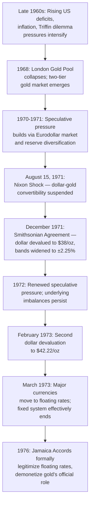

## The Collapse of Bretton Woods

### Definition and Overview

The collapse of Bretton Woods refers to the sequence of events between 1971 and 1973 during which the fixed exchange rate system established at the 1944 Bretton Woods Conference — centered on dollar-gold convertibility at $35 per ounce and dollar-pegged member currencies — disintegrated, culminating in the transition of major world currencies to floating exchange rates. This episode marks one of the most significant structural transformations in the modern international monetary system and is essential for understanding the origins of the contemporary floating-rate era.

### Underlying Structural Cause: The Triffin Dilemma Realized

The collapse is best understood not as a sudden, isolated event but as the culmination of a structural contradiction identified in advance by economist Robert Triffin: the **Triffin dilemma**.

**Key Points:**

- The Bretton Woods system required steadily growing US dollar reserves held by foreign central banks to support expanding global trade and reserve needs.
- Meeting this liquidity demand required the US to run persistent balance of payments deficits, supplying dollars to the rest of the world.
- As foreign-held dollar claims accumulated relative to the fixed US gold stock, the credibility of the US commitment to convert those dollars into gold at $35/ounce necessarily eroded over time.
- By the late 1960s, foreign official dollar holdings had grown to a level where full conversion into gold at the official price was widely understood to be practically infeasible, transforming a theoretical long-run contradiction into an acute, near-term credibility crisis.

$$\text{Foreign Official Dollar Claims} \gg \text{US Gold Stock} \times \$35/\text{oz}$$

### Proximate Causes: US Macroeconomic Policy in the 1960s

**Key Points — Domestic Drivers of Dollar Overhang:**

- **Vietnam War financing**: Substantial US government spending on the Vietnam War through the 1960s, financed partly through monetary expansion, contributed to rising US inflation and balance of payments deficits.
- **Great Society domestic programs**: Concurrent expansion of domestic social spending added to fiscal pressures without commensurate tax increases, a combination sometimes described as attempting to finance both "guns and butter" simultaneously.
- **Relative competitiveness decline**: As Western Europe and Japan completed post-war reconstruction and achieved rapid productivity growth through the 1950s and 1960s, US relative export competitiveness gradually eroded, contributing to a weakening US trade position.
- **Rising US inflation relative to trading partners**: Expansionary US fiscal and monetary policy in the late 1960s generated inflation that, under fixed exchange rates, could not be corrected through nominal exchange rate adjustment, progressively eroding US competitiveness and reinforcing balance of payments pressure.

### The London Gold Pool and Its Collapse (1961–1968)

**Key Points:**

- Formed in 1961, the **London Gold Pool** was a coordinated arrangement among major central banks (including the US, UK, and several European central banks) to jointly intervene in the London gold market, selling gold when necessary to keep the private market price near the official $35/ounce rate.
- Growing private demand for gold (partly reflecting speculative doubts about dollar convertibility credibility) placed increasing strain on the pool's ability to defend the price without excessive gold depletion.
- The pool was abandoned in March 1968, replaced by a **two-tier gold market**: an official settlement price of $35/ounce maintained for transactions between central banks, and a separate, freely floating private market price allowed to move above the official rate.
- This bifurcation was itself a significant signal that full defense of the official gold price was no longer considered sustainable, foreshadowing the more decisive break to come.

### Growing Speculative Pressure Through 1970–1971

**Key Points:**

- As doubts about the sustainability of dollar-gold convertibility mounted, foreign central banks and private market participants increasingly sought to convert dollar holdings into gold or other currencies perceived as more stable, placing direct pressure on US gold reserves.
- Speculative capital flows, despite the formal capital controls maintained under Bretton Woods, increasingly found channels (including through the growing **Eurodollar market** — dollar-denominated deposits and lending outside direct US regulatory jurisdiction) to move funds in anticipation of a dollar devaluation or convertibility suspension, illustrating the progressive erosion of capital control effectiveness that had underpinned the system's trilemma trade-off.
- Several European countries, notably including France under President Charles de Gaulle, had periodically and publicly converted dollar reserves into gold, both reflecting and amplifying pressure on the US gold stock, alongside broader French skepticism of the dollar's "exorbitant privilege" as the world's reserve currency.

### The Nixon Shock: August 15, 1971

**Key Points — The Core Announcement:**

- On August 15, 1971, US President Richard Nixon announced a package of economic measures, the most consequential of which for the international monetary system was the **unilateral suspension of the US dollar's convertibility into gold** for foreign central banks.
- This action, taken without prior multilateral consultation through the IMF, effectively ended the core mechanism that had anchored the entire Bretton Woods fixed exchange rate structure since 1944.
- The announcement was accompanied by other domestic measures, including a temporary wage-price freeze and a 10% import surcharge, reflecting a broader domestic policy response to inflation and trade competitiveness concerns rather than a narrowly international monetary policy action alone.
- [Unverified] The precise domestic political and economic motivations behind the timing and full package of the August 1971 announcement are analyzed in varying ways across different historical and economic accounts; the core international monetary consequence — the suspension of gold convertibility — is, however, a well-established historical fact.

**Immediate Consequences:**

- With the dollar no longer convertible into gold, the fundamental anchor of the fixed exchange rate system was removed.
- Major currencies were allowed to float temporarily while a new arrangement was negotiated, representing a de facto (though not yet formally acknowledged as permanent) departure from the Bretton Woods par value system.

### The Smithsonian Agreement (December 1971)

**Key Points:**

- Negotiated among the Group of Ten (G10) major industrial economies at the Smithsonian Institution in Washington, D.C., this agreement represented an attempt to restore a modified fixed exchange rate system rather than abandon fixed rates altogether.
- **Key provisions:**
  - The US dollar was devalued against gold, with the official gold price raised from $35 to $38 per ounce (a nominal devaluation, though gold convertibility itself was not restored).
  - Other major currencies were realigned against the dollar, with several (including the Japanese yen and German mark) appreciating.
  - Fluctuation bands around the new par values were widened from the original ±1% to **±2.25%**, providing greater flexibility to absorb market pressure without requiring immediate intervention or further realignment.
- Despite being described at the time by President Nixon as "the most significant monetary agreement in the history of the world," the Smithsonian Agreement proved unable to durably restore confidence in the fixed-rate framework, given that the underlying structural pressures (persistent US deficits, absence of gold convertibility, continued speculative capital mobility) remained fundamentally unresolved.

### Renewed Pressure and Final Breakdown (1972–1973)

**Key Points:**

- Continued US balance of payments deficits and speculative pressure against the dollar resumed within months of the Smithsonian realignment, demonstrating that the widened bands and one-time devaluation had not addressed the underlying structural imbalances.
- In **February 1973**, the US announced a further devaluation of the dollar, raising the official gold price to **$42.22 per ounce** — though, as under the Smithsonian Agreement, this was a nominal accounting adjustment rather than a restoration of actual gold convertibility.
- Despite this second devaluation, speculative pressure against the dollar continued, and in **March 1973**, major industrialized countries — including the members of the European Community and Japan — allowed their currencies to float freely against the dollar, effectively abandoning the fixed exchange rate framework altogether.
- This March 1973 shift is generally regarded by economic historians as marking the definitive, practical end of the Bretton Woods fixed exchange rate system, even though its formal legal demise within the IMF's Articles of Agreement would not occur until several years later.

### The Jamaica Accords and Formal Legal Ratification (1976)

**Key Points:**

- The **Jamaica Accords**, reached in January 1976 (formally amending the IMF's Second Amendment to the Articles of Agreement, effective 1978), provided the formal legal recognition of the shift to floating exchange rates that had already occurred de facto in 1973.
- Key provisions included: legitimizing member countries' freedom to choose their own exchange rate arrangements (fixed, floating, or intermediate), formally demonetizing gold's official role in the international monetary system (eliminating the official gold price and reducing gold's centrality as a reserve asset), and establishing IMF surveillance over members' exchange rate policies as an ongoing institutional function, even absent a common fixed-rate framework to administer.
- This amendment effectively transformed the IMF's core institutional role from managing an adjustable-peg par value system to conducting broader macroeconomic and exchange rate policy surveillance across a diverse range of national regime choices — a function the institution continues to perform.

### Why Did Bretton Woods Collapse? Synthesizing the Causes

**Key Points — Structural vs. Proximate Causes:**

- **Structural (long-run, arguably inevitable) cause**: The Triffin dilemma's fundamental contradiction between global dollar liquidity provision and finite US gold backing, which made some form of eventual convertibility crisis highly likely under the system's original design, absent a major structural reform (such as adopting a supranational reserve asset along the lines of Keynes's original Bancor proposal).
- **Proximate (contingent, policy-driven) causes**: Specific US fiscal and monetary policy choices in the 1960s (Vietnam War and Great Society spending, accommodative monetary policy) accelerated the timeline and severity of the dollar overhang problem beyond what might otherwise have been a more gradual structural strain.
- **Facilitating factor**: The progressive deepening of international capital mobility (notably via the Eurodollar market) throughout the 1960s eroded the effectiveness of the capital controls the system's architects had relied upon to sustain fixed rates alongside domestic monetary autonomy, consistent with the trilemma's logic that increasing capital mobility makes fixed exchange rate commitments progressively harder to sustain.
- **Political/institutional factor**: The absence of a symmetric adjustment mechanism (as Keynes had originally proposed with the Bancor plan, including penalties for persistent surplus countries) meant the burden of adjustment fell disproportionately and unsustainably on the reserve-currency-issuing country (the US), a design asymmetry inherent from the system's founding negotiations.

[Inference] The relative weight assigned to structural inevitability versus specific US policy choices as the "true" cause of the collapse remains a subject of ongoing debate among economic historians; most mainstream accounts treat the Triffin dilemma as having made some form of crisis highly likely over time, while acknowledging that the specific timing, sequence, and severity of the 1971–73 breakdown were significantly shaped by contingent US macroeconomic policy decisions of the preceding decade.

### Consequences of the Collapse

**Key Points — Immediate and Longer-Run Effects:**

- **Transition to generalized floating**: Major currencies (dollar, yen, deutsche mark, and eventually most others) moved to market-determined exchange rates, ending the adjustable-peg era for the core international monetary system, though many smaller and developing economies continued to peg to major currencies.
- **End of gold's formal monetary role**: Gold's official price and mandatory convertibility function were eliminated, transforming gold into a freely traded commodity/reserve asset without a fixed institutional exchange rate role, though central banks continued (and continue) to hold gold reserves for other purposes.
- **Increased exchange rate volatility**: The shift to floating rates introduced substantially greater short-run exchange rate volatility relative to the Bretton Woods era, prompting the development of new financial instruments (currency futures, options, and swaps) to manage the resulting currency risk, and stimulating extensive new academic and policy research into exchange rate determination under floating regimes (including models such as the monetary approach and the Dornbusch overshooting model).
- **Reinforced the "impossible trinity" as an analytical framework**: The collapse is widely cited as a real-world validation of trilemma logic — as international capital mobility deepened, the fixed exchange rate plus domestic monetary autonomy combination became increasingly unsustainable, consistent with subsequent formal trilemma analysis developed later in the academic literature.
- **The 1970s oil shocks compounded adjustment challenges**: The 1973 oil price shock, occurring almost simultaneously with the final Bretton Woods breakdown, created major, differentiated balance of payments pressures across oil-importing and oil-exporting countries, which floating exchange rates arguably helped absorb more readily than a fixed-rate system would have, though this transition also contributed to the stagflation challenges of the 1970s in many economies.
- **Enduring dollar centrality despite the end of gold convertibility**: Notably, even after losing its formal gold-convertibility anchor, the US dollar retained (and largely still retains) its dominant role as the world's primary reserve and invoicing currency, reflecting deep-seated network effects, US financial market depth, and geopolitical factors that persisted independently of the specific institutional gold-convertibility mechanism that had originally underpinned Bretton Woods.

### Illustrative Timeline Summary

| Date | Event |
| --- | --- |
| 1961 | London Gold Pool established |
| March 1968 | Gold Pool collapses; two-tier gold market begins |
| August 15, 1971 | Nixon Shock: dollar-gold convertibility suspended |
| December 1971 | Smithsonian Agreement: dollar devalued to $38/oz, bands widened |
| February 1973 | Second dollar devaluation to $42.22/oz |
| March 1973 | Major currencies move to floating rates (de facto system end) |
| January 1976 | Jamaica Accords formally legitimize floating rates |
| April 1978 | Second Amendment to IMF Articles of Agreement takes effect |

### Conclusion

The collapse of Bretton Woods between 1971 and 1973 resulted from the interaction of a fundamental structural contradiction — the Triffin dilemma's inherent tension between global dollar liquidity provision and finite US gold backing — with specific, accelerating US macroeconomic policy choices of the 1960s and the progressive deepening of international capital mobility that undermined the capital controls the system had relied upon. The August 1971 Nixon Shock, suspending dollar-gold convertibility, marked the decisive break, and subsequent attempts to restore a modified fixed-rate framework through the Smithsonian Agreement proved unable to address the underlying structural pressures, leading to the definitive shift to floating exchange rates by March 1973 and formal legal ratification via the 1976 Jamaica Accords. This episode remains a foundational case study in international economics, illustrating the practical force of the trilemma constraint and setting the institutional and analytical foundations for the floating-rate era and modern exchange rate regime diversity that followed.

**Related Topics:**

- The Triffin dilemma and reserve currency structural contradictions
- The design and operation of the original Bretton Woods system
- The Eurodollar market and the erosion of capital controls
- The Jamaica Accords and the IMF's Second Amendment
- Exchange rate determination models under floating regimes (monetary approach, Dornbusch overshooting)
- The 1970s oil shocks and their interaction with the transition to floating rates
- The "exorbitant privilege" debate surrounding dollar reserve currency status
- Modern trilemma analysis and its historical validation through the Bretton Woods collapse
- The evolution of the IMF's role from par-value administrator to surveillance institution
- Contemporary reserve currency competition and de-dollarization debates