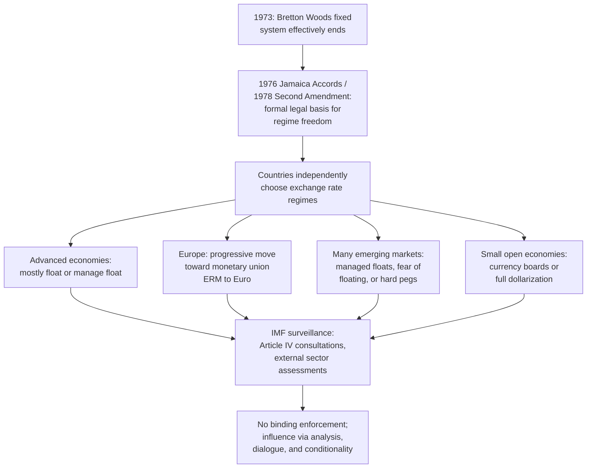

## The Post-1973 Non-System

### Definition and Conceptual Overview

The "**non-system**" is the term widely used by international economists to describe the international monetary arrangement that has prevailed since the collapse of the Bretton Woods fixed exchange rate framework in 1973. Unlike the classical gold standard or Bretton Woods, both of which operated under a single, universally applicable set of rules governing exchange rate determination, the post-1973 arrangement is characterized by the **absence of any single, common rule**: individual countries are free to choose their own exchange rate regime — floating, managed floating, pegged, currency board, dollarized, or any intermediate arrangement — subject only to loose IMF surveillance rather than binding par-value obligations. The term "non-system" (sometimes attributed to economist Richard Cooper's usage in describing this arrangement) captures this defining characteristic of institutionalized regime heterogeneity rather than a coherent, singular framework.

### Legal Foundation: The Jamaica Accords and the Second Amendment

**Key Points:**

- The **Jamaica Accords** (January 1976) and the subsequent **Second Amendment to the IMF's Articles of Agreement** (effective April 1978) provided the formal legal basis for the non-system, retroactively legitimizing the de facto shift to floating rates that had already occurred in March 1973.
- Under the amended Articles, member countries were granted explicit freedom to choose their own exchange rate arrangements, provided they avoid manipulating exchange rates "to prevent effective balance of payments adjustment or to gain unfair competitive advantage" — a broad, largely unenforceable principle rather than a binding rule.
- Gold's official monetary role was formally abolished: the official gold price was eliminated, and IMF members were no longer required to maintain currency values in terms of gold.
- The IMF's function shifted definitively from **administering a common par-value system** to conducting **surveillance** over members' exchange rate and macroeconomic policies — monitoring and offering policy advice, without the power to compel specific regime choices or exchange rate levels.

### Core Characteristics of the Non-System

**Key Points — Defining Features:**

- **Regime heterogeneity**: Countries independently choose from across the full exchange rate spectrum (free float, managed float, crawling peg, adjustable peg, currency board, dollarization, monetary union), based on their own structural characteristics and policy priorities, as examined under regime choice frameworks.
- **No common nominal anchor**: Unlike gold under the classical standard or the dollar-gold link under Bretton Woods, there is no single asset or rule anchoring the overall system's nominal stability; each country (or currency bloc) determines its own nominal anchor, commonly via domestic inflation targeting frameworks rather than an exchange-rate-based anchor.
- **Persistent US dollar centrality despite the absence of formal anchor status**: Even without gold backing or a formal international mandate, the US dollar has retained its position as the dominant global reserve currency, primary trade invoicing currency, and key intervention currency, reflecting network effects, the depth and liquidity of US financial markets, and continued global demand for dollar-denominated safe assets.
- **Loose, non-binding multilateral surveillance**: The IMF conducts regular Article IV consultations with member countries (periodic reviews of exchange rate and macroeconomic policies) and issues broader assessments (e.g., the *World Economic Outlook* and *External Sector Report*), but lacks binding enforcement authority over exchange rate policy choices in the way it once had authority (in principle) over Bretton Woods par values.
- **Increased reliance on ad hoc coordination**: In the absence of a rule-based system, international monetary cooperation occurs through periodic, voluntary coordination among major economies (e.g., G7, G20 discussions) rather than through an institutionalized common framework.

### Evolution of Regime Choices Since 1973

**Key Points — Broad Historical Patterns:**

- **Major advanced economy currencies** (US dollar, euro/deutsche mark, Japanese yen, British pound) have generally operated under floating or managed floating regimes since 1973, consistent with their status as large, relatively closed, or highly credible economies per regime-choice theory.
- **The European path toward monetary union** represents a notable counter-trend: rather than embracing floating rates, European countries pursued progressively deeper exchange rate coordination — from the "currency snake" arrangements of the 1970s, to the European Monetary System (EMS) and Exchange Rate Mechanism (ERM) from 1979, ultimately culminating in the adoption of the euro as a shared single currency beginning in 1999 — illustrating a regional move toward the "hard peg/monetary union" corner solution even as the global non-system embraced heterogeneity.
- **Many emerging market and developing economies** have continued to peg or manage their currencies against major currencies (particularly the dollar), often exhibiting the "fear of floating" pattern despite nominal classification as floating regimes, reflecting liability dollarization, high exchange rate pass-through, and credibility concerns discussed extensively in regime-choice analysis.
- **A subset of small, highly open economies** adopted currency boards (e.g., Hong Kong from 1983) or full dollarization (e.g., Ecuador in 2000, Panama long-standing) as credible commitment devices, representing the other extreme corner solution within the heterogeneous non-system.
- **China's exchange rate policy** has evolved through several distinct phases since the 1990s — from a tightly managed peg to the US dollar, to a managed float with reference to a currency basket (introduced in 2005 and adjusted subsequently), reflecting its own domestic policy priorities within the broader absence of any binding international rule.

### The IMF's Surveillance Framework Under the Non-System

**Key Points — Institutional Mechanisms:**

- **Article IV Consultations**: Regular (typically annual) bilateral consultations between IMF staff and member country authorities, reviewing macroeconomic conditions, exchange rate policy, and broader economic developments, concluding in a staff report and Executive Board discussion.
- **Multilateral surveillance**: Broader assessments of global economic conditions and cross-country spillovers, including flagship publications assessing whether major economies' external positions and exchange rates are broadly consistent with underlying fundamentals.
- **External sector assessments**: Since 2012, the IMF has conducted systematic assessments of external positions (current accounts, exchange rates, reserves, capital flows) for major economies, aiming to identify significant misalignments, though without binding corrective authority.
- **Absence of enforcement power**: Unlike its original par-value oversight role under Bretton Woods, the IMF under the non-system possesses no mechanism to compel a country to adjust its exchange rate policy; its influence operates through analysis, peer pressure, policy dialogue, and conditionality attached to financing arrangements for countries that voluntarily seek IMF support.

### Costs and Benefits of the Non-System

**Key Points — Perceived Benefits:**

- **Flexibility and adaptability**: Countries can select regimes suited to their specific structural characteristics (per Optimum Currency Area and regime-choice criteria) rather than being forced into a one-size-fits-all framework.
- **Absorption of diverse shocks**: The heterogeneity of regimes allows different economies to use exchange rate flexibility (or rigidity) as appropriate to their particular exposure to monetary versus real shocks.
- **No single point of systemic failure**: Unlike Bretton Woods' dependence on US dollar-gold convertibility, the non-system's decentralized structure means no single currency's crisis need trigger a wholesale collapse of the entire international monetary architecture (though individual currency crises remain common and can generate significant regional or global spillovers).
- **Avoided repeat of Triffin-dilemma-style structural traps**: Without a formal gold-convertibility anchor, the specific contradiction that undermined Bretton Woods does not directly recur, though some analysts argue analogous tensions persist around the dollar's reserve currency role in other forms.

**Key Points — Perceived Costs and Criticisms:**

- **Elevated and persistent exchange rate volatility**: Major currency pairs have exhibited substantially greater volatility since 1973 than under either the gold standard or Bretton Woods, generating ongoing debate about whether this volatility reflects efficient adjustment to changing fundamentals or excessive, welfare-reducing noise (a debate closely tied to exchange rate overshooting models).
- **Lack of a coherent global nominal anchor**: The absence of any common rule or anchor has been criticized as removing an important source of international monetary discipline, potentially contributing to more divergent global inflation experiences over time (though inflation targeting frameworks adopted independently by many central banks have provided a domestic substitute for the anchor function).
- **Coordination failures and spillover risk**: Absent a binding framework, major economies' independently chosen monetary and exchange rate policies can generate significant cross-border spillovers (e.g., large capital flow swings associated with major central banks' monetary policy cycles) without an institutionalized mechanism for managing them, a persistent theme in debates about the "global financial cycle" and its relationship to exchange rate regimes.
- **Recurring emerging market currency crises**: The decades since 1973 have witnessed numerous significant currency and balance of payments crises (Latin American debt crisis of the 1980s, Mexican peso crisis 1994–95, Asian Financial Crisis 1997–98, Russian crisis 1998, Argentine crisis 2001–02, various others), which some analysts attribute partly to the difficulties of managing intermediate exchange rate regimes under increasingly mobile global capital, consistent with the "bipolar view" critique discussed in regime-choice analysis.
- **Persistent "exorbitant privilege" and dollar dependence concerns**: The continued centrality of the US dollar, absent any formal international mandate, has generated ongoing debate (particularly among some emerging market and reserve-diversification advocates) about the asymmetric benefits accruing to the United States from issuing the world's dominant reserve currency, and periodic proposals for greater use of alternative reserve assets (including the IMF's own Special Drawing Rights, SDRs) or multipolar reserve currency arrangements.

### Special Drawing Rights (SDRs) and Alternative Reserve Asset Proposals

**Key Points:**

- The IMF's **Special Drawing Right (SDR)**, originally created in 1969 (predating the Bretton Woods collapse) as a supplementary reserve asset to address anticipated global liquidity constraints under gold-convertibility limits, has continued to exist under the non-system as a unit of account and limited reserve asset, valued as a basket of major currencies (currently including the US dollar, euro, Chinese renminbi, Japanese yen, and British pound).
- Periodic proposals — including a notable 2009 proposal from the People's Bank of China's governor — have called for expanding the SDR's role as a genuine alternative to dollar-centric reserve arrangements, motivated partly by concerns about the Triffin-dilemma-style tensions potentially inherent in any single national currency serving as the dominant global reserve asset.
- [Inference] Despite periodic proposals and occasional large SDR allocations (notably a substantial allocation in 2021 partly in response to the COVID-19 pandemic's global liquidity needs), the SDR has not displaced the US dollar's dominant practical role in international trade invoicing, private financial transactions, or as the primary reserve currency held by most central banks; the extent to which this reflects inherent structural advantages of the dollar versus path-dependency and network effects remains debated among international monetary economists.

### The Continued Relevance of the Trilemma

**Key Points:**

- The non-system's regime heterogeneity is best understood as the aggregate outcome of many individual countries making their own trilemma trade-off choices, rather than the elimination of the trilemma constraint itself.
- Countries choosing to float (like the US, UK, Japan, and eurozone collectively) prioritize monetary independence and capital mobility; countries choosing hard pegs or currency unions (like eurozone members individually, or dollarized economies) prioritize exchange rate stability and capital mobility at the cost of individual monetary autonomy; countries retaining significant capital controls (historically and to some degree still China) can combine greater exchange rate management with some domestic monetary autonomy.
- The **"trilemma to dilemma" thesis**, advanced by some researchers (notably Hélène Rey), argues that in a world of very high global capital mobility, even nominally floating exchange rates may not fully insulate domestic monetary policy from global financial cycle spillovers (driven substantially by US Federal Reserve policy), suggesting the effective trade-off facing many countries today may be better characterized as a **"dilemma"** (capital mobility vs. monetary independence, with exchange rate flexibility providing only partial insulation) rather than a strict three-way trilemma. [Speculation] This remains an active and contested area of ongoing research rather than settled consensus within international economics.

### Illustrative Comparison: Three Eras of the International Monetary System

| Feature | Classical Gold Standard | Bretton Woods | Post-1973 Non-System |
| --- | --- | --- | --- |
| Common rule/anchor | Gold, symmetric | Dollar-gold convertibility | None; regime choice is decentralized |
| Regime uniformity | Uniform (fixed to gold) | Uniform (adjustable peg to dollar) | Heterogeneous across countries |
| Institutional oversight | Informal "rules of the game" | IMF par-value administration | IMF surveillance (non-binding) |
| Capital mobility | Relatively open | Restricted via capital controls | Highly variable by country |
| Primary vulnerability | Deflationary adjustment burden | Triffin dilemma | Volatility, spillovers, recurring EM crises |
| Duration | ~1870–1914 | ~1945–1973 | 1973–present |

### Conclusion

The post-1973 non-system represents the current international monetary arrangement, defined not by a common exchange rate rule but precisely by the institutionalized absence of one: countries are free, within loosely enforced IMF surveillance parameters, to select exchange rate regimes ranging across the full spectrum from free floating to full dollarization, based on their own structural characteristics and policy priorities. This flexibility has allowed for context-appropriate regime diversity and avoided the specific structural trap (the Triffin dilemma) that undermined Bretton Woods, but has also been associated with elevated exchange rate volatility, recurring emerging market currency crises, persistent debates over the US dollar's disproportionate global role absent any formal international mandate, and ongoing academic debate over whether even floating exchange rates can fully preserve monetary policy independence in a world of extremely high global capital mobility. The non-system remains the operative framework of the contemporary international monetary system, with the IMF's surveillance function, regional arrangements like the eurozone, and ad hoc major-economy policy coordination serving as the primary (non-binding) mechanisms for managing the resulting heterogeneity.

**Related Topics:**

- The Triffin dilemma and its role in the Bretton Woods collapse
- The IMF's Article IV surveillance process in practice
- The evolution of the European Monetary System and the euro
- Special Drawing Rights (SDRs) and reserve asset diversification proposals
- The "dilemma not trilemma" thesis and the global financial cycle (Hélène Rey)
- China's managed exchange rate policy evolution since the 1990s
- Recurring emerging market currency crises since 1973 as case studies
- Regime choice theory and Optimum Currency Area criteria in the non-system context
- The US dollar's "exorbitant privilege" and de-dollarization debates
- Comparative analysis of the three major historical international monetary regimes