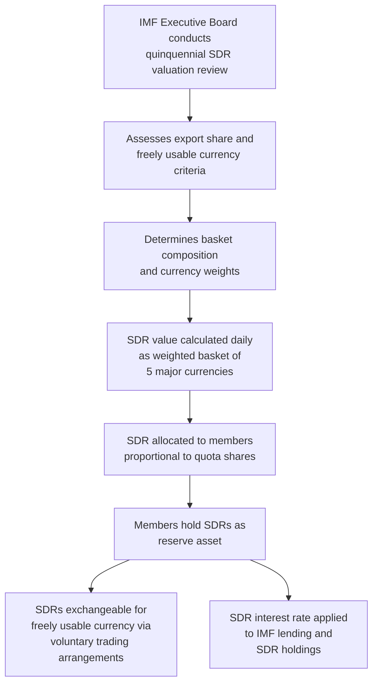

## Special Drawing Rights and IMF Quota Governance

### Definition and Conceptual Overview

Special Drawing Rights (SDRs) and IMF quota governance together constitute the core financial architecture underpinning the International Monetary Fund's operations. **Special Drawing Rights** are an international reserve asset created by the IMF to supplement member countries' official reserves. **IMF quotas** are the capital subscriptions member countries contribute to the Fund, which simultaneously determine financial contribution obligations, borrowing access, and voting power — making the quota system the central mechanism of IMF governance and resource allocation.

### Special Drawing Rights: Origin and Purpose

**Key Points:**

- The SDR was created in 1969, under the First Amendment to the IMF's Articles of Agreement, in anticipation of a global reserve asset shortage that policymakers of the time expected under continued Bretton Woods gold-convertibility constraints (the SDR predates the 1971–73 Bretton Woods collapse and was originally intended to supplement, not replace, gold and dollar reserves).
- The SDR is **not a currency** and is not used directly for private transactions; it functions as a **unit of account** and a **potential claim on freely usable currencies** of IMF member countries, which SDR holders can exchange for actual usable currency through voluntary trading arrangements among IMF members or via IMF-arranged designation mechanisms.
- The SDR is an international reserve asset created by the International Monetary Fund to supplement the existing official reserves of member countries. [ScienceDirect](https://www.sciencedirect.com/science/article/abs/pii/S0927538X25000484)

### The SDR Valuation Basket

The SDR's value is determined as a weighted basket of major international currencies, reviewed and updated approximately every five years (the "quinquennial review") by the IMF Executive Board.

**Key Points — Basket Composition:**

- The SDR currency basket consists of five major currencies: the US dollar, the Chinese renminbi, the British pound, the euro, and the Japanese yen. [ABiQ](https://www.abiq.io/new-currency-weights-for-sdr-valuation-basket-set-by-imf/)
- The renminbi was added to the basket in October 2016, following a determination that it met the IMF's "freely usable" currency criterion. Before the RMB's addition, SDR weights were USD 41.9%, EUR 37.4%, JPY 9.4%, and GBP 11.3%; after October 1, 2016, the weights became USD 41.73%, EUR 30.93%, JPY 8.33%, GBP 8.09%, and RMB 10.92%. [ScienceDirect](https://www.sciencedirect.com/science/article/abs/pii/S0927538X25000484)
- The most recent quinquennial review, concluded May 11, 2022, maintained the existing basket composition and updated the weights, with slightly higher weights for the US dollar and Chinese renminbi and correspondingly lower weights for the British pound, euro, and Japanese yen. The updated weights, effective August 1, 2022, are 43.38% for the US dollar, 29.31% for the euro, 12.28% for the Chinese renminbi, 7.59% for the Japanese yen, and 7.44% for the pound sterling, based on trade and financial market data from the 2017–2021 review period, and remain in effect for a five-year valuation period running through July 31, 2027. [imf](https://www.imf.org/en/news/articles/2022/05/14/pr22153-imf-board-concludes-sdr-valuation-review)[imf](https://www.imf.org/en/news/articles/2022/07/29/pr22281-press-release-imf-determines-new-currency-amounts-for-the-sdr-valuation-basket)

$$\text{SDR Value} = \sum_{i=1}^{5} w_i \times \text{Exchange Rate}_i$$

Where $w_i$ represents the fixed currency amount (not percentage weight) of each of the five currencies determined at each quinquennial review, and the SDR's value in any given currency fluctuates daily based on market exchange rates among the five basket currencies.

**Key Points — Selection Criteria for Basket Inclusion:**

- The export criterion and the freely usable currency criterion continue to guide decisions on inclusion of currencies in the basket, meaning a currency must be issued by a top global exporter (or currency union) and be widely used and traded in international transactions and foreign exchange markets. [imf](https://www.imf.org/en/publications/selected-decisions/description/SU/22/68)

### SDR Allocations

**Key Points — Mechanics of Allocation:**

- The IMF periodically allocates SDRs to member countries **in proportion to their existing quota shares**, effectively creating new reserve assets without requiring any repayment or offsetting contribution, functioning as a form of collectively created international reserve liquidity.
- Allocations require approval by 85% of total voting power and are typically undertaken to address a long-term global need for supplementing reserves, rather than to address any single country's specific balance of payments situation.
- A substantial general allocation occurred in August 2021 (approximately SDR 456 billion, equivalent to roughly $650 billion at the time), motivated significantly by the global liquidity needs arising from the COVID-19 pandemic, representing the largest SDR allocation in the Fund's history.
- **Key limitation**: Because allocations are distributed proportionally to existing quota shares, the largest, wealthiest economies (with the largest quotas) receive the largest absolute SDR allocations, even though the additional reserve liquidity is often argued to be of greater marginal benefit to lower-income and developing economies — a persistent equity critique of the allocation mechanism, which has led to various voluntary **SDR rechanneling** proposals (wealthier countries voluntarily channeling a portion of their allocated SDRs to lower-income countries or to IMF-administered trust funds such as the Poverty Reduction and Growth Trust or the Resilience and Sustainability Trust).

### The SDR Interest Rate

**Key Points:**

- The SDR carries its own interest rate (the "SDRi"), calculated weekly as a weighted average of short-term interest rate instruments in the same five currencies comprising the valuation basket, using the same currency weights.
- The SDR interest rate is determined and applied weekly, based on the exchange rates and interest rates prevailing at the time of determination and the currency amounts established in the valuation basket. [imf](https://www.imf.org/en/news/articles/2022/07/29/pr22281-press-release-imf-determines-new-currency-amounts-for-the-sdr-valuation-basket)
- The SDR interest rate serves as the basis for interest charged on IMF financing arrangements and interest paid to members holding SDRs in excess of their allocation, linking the reserve asset function directly to the Fund's lending operations.

### IMF Quotas: Definition and Functions

**Key Points — What a Quota Determines:**

- **Financial contribution (subscription)**: Each member's quota subscription represents its capital contribution to the IMF, historically payable partly in reserve assets (SDRs or freely usable currency) and partly in the member's own domestic currency.
- **Voting power**: Each member receives votes based on a formula combining **basic votes** (a fixed number allocated equally to all members, intended to protect smaller countries' minimal voice) plus additional votes proportional to quota size, meaning larger quota holders wield substantially greater voting power.
- **Access to IMF financing**: The amount a member can borrow from the IMF under various lending facilities is generally expressed as a multiple of its quota, making quota size directly determinative of a country's potential access to Fund resources during a balance of payments need.
- **SDR allocation share**: As noted above, general SDR allocations are distributed in proportion to quota shares.

### The Quota Formula

IMF quotas are notionally calibrated using a **quota formula** intended to reflect a member's relative position in the global economy, combining several economic indicators.

$$\text{Quota Share} = f(\text{GDP}, \text{Openness}, \text{Variability}, \text{Reserves})$$

**Key Points — Formula Components (Illustrative Structure):**

- **GDP** (blended measure of GDP at market exchange rates and purchasing power parity): the largest-weighted component, reflecting overall economic size.
- **Openness**: a measure of the sum of current account receipts and payments, reflecting exposure to and reliance on international trade and financial flows.
- **Economic variability**: a measure of variability in current receipts and net capital flows, reflecting a country's exposure to external shocks and hence its potential need for IMF resources.
- **International reserves**: reflecting a member's existing reserve buffer.

[Inference] The precise numerical weights within the formula have been the subject of extended, still-unresolved political negotiation, since the formula's design directly determines how quota shares — and hence voting power and financing access — are distributed among the membership; the persistent inability of the membership to agree on formula revisions is a recurring feature of quota governance rather than a one-time technical exercise.

### The General Review of Quotas Process

**Key Points:**

- The IMF's Articles of Agreement require **General Reviews of Quotas** at intervals of no more than five years, providing a recurring mechanism to reassess both the overall size of IMF resources and the distribution of quota shares among members.
- Any quota increase or reallocation requires approval by **85% of total voting power**, a supermajority threshold that in practice gives any member (or bloc of members) holding more than 15% of total voting power an effective veto — a threshold the United States alone has historically held, given its position as the largest single quota holder.
- Any change to quotas requires an 85 percent supermajority of total voting power, giving the United States, with over 15 percent voting share, an effective veto over quota reform decisions. [Model Diplomat](https://modeldiplomat.com/learn/glossary/imf-quota-review)

### The 16th General Review of Quotas (Concluded December 2023)

**Key Points — Outcome and Significance:**

- On December 15, 2023, the IMF Board of Governors concluded the 16th General Review of Quotas and approved a 50 percent increase in member quotas (SDR 238.6 billion, or approximately US$320 billion), bringing total IMF quotas to SDR 715.7 billion (approximately US$960 billion). [IMF](https://www.imf.org/en/News/Articles/2023/12/18/pr23459-imf-board-governors-approves-quota-increase-under-16th-general-review-quotas)
- The resolution passed with governors representing 92.86 percent of total voting power casting votes in favor, exceeding the required 85 percent threshold. [IMF](https://www.imf.org/en/News/Articles/2023/12/18/pr23459-imf-board-governors-approves-quota-increase-under-16th-general-review-quotas)
- **Critically, the increase was implemented on an "equiproportional" basis**: the 50 percent quota increase was allocated to members in proportion to their existing quotas, meaning individual members' relative quota shares — and hence voting power — remained unchanged despite the overall increase in Fund resources. [International Monetary Fund](https://www.imf.org/en/publications/policy-papers/issues/2023/12/18/sixteenth-general-review-of-quotas-report-to-the-board-of-governors-and-proposed-resolution-542596)
- This equiproportional approach was adopted specifically because of significant differences in views among members about the appropriate quota formula and how to implement any realignment of quota shares, so the review proceeded with an across-the-board increase while explicitly deferring the more contentious question of relative share realignment. [International Monetary Fund](https://www.imf.org/en/publications/policy-papers/issues/2023/12/18/sixteenth-general-review-of-quotas-report-to-the-board-of-governors-and-proposed-resolution-542596)
- The 16th Review therefore concluded with no realignment of relative quota shares among members, essentially increasing the IMF's overall lending capacity while leaving the existing distribution of quotas between members unchanged. [Boston University](https://www.bu.edu/gdp/2025/04/14/the-imfs-17th-general-review-of-quotas-needs-a-new-formula-to-deliver-on-development/)
- A key stated rationale for the increase was reducing the IMF's reliance on borrowed resources (the New Arrangements to Borrow and Bilateral Borrowing Agreements) by restoring quota subscriptions as the primary source of the Fund's permanent lending capacity. [IMF](https://www.imf.org/en/News/Articles/2023/12/18/pr23459-imf-board-governors-approves-quota-increase-under-16th-general-review-quotas)

### The Unresolved Quota Realignment Debate

**Key Points — Ongoing Governance Tensions:**

- Alongside the equiproportional increase, the membership committed to developing a new quota formula and realignment approach, with an original target of mid-2025, reflecting the broader recognition that current quota shares do not adequately reflect shifts in relative global economic weight since the formula was last substantively revised. [Model Diplomat](https://modeldiplomat.com/learn/glossary/imf-quota-review)
- Emerging market economies, particularly the BRICS grouping, have long argued that their underrepresentation in quota shares undermines the IMF's overall legitimacy, while advanced economies — especially European members — have generally been identified as likely to be asked to cede quota share in any realignment reflecting updated relative economic weights. [Model Diplomat](https://modeldiplomat.com/learn/glossary/imf-quota-review)
- Analysis of prospective realignment scenarios has highlighted that many emerging market and developing economies would see decreases in quota share under a straightforward formula-based realignment, with China representing a notable exception typically projected to gain share, complicating the political feasibility of reaching the required 85% supermajority for any realignment package. [Boston University](https://www.bu.edu/gdp/2025/04/14/the-imfs-17th-general-review-of-quotas-needs-a-new-formula-to-deliver-on-development/)
- **Proposed complementary reforms**: Options under discussion include increasing the share of "basic votes" (currently around 5.5% of total voting power) — which are allocated equally across all members regardless of quota size — toward historical levels closer to 11% (the level at the Fund's founding) or up to approximately 14.3% (the maximum increase that would not erode the United States' veto power), as a way to boost the voice of smaller emerging market and developing economies without requiring a full formula-based quota share realignment. [Boston University](https://www.bu.edu/gdp/2025/04/14/the-imfs-17th-general-review-of-quotas-needs-a-new-formula-to-deliver-on-development/)
- [Inference] The practical political difficulty of achieving the 85% supermajority for any quota share realignment — given that any material redistribution of voting power necessarily requires some existing quota holders to accept a reduction in relative influence — is widely regarded among IMF governance researchers as the central structural obstacle to timely reform, a dynamic that has recurred across multiple general review cycles rather than being unique to the 16th Review.

### Quota Governance and the Broader "Legitimacy" Debate

**Key Points:**

- The IMF's quota system determines member countries' financial contributions, voting power distribution, access to Fund financing mechanisms, and SDR allocation shares, making it central to broader debates about whether the Fund's governance structure adequately reflects the current distribution of economic weight in the global economy. [bu](https://www.bu.edu/gdp/?p=25486)
- Critics argue that the persistent underrepresentation of large emerging market economies relative to their current share of global GDP (compared to their formula-implied quota shares) undermines the Fund's perceived legitimacy as a genuinely multilateral institution, particularly among economies that have grown rapidly since the quota formula's underlying weights were last substantively negotiated.
- Proponents of gradual, equiproportional-style reform argue that maintaining broad consensus and avoiding destabilizing shifts in the balance of power among the largest shareholders (particularly the US, whose veto-protecting 15%+ share is a de facto redline in any negotiation) is necessary to preserve the Fund's overall functionality and continued broad-based financial support from its largest contributors.
- [Inference] Whether future general reviews (a 17th Review is anticipated in subsequent years) will succeed in achieving a substantive formula-based realignment, as opposed to repeating the equiproportional-increase-without-realignment pattern of the 16th Review, remains an open and actively contested question in IMF governance policy circles as of this writing.

### Summary Table: Key SDR and Quota Facts

| Element | Current Status (as of most recent confirmed data) |
| --- | --- |
| SDR basket currencies | US dollar, euro, Chinese renminbi, Japanese yen, British pound |
| Current SDR weights (effective Aug 2022–Jul 2027) | USD 43.38%, EUR 29.31%, RMB 12.28%, JPY 7.59%, GBP 7.44% |
| Total IMF quotas (post-16th Review) | SDR 715.7 billion (~US$960 billion) |
| 16th Review outcome | 50% equiproportional increase; no share realignment |
| Approval threshold for quota/SDR decisions | 85% of total voting power |
| Basic votes (equal per member) | Approximately 5.5% of total voting power |
| Largest 2021 SDR allocation | Approximately SDR 456 billion (~US$650 billion), August 2021 |

### Illustrative Example: Quota Mechanics in Practice

**Example:**

Suppose a member country holds a quota of SDR 10 billion out of total IMF quotas of SDR 715.7 billion (approximately 1.4% of the total). Under an equiproportional 50% general increase, this member's quota would rise to SDR 15 billion, but its relative share of total quotas (and hence its voting power and proportional SDR allocation share) would remain unchanged at approximately 1.4%, since every other member's quota increased by the same 50% proportion. If a future review instead adopted a formula-based realignment reflecting this member's faster-than-average GDP growth relative to the rest of the membership since the formula weights were last set, its quota share might rise above 1.4% even without any further equiproportional increase — but achieving this would require securing the 85% supermajority approval, a threshold that has proven difficult to reach for realignment (as opposed to simple size increases) in recent review cycles.

### Conclusion

Special Drawing Rights and IMF quota governance together form the financial and institutional backbone of the Fund's operations: SDRs provide a supplementary international reserve asset valued against a periodically reviewed basket of major currencies, while quotas determine each member's financial contribution, borrowing access, voting power, and SDR allocation share. The system's central governance tension — starkly illustrated by the 16th General Review of Quotas' equiproportional-increase-without-realignment outcome in December 2023 — lies in the persistent difficulty of reconciling calls for quota shares to better reflect the current distribution of global economic weight (particularly regarding emerging market representation) with the 85% supermajority approval threshold that effectively requires existing major shareholders, including the United States, to consent to any redistribution of their relative influence. This unresolved tension continues to shape ongoing debates about the Fund's legitimacy, resource adequacy, and capacity to represent the contemporary global economy going into future review cycles.

**Related Topics:**

- The Triffin dilemma and reserve currency diversification proposals
- The post-1973 non-system and the IMF's surveillance role
- SDR rechanneling and the Poverty Reduction and Growth Trust
- Quota formula design: GDP, openness, variability, and reserves weighting
- The 85% supermajority threshold and effective veto power dynamics
- BRICS advocacy for IMF governance reform
- IMF lending facilities and quota-linked access limits
- The renminbi's 2016 inclusion in the SDR basket as a case study in currency internationalization
- Basic votes and their role in protecting smaller-economy representation
- Comparative governance structures: IMF quotas versus World Bank shareholding