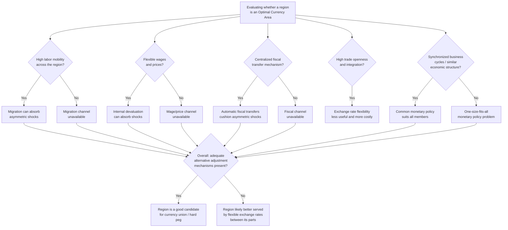

## Mundell's Optimal Currency Area Criteria

### Definition and Conceptual Overview

The theory of **Optimal Currency Areas (OCA)**, originated by economist Robert Mundell in his seminal 1961 paper "A Theory of Optimum Currency Areas," addresses a foundational question in international monetary economics: what geographic or economic area should share a single currency (or, equivalently, maintain irrevocably fixed exchange rates among its members)? Mundell's framework identifies the specific structural and economic conditions under which the benefits of adopting a common currency (or a hard peg) are likely to exceed the costs, providing the analytical foundation for evaluating monetary unions, currency boards, dollarization, and fixed exchange rate regime choices more broadly.

### The Core Trade-off Underlying OCA Theory

**Key Points:**

- Adopting a common currency (or irrevocable fixed rate) with another country or region **eliminates the nominal exchange rate as an independent adjustment tool** between the two areas, since by definition no separate national currency exists to depreciate or appreciate.
- This trade-off is beneficial when the areas involved are unlikely to need independent exchange rate adjustment relative to each other (i.e., they face similar shocks or possess alternative adjustment mechanisms), and costly when the areas are prone to asymmetric shocks with no adequate substitute adjustment channel.
- OCA theory therefore seeks to identify the structural characteristics that determine whether a given geographic area constitutes a sensible "optimal" domain for a single currency, as opposed to being better served by multiple currencies with flexible exchange rates between them.

### Mundell's Original Criterion: Labor Mobility

**Key Points:**

- Mundell's central and most famous criterion is **factor mobility, particularly labor mobility**, across the region considering monetary union.
- **Core logic**: If a region experiences an asymmetric shock (e.g., one area suffers a demand decline while another does not), and the exchange rate cannot adjust because both areas share a single currency, the alternative adjustment mechanism is for unemployed workers in the depressed area to migrate to the area with excess labor demand, equilibrating employment and wages across the currency area without requiring nominal exchange rate movement.
- **Implication**: A region with high labor mobility (low migration costs — linguistic, cultural, legal, and logistical) can function effectively as a single currency area even in the face of asymmetric shocks, because migration substitutes for the exchange rate as an adjustment mechanism.
- **Contrast case**: A region with low labor mobility (e.g., due to language barriers, cultural differences, restrictive immigration policies, or housing market rigidities) lacks this substitute mechanism, meaning an asymmetric shock would instead translate into prolonged unemployment in the depressed area, since neither exchange rate adjustment nor labor migration is available to restore equilibrium.

$$\text{Adjustment Capacity} \propto \text{Labor Mobility} \times \frac{1}{\text{Migration Costs}}$$

**Example:**

Mundell's original 1961 analysis explicitly used the comparison between the United States and Canada to illustrate this logic: he noted that US regions (e.g., different states) exhibit relatively high internal labor mobility, potentially making the US a better candidate for a single currency area along regional lines than a strict national-border-based grouping would suggest, whereas cross-border labor mobility between the US and Canada was comparatively more constrained, suggesting national currency areas might not always align neatly with genuinely optimal currency area boundaries defined by factor mobility.

### Extension: Wage and Price Flexibility

While not exclusively Mundell's own original 1961 contribution alone, closely related and complementary to his framework, **wage and price flexibility** is frequently incorporated as a core OCA criterion.

**Key Points:**

- If wages and prices are highly flexible (able to adjust downward as well as upward in response to economic conditions), a region experiencing an asymmetric negative shock can restore competitiveness and full employment through **internal devaluation** — falling wages and prices — even without nominal exchange rate adjustment or labor migration.
- Rigid wages and prices (due to strong labor unions, extensive wage indexation, minimum wage laws, or other institutional frictions) remove this alternative adjustment channel, making the region more reliant on either exchange rate flexibility or labor mobility to absorb asymmetric shocks.
- [Inference] In practice, internal devaluation via wage and price adjustment is generally considered by economists to be a slower and more socially costly adjustment mechanism than nominal exchange rate depreciation, since it typically requires a period of elevated unemployment to generate the downward wage pressure, though the relative severity of this cost depends heavily on the specific labor market institutions and social safety nets of the region in question.

### Fiscal Transfer Mechanisms (Kenen's Contribution)

Economist Peter Kenen extended Mundell's original framework in 1969, emphasizing the role of **fiscal integration and transfer mechanisms** as an additional criterion.

**Key Points:**

- A region with a **centralized fiscal system** capable of automatically transferring resources from prosperous areas to depressed areas (e.g., through federal unemployment insurance, progressive taxation, or explicit regional transfer programs) can cushion asymmetric shocks through fiscal channels, substituting for the lost exchange rate adjustment mechanism.
- **Example**: Within a fully integrated fiscal union (such as the United States at the federal level), a region experiencing a negative economic shock automatically receives increased federal transfer payments (unemployment benefits, other automatic stabilizers) and pays reduced federal taxes (as regional income falls), providing an automatic fiscal cushion without requiring any explicit policy action or exchange rate adjustment.
- **Diversification argument**: Kenen also argued that economies with highly **diversified production structures** (rather than being heavily concentrated in a single industry or export commodity) are better suited to currency unions, since diversification reduces the likelihood that any single sector-specific shock will generate a large, economy-wide asymmetric disturbance relative to currency union partners.

### Economic Openness (McKinnon's Contribution)

Economist Ronald McKinnon (1963) contributed the criterion of **economic openness**, focusing on the degree of trade integration between potential currency union members.

**Key Points:**

- In a highly open economy (large tradable goods sector relative to GDP, extensive trade with the potential currency union partner), exchange rate changes have a larger and more direct effect on the domestic price level (via import price pass-through), meaning nominal exchange rate flexibility may be a less effective tool for achieving real adjustment (since a nominal depreciation quickly translates into domestic inflation, eroding the intended real competitiveness gain) and simultaneously more costly (since a larger share of transactions face exchange rate uncertainty).
- Conversely, small, highly open economies with a large share of trade concentrated with a particular partner benefit more from fixing their exchange rate with that partner, both because the "monetary illusion" benefit of nominal depreciation is smaller in a highly open economy and because the transaction cost savings from eliminating exchange rate uncertainty with a dominant trade partner are larger.
- This logic reinforces the general regime-choice principle that small, highly open economies with concentrated trade patterns are generally better candidates for fixed exchange rates or currency union than large, relatively closed, diversified-trade economies.

### Business Cycle Synchronization

**Key Points:**

- A criterion of central importance in modern OCA analysis (building on and refining Mundell's original asymmetric shock framing) is the degree to which potential currency union members experience **synchronized business cycles**.
- If member regions' economies move through expansions and recessions in a highly correlated fashion, a single, common monetary policy (necessarily uniform across the currency union, since a shared currency implies a shared central bank and interest rate) is more likely to be appropriate for all members simultaneously.
- If business cycles are poorly synchronized (one region booming while another is in recession), the single monetary policy will inevitably be too tight for the underperforming region and too loose for the overperforming region at any given time — a "one-size-fits-all" problem widely discussed in analyses of currency unions, particularly in the context of the eurozone's structural challenges.

### Similarity of Economic Structure and Shock Exposure

**Key Points:**

- Related to both diversification and business cycle synchronization, OCA theory emphasizes that regions with **similar underlying economic structures** (comparable industry composition, similar exposure to global commodity price movements, similar demand elasticities) are more likely to experience **symmetric shocks** — disturbances that affect all currency union members similarly, rather than asymmetrically.
- Symmetric shocks do not require differential adjustment across currency union members (since a common monetary policy response, e.g., an interest rate cut, is appropriate for all members simultaneously when facing a symmetric negative shock), whereas asymmetric shocks are precisely the scenario in which the loss of independent exchange rate and monetary policy tools becomes costly.

### The Endogeneity of OCA Criteria (Frankel-Rose Hypothesis)

**Key Points:**

- A significant later refinement to Mundell's static framework, associated with economists Jeffrey Frankel and Andrew Rose (1998), argues that OCA criteria are **endogenous**: countries may not need to satisfy OCA criteria (such as high trade integration or synchronized business cycles) *before* forming a currency union, because the act of forming the union itself can subsequently generate greater trade integration and business cycle synchronization.
- **Core logic**: Adopting a common currency eliminates exchange rate uncertainty and transaction costs, which stimulates greater cross-border trade and investment integration between members over time; this deepened economic integration then, in turn, tends to increase business cycle correlation, since more integrated economies tend to be more exposed to common shocks and interconnected demand channels.
- **Implication**: A currency union that does not initially satisfy traditional OCA criteria particularly well might, over time, become a more genuinely optimal currency area as a consequence of the union itself — an important consideration in evaluating projects like European Monetary Union, which some analysts argued at the outset did not fully satisfy traditional Mundellian criteria (particularly regarding cross-border labor mobility and fiscal transfer capacity).
- [Inference] The empirical support for the strong form of the Frankel-Rose endogeneity hypothesis is considered substantial but not unanimous within the academic literature; subsequent research has debated the precise magnitude of the trade-creation and business-cycle-synchronization effects attributable to currency union membership itself, as opposed to other concurrent factors (such as the broader European single market integration process running alongside monetary union).

### Summary Table: Core OCA Criteria and Their Originators

| Criterion | Key Contributor(s) | Core Logic |
| --- | --- | --- |
| Labor mobility | Mundell (1961) | Migration substitutes for exchange rate adjustment following asymmetric shocks |
| Wage/price flexibility | Related to Mundell's framework | Internal devaluation substitutes for external devaluation |
| Fiscal transfer mechanisms | Kenen (1969) | Automatic fiscal transfers cushion regional asymmetric shocks |
| Production diversification | Kenen (1969) | Diversified structure reduces likelihood of large asymmetric sectoral shocks |
| Economic openness | McKinnon (1963) | High openness reduces the effectiveness and increases the cost of nominal exchange rate flexibility |
| Business cycle synchronization | Later synthesis of the framework | Correlated cycles mean a common monetary policy suits all members |
| Endogeneity of OCA criteria | Frankel and Rose (1998) | Currency union itself can generate greater trade integration and cycle synchronization over time |

### Applying the Criteria: A Decision Framework

### Illustrative Example: Applying OCA Criteria to a Hypothetical Case

**Example:**

Consider two neighboring countries, Country M and Country N, evaluating whether to form a monetary union.

- **Labor mobility**: Citizens of M and N share a common language, mutual recognition of professional qualifications, and no work-permit restrictions between them — a strongly favorable OCA indicator.
- **Fiscal transfers**: M and N have no shared fiscal authority or cross-border transfer mechanism; each country's fiscal policy remains entirely separate — an unfavorable indicator, since no automatic fiscal cushion would exist for an asymmetric shock.
- **Trade openness**: M and N conduct 60% of their total trade with each other, indicating high bilateral openness — a favorable indicator for the benefits of eliminating exchange rate uncertainty between them.
- **Business cycle correlation**: M's economy is heavily weighted toward manufacturing exports, while N's economy is dominated by tourism and services; historical data shows their GDP growth rates have been only weakly correlated, with M often experiencing recessions during global manufacturing downturns that do not equally affect N — an unfavorable indicator, suggesting a common monetary policy would frequently be poorly suited to at least one of the two economies.
- **Overall assessment**: M and N present a **mixed case** — strong labor mobility and trade integration favor monetary union, but weak fiscal integration and business cycle divergence suggest a currency union between them would carry meaningful risk of costly asymmetric adjustment episodes, absent either efforts to build shared fiscal transfer capacity or a structural convergence in their industrial compositions over time (consistent with the endogeneity hypothesis, if their trade integration continues to deepen).

### Critiques and Limitations of the Original Framework

**Key Points:**

- **No single criterion is individually necessary or sufficient**: Mundell's framework, and its subsequent extensions, is generally understood as identifying a set of relevant factors rather than a strict checklist with a definitive pass/fail threshold; real-world monetary unions typically satisfy some criteria strongly and others poorly, requiring a holistic, weighted judgment rather than mechanical application.
- **Political economy factors are excluded from the pure economic framework**: OCA theory as originally formulated focuses on economic adjustment efficiency, but actual currency union decisions (such as European Monetary Union) are also shaped by political integration goals, historical reconciliation objectives, and geopolitical considerations that lie outside the strict economic OCA calculus.
- **Measurement difficulty**: Several OCA criteria (such as "business cycle synchronization" or "economic structure similarity") are not straightforwardly quantifiable with a single agreed metric, meaning empirical OCA assessments often involve significant methodological judgment and can yield different conclusions depending on the specific indicators and time periods chosen.
- **The endogeneity critique complicates ex-ante assessment**: If OCA criteria can be endogenously generated by the currency union itself (per Frankel-Rose), then a strict ex-ante application of the criteria to reject a proposed currency union may understate its longer-run viability, since the union's own effects on trade and cycle synchronization are not observable prior to formation — creating an inherent forecasting challenge for policymakers evaluating prospective currency unions.

### Conclusion

Mundell's Optimal Currency Area framework, originating with his 1961 emphasis on labor mobility as a substitute for exchange rate adjustment, has been extended through subsequent contributions — Kenen's fiscal integration and diversification criteria, McKinnon's openness criterion, and the broader emphasis on business cycle synchronization — into a comprehensive multi-criteria framework for evaluating whether a given region is well-suited to sharing a single currency. The framework's central insight is that the costs of forgoing independent exchange rate and monetary policy (the necessary consequence of currency union) are minimized when adequate alternative adjustment mechanisms exist: labor mobility, wage/price flexibility, fiscal transfers, or a low likelihood of asymmetric shocks due to structural similarity and business cycle synchronization. The later Frankel-Rose endogeneity hypothesis complicates static, ex-ante application of these criteria by suggesting that currency union formation can itself generate the very conditions (trade integration, cycle synchronization) that make the union more optimal after the fact. This body of theory provides the essential analytical foundation for evaluating real-world monetary union projects, most prominently the European Economic and Monetary Union, against the structural conditions Mundell and his successors identified as central to currency area optimality.

**Related Topics:**

- The European Economic and Monetary Union as an applied OCA case study
- The Frankel-Rose endogeneity hypothesis and its empirical tests
- Fiscal federalism and automatic stabilizers in currency unions
- Asymmetric shocks and the "one-size-fits-all" monetary policy problem
- Currency boards and dollarization as related hard-peg regime choices
- Labor mobility barriers within the European Union in practice
- Kenen's diversification argument and sectoral shock exposure
- McKinnon's openness criterion and small open economy exchange rate choice
- The eurozone sovereign debt crisis as a stress test of OCA adequacy
- Political economy drivers of monetary union beyond pure economic optimality