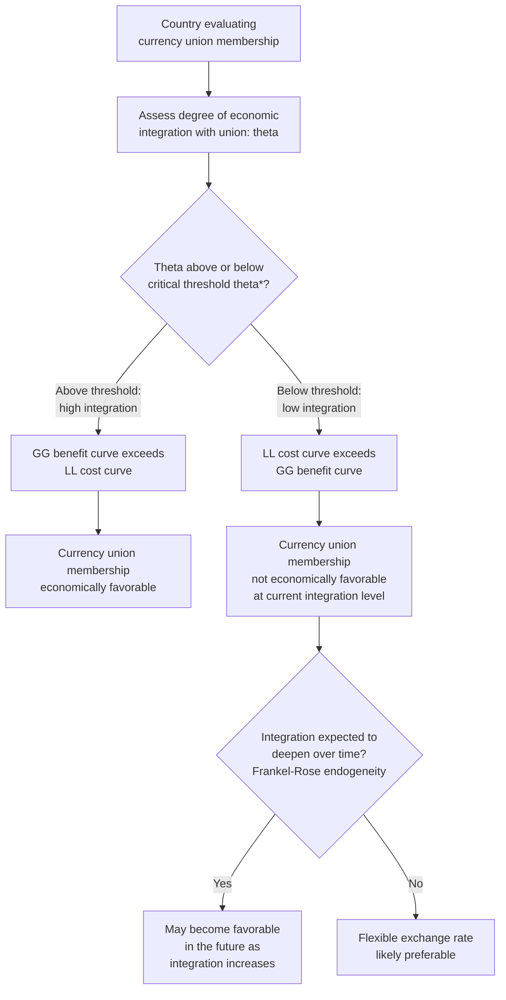

## Costs and Benefits of Adopting a Common Currency

### Definition and Conceptual Overview

The decision to adopt a common currency — whether through full monetary union with a group of other countries (such as eurozone membership), unilateral dollarization, or a currency board arrangement — involves a systematic trade-off between microeconomic efficiency gains from eliminating exchange rate transaction costs and uncertainty, and macroeconomic stabilization costs from surrendering independent monetary policy and the nominal exchange rate as an adjustment tool. This cost-benefit framework, closely related to but analytically distinct from Optimal Currency Area (OCA) criteria, provides the standard economic lens through which monetary union decisions are evaluated.

### The Benefits of a Common Currency

**1. Elimination of Transaction Costs**

**Key Points:**

- Currency conversion involves direct costs: bid-ask spreads charged by banks and currency exchange services, administrative costs of maintaining multi-currency accounts, and the operational burden of currency risk management for firms engaged in cross-border trade and investment.
- A common currency eliminates these costs entirely for transactions within the currency union, providing a direct, quantifiable efficiency gain, historically estimated (in studies conducted around the euro's introduction) as a modest but non-trivial percentage of GDP for economies with substantial intra-union trade shares. [Unverified] Specific historical estimates of these transaction cost savings vary by study methodology and time period and should be verified against contemporaneous sources if precise figures are required.

**2. Elimination of Exchange Rate Uncertainty**

**Key Points:**

- Beyond direct conversion costs, exchange rate volatility creates uncertainty that can deter cross-border trade and investment, as firms face the risk that currency movements will erode profit margins on foreign transactions between the time a contract is signed and payment is settled.
- A common currency eliminates this uncertainty entirely for intra-union transactions, potentially reducing the need for costly hedging instruments (forwards, options, swaps) and encouraging firms to engage in cross-border trade and investment they might otherwise have avoided or scaled back due to currency risk.
- This benefit is theoretically larger for small, open economies with a high proportion of trade concentrated with the currency union partners, consistent with McKinnon's openness criterion in OCA theory.

**3. Enhanced Price Transparency and Market Integration**

**Key Points:**

- A common currency makes cross-border price comparisons direct and immediate, without requiring conversion calculations, which can intensify price competition and market integration across the currency union, potentially benefiting consumers through increased competitive pressure on firms to align prices for comparable goods and services.
- This transparency effect can also facilitate deeper financial market integration, as investors can more easily compare returns on assets denominated in a common currency across different national markets, potentially deepening capital markets and improving capital allocation efficiency across the union.

**4. Credibility and Inflation Discipline (for Countries with Weak Monetary Institutions)**

**Key Points:**

- For a country with a history of high inflation, weak central bank independence, or fiscal dominance over monetary policy, adopting a common currency shared with a more credible monetary authority can serve as an external commitment device, importing the anchor country's (or currency union's) monetary discipline and credibility.
- This benefit parallels the credibility rationale for currency boards and dollarization discussed in fixed exchange rate regime analysis, and was a significant motivating factor for several countries joining the eurozone, particularly those with prior histories of relatively higher inflation than the German Bundesbank's historical track record (which anchored the pre-euro European Monetary System).

**5. Reduced Risk of Currency Crises and Speculative Attacks**

**Key Points:**

- Within a full monetary union (as opposed to a mere fixed peg), the absence of a separate national currency altogether removes the possibility of a classic speculative attack on that currency, since there is no separate exchange rate to attack — a structural benefit relative to adjustable peg or even currency board arrangements, which in principle remain exposed to speculative pressure (as Argentina's 2001 currency board collapse illustrated).
- This benefit is analytically similar to the advantage claimed for full dollarization relative to a currency board, extended to the context of a genuine multilateral monetary union.

**6. Network Effects and International Currency Status**

**Key Points:**

- A larger currency union can achieve a more liquid, internationally significant currency than its individual member currencies would have achieved separately, potentially conferring benefits associated with international reserve currency status (lower borrowing costs, seigniorage-like benefits from foreign holdings of the currency, and reduced exposure to currency mismatch risk in international borrowing).
- The euro's emergence as the world's second most significant reserve and international currency (behind the US dollar) is frequently cited as an example of this network-effect benefit accruing to the eurozone as a bloc, which would have been unattainable for most individual member countries' pre-euro national currencies.

### The Costs of a Common Currency

**1. Loss of Independent Monetary Policy**

**Key Points:**

- The most fundamental cost, directly following from the trilemma, is the complete loss of an independent domestic monetary policy: a member of a currency union must accept the common central bank's single policy interest rate, regardless of whether that rate suits domestic cyclical conditions.
- This cost is most severe when currency union members experience poorly synchronized business cycles (a core OCA consideration), since the common monetary policy will inevitably be too tight for underperforming members and too loose for overperforming members at any given time.

**2. Loss of the Nominal Exchange Rate as a Shock Absorber**

**Key Points:**

- Without a separate national currency, a member country experiencing an asymmetric negative shock (e.g., a sector-specific demand collapse, a region-specific productivity decline, or a country-specific fiscal crisis) cannot use nominal currency depreciation to restore competitiveness and support demand.
- Adjustment must instead occur through alternative, typically slower and more socially costly channels: internal devaluation (wage and price deflation), labor migration out of the depressed region, or fiscal transfers from unaffected regions — precisely the alternative mechanisms examined under OCA theory, whose absence or inadequacy determines how costly this channel's loss will be in practice.

**3. Seigniorage Loss (Full Dollarization Case Specifically)**

**Key Points:**

- In cases of unilateral adoption of another country's existing currency (full dollarization) rather than a genuine multilateral monetary union with shared governance, the adopting country typically forfeits seigniorage revenue entirely to the anchor currency's issuer, unless a formal revenue-sharing arrangement is negotiated.
- In a genuine multilateral monetary union with a jointly governed common central bank (such as the European Central Bank), seigniorage revenue is instead pooled and distributed among member central banks according to an agreed formula, meaning this specific cost is structurally different (and generally smaller or absent) compared to unilateral dollarization.

**4. Constraints on Fiscal Policy Flexibility**

**Key Points:**

- While not a direct, mechanical consequence of currency union in the way monetary policy loss is, currency unions often impose (or generate strong pressure toward) fiscal policy constraints on individual members, since uncoordinated, large fiscal deficits by one member can generate negative spillovers (higher borrowing costs, financial instability risk) affecting the entire union — a dynamic starkly illustrated by the eurozone sovereign debt crisis beginning in 2010.
- Fiscal rules adopted to manage this risk (such as the eurozone's Stability and Growth Pact, limiting deficit and debt levels) can themselves constrain a member's ability to use countercyclical fiscal policy as a substitute for the lost monetary policy tool, potentially compounding the adjustment difficulty for a member facing an asymmetric shock if both monetary and fiscal flexibility are constrained simultaneously.

**5. Transition and Implementation Costs**

**Key Points:**

- Adopting a new common currency involves one-time transition costs: reprinting currency, reprogramming financial and payment systems, relabeling prices, and public/business adaptation costs, which, while not permanent, can be economically and administratively significant during the transition period.
- Menu costs (the cost of updating displayed prices) and potential price-level "rounding effects" (where firms round converted prices upward more often than downward during currency transition, generating a temporary, modest inflationary effect) have been observed and studied in the context of historical currency changeovers, including the euro's physical introduction in 2002.

**6. Loss of National Monetary Symbolism and Policy Autonomy Signaling**

**Key Points:**

- Beyond the purely economic costs, currency union involves the loss of a national currency as a symbol of sovereignty and independent economic identity, which can carry political costs and generate domestic political resistance, independent of the strict economic cost-benefit calculus.
- [Inference] The relative weight the public and policymakers assign to this symbolic cost varies substantially across countries and historical contexts, and is generally treated in the economic literature as a political economy consideration lying outside, though interacting with, the core economic cost-benefit framework.

### Synthesizing the Trade-off: The GG-LL Framework

A standard graphical framework used in international economics to synthesize these costs and benefits is the **GG-LL diagram** (developed in modern international economics textbooks, notably associated with Krugman, Obstfeld, and Melitz), which plots the benefits (GG curve) and costs (LL curve) of joining a currency union as functions of the degree of economic integration with the currency union.

**Key Points — Diagram Logic:**

- The **GG curve** (monetary efficiency gain) slopes **upward**: as a country's economic integration (trade and financial linkages) with the currency union increases, the benefit of eliminating exchange rate transaction costs and uncertainty with that union also increases, since a larger share of the country's economic activity benefits from the efficiency gain.
- The **LL curve** (economic stability loss) slopes **downward**: as economic integration increases, the LL curve suggests the cost of losing independent monetary policy tends to fall, because higher trade and financial integration with the currency union partners is generally associated (per OCA logic, particularly the Frankel-Rose endogeneity argument) with more synchronized business cycles and reduced likelihood of asymmetric shocks relative to those partners, making the loss of independent monetary policy less costly.
- The **intersection point** of the GG and LL curves defines a critical **threshold degree of integration** ($\theta^*$): for a country with economic integration below this threshold, the LL (cost) curve lies above the GG (benefit) curve, meaning currency union membership is not economically worthwhile; for integration above the threshold, GG lies above LL, meaning the benefits outweigh the costs, and currency union becomes economically favorable.

(svg_diagram) The GG-LL Diagram

<svg xmlns="http://www.w3.org/2000/svg" viewBox="0 0 700 420">
<text x="350" y="28" text-anchor="middle" font-size="17" font-weight="bold" fill="#1a1a1a">The GG-LL Diagram (svg_diagram)</text>
<line x1="90" y1="360" x2="620" y2="360" stroke="#333" stroke-width="2" marker-end="url(#ax1)" />
<line x1="90" y1="360" x2="90" y2="60" stroke="#333" stroke-width="2" marker-end="url(#ax2)" />
<text x="620" y="380" text-anchor="middle" font-size="12" fill="#333">Economic Integration (θ)</text>
<text x="55" y="60" text-anchor="middle" font-size="12" fill="#333">Benefit / Cost</text>
<path d="M 130 330 Q 350 260 570 100" fill="none" stroke="#006400" stroke-width="2.5" />
<text x="580" y="95" font-size="13" font-weight="bold" fill="#006400">GG (Benefit)</text>
<path d="M 130 100 Q 350 200 570 320" fill="none" stroke="#8B0000" stroke-width="2.5" />
<text x="580" y="335" font-size="13" font-weight="bold" fill="#8B0000">LL (Cost)</text>
<circle cx="350" cy="218" r="6" fill="#00008B" />
<line x1="350" y1="218" x2="350" y2="360" stroke="#00008B" stroke-width="1.5" stroke-dasharray="4,3" />
<text x="350" y="390" text-anchor="middle" font-size="12" font-weight="bold" fill="#00008B">θ* (threshold)</text>

<text x="200" y="260" font-size="11" fill="#444">Below θ*: costs exceed</text>

<text x="200" y="273" font-size="11" fill="#444">benefits (LL above GG)</text>

<text x="440" y="180" font-size="11" fill="#444">Above θ*: benefits exceed</text>

<text x="440" y="193" font-size="11" fill="#444">costs (GG above LL)</text>

</svg>

### Summary Table: Costs and Benefits at a Glance

| Benefits | Costs |
| --- | --- |
| Eliminated currency conversion transaction costs | Loss of independent monetary policy |
| Eliminated exchange rate uncertainty | Loss of nominal exchange rate as shock absorber |
| Enhanced price transparency and market integration | Seigniorage loss (in unilateral dollarization) |
| Imported monetary credibility (for weak-institution countries) | Fiscal policy constraints and spillover risk |
| Reduced risk of currency crises/speculative attacks | One-time transition and implementation costs |
| Network effects and international currency status | Loss of national monetary symbolism/sovereignty |

### Asymmetric Distribution of Costs and Benefits Within a Union

**Key Points:**

- The costs and benefits of currency union membership are rarely distributed evenly across all members: countries with high pre-existing trade integration, synchronized business cycles, and weak prior monetary credibility tend to experience a more favorable net balance, while countries with more idiosyncratic economic structures, lower trade concentration with the union, or already-strong independent monetary credibility tend to experience a less favorable balance.
- [Inference] This asymmetric distribution helps explain persistent debates within existing currency unions (most visibly, the eurozone) about whether specific member countries' economic structures were, and remain, sufically aligned with the broader union to justify continued membership on a strict cost-benefit basis, as distinct from the political integration objectives that also motivate currency union membership independent of the pure economic calculus.

### Illustrative Example: Applying the Cost-Benefit Framework

**Example:**

Consider a small, open economy deciding whether to join a large neighboring currency union with which it already conducts 55% of its total trade.

- **Benefits**: Given the high (55%) trade share with the union, eliminating currency conversion costs and exchange rate uncertainty on this substantial share of trade represents a significant, quantifiable efficiency gain — placing this country relatively far along the horizontal (integration) axis of the GG-LL framework, where the GG benefit curve is comparatively high.
- **Costs**: If this economy's business cycle has historically been weakly correlated with the currency union (e.g., due to a distinct commodity export specialization not shared by other union members), the LL cost curve remains elevated even at this relatively high integration level, since monetary policy loss remains costly absent business cycle synchronization.
- **Net assessment**: Whether currency union membership is favorable for this country depends on whether its position lies above or below the threshold integration level $\theta^*$ — a country with high trade integration but poor cycle synchronization sits closer to the threshold than a country strong on both dimensions, making the net cost-benefit assessment more genuinely uncertain and sensitive to the specific weights placed on the trade-efficiency benefit versus the monetary-policy-autonomy cost.

### Conclusion

The decision to adopt a common currency involves weighing tangible microeconomic efficiency gains — eliminated transaction costs, reduced exchange rate uncertainty, enhanced price transparency, potential credibility benefits, reduced currency crisis risk, and network effects from a larger, more liquid currency — against significant macroeconomic stabilization costs, chiefly the loss of independent monetary policy and the nominal exchange rate as a shock-absorbing tool, alongside seigniorage loss (particularly in unilateral dollarization), fiscal policy constraints, transition costs, and the loss of national monetary symbolism. The GG-LL framework provides a systematic way to synthesize this trade-off, showing that the net economic desirability of currency union membership rises with the degree of economic integration between the country and the currency union, with a threshold level of integration determining whether the balance favors membership. This cost-benefit framework operates in close conjunction with, but is analytically distinct from, the structural Optimal Currency Area criteria (labor mobility, fiscal transfers, business cycle synchronization) that determine where along this cost-benefit spectrum a given country or region is likely to sit.

**Related Topics:**

- Mundell's Optimal Currency Area criteria in depth
- The GG-LL diagram and its formal derivation
- The Frankel-Rose endogeneity hypothesis and its implications for the LL curve
- The eurozone sovereign debt crisis as a case study in currency union costs
- Seigniorage and its distribution in multilateral versus unilateral currency arrangements
- The Stability and Growth Pact and fiscal constraints in currency unions
- Currency boards and dollarization as related but distinct regime choices
- Transition costs and price-level effects of historical currency changeovers (the euro cash changeover)
- Network effects and international reserve currency status
- Political economy motivations for monetary union beyond pure economic efficiency