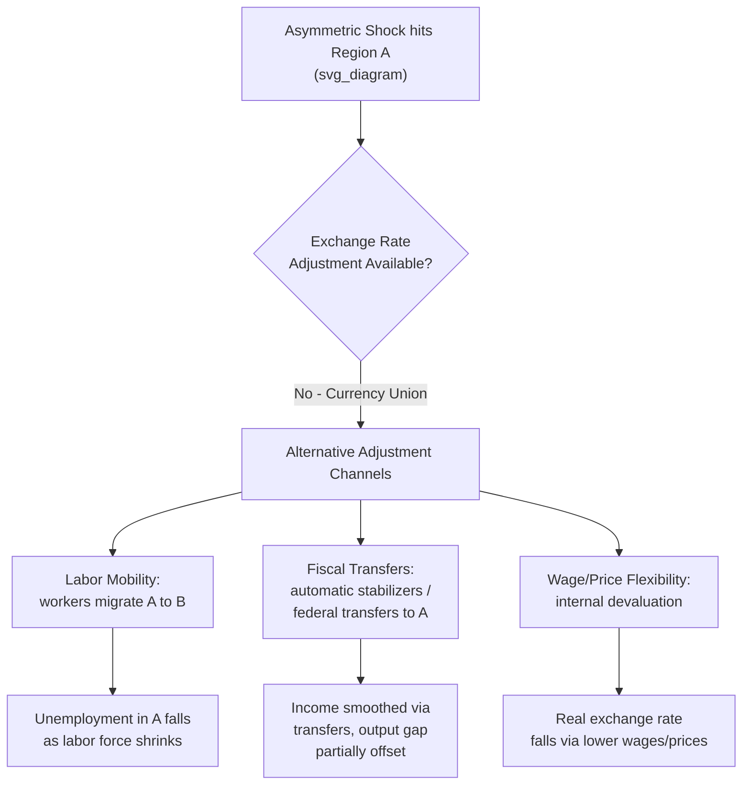
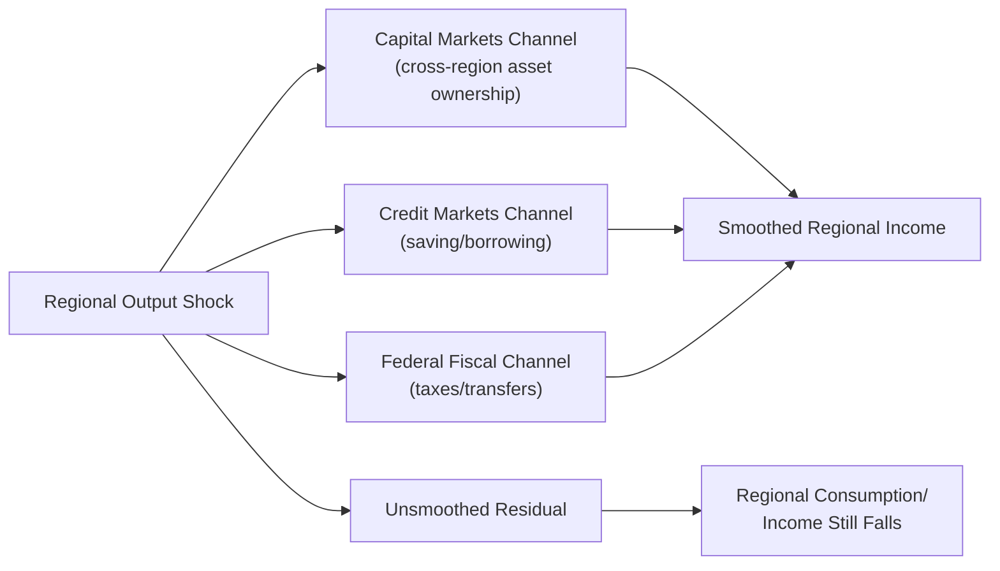

## Labor Mobility and Fiscal Transfers as Adjustment Mechanisms

### Overview

In an Optimal Currency Area (OCA), member regions or countries surrender independent monetary policy and the nominal exchange rate as tools for responding to asymmetric shocks. When a shock hits one region differently than others in the union, the standard exchange-rate adjustment channel is unavailable. OCA theory identifies **factor mobility** (primarily labor) and **fiscal transfers** (primarily through a centralized fiscal system) as the two principal alternative adjustment mechanisms that can substitute for exchange rate flexibility. This item examines both mechanisms in detail, their theoretical basis, empirical evidence (particularly the US–Eurozone comparison), and their policy implications.

### The Adjustment Problem: Asymmetric Shocks Without Exchange Rate Flexibility

Consider two regions, A and B, sharing a common currency. Suppose region A experiences a negative demand shock (e.g., a decline in demand for its main export) while region B does not. Under flexible exchange rates, A's currency would depreciate, restoring competitiveness and employment. Inside a currency union, this channel is closed. The region must instead adjust through:

1. Internal price/wage deflation ("internal devaluation")
2. Unemployment absorption (workers leave the labor force or emigrate)
3. Fiscal support from the rest of the union (transfers)

$$\text{Adjustment}_A = \Delta(\text{wages/prices}) + \Delta(\text{labor force}) + \Delta(\text{net fiscal transfers})$$

If none of these operate smoothly, the shock manifests as prolonged unemployment and output loss concentrated in region A — this is the central cost side of the OCA cost-benefit calculus (Mundell, 1961; Kenen, 1969).

### Mundell's Labor Mobility Criterion

Robert Mundell's foundational 1961 contribution identified **labor mobility** as the key criterion for an optimal currency area. If labor can move freely and quickly from a depressed region to a booming region within the union, unemployment in the depressed region is alleviated (workers leave), and wage/inflationary pressure in the booming region is dampened (workers arrive), without any need for a nominal exchange rate change.

**Key Points**

- Mobility must be sufficiently fast relative to the shock's duration to be an effective substitute — slow-moving migration responds to a shock only after unemployment has already persisted for years.
- Mobility can be geographic (across regions/countries) or sectoral (across industries within a region); OCA theory is primarily concerned with geographic mobility since the exchange rate is a region-specific/country-specific instrument.
- Mobility itself carries costs: hysteresis effects, loss of local human capital, social/family disruption, and depressed regions being left with an aging, less economically dynamic population.

### Empirical Evidence: US vs. Eurozone Labor Mobility

The classic empirical comparison, largely following work by **Blanchard and Katz (1992)** and later Eurozone-focused studies (e.g., Obstfeld and Peri, 1998; Beyer and Smets, 2015), finds:

| Dimension | United States | Eurozone |
| --- | --- | --- |
| Interstate/cross-border migration response to shocks | Relatively rapid; roughly half of an employment shock's effect on the regional employment rate dissipates via migration within ~5-6 years | Substantially slower; cross-border mobility historically much lower, though post-2010 intra-EU mobility (e.g., Southern to Northern Europe during the debt crisis) increased |
| Language/cultural barriers | Largely absent (common language, national labor market institutions) | Significant (multiple languages, differing social security systems, licensing/qualification recognition issues) |
| Housing and pension portability | High | Historically lower, though EU coordination has improved portability of some benefits |
| Primary adjustment channel to shocks | Labor mobility + some fiscal transfers | Historically closer to unemployment absorption and wage/price adjustment ("internal devaluation") than migration |

[Inference] The precise magnitude of the mobility gap between the US and the Eurozone varies across studies and time periods, and has likely narrowed somewhat since the 2010-2013 sovereign debt crisis, but a persistent gap consistent with the qualitative conclusion above remains a widely cited feature of the OCA literature.

### Kenen's Fiscal Integration Criterion

Peter Kenen (1969) proposed **fiscal integration** — a centralized fiscal system with automatic interregional transfers — as an alternative or complementary OCA criterion to labor mobility. The logic: if a federal-level tax-and-transfer system exists, a region hit by a negative shock automatically receives net transfers (lower federal tax collection due to falling incomes, higher federal unemployment/welfare payments) without any explicit discretionary policy action. This functions as **fiscal risk-sharing** across the union.

$$\text{Transfer}_A = \tau \cdot (\bar{Y} - Y_A)$$

Where $\tau$ is the effective marginal transfer/tax rate of the fiscal system and $(\bar{Y} - Y_A)$ is the shortfall of region A's income from the union average. A higher $\tau$ implies a larger automatic stabilizing transfer per unit of regional income shock.

### Empirical Magnitude of Fiscal Risk-Sharing: US vs. EU

The most cited empirical benchmark comes from **Sala-i-Martin and Sachs (1991)** and later refinements (e.g., Asdrubali, Sørensen, and Yosha, 1996; von Hagen, 1992), which decompose income smoothing into channels:

**Key Points**

- Sala-i-Martin and Sachs estimated that the US federal fiscal system offsets roughly 30-40 cents of every dollar of a regional income shock automatically, primarily through the federal income tax and transfer system (unemployment insurance, federal entitlement programs), without any new legislation.
- By contrast, the EU's central budget is very small (roughly 1% of EU GDP, dominated by the Common Agricultural Policy and structural/cohesion funds, which are not primarily countercyclical in design), providing negligible automatic interregional risk-sharing at the union level compared to the US federal system.
- [Unverified] The exact percentage figures from Sala-i-Martin and Sachs (often cited as "30-40%") have been contested and revised in later literature (e.g., von Hagen found smaller effects using different methodology), so the number should be treated as an order-of-magnitude illustration rather than a precise, uncontested estimate.
- Within the Eurozone, cross-country risk-sharing has historically relied on capital markets (private financial flows, credit channels) and household savings/borrowing rather than fiscal transfers — a structurally different smoothing mechanism than the US.

**Example**

If region A's income falls by $100 million relative to trend due to an asymmetric shock, and the fiscal system has an effective transfer rate of $\tau = 0.35$, the region automatically receives approximately $35 million in net fiscal relief (lower net tax payments plus higher transfer receipts) without any new policy action — cushioning roughly a third of the shock's income effect before any market or migration-based adjustment occurs.

### Three Channels of Interregional Risk-Sharing (Asdrubali-Sørensen-Yosha Framework)

A more granular decomposition, widely used in OCA empirics, separates smoothing into:

1. **Capital markets channel** — cross-region ownership of capital/assets means shocks to regional output do not translate one-to-one into shocks to regional income (income is smoothed via corporate profits/dividends flowing across regions).
2. **Credit markets channel** — regions borrow and save via financial markets, smoothing consumption relative to income (income shock ≠ consumption shock, due to saving/dissaving).
3. **Federal fiscal channel** — the Kenen-style automatic transfer mechanism described above, smoothing disposable income relative to income.

$$\text{Total Smoothing} = \underbrace{\beta_{\text{capital}}}_{\text{via factor income flows}} + \underbrace{\beta_{\text{credit}}}_{\text{via saving/borrowing}} + \underbrace{\beta_{\text{fiscal}}}_{\text{via federal transfers}} + \underbrace{\beta_{\text{unsmoothed}}}_{\text{residual shock}}$$

Studies applying this framework to the US typically find capital markets provide the largest single channel of smoothing, followed by credit markets, with the federal fiscal channel smaller but still significant; a large residual (unsmoothed) share remains in both the US and especially the EU, with the EU's residual historically much larger given its underdeveloped capital-market and fiscal channels.

### Policy Implications for Monetary Unions

**Key Points**

- Because the Eurozone lacks both Mundell-style labor mobility (though improving) and Kenen-style fiscal integration at the scale of the US federal system, it has historically relied more heavily on wage/price flexibility ("internal devaluation") and, during the 2010-2015 sovereign debt crisis, on emergency inter-governmental lending (EFSF/ESM) rather than automatic fiscal transfers.
- Proposals for a **Eurozone-level fiscal capacity** (e.g., a common unemployment reinsurance scheme, a central Eurozone budget, or Eurobonds) are explicitly motivated by the Kenen criterion — attempting to replicate at the EU level the automatic stabilization the US achieves through its federal budget.
- The **NextGenerationEU** recovery fund (post-COVID-19) represented a significant, though still largely one-off rather than permanent automatic, step toward EU-level fiscal risk-sharing, and is frequently discussed in the literature as a partial move toward Kenen-style fiscal integration.
- [Speculation] Whether the EU will move toward a permanent, automatic fiscal transfer mechanism comparable in scale to the US federal system remains a politically contested and empirically open question, dependent on further fiscal and political integration that is not guaranteed.

### Interaction Between the Two Mechanisms

Labor mobility and fiscal transfers are generally viewed as **substitutes** in the OCA framework — a currency union strong in one dimension needs less of the other to achieve adequate adjustment capacity. The US arguably relies relatively more on labor mobility (interstate migration is comparatively high) combined with a moderate fiscal channel; a hypothetical fully fiscally integrated union could in principle tolerate lower labor mobility, and vice versa. A currency union weak in *both* dimensions — arguably a fair characterization of the Eurozone pre-2020 relative to the US — is more vulnerable to prolonged regional divergence following asymmetric shocks, as observed in the persistent unemployment divergence between Southern and Northern Eurozone economies following the 2009-2013 crisis.

### Related Topics

- Mundell's Optimal Currency Area criterion (original 1961 formulation)
- Kenen's fiscal integration criterion and criticisms
- Internal devaluation as an adjustment mechanism
- Asdrubali-Sørensen-Yosha risk-sharing decomposition
- Eurozone sovereign debt crisis (2009-2015) as an OCA stress test
- Common Unemployment Reinsurance Scheme (proposed EU mechanism)
- NextGenerationEU recovery fund
- McKinnon's openness criterion for OCA
- Symmetry vs. asymmetry of shocks across currency union members
- Fiscal federalism theory