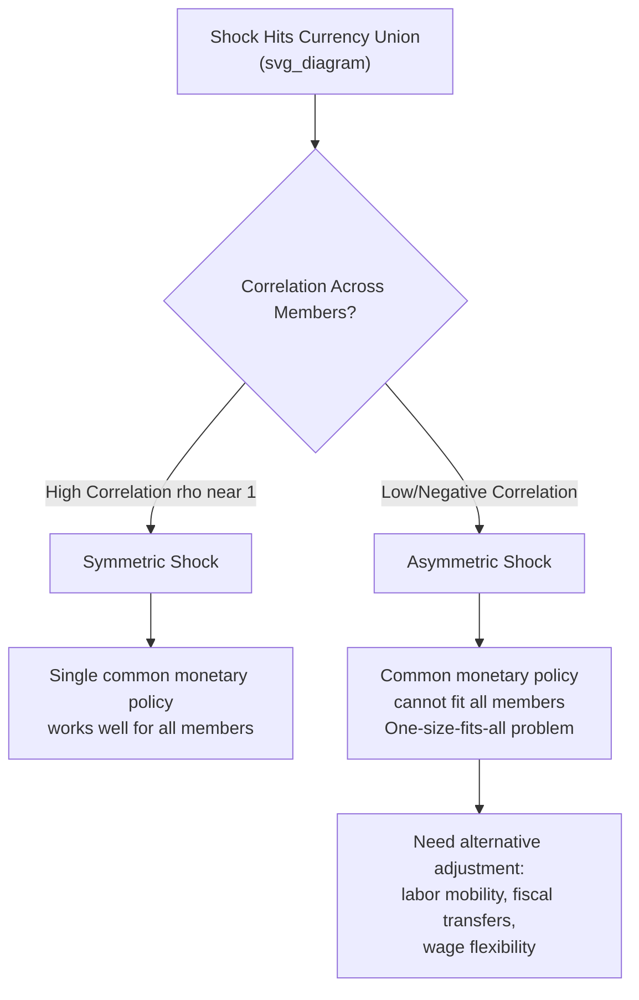

## Symmetric Versus Asymmetric Shocks

### Overview

The distinction between symmetric and asymmetric shocks is a central organizing concept in Optimal Currency Area (OCA) theory. It determines whether the loss of an independent monetary policy and nominal exchange rate — the core cost of joining a currency union — is actually binding. If shocks affecting member economies are highly correlated (symmetric), a single common monetary policy can address them adequately for all members simultaneously, and the cost of currency union membership is low. If shocks are uncorrelated or divergent (asymmetric), a single monetary policy cannot suit all members at once, and the absence of independent exchange rate adjustment becomes costly.

### Defining the Shock Types

**Symmetric shocks** affect all regions or member countries of a currency union in the same direction and, ideally, with similar magnitude and timing. Examples: a global oil price shock affecting all oil-importing members similarly, a common monetary policy shock from a global reserve currency area, or a globally synchronized recession such as the 2008-09 financial crisis or the COVID-19 pandemic shock.

**Asymmetric shocks** affect member regions differently — in direction, magnitude, or timing. Examples: a demand shift away from a product concentrated in one member's export base, a region-specific productivity shock, a country-specific fiscal or banking crisis, or a shock to a sector unevenly distributed across the union (e.g., a shock to tourism disproportionately affecting Southern European Eurozone economies).

$$\text{Shock Correlation} = \rho(\varepsilon_A, \varepsilon_B)$$

Where $\varepsilon_A$ and $\varepsilon_B$ are shock realizations in regions A and B. A currency union is more viable, in the Mundellian sense, the closer $\rho$ is to $+1$ (near-perfect positive correlation, i.e., near-symmetric shocks).

### Why the Distinction Matters: The One-Size-Fits-All Problem

A currency union's central bank sets a single policy interest rate for the entire union based on aggregate (union-wide) economic conditions. If a shock is symmetric, the union-wide aggregate accurately reflects each member's individual condition, and the single policy rate is appropriately calibrated for everyone.

If a shock is asymmetric — say, region A is in recession while region B is booming — the union-wide average might show moderate growth, leading the central bank to set a policy rate that is:

- **Too tight for region A** (needs more stimulus, but doesn't get it), prolonging its recession/unemployment, or
- **Too loose for region B** (needs to cool down, but doesn't get it), risking overheating/inflation

**Key Points**

- This is often called the "one-size-fits-all" monetary policy problem in the OCA literature.
- The larger and more persistent the divergence, the greater the welfare cost of forgoing an independent monetary policy for the affected region — this is the core logic behind Mundell's original 1961 argument for why currency areas should be organized around zones of correlated shocks rather than existing political/national boundaries.
- Without an independent exchange rate, the affected region cannot restore competitiveness through nominal depreciation and must instead rely on internal devaluation (wage/price deflation), labor mobility, or fiscal transfers.

### Sources of Shock Asymmetry

OCA theory identifies several structural sources of why shocks might be asymmetric across regions within a union:

**1. Differences in Industrial/Sectoral Structure**

If regions specialize in different industries (Kenen's diversification criterion actually cuts the other way at the national level, but sectoral concentration differences across regions matter for correlation), a sector-specific demand or supply shock (e.g., a fall in commodity prices, an oil shock, a shift in global demand for manufactured vs. service exports) will hit specialized regions asymmetrically while leaving diversified regions relatively unaffected.

**2. Differences in Financial Structure and Sensitivity to Interest Rates**

Regions differ in household debt levels, mortgage structure (fixed vs. variable rate), and reliance on bank credit — meaning the same common interest rate change produces different real effects across the union (this is often termed a "transmission mechanism asymmetry" rather than a shock asymmetry per se, but it compounds the practical effects of any common policy shock).

**3. Country/Region-Specific Fiscal or Financial Crises**

A banking sector crisis, sovereign debt crisis, or housing bubble collapse concentrated in one member (e.g., Ireland's banking crisis, Greece's sovereign debt crisis, Spain's housing bust — all circa 2009-2012) constitutes a highly asymmetric shock with no natural mechanism for correction absent labor mobility or fiscal transfers.

**4. Divergent Productivity Growth (Balassa-Samuelson-type Divergence)**

Persistent differences in productivity growth rates across members generate divergent real exchange rate pressures even without a discrete "shock" — a form of structural asymmetry that compounds over time within a fixed nominal exchange rate regime.

**5. Policy-Induced Asymmetries**

National fiscal policy differences (e.g., one member running large deficits while another consolidates) can generate divergent demand conditions even in the absence of an external shock.

### Endogeneity of the OCA Criterion (The Frankel-Rose Hypothesis)

An influential twist in the literature, associated with **Frankel and Rose (1998)**, argues that the degree of shock symmetry is not fixed but **endogenous to currency union membership itself**. Their argument:

1. Currency union membership eliminates exchange rate risk and transaction costs, boosting intra-union trade.
2. Higher trade integration increases business cycle synchronization across members (via demand spillovers, common supply chains, and intra-industry trade).
3. Therefore, a currency union that does not initially satisfy the OCA symmetric-shock criterion may satisfy it **after formation**, as trade integration endogenously raises shock correlation.

This became known as the **"OCA endogeneity" hypothesis** and was influential in the political-economic case for Eurozone formation — the argument being that the Eurozone did not need to be an optimal currency area *ex ante* since integration would make it more optimal *ex post*.

**Key Points**

- [Unverified] The empirical evidence on OCA endogeneity is mixed; some studies (e.g., following Frankel-Rose methodology) find that trade integration does raise business cycle correlation, while other studies — particularly post-2009 Eurozone crisis analyses — find evidence of increased specialization and divergence rather than convergence, especially in the run-up to and aftermath of the sovereign debt crisis.
- Critics (notably Paul Krugman, drawing on economic geography models) argue that greater trade integration can instead increase regional specialization (via agglomeration/increasing-returns effects), which would make shocks *more* asymmetric over time, not less — directly contradicting the Frankel-Rose mechanism.
- This tension between the "trade integration → synchronization" view and the "trade integration → specialization" view remains an open empirical and theoretical debate in the OCA literature.

### Types of Asymmetric Shocks: A Taxonomy

| Shock Type | Description | Example |
| --- | --- | --- |
| Demand shock | Region-specific shift in demand for a region's output | Fall in export demand for one country's manufactured goods |
| Supply shock | Region-specific productivity or input-cost shock | Region-specific drought, technology shock, oil price pass-through differences |
| Financial shock | Region-specific banking/credit crisis | Ireland/Spain banking crisis, 2008-2012 |
| Fiscal shock | Region-specific sovereign fiscal stress | Greek sovereign debt crisis, 2010 |
| Policy transmission asymmetry | Same common policy shock, different regional effects | Housing-market sensitivity to interest rates varying by mortgage structure |

### Empirical Assessment: Was the Eurozone an Optimal Currency Area?

The Eurozone has been extensively studied as a test case for symmetric vs. asymmetric shock analysis:

- Pre-crisis studies (1990s-2000s) generally found business cycles across the core Eurozone (Germany, France, Benelux) reasonably correlated, but peripheral members (Greece, Portugal, Ireland, Spain) showed weaker correlation with the core.
- The 2009-2013 sovereign debt crisis is widely cited as a textbook case of an asymmetric shock (concentrated in peripheral, high-debt, less competitive members) hitting a currency union lacking sufficient labor mobility or fiscal transfer mechanisms to absorb it, forcing painful internal devaluation instead.
- The COVID-19 shock (2020) is frequently cited as a more symmetric shock across the Eurozone (all members hit by lockdowns and demand collapse simultaneously), though the *fiscal capacity* to respond still varied significantly by member, prompting the NextGenerationEU response.

[Inference] The characterization of any specific historical episode as "symmetric" or "asymmetric" often depends on the level of aggregation and time horizon used in the underlying study, and reasonable researchers using different correlation methodologies have reached differing conclusions about the precise degree of Eurozone business cycle synchronization at various points in time.

### Policy Implications

**Key Points**

- The greater the expected asymmetry of shocks among prospective currency union members, the stronger the case for retaining independent monetary policy/exchange rates, or alternatively, for building strong compensating mechanisms (labor mobility, fiscal transfers) before or alongside monetary union.
- This is a central argument in assessing candidate members for monetary union (e.g., debates over whether specific EU accession countries were ready for euro adoption) and in assessing whether currency unions should be expanded or contracted.
- Asymmetric shock vulnerability is a primary justification cited for proposals to build Eurozone-level automatic fiscal stabilizers (e.g., a common unemployment reinsurance scheme) — the goal being to substitute a fiscal risk-sharing mechanism for the missing exchange rate channel.

### Related Topics

- Mundell's Optimal Currency Area criteria
- Labor mobility and fiscal transfers as adjustment mechanisms
- Frankel-Rose OCA endogeneity hypothesis
- Krugman's economic geography critique of OCA endogeneity
- Internal devaluation
- Eurozone sovereign debt crisis (2009-2015)
- Business cycle synchronization measurement methods
- Balassa-Samuelson effect
- Kenen's diversification and fiscal integration criteria
- Optimal Currency Area theory: costs and benefits framework