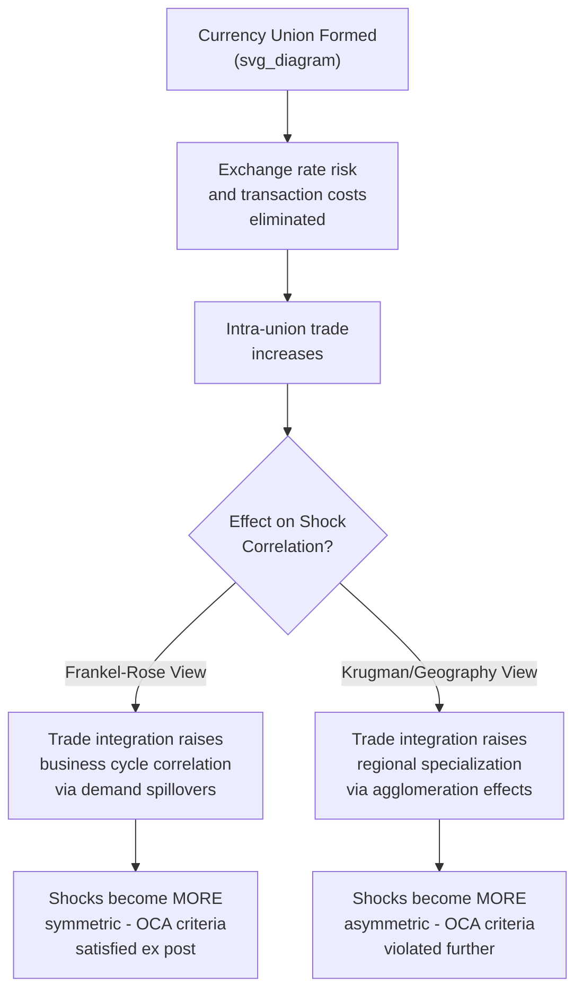

## Endogeneity of the Optimal Currency Area Criteria

### Overview

Classical Optimal Currency Area (OCA) theory — built on the criteria of Mundell (labor mobility), McKinnon (openness), and Kenen (diversification/fiscal integration) — treats these criteria as **exogenous, pre-existing structural characteristics** of candidate regions that determine, ex ante, whether currency union is advisable. The endogeneity hypothesis, most prominently associated with **Jeffrey Frankel and Andrew Rose (1998)**, challenges this static view by arguing that OCA suitability is not a fixed precondition but a **dynamic outcome that currency union itself helps create**. This reframes the entire policy question: a region that fails to meet OCA criteria today might satisfy them after adopting the common currency.

### The Core Argument

The Frankel-Rose endogeneity argument proceeds through a causal chain:

$$\text{Currency Union} \rightarrow \Delta(\text{Trade Integration}) \rightarrow \Delta(\text{Business Cycle Correlation})$$

**Step 1: Currency union boosts trade.** Adopting a common currency eliminates exchange rate uncertainty and currency conversion transaction costs between members, and enhances price transparency, all of which lower the effective cost of cross-border trade.

**Step 2: Higher trade integration raises business cycle correlation.** As members trade more with one another, they become more exposed to each other's demand conditions, supply chains, and sector-specific shocks propagate more readily across borders (via intra-industry trade and input-output linkages), pushing national business cycles into closer alignment.

**Step 3: Higher business cycle correlation satisfies the Mundell symmetric-shock criterion after the fact.** Even if shocks were asymmetric before monetary union, the increased correlation generated by trade integration means shocks become more symmetric after monetary union is formed — precisely the condition OCA theory says should have existed beforehand.

**Key Points**

- This inverts the traditional policy sequencing: rather than "become an OCA, then adopt a common currency," the endogeneity view suggests "adopt a common currency, and OCA-ness will follow."
- Frankel and Rose's original empirical work found a statistically significant positive relationship between bilateral trade intensity and business cycle correlation across a large panel of country pairs, which they interpreted as support for the endogeneity mechanism.
- The hypothesis was highly influential in the political-economic debate preceding Eurozone formation, providing an economic rationale for proceeding with monetary union among European economies that did not, by traditional Mundell-Kenen-McKinnon metrics, clearly constitute an optimal currency area at the time (particularly regarding the peripheral member states).

### The Competing Mechanism: Krugman's Specialization Critique

Paul Krugman, drawing on **New Economic Geography** models (increasing returns to scale, agglomeration economies, and regional specialization), offered a direct theoretical challenge to the Frankel-Rose mechanism. His argument:

- Lower trade costs (from currency union) do not necessarily increase symmetric, intra-industry trade; they can instead enable **regional specialization** according to comparative or locational advantage, as firms concentrate production of specific industries in specific locations to exploit economies of scale (agglomeration/clustering effects, similar to Silicon Valley or the historical concentration of the US auto industry in Detroit).
- If integration promotes specialization rather than diversification, regions become **more** exposed to sector-specific shocks unique to their now-concentrated industry mix, making business cycles **less** correlated with the rest of the union, not more.
- This is sometimes summarized as the tension between the "trade creates similarity" view (Frankel-Rose) and the "trade creates difference" view (Krugman), and it means the sign of the endogeneity effect is theoretically ambiguous — it depends on whether integration-induced trade is predominantly **intra-industry** (supports Frankel-Rose) or **inter-industry/specialization-driven** (supports Krugman).

**Key Points**

- Both mechanisms are theoretically coherent; which dominates in practice is an empirical question, and the literature has not converged on a definitive answer.
- The distinction matters enormously for policy: if Frankel-Rose dominates, currency unions among ex-ante non-optimal regions are more defensible as a bet that will pay off; if Krugman dominates, currency unions may set in motion self-reinforcing divergence, raising the long-run cost of forgoing independent monetary policy.

### Empirical Evidence and the Eurozone Test Case

The Eurozone, having formed in 1999 among a set of economies that did not clearly satisfy traditional OCA criteria, has served as the primary real-world test of the endogeneity hypothesis.

**Evidence broadly supportive of endogeneity/convergence:**

- Some studies found rising intra-industry trade shares and increased business cycle synchronization among core Eurozone economies (Germany, France, Benelux, Austria) in the years following euro adoption.
- Financial market integration deepened substantially post-1999, which some researchers link to increased cross-border risk-sharing and correlated financial conditions.

**Evidence challenging endogeneity/supporting divergence:**

- The 2009-2013 Eurozone sovereign debt crisis is widely interpreted as evidence *against* the optimistic endogeneity thesis: rather than converging, peripheral economies (Greece, Portugal, Spain, Ireland, Italy) experienced a highly asymmetric shock relative to the core, with divergent unemployment trajectories, competitiveness gaps, and current account imbalances that had been building for years prior to the crisis.
- Pre-crisis, several peripheral economies experienced credit-fueled booms and real exchange rate appreciation (rising unit labor costs relative to Germany) that increased structural divergence rather than reducing it — a pattern more consistent with the specialization/divergence view than the Frankel-Rose convergence view.
- [Unverified] Whether this divergence reflects a failure of the endogeneity mechanism itself, or reflects other confounding factors (differential fiscal policy, financial regulation gaps, the absence of complementary institutions like banking union that arrived only after the crisis), remains actively debated; the crisis does not cleanly falsify Frankel-Rose so much as complicate its straightforward application.

[Inference] The balance of post-2010 academic assessment appears to lean toward viewing the pre-crisis Eurozone convergence as having been partly illusory or credit-driven rather than reflecting genuine structural convergence in the Frankel-Rose sense, though this is a matter of ongoing scholarly interpretation rather than settled consensus.

### Methodological Challenges in Testing Endogeneity

Empirically testing the endogeneity hypothesis faces several difficulties:

**1. Reverse Causality / Selection Bias**

Countries that choose to form a currency union may already be more economically similar and more inclined toward deeper integration for reasons unrelated to the currency itself (e.g., shared institutions, geographic proximity, political alignment), making it difficult to isolate the causal effect of the currency union itself from pre-existing similarity.

**2. Identifying the Correct Counterfactual**

Assessing what business cycle correlation *would have been* absent the currency union requires a credible counterfactual, which is inherently difficult with a single, non-repeatable natural experiment like the Eurozone.

**3. Time Horizon Sensitivity**

Short-run and long-run effects of integration on correlation may differ (the "hysteresis" of specialization patterns may take decades to manifest), meaning studies using different sample periods can reach different conclusions.

**4. Distinguishing Trade Effects from Financial Integration Effects**

Currency union simultaneously boosts trade and financial integration; separating the shock-correlation effects attributable specifically to trade linkages (the Frankel-Rose channel) from those attributable to financial linkages (which can transmit shocks through entirely different mechanisms, e.g., banking contagion) is econometrically challenging.

### Policy Implications

**Key Points**

- The endogeneity hypothesis provides a rationale for **proceeding with monetary union ahead of full ex-ante OCA satisfaction**, but this rationale is conditional on the Frankel-Rose convergence mechanism dominating over the Krugman specialization mechanism — a condition that cannot be guaranteed ex ante.
- If policymakers rely on the endogeneity argument but the Krugman mechanism instead dominates, currency union risks locking in a system where asymmetric shocks become structurally larger and more persistent over time, precisely when the policy tools (independent monetary policy, exchange rate) to address them have already been surrendered.
- This tension underlies continued arguments for **complementary institutions** — banking union, fiscal risk-sharing mechanisms, structural funds — that can substitute for the labor mobility and fiscal transfer channels regardless of which endogeneity mechanism ultimately dominates, essentially hedging against the uncertainty in the endogeneity debate itself.
- The debate also informs assessments of prospective new currency union members or expansions: policymakers must judge not just current OCA metrics but the expected direction and magnitude of endogenous change following adoption.

### Related Topics

- Mundell's Optimal Currency Area criterion (labor mobility)
- Symmetric versus asymmetric shocks
- Kenen's fiscal integration and diversification criteria
- New Economic Geography and agglomeration economics
- Labor mobility and fiscal transfers as adjustment mechanisms
- Eurozone sovereign debt crisis (2009-2015)
- Banking union and European financial integration
- Intra-industry trade versus inter-industry trade
- Business cycle synchronization measurement methods