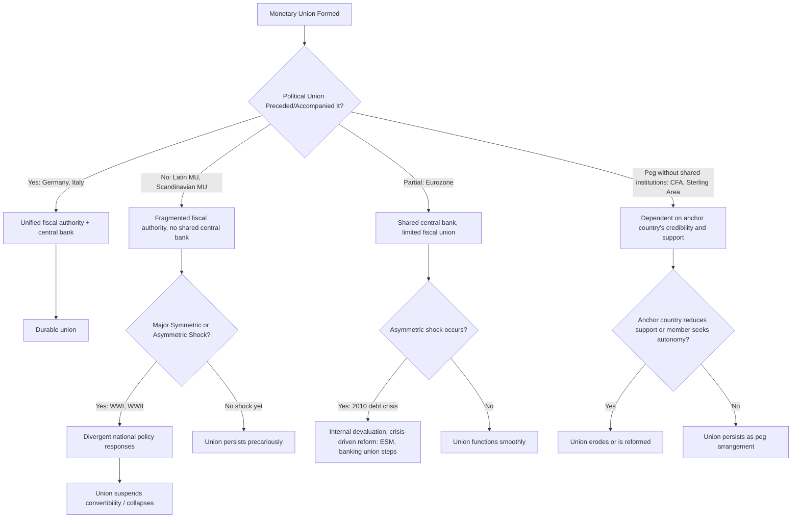

## Historical Examples of Monetary Unions

### Overview

Monetary unions — arrangements where multiple political jurisdictions share a single currency or irrevocably fix exchange rates and cede monetary sovereignty to a common authority — have recurred throughout modern economic history. Examining historical cases provides empirical grounding for Optimal Currency Area (OCA) theory, since each union's success or failure can be evaluated against OCA criteria (labor mobility, fiscal integration, trade openness, symmetry of shocks, wage-price flexibility).

This reference surveys the major historical and contemporary monetary unions, organized by structural type, with emphasis on the institutional design choices and outcomes relevant to OCA analysis.

---

### Classification of Monetary Unions

**Key Points**

- **National monetary unions**: unification of previously separate currencies within a single emerging nation-state (e.g., German unification, Italian unification)
- **Multilateral/international monetary unions**: sovereign states pooling monetary authority while retaining separate fiscal and political sovereignty (e.g., Eurozone, CFA Franc Zone)
- **Colonial/metropole-linked unions**: currency arrangements imposed or extended by an imperial power across colonies (e.g., Sterling Area, Franc Zone origins)
- **De facto vs. de jure unions**: some unions involve formal treaties and central banks (EMU); others are informal peg/dollarization arrangements without shared institutions (Panama's use of the USD)

---

### The Latin Monetary Union (1865–1927)

#### Structure and Formation

Founded in 1865 by France, Belgium, Italy, and Switzerland, later joined by Greece (1868) and several other states adhering informally (Spain, Romania, Venezuela, Serbia, Bulgaria). The union standardized gold and silver coin specifications (weight, fineness, diameter) under a bimetallic standard, allowing coins minted in any member state to circulate freely in all others.

#### Design Weaknesses

- **No central bank or fiscal coordination**: each state retained an independent treasury and could mint coins subject only to agreed metallic content, creating incentives for debasement at the margin
- **Bimetallism arbitrage**: divergent gold-silver market ratios across members created Gresham's Law pressures, exacerbated when Germany's 1871 shift to the gold standard flooded the union with demonetized silver
- **No lender of last resort**: fiscal crises (notably Greece's, culminating in effective expulsion pressure in 1908) had no union-level backstop

#### Collapse

World War I fiscal demands led members to suspend convertibility and issue fiat currency unilaterally, effectively ending the union in practice by 1914; it was formally dissolved in 1927.

**Relevance to OCA Theory**: [Inference] Often cited as a cautionary case demonstrating that a common currency standard without fiscal union or a central monetary authority is fragile to asymmetric fiscal shocks — a precursor argument to modern Eurozone debates.

---

### The Scandinavian Monetary Union (1873–1924)

#### Structure

Sweden and Denmark (1873), joined by Norway (1875), adopted a common gold-based krona/krone with mutually accepted banknotes and coins across borders — one of history's most integrated voluntary unions, given the members' high trade openness, similar economic structures, and geographic proximity (all strong OCA criteria).

#### Outcome

The union functioned smoothly for decades but fractured during World War I when member states' fiscal and monetary policies diverged sharply (Sweden pursuing tighter policy than Norway and Denmark), leading to suspension of note interchangeability in 1914 and formal dissolution by 1924.

**Relevance to OCA Theory**: [Inference] Despite favorable OCA characteristics (high trade integration, cultural/institutional similarity), the union still failed under a large symmetric-turned-asymmetric shock (WWI), suggesting that even strong OCA fundamentals cannot substitute for centralized crisis-response institutions.

---

### German Monetary Unification (1871–1876)

#### Structure and Context

Following political unification of the German Empire in 1871, the new state replaced numerous regional currencies (thalers, guilders, and various local coinages issued by Prussia, Bavaria, Saxony, and dozens of smaller states) with the gold-based mark, administered from 1876 by the Reichsbank as a unified central bank.

#### Distinguishing Features

- Unlike the Latin or Scandinavian unions, this was a **national** monetary union following political unification, not a treaty among sovereign states
- A single fiscal authority (the Reich) and central bank emerged concurrently with the currency, avoiding the institutional gap that undermined the Latin Monetary Union
- Indemnity payments from France after the Franco-Prussian War (1871) partly financed the transition to gold backing

**Relevance to OCA Theory**: [Inference] Frequently cited as the template case for the view that durable currency unions require prior or simultaneous political and fiscal union — a foundational argument in the "OCA requires more than economics" literature (echoed by economists skeptical of EMU without fiscal union, e.g., Feldstein).

---

### Italian Monetary Unification (1861–1865)

Following the Risorgimento, the Kingdom of Italy consolidated the currencies of pre-unification states (Kingdom of Sardinia's lira, Papal States' scudo, Kingdom of the Two Sicilies' ducato, and others) into a single lira, backed initially by the Banca Nazionale and eventually a fully unified banking and currency system. Structurally parallel to the German case: political unification preceded and enabled monetary unification, rather than the reverse.

---

### The East African Currency Board / East African Shilling (1919–1966 era)

#### Structure

A colonial-era currency board arrangement covering Kenya, Uganda, Tanganyika (later Tanzania), and Zanzibar, administered from London, issuing the East African shilling fully backed by sterling reserves (a strict currency board, not a discretionary central bank).

#### Post-Independence Trajectory

After the three mainland territories gained independence (early 1960s), the shared currency board persisted briefly but each country established its own central bank and national currency by 1966, driven by desires for independent monetary policy and seigniorage revenue.

**Relevance to OCA Theory**: [Inference] Illustrates that political sovereignty transitions frequently trigger monetary union breakup even absent an economic crisis, as the demand for monetary policy autonomy (and seigniorage) rises with statehood — a political-economy factor OCA theory's original formulation (Mundell, 1961) did not emphasize.

---

### The CFA Franc Zone (1945–present)

#### Structure

Two currency unions — the West African Economic and Monetary Union (UEMOA/WAEMU, 8 countries, XOF franc) and the Central African Economic and Monetary Community (CEMAC, 6 countries, XAF franc) — both pegged historically to the French franc and since 1999 to the euro at a fixed rate, with reserves partly held in the French Treasury.

#### Institutional Design

- Each zone has its own regional central bank (BCEAO for West Africa, BEAC for Central Africa) issuing a common currency across member states
- The peg to the euro is guaranteed by France via an "operations account" mechanism, historically requiring members to deposit a share of foreign reserves with the French Treasury (originally 65–100%, reduced over time)
- The two zones use currencies with the same name (CFA franc) and equal historical value but are **not mutually convertible** without going through euro conversion

#### Ongoing Debates

[Inference] Critics argue the arrangement constrains monetary policy autonomy and may not suit economies with commodity-driven, asymmetric shocks relative to the eurozone anchor; defenders point to the credibility and low-inflation track record the peg has provided. West African states announced plans (from 2019) to reform the WAEMU arrangement into a new currency ("eco") with reduced French oversight — as of the reference cutoff, implementation had been repeatedly delayed. [Unverified] Current status of the eco transition should be verified against recent sources given the multi-year delays.

**Relevance to OCA Theory**: Often studied as a long-running real-world test of currency union among structurally similar, low-income, primarily agricultural/commodity-exporting economies with limited labor mobility to the anchor currency country (France) — contrasting with the Eurozone's higher (though still imperfect) labor mobility.

---

### The Sterling Area (1930s–1970s)

#### Structure

An informal (not treaty-bound in its early form) grouping of countries — predominantly British Commonwealth members plus some others — that pegged their currencies to the British pound, held reserves primarily in sterling, and often imposed capital controls on transactions outside the area (formalized further during and after WWII).

#### Distinguishing Features

- Looser than a true monetary union: members retained separate national currencies (Australian pound, Indian rupee, etc.) merely pegged to sterling, rather than sharing a single currency
- Functioned partly as a reserve-currency bloc and capital-control zone rather than a full OCA

#### Dissolution

Eroded gradually as members pursued independent exchange rate policies, accelerated by the 1967 sterling devaluation and the UK's own eventual float in 1972; effectively ended with the collapse of Bretton Woods-era fixed arrangements.

---

### The Eurozone / European Economic and Monetary Union (1999–present)

#### Structure

The most extensively studied contemporary monetary union: 20 EU member states (as of recent years) share the euro, with monetary policy centralized at the European Central Bank (ECB) while fiscal policy remains largely national, subject to rules-based constraints (Stability and Growth Pact).

#### Design Relative to OCA Criteria

| OCA Criterion | Eurozone Assessment |
| --- | --- |
| Trade integration | High among core members |
| Labor mobility | Lower than the US; language/cultural barriers persist |
| Fiscal risk-sharing | Historically weak; strengthened somewhat post-2010 (ESM, and pandemic-era instruments) |
| Symmetry of shocks | Documented asymmetries (e.g., 2010–2012 sovereign debt crisis hit periphery states — Greece, Portugal, Ireland, Spain — far harder than core) |
| Wage-price flexibility | Limited in several member states, complicating adjustment without a national exchange rate tool |

#### Key Historical Stress Test

The European sovereign debt crisis (2010–2012) is the primary real-time case study for OCA critiques of the Eurozone: countries facing asymmetric demand shocks could not devalue independently, and initial fiscal risk-sharing mechanisms were minimal, leading to severe internal devaluation (wage/price deflation) as the primary adjustment channel in crisis countries.

**Relevance to OCA Theory**: The Eurozone is the paradigmatic modern test case in nearly all OCA coursework, since it was consciously designed with awareness of OCA theory yet proceeded despite acknowledged shortfalls on several criteria — a deliberate "OCA gamble" that fiscal and institutional integration would follow monetary integration (the reverse sequencing from the German/Italian unification cases above).

---

### Dollarization Cases (De Facto Unions Without Shared Institutions)

#### Panama (1904–present) and Ecuador (2000–present) and El Salvador (2001–present)

These represent unilateral adoption of the US dollar as legal tender without any formal currency union treaty, shared central bank, or US fiscal backstop.

**Key Points**

- No seigniorage revenue retained by the adopting country
- No lender-of-last-resort facility from the Federal Reserve
- Complete loss of independent monetary policy with none of the institutional voice a treaty-based union (like the Eurozone) provides members

[Inference] These cases are often used pedagogically as the "extreme" end of the monetary integration spectrum — illustrating the tradeoff between credibility gains (importing US monetary credibility, reducing inflation and currency risk) and the total loss of policy autonomy, without even the limited institutional representation that treaty-based unions offer.

---

### Comparative Summary Table

| Union | Period | Type | Central Bank? | Fiscal Union? | Outcome |
| --- | --- | --- | --- | --- | --- |
| Latin Monetary Union | 1865–1927 | Multilateral coin standard | No | No | Collapsed (WWI stress) |
| Scandinavian Monetary Union | 1873–1924 | Multilateral note/coin union | No shared bank | No | Collapsed (WWI stress) |
| German Unification | 1871–1876 | National unification | Yes (Reichsbank) | Yes | Durable |
| Italian Unification | 1861–1865 | National unification | Yes (eventually) | Yes | Durable |
| East African Currency Board | 1919–1966 | Colonial currency board | Board, not discretionary CB | No | Dissolved post-independence |
| CFA Franc Zone | 1945–present | Multilateral peg union | Yes (BCEAO/BEAC) | No | Ongoing, under reform pressure |
| Sterling Area | 1930s–1970s | Informal peg/reserve bloc | No | No | Eroded gradually |
| Eurozone | 1999–present | Multilateral full union | Yes (ECB) | Partial | Ongoing, stress-tested 2010–2012 |
| Dollarization (Panama, Ecuador, El Salvador) | Various | Unilateral adoption | No (foreign CB) | No | Ongoing |

---

### Timeline of Major Monetary Unions (svg_diagram)

<svg xmlns="http://www.w3.org/2000/svg" viewBox="0 0 900 420">
\<style\>
.axis { stroke: #333; stroke-width: 1.5; }
.label { font-family: sans-serif; font-size: 12px; fill: #222; }
.title { font-family: sans-serif; font-size: 14px; fill: #000; font-weight: bold; }
.bar { opacity: 0.85; }
\</style\>
<text x="450" y="20" text-anchor="middle" class="title">Timeline of Major Monetary Unions (svg_diagram)</text>
<line x1="120" y1="380" x2="860" y2="380" class="axis" />
<text x="120" y="398" class="label">1860</text>
<text x="230" y="398" class="label">1900</text>
<text x="340" y="398" class="label">1940</text>
<text x="450" y="398" class="label">1980</text>
<text x="560" y="398" class="label">2000</text>
<text x="670" y="398" class="label">2020</text>
<text x="780" y="398" class="label">2040</text>
<rect x="125" y="50" width="145" height="16" fill="#3b82f6" class="bar" />
<text x="275" y="63" class="label">Latin Monetary Union (1865–1927)</text>
<rect x="132" y="75" width="130" height="16" fill="#f59e0b" class="bar" />
<text x="265" y="88" class="label">Scandinavian Monetary Union (1873–1924)</text>
<rect x="125" y="100" width="18" height="16" fill="#10b981" class="bar" />
<text x="150" y="113" class="label">German Unification (1871–76)</text>
<rect x="110" y="125" width="12" height="16" fill="#8b5cf6" class="bar" />
<text x="130" y="138" class="label">Italian Unification (1861–65)</text>
<rect x="230" y="150" width="105" height="16" fill="#ef4444" class="bar" />
<text x="340" y="163" class="label">East African Currency Board (1919–66)</text>
<rect x="200" y="175" width="605" height="16" fill="#06b6d4" class="bar" />
<text x="815" y="188" class="label">CFA Franc Zone (1945–present)</text>
<rect x="300" y="200" width="150" height="16" fill="#eab308" class="bar" />
<text x="460" y="213" class="label">Sterling Area (1930s–1970s)</text>
<rect x="555" y="225" width="315" height="16" fill="#dc2626" class="bar" />
<text x="700" y="245" class="label">Eurozone (1999–present)</text>
<rect x="205" y="250" width="665" height="16" fill="#7c3aed" class="bar" />
<text x="700" y="270" class="label">Panama dollarization (1904–present)</text>
</svg>

---

### Causal Structure: Why Historical Unions Failed or Survived (svg_diagram)

---

### Worked Example: Applying OCA Criteria to a Historical Case

**Example**

Consider the Scandinavian Monetary Union (1873–1924) against Mundell's core OCA criteria:

1. **Labor mobility**: Relatively high among Sweden, Norway, Denmark (shared linguistic roots, geographic proximity) — favorable
2. **Trade openness**: High intra-regional trade share — favorable
3. **Fiscal transfers**: None existed — unfavorable
4. **Shock symmetry**: WWI created divergent trade exposure and neutrality policies (Sweden more insulated than Norway/Denmark) — the deciding unfavorable factor
5. **Result**: Despite scoring well on labor mobility and trade openness, the union collapsed once the fiscal/shock-symmetry weaknesses were exposed by WWI — demonstrating that satisfying *some* OCA criteria is insufficient if fiscal risk-sharing mechanisms are entirely absent when an asymmetric shock hits.

$$\text{Union Stability} \approx f(\text{Labor Mobility}, \text{Trade Openness}, \text{Fiscal Risk-Sharing}, \text{Shock Symmetry})$$

[Inference] This functional relationship is a pedagogical simplification of Mundell (1961), McKinnon (1963), and Kenen (1969) criteria combined — not a formally estimated model — useful for structuring comparative case analysis rather than for quantitative prediction.

---

### Conclusion

Historical monetary unions demonstrate a consistent pattern: unions built on genuine political/fiscal integration (German and Italian unification) have proven durable, while unions relying solely on shared metallic or note standards without centralized fiscal backstops (Latin Monetary Union, Scandinavian Monetary Union) have collapsed under major shocks, typically wartime fiscal pressure. Peg-based arrangements dependent on an external anchor (CFA Franc Zone, Sterling Area, dollarization cases) trade monetary credibility for complete loss of policy autonomy and persist only as long as the anchor relationship remains politically and economically viable. The Eurozone represents a deliberate, partial departure from this historical pattern — proceeding with monetary union ahead of full fiscal union — making it the central live case study for testing OCA theory's predictions against real institutional design choices.

---

**Related Topics**

- Mundell's original Optimal Currency Area criteria (1961)
- McKinnon and Kenen's extensions to OCA theory
- The Eurozone sovereign debt crisis (2010–2012) as an OCA stress test
- Fiscal federalism and risk-sharing mechanisms in currency unions
- The theory and mechanics of currency boards vs. central banks
- Dollarization and "original sin" in emerging market currency choices
- The proposed West African "eco" currency and WAEMU reform
- Endogenous OCA theory (Frankel and Rose): does trade integration follow monetary union rather than precede it?
- Asymmetric shocks and adjustment mechanisms absent exchange rate flexibility (internal devaluation)
- Comparison of US dollar area vs. Eurozone as OCA case studies