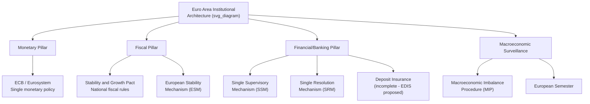
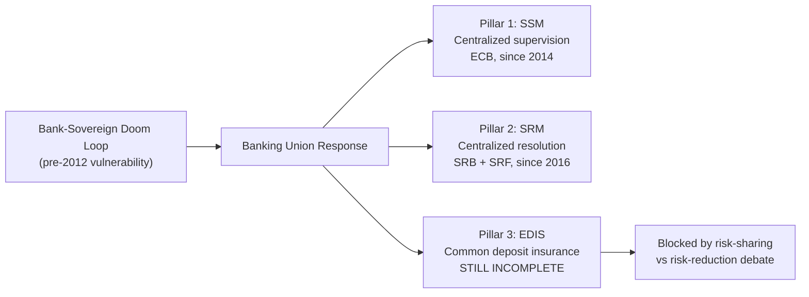

## Institutional Architecture of the Euro Area

### Overview

The euro area's institutional architecture is the set of supranational and intergovernmental bodies, treaties, and rules that govern monetary, fiscal, financial, and macroeconomic policy for the countries using the euro. Unlike a conventional nation-state monetary union, the Eurozone combines a **fully centralized monetary authority** (the ECB) with **largely decentralized fiscal, banking, and labor market policy**, constrained by rules-based coordination frameworks rather than direct federal control. This institutional asymmetry — centralized money, decentralized fiscal and structural policy — is a defining and much-debated feature of the euro area's design, and much of the post-2010 reform agenda has been aimed at addressing the gaps it exposed.

### Core Monetary Pillar: The Eurosystem and ECB

**European Central Bank (ECB)**

The ECB, headquartered in Frankfurt, sets the single monetary policy for all euro area members. Its primary objective, per the Treaty on the Functioning of the European Union (TFEU), is price stability, operationalized as an inflation target (historically "below but close to 2%," revised in the 2021 strategy review to a symmetric 2% target).

**European System of Central Banks (ESCB)**

The ESCB comprises the ECB and the national central banks (NCBs) of **all** EU member states, including those outside the euro area. It is distinct from:

**Eurosystem**

The Eurosystem comprises the ECB and only the NCBs of euro area members. It is the Eurosystem, not the broader ESCB, that actually implements single monetary policy.

**Key Points**

- Monetary policy decisions are made by the **Governing Council**, comprising the ECB's Executive Board (6 members) plus the governors of the euro area NCBs (one per member state).
- The ECB is legally structured with a high degree of independence from national governments and EU political institutions, insulating interest rate decisions from short-term political pressure — a design feature modeled partly on the Bundesbank.
- The ECB's mandate is narrower than, e.g., the US Federal Reserve's dual mandate (price stability and maximum employment); the ECB's primary objective is price stability, with support for general EU economic policies as a secondary objective "without prejudice" to price stability.

### Fiscal Pillar: Rules-Based Coordination Without Federal Fiscal Authority

Unlike the monetary pillar, fiscal policy remains a **national competence** in the euro area, constrained by supranational rules rather than centralized control. This reflects the deliberate design choice at Maastricht to pursue monetary union without full fiscal union.

**Stability and Growth Pact (SGP)**

Established in 1997 to enforce the Maastricht fiscal criteria (deficit ≤ 3% of GDP, debt ≤ 60% of GDP) on an ongoing basis after monetary union began, with:

- A **preventive arm**: requiring members to pursue medium-term budgetary objectives (MTOs) and submit annual Stability Programmes.
- A **corrective arm**: the **Excessive Deficit Procedure (EDP)**, which can, in principle, impose sanctions on persistent violators (though enforcement has historically been politically weak — notably, France and Germany themselves breached the 3% threshold in the early 2000s without facing meaningful sanctions).

$$\text{Fiscal Rule Constraint}: \quad \frac{\text{Deficit}}{\text{GDP}} \leq 3\%, \quad \frac{\text{Debt}}{\text{GDP}} \leq 60\%$$

**European Stability Mechanism (ESM)**

Established in 2012 (successor to the temporary European Financial Stability Facility, EFSF, created in 2010) as a permanent intergovernmental crisis-lending institution, providing financial assistance to euro area members facing severe financing difficulties, conditional on economic adjustment programs (the "Troika" conditionality framework involving the European Commission, ECB, and IMF).

**Key Points**

- The absence of a centralized fiscal authority means the euro area lacks a union-wide automatic fiscal stabilizer comparable to the US federal budget (see Kenen's fiscal integration criterion) — a structural gap exposed severely during the 2010-2015 sovereign debt crisis.
- The SGP's rules-based approach reflects concern over moral hazard: without market discipline (no bailout clause, TFEU Article 125) or rules discipline, individual members might run unsustainable deficits, generating negative spillovers (higher borrowing costs, contagion risk) for the entire currency union.
- [Inference] The SGP's enforcement record is generally regarded in the literature as weak relative to its formal design, given the political difficulty of imposing sanctions on large member states, which has motivated repeated reform efforts (2005, 2011 "Six-Pack," 2013 "Two-Pack," and a further overhaul agreed in 2024).

### Financial/Banking Pillar: Banking Union

The 2010-2012 crisis revealed a severe vulnerability: national banking crises could threaten entire sovereigns (and vice versa) — the so-called **"doom loop"** or "bank-sovereign nexus" — because bank supervision, resolution, and deposit insurance remained nationally fragmented even though monetary policy was unified. **Banking Union**, launched in 2014, was the institutional response, built on three intended pillars:

**1. Single Supervisory Mechanism (SSM)**

Gives the ECB direct supervisory authority over "significant" euro area banks (those above certain asset thresholds), with national competent authorities supervising smaller banks under ECB oversight. Operational since November 2014.

**2. Single Resolution Mechanism (SRM)**

Provides a centralized framework and authority (the Single Resolution Board, SRB) for resolving failing banks in an orderly manner, funded by a bank-financed **Single Resolution Fund (SRF)**, intended to reduce reliance on taxpayer-funded bailouts.

**3. European Deposit Insurance Scheme (EDIS) — incomplete**

A proposed common deposit guarantee scheme, intended to complete Banking Union by mutualizing deposit insurance across the euro area. As of the most recent EU-level negotiations, EDIS remains **unimplemented**, blocked primarily by disagreements over risk-sharing versus risk-reduction sequencing (some member states, notably Germany, insist on further risk reduction — e.g., addressing legacy non-performing loans and sovereign exposure concentration in bank balance sheets — before agreeing to risk mutualization).

### Macroeconomic Surveillance: The European Semester and MIP

**European Semester**

An annual cycle of economic policy coordination, introduced in 2011, through which the European Commission and Council review member states' fiscal and structural policies, issue country-specific recommendations, and monitor SGP and Macroeconomic Imbalance Procedure compliance in a coordinated annual timetable.

**Macroeconomic Imbalance Procedure (MIP)**

Introduced in 2011 (as part of the "Six-Pack" reforms) to monitor and address macroeconomic imbalances beyond narrow fiscal metrics — including current account imbalances, unit labor cost competitiveness, private sector debt, house price developments, and unemployment — using a **scoreboard of indicators** with indicative thresholds, aiming to catch the kind of pre-crisis divergences (e.g., Spanish/Irish credit booms, competitiveness losses in Southern Europe) that the SGP's narrow fiscal focus had missed.

### Crisis-Era Institutional Additions

**Outright Monetary Transactions (OMT)**

Announced by ECB President Mario Draghi in 2012 alongside the "whatever it takes" pledge, OMT is a (never-activated but credibility-defining) ECB program allowing potentially unlimited purchases of distressed member states' sovereign bonds in secondary markets, conditional on the country being under an ESM program. Widely credited with ending the acute phase of the sovereign debt crisis by removing convertibility/redenomination risk from bond pricing.

**Pandemic Emergency Purchase Programme (PEPP)**

A large-scale, flexible asset purchase program launched by the ECB in March 2020 in response to COVID-19, with flexibility across time, asset classes, and jurisdictions exceeding the ECB's standard Asset Purchase Programme (APP) rules.

**NextGenerationEU (NGEU) / Recovery and Resilience Facility (RRF)**

Agreed in 2020, NGEU represents a historically significant step: the European Commission borrowing on capital markets on behalf of the EU (common debt issuance) to fund grants and loans to member states for pandemic recovery, tied to national Recovery and Resilience Plans. Widely discussed as a partial, largely one-off (rather than permanent) move toward EU-level fiscal capacity, addressing — at least temporarily — the Kenen-criterion gap discussed elsewhere in this chapter.

### Institutional Gaps and the "Incomplete Union" Critique

**Key Points**

- The euro area is frequently characterized in the academic literature as an **"incomplete monetary union"**: it has full monetary centralization but only partial fiscal centralization, partial banking union (EDIS missing), and no significant capital markets union or unemployment insurance mechanism at the union level.
- This asymmetry directly maps onto the OCA-theoretic adjustment mechanisms (labor mobility, fiscal transfers) discussed elsewhere in this course: because the fiscal and banking pillars remain incomplete, the euro area has historically had to rely disproportionately on internal devaluation and emergency intergovernmental lending (ESM) rather than automatic risk-sharing mechanisms comparable to a fully federal system.
- The **Five Presidents' Report (2015)** and subsequent Commission reflection papers laid out a roadmap toward "Genuine Economic and Monetary Union," including proposals for a Eurozone-level fiscal capacity, a common unemployment reinsurance scheme, and completion of Banking Union and Capital Markets Union — most of which remain only partially implemented.
- [Speculation] Further deepening of fiscal and banking integration (completing EDIS, establishing a permanent fiscal capacity beyond NGEU) is widely viewed by economists as necessary to durably address the euro area's structural vulnerabilities, but the pace and extent of such integration depends on member-state political consensus that has historically proven difficult to achieve, particularly regarding permanent fiscal risk mutualization.

### Related Topics

- Labor mobility and fiscal transfers as adjustment mechanisms
- Eurozone sovereign debt crisis (2009-2015)
- Banking Union: SSM, SRM, and EDIS in detail
- Stability and Growth Pact reforms (Six-Pack, Two-Pack, 2024 reform)
- Draghi's "whatever it takes" and Outright Monetary Transactions
- NextGenerationEU and the Recovery and Resilience Facility
- Macroeconomic Imbalance Procedure indicators and scoreboard
- Bank-sovereign "doom loop" and its transmission channels
- Capital Markets Union (proposed)
- ECB monetary policy strategy review (2021)