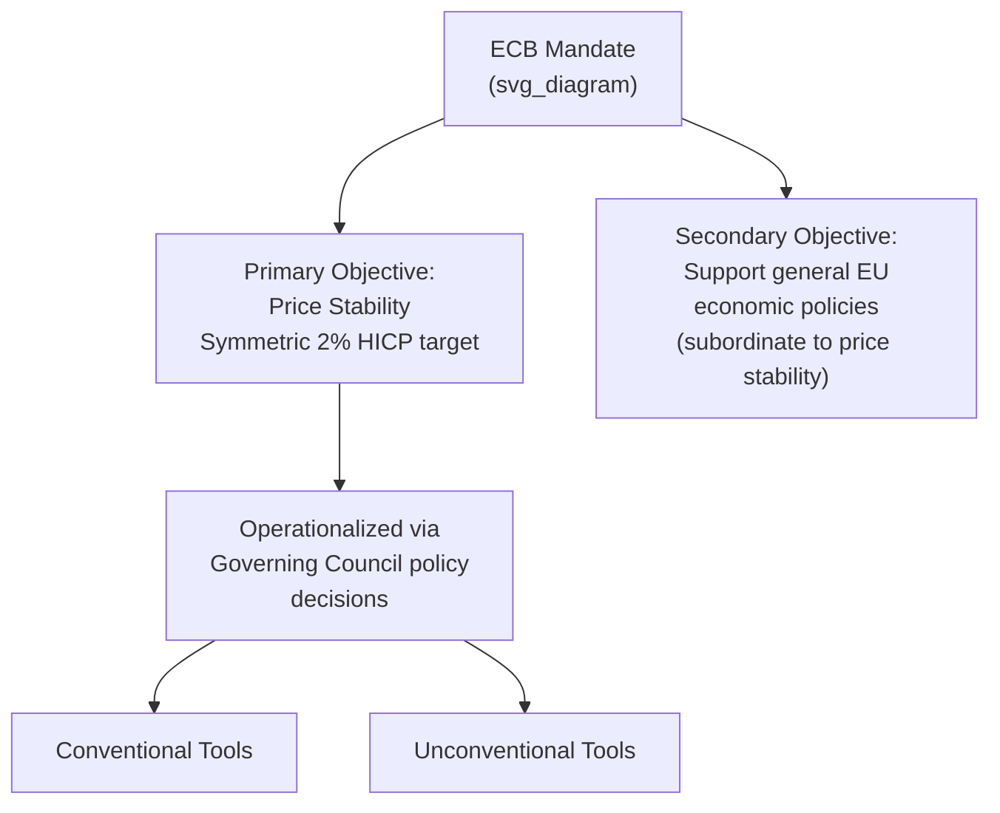
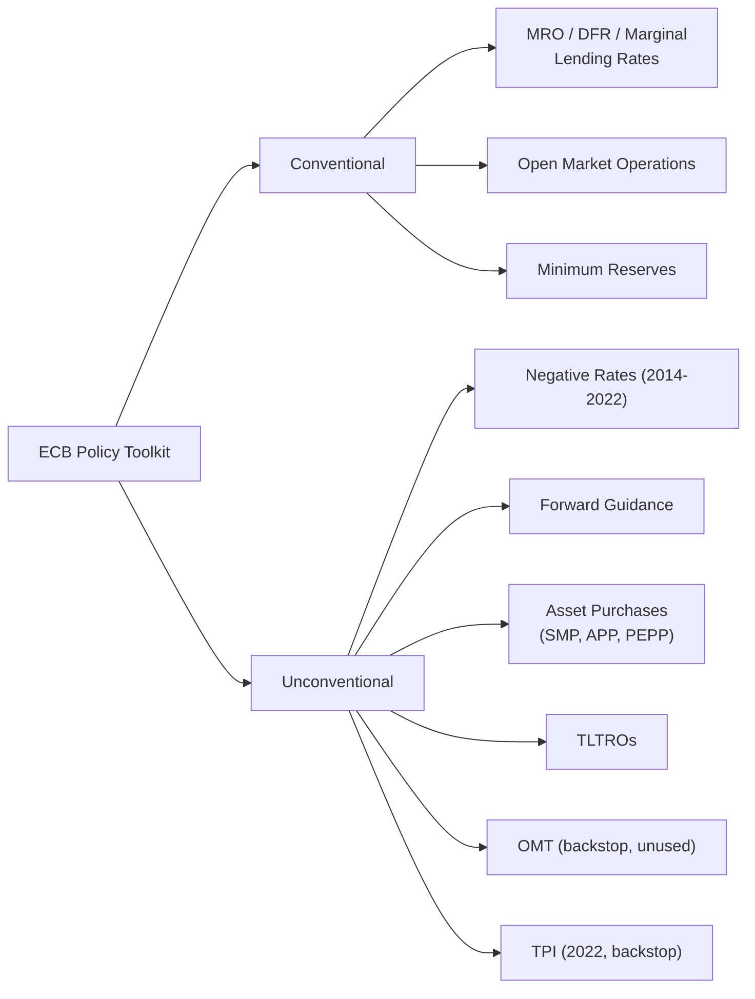

## The European Central Bank's Mandate and Toolkit

### Overview

The European Central Bank (ECB) is the monetary authority for the euro area, responsible for conducting single monetary policy on behalf of all euro-using member states. Its legal mandate, governance structure, and policy toolkit have evolved substantially since its 1998 founding — most notably through crisis-era innovations in unconventional monetary policy and a formal strategy review in 2021. This item covers the ECB's legal objectives, governance, and the full range of conventional and unconventional instruments it uses to pursue those objectives.

### Legal Mandate

The ECB's mandate derives from the **Treaty on the Functioning of the European Union (TFEU)**, Article 127(1), and the **Statute of the ESCB and of the ECB**.

**Primary Objective: Price Stability**

The TFEU establishes price stability as the ECB's primary objective, without specifying a numerical target — the ECB itself has operationalized this through its monetary policy strategy.

- **1998-2003 definition**: inflation (HICP) of "below 2%" year-on-year in the medium term.
- **2003 clarification**: "below, but close to, 2%" over the medium term, addressing concerns that "below 2%" alone could imply a deflationary bias.
- **2021 strategy review**: a **symmetric 2% inflation target** over the medium term, explicitly clarifying that deviations above and below target are equally undesirable (removing the earlier asymmetric "close to but below" language), and acknowledging that near the effective lower bound on interest rates, the ECB may undertake especially forceful or persistent policy action, potentially implying a transitory period of inflation moderately above target.

**Secondary Objective**

Article 127(1) TFEU further states that, without prejudice to price stability, the ECB "shall support the general economic policies in the Union" — including objectives such as balanced economic growth, full employment, and environmental protection (Article 3 TEU). This is explicitly subordinate to the price stability mandate, distinguishing the ECB's mandate structure from the US Federal Reserve's co-equal dual mandate (price stability and maximum employment).

**Key Points**

- The ECB's mandate is generally characterized as narrower and more hierarchically structured than the Fed's, prioritizing price stability above other objectives rather than treating employment and price stability as co-equal goals.
- The ECB is granted a high degree of legal independence: it cannot seek or take instructions from EU institutions, member state governments, or any other body (TFEU Article 130), and the Treaty explicitly prohibits monetary financing of government deficits (Article 123, the "no monetary financing" or "no bailout" clause) — a provision that became a significant legal and political constraint during the sovereign debt crisis.

### Governance Structure

**Governing Council**

The principal decision-making body, comprising the 6-member Executive Board plus the governors of the national central banks (NCBs) of all euro area member states. Sets monetary policy, including key interest rates and unconventional measures.

**Executive Board**

Comprises the ECB President, Vice-President, and four other members, appointed by the European Council. Responsible for implementing monetary policy per Governing Council decisions and managing the ECB's day-to-day operations.

**General Council**

A broader body including the ECB President, Vice-President, and the governors of the NCBs of **all** EU member states (including non-euro members), primarily coordinating between euro area and non-euro EU monetary policy and handling transitional matters for prospective euro adopters.

### Conventional Monetary Policy Toolkit

**Key ECB Interest Rates**

The ECB sets three primary policy rates:

1. **Main Refinancing Operations (MRO) rate** — the rate for regular liquidity-providing operations with the banking system, historically the ECB's primary policy signal.
2. **Deposit Facility Rate (DFR)** — the rate banks earn on overnight deposits held at the Eurosystem; since 2022 this has become the ECB's primary operative policy rate given the large excess liquidity in the banking system built up through years of asset purchases.
3. **Marginal Lending Facility rate** — the rate for overnight borrowing from the Eurosystem, typically forming the ceiling of the interest rate corridor.

$$\text{Interest Rate Corridor}: \quad \text{Deposit Facility Rate} \leq \text{MRO Rate} \leq \text{Marginal Lending Rate}$$

**Open Market Operations**

Standard liquidity management through repo-style refinancing operations (MROs, weekly, and longer-term operations) conducted with eligible counterparties against eligible collateral.

**Minimum Reserve Requirements**

Credit institutions in the euro area are required to hold minimum reserves with their national central bank, calculated as a percentage of specified liabilities, serving both a liquidity-management and (secondarily) a monetary-control function.

### Unconventional Monetary Policy Toolkit

Following the 2008-09 financial crisis and 2010-2015 sovereign debt crisis, and with policy rates approaching or reaching their effective lower bound, the ECB substantially expanded its toolkit:

**Negative Interest Rate Policy (NIRP)**

The Deposit Facility Rate was taken negative starting June 2014 and remained negative until July 2022, intended to encourage bank lending over reserve hoarding and to further ease financial conditions once conventional rate cuts were exhausted.

**Forward Guidance**

Explicit ECB communication about the likely future path of policy rates and/or asset purchases, intended to shape market expectations and long-term interest rates beyond what current short-term rate settings alone would achieve.

**Large-Scale Asset Purchase Programmes**

| Programme | Period | Key Features |
| --- | --- | --- |
| Securities Markets Programme (SMP) | 2010-2012 | Targeted secondary-market purchases of distressed sovereign bonds during the early crisis |
| Asset Purchase Programme (APP) | Launched 2015 | Broad-based quantitative easing; includes public sector (PSPP), corporate sector (CSPP), covered bond (CBPP3), and asset-backed securities (ABSPP) purchase programmes |
| Pandemic Emergency Purchase Programme (PEPP) | March 2020 - March 2022 (net purchases) | Larger and more flexible than APP; flexibility across time, asset classes, and jurisdictions in response to COVID-19; reinvestment continued afterward with flexibility maintained |
| Outright Monetary Transactions (OMT) | Announced 2012, never activated | Potentially unlimited secondary-market sovereign bond purchases, conditional on an ESM programme; primarily a credibility/backstop tool |

**Targeted Longer-Term Refinancing Operations (TLTROs)**

Multi-year, low-cost (in some series, rates could fall below zero, effectively paying banks to borrow) loans to banks conditional on their lending to the real economy, intended to directly incentivize bank credit provision to households and non-financial corporations rather than relying purely on general liquidity provision.

**Transmission Protection Instrument (TPI)**

Announced July 2022, a tool enabling the ECB to make potentially unlimited secondary-market purchases of a member state's public sector securities if the Governing Council judges that unwarranted, disorderly market dynamics pose a threat to monetary policy transmission across the euro area — distinct from OMT in that it does not require an ESM programme, though it carries eligibility criteria related to fiscal and macroeconomic policy soundness.

### The 2021 Strategy Review: Key Changes

The ECB's first comprehensive strategy review since 2003 (concluded July 2021) introduced several substantive changes:

**Key Points**

- Adoption of a **symmetric** 2% inflation target, replacing the earlier "below, but close to, 2%" formulation, explicitly treating positive and negative deviations from target as equally undesirable.
- Recognition that near the effective lower bound, monetary policy requires especially forceful or persistent action, which may imply a transitory period of inflation moderately above target.
- A shift in the **primary reference index** for the inflation target to include an estimated cost of owner-occupied housing in HICP over time — a methodological change intended to better capture euro area consumers' actual cost of living, though full incorporation remains a multi-year technical undertaking.
- Explicit incorporation of **climate change considerations** into the monetary policy framework, including climate-related disclosure requirements and considerations for corporate bond purchases and collateral frameworks.
- Commitment to periodic strategy reviews approximately every ~4 years going forward, rather than the previous ~18-year gap between the first two reviews.

### Distinguishing the ECB's Toolkit from the Federal Reserve's

**Key Points**

- Both central banks conduct large-scale asset purchases and forward guidance, but the ECB's toolkit includes instruments specifically designed to address **fragmentation risk** across a currency union with multiple sovereign issuers (OMT, TPI, PEPP's jurisdictional flexibility) — a challenge the Fed, operating within a single sovereign, does not face in the same form.
- The ECB's TLTROs represent a more direct bank-lending-channel instrument than the Fed typically employs, reflecting the euro area's greater reliance on bank-based (versus capital-market-based) financial intermediation relative to the US.
- [Inference] The ECB's negative rate policy was sustained for a considerably longer period (2014-2022) than analogous near-zero/negative-rate episodes at the Fed, reflecting persistently weaker inflation dynamics and a lower estimated natural rate of interest in the euro area during that period, though the precise drivers of this divergence remain subject to ongoing academic debate.

### Related Topics

- Institutional architecture of the euro area
- Outright Monetary Transactions and "whatever it takes"
- Transmission Protection Instrument (TPI)
- Quantitative easing: transmission channels and effectiveness
- Effective lower bound and unconventional monetary policy
- Eurozone sovereign debt crisis (2009-2015)
- ECB independence and central bank governance
- Inflation targeting frameworks: comparative approaches
- Monetary policy transmission mechanism in a currency union