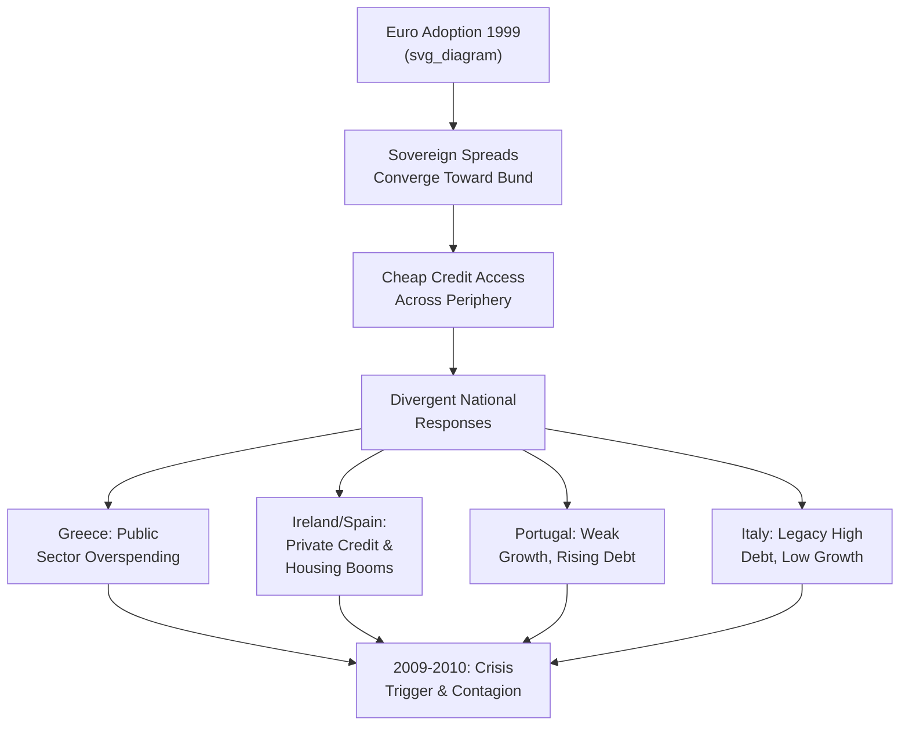
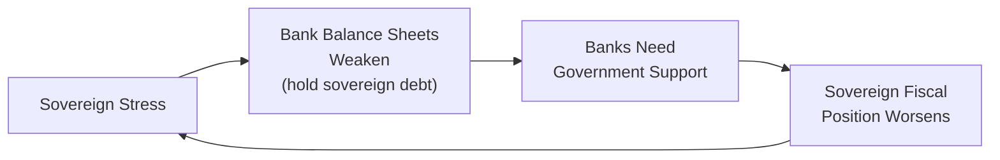

## Origins of the Eurozone Sovereign Debt Crisis

### Overview

The Eurozone sovereign debt crisis (roughly 2009-2015) was a multi-country financial and fiscal crisis that exposed deep structural weaknesses in the euro area's institutional design. While often narrated primarily as a story of fiscal profligacy — particularly in the case of Greece — the crisis's origins were considerably more heterogeneous across countries, involving distinct combinations of fiscal mismanagement, private-sector credit booms, banking sector fragility, and pre-existing competitiveness divergences, all interacting with the structural constraints of an incomplete monetary union.

### Pre-Crisis Convergence and Its Illusions

**The Convergence Trade (1999-2007)**

Upon euro adoption, sovereign bond yields across euro area members converged dramatically toward German (Bund) levels, as markets priced in the assumption that currency union implied comparable credit risk across members — reinforced by the disappearance of currency/devaluation risk.

$$\text{Spread}_{i,t} = y_{i,t} - y_{\text{Germany},t} \approx 0 \text{ for most members, 1999-2007}$$

This convergence was, in retrospect, widely regarded as having mispriced sovereign credit risk — peripheral member spreads over Bunds fell to near zero despite underlying differences in fiscal positions, competitiveness, and growth models, a pattern many economists later characterized as inconsistent with genuine underlying economic convergence.

**Key Points**

- Cheap credit access (near-German borrowing costs) fueled substantial private and, in some cases, public sector borrowing across the periphery in the pre-crisis years.
- The **"no bailout" clause** (TFEU Article 125) was intended to enforce market discipline on individual sovereigns, but markets appear to have significantly discounted this provision's credibility, pricing peripheral debt as if implicit mutual support existed.
- [Inference] The scale of the pre-crisis spread compression is generally interpreted in the literature as reflecting a systematic underpricing of sovereign credit and redenomination risk rather than a genuine convergence in underlying fiscal or competitiveness fundamentals, though the precise degree of mispricing versus genuine convergence is debated country by country.

### Divergent National Origins: Not a Single Story

A central analytical point is that the crisis did not have a single common cause across countries — it is more accurately understood as several distinct national crises that became interlinked through the shared currency and financial system.

**Greece: Fiscal Origins**

- Greece ran persistent, large fiscal deficits through the 2000s, financed increasingly cheaply due to euro-era spread compression.
- In October 2009, a newly elected government revealed that the previous government had significantly understated the true budget deficit — revised from an initial estimate near 6% of GDP to over 12% (later revised even higher), and debt levels far exceeding the 60% Maastricht reference value.
- This revelation triggered an immediate, sharp repricing of Greek sovereign risk and is generally identified as the proximate trigger for the broader crisis.

**Ireland and Spain: Private Sector Credit and Housing Booms**

- Both countries entered the crisis with **strong fiscal positions** (Ireland and Spain both ran budget surpluses or near-balance in the mid-2000s, and had debt-to-GDP ratios well below the Maastricht threshold) — directly contradicting a purely "fiscal profligacy" narrative of the crisis.
- Instead, both experienced massive **private sector credit and housing booms**, fueled by post-euro cheap financing, with banking sectors that became dangerously overexposed to real estate.
- When the housing bubbles collapsed (following the global financial crisis), banking sector losses were severe enough that government bailouts of the banking system converted a **private sector debt crisis into a public sector sovereign debt crisis** — the Irish government's 2010 decision to guarantee bank liabilities in full is frequently cited as a pivotal moment that dramatically worsened Ireland's sovereign fiscal position.

**Portugal: Structural Growth Weakness**

- Portugal's crisis reflected a longer-run pattern of weak productivity growth and declining competitiveness relative to the euro area core since the late 1990s, combined with rising public and private debt, rather than a single acute trigger event comparable to Greece or Ireland.

**Italy: Legacy Debt and Low Growth**

- Italy entered the euro with already high public debt (well above 100% of GDP) inherited from before monetary union, combined with persistently weak productivity growth through the 2000s — a slower-burning vulnerability that made Italy susceptible to contagion once the crisis began, even without a discrete triggering event of its own.

### The Competitiveness Divergence Channel

A structural, slower-moving contributor to the crisis was a growing divergence in **unit labor costs and price competitiveness** between the euro area core (notably Germany, which pursued significant wage restraint and labor market reform, particularly the Hartz reforms of the early-to-mid 2000s) and the periphery, where wages and prices rose faster than productivity.

$$\text{ULC}_i = \frac{\text{Compensation per employee}_i}{\text{Labor productivity}_i}$$

Without the exchange rate available to correct this real appreciation, peripheral economies accumulated persistent current account deficits (mirrored by Germany's growing current account surplus) throughout the 2000s — a divergence the Macroeconomic Imbalance Procedure was later created to monitor, but which existed largely unaddressed at the institutional level during the pre-crisis period.

### Financial Sector and Sovereign-Bank Feedback Loops ("Doom Loop")

**Key Points**

- Euro area banks, particularly in the periphery but also core-country banks with cross-border exposures, held substantial quantities of domestic sovereign debt on their balance sheets, partly encouraged by regulatory treatment of sovereign debt as risk-free (zero risk-weighting under Basel capital rules).
- This created a **bank-sovereign feedback loop**: sovereign stress reduced the value of banks' sovereign bond holdings, weakening bank balance sheets; weakened banks required government support, straining sovereign finances further; strained sovereign finances reduced the value of sovereign bonds again — a self-reinforcing "doom loop" absent in nations with fully diversified, non-domestically-concentrated bank sovereign holdings.
- Cross-border interbank lending, which had expanded significantly in the pre-crisis convergence period, transmitted stress rapidly across borders once confidence in peripheral sovereign and bank solvency deteriorated — contributing to contagion from Greece to Ireland, Portugal, Spain, and Italy despite their differing underlying vulnerabilities.

### Institutional Amplifiers: Why the Crisis Became a Currency Union Crisis

The crisis's severity and contagion pattern were amplified by specific gaps in the euro area's institutional architecture (covered in detail elsewhere in this chapter):

1. **No lender of last resort for sovereigns**: Unlike countries with their own currency, euro area members cannot have their central bank directly monetize sovereign debt (Article 123 "no monetary financing" clause), removing a backstop available to standalone sovereigns and leaving peripheral debt vulnerable to self-fulfilling liquidity/rollover crises.
2. **No pre-existing crisis resolution mechanism**: The EFSF/ESM did not exist until 2010-2012 — created reactively during the crisis rather than being in place beforehand.
3. **Fragmented banking supervision**: Banking Union (SSM/SRM) did not exist until 2014-2016, meaning bank oversight remained a national responsibility despite banks operating within a unified currency and increasingly integrated financial system.
4. **Absence of fiscal risk-sharing**: As discussed under the Kenen criterion elsewhere in this course, the euro area lacked (and largely still lacks) an automatic fiscal transfer mechanism comparable to the US federal system, meaning asymmetric shocks had to be absorbed almost entirely through internal devaluation and external emergency lending rather than automatic stabilizers.

[Inference] The consensus view in the post-crisis academic literature is that these institutional gaps did not *cause* the underlying fiscal and financial vulnerabilities in individual member states, but they substantially amplified the severity, contagion, and duration of the crisis relative to what a more institutionally complete monetary union — or these same countries retaining independent currencies — might have experienced; this counterfactual judgment, however, cannot be definitively tested.

### Timeline of Key Trigger Events

| Date | Event |
| --- | --- |
| October 2009 | Greek government reveals understated deficit figures |
| April 2010 | Greece requests EU/IMF financial assistance |
| May 2010 | First Greek bailout program; EFSF created |
| November 2010 | Ireland requests bailout following banking sector collapse |
| April 2011 | Portugal requests bailout |
| 2011-2012 | Contagion spreads to Italy and Spain; sovereign spreads spike |
| July 2012 | Draghi's "whatever it takes" speech; OMT announced |
| 2012 | Spain requests bank-specific assistance; second Greek bailout/restructuring |
| 2015 | Greek crisis intensifies again; third bailout program |

### Related Topics

- Institutional architecture of the euro area
- Symmetric versus asymmetric shocks
- Bank-sovereign "doom loop" and Banking Union response
- Outright Monetary Transactions and "whatever it takes"
- Macroeconomic Imbalance Procedure
- Internal devaluation as a crisis adjustment mechanism
- Stability and Growth Pact and its enforcement record
- Labor mobility and fiscal transfers as adjustment mechanisms
- Greek debt restructuring (2012 PSI)
- European Stability Mechanism (ESM) and conditionality