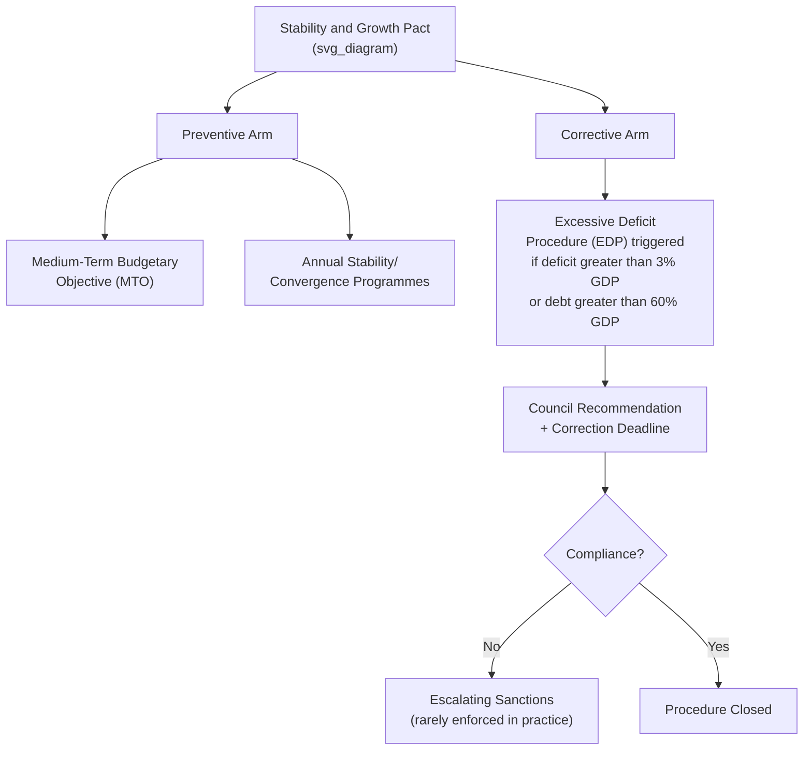

## Fiscal Rules and the Stability and Growth Pact

### Overview

The Stability and Growth Pact (SGP) is the euro area's central rules-based framework for coordinating and constraining national fiscal policy in the absence of a centralized fiscal authority. Established in 1997, prior to the euro's 1999 launch, the SGP operationalizes the Maastricht Treaty's fiscal criteria into an ongoing surveillance and enforcement regime. Its design reflects a core tension in monetary union: since individual member states retain sovereign control over fiscal policy but share a single currency and central bank, unsustainable national fiscal policy in one member can generate negative externalities (higher borrowing costs, contagion risk, pressure on the common monetary stance) for the entire union. The SGP's history is one of repeated reform, driven by recurring gaps between its formal rules and their political enforceability.

### Origins: The Maastricht Criteria

The SGP builds directly on the fiscal convergence criteria established in the **1992 Maastricht Treaty** as preconditions for euro adoption:

$$\frac{\text{Government Deficit}}{\text{GDP}} \leq 3\%, \qquad \frac{\text{Government Debt}}{\text{GDP}} \leq 60\%$$

These reference values were not derived from a rigorous optimal-fiscal-policy model but were, in large part, based on then-prevailing EU average debt and deficit levels in the late 1980s, serving as a politically negotiated benchmark rather than a theoretically optimal threshold. [Unverified] The specific origin and theoretical justification of the 3%/60% figures is debated in the literature, with various retrospective rationalizations offered (e.g., debt-stabilizing deficit levels given assumed nominal GDP growth rates) that were not necessarily the original basis for the numbers.

**Key Points**

- The Maastricht criteria were designed as **entry criteria** for euro adoption; the SGP extended equivalent constraints into a **permanent, ongoing framework** applicable to members after adoption, addressing concern that fiscal discipline might otherwise lapse once entry had been secured.
- The SGP was pushed strongly by Germany during 1990s negotiations, reflecting concern that fiscally undisciplined members could free-ride on the credibility of the common currency, generating inflationary or bailout pressure on more fiscally conservative members.

### Structure: Preventive and Corrective Arms

**Preventive Arm**

Requires member states to pursue a country-specific **Medium-Term Budgetary Objective (MTO)**, generally defined in structural (cyclically-adjusted, one-off-measures-excluded) terms, and to submit annual **Stability Programmes** (euro area members) or **Convergence Programmes** (non-euro EU members) detailing their fiscal trajectory. The European Commission and Council assess these submissions for compliance with the required adjustment path toward the MTO.

**Corrective Arm: The Excessive Deficit Procedure (EDP)**

Triggered when a member state breaches the 3% deficit or 60% debt reference values without qualifying exceptional circumstances. The EDP process involves:

1. Commission assessment and recommendation
2. Council decision on the existence of an excessive deficit
3. Council recommendation with a deadline for correction
4. Escalating steps for non-compliance, potentially including financial sanctions (interest-bearing deposits, later non-interest-bearing deposits, and ultimately fines) for euro area members

### The Enforcement Problem: 2003 and Beyond

**Key Points**

- The SGP's credibility suffered a major early blow in **November 2003**, when the Council declined to advance the EDP against **France and Germany** — both of which had breached the 3% deficit threshold — effectively suspending the procedure against the EU's two largest economies through a political vote.
- This episode is widely cited in the literature as demonstrating that SGP enforcement depends on qualified-majority political votes among member states (rather than automatic, rules-based sanctions), creating a structural incentive problem: large or influential members facing sanctions can potentially muster sufficient political support among peers to avoid enforcement, undermining the credibility of the rules for smaller members.
- [Inference] This episode is broadly regarded as having weakened market and institutional confidence in the SGP's enforceability well before the sovereign debt crisis, contributing to a "reform in response to failure" pattern that has recurred repeatedly since.

### The 2005 Reform

Following the 2003 crisis of enforcement, the SGP was reformed in 2005 to introduce greater flexibility:

- Expanded the range of "relevant factors" the Commission and Council could consider when assessing compliance (e.g., pension reforms, R&D spending, economic cycle conditions), giving more discretion in EDP assessments.
- Lengthened correction deadlines under certain circumstances.
- Critics argued this reform weakened the rules' rigor in the name of flexibility, potentially exacerbating the enforcement credibility problem rather than solving it; supporters argued it made the rules more realistic and less mechanically procyclical.

### Post-Crisis Reforms: Six-Pack, Two-Pack, and the Fiscal Compact

The 2010-2015 sovereign debt crisis exposed the SGP's insufficiency (it had not prevented, and arguably had not even adequately detected, the underlying imbalances in Ireland, Spain, or the competitiveness divergence problem) and prompted a substantial expansion of the EU's fiscal and macroeconomic surveillance architecture.

**"Six-Pack" (2011)**

A package of five regulations and one directive that:

- Introduced the **Macroeconomic Imbalance Procedure (MIP)**, extending surveillance beyond narrow fiscal metrics to a broader scoreboard (current account balances, unit labor costs, private debt, house prices, unemployment, etc.).
- Introduced **reverse qualified majority voting (RQMV)** for certain EDP sanction decisions — meaning a Commission sanction recommendation would be adopted unless a qualified majority of the Council voted **against** it, intended to make sanctions more automatic and harder to politically block (addressing the 2003 France-Germany problem).
- Added a **debt criterion operationalization**: members with debt above 60% of GDP must reduce the excess at an average rate of 1/20th per year, or face EDP.
- Introduced expenditure benchmark rules limiting the growth rate of government expenditure relative to potential GDP growth.

**"Two-Pack" (2013)**

Applying specifically to euro area members, requiring:

- Enhanced monitoring of draft budgetary plans submitted to the Commission **before** national parliamentary adoption, allowing earlier Commission input.
- Enhanced surveillance for member states under EDP or receiving financial assistance.

**Treaty on Stability, Coordination and Governance (TSCG) / "Fiscal Compact" (2012)**

An intergovernmental treaty (outside the formal EU treaty framework, signed by most but not all EU members) requiring:

- A **balanced budget rule** (structural deficit generally not exceeding 0.5% of GDP, or 1% for members with debt well below 60%) to be enshrined in national law, preferably constitutional or equivalent binding status.
- An automatic correction mechanism triggered by significant deviations.
- Reinforced the RQMV principle for EDP decisions among signatories.

### The 2024 Reform

Following an extended review process prompted by the limitations exposed during the COVID-19 pandemic (SGP rules were suspended via the "general escape clause" from 2020-2023) and criticisms that the pre-existing rules were overly complex, insufficiently growth-friendly, and procyclical, a reformed framework took effect in 2024:

**Key Points**

- Shifted toward **country-specific, multi-year fiscal adjustment paths** (typically 4 years, extendable to 7 with qualifying reforms/investments) negotiated between each member state and the Commission, replacing the more uniform, one-size-fits-all adjustment benchmarks of earlier rules.
- Retained the headline 3%/60% Maastricht reference values (these are treaty-based and were not altered) but changed the operational **indicators** used to assess compliance, placing greater emphasis on a single operational indicator (net primary expenditure growth) rather than the earlier structural balance-based approach, intended to be simpler and more transparently monitorable.
- [Inference] Early assessments of the 2024 framework's effectiveness are necessarily preliminary given its recent implementation; whether it durably resolves the SGP's historical tension between credible enforcement and country-specific flexibility remains to be empirically evaluated over subsequent fiscal cycles.

### Theoretical Critiques of Rules-Based Fiscal Frameworks

**Key Points**

- **Procyclicality concern**: Deficit ceilings can force fiscal tightening precisely when automatic stabilizers would otherwise be supporting a weak economy (during a recession, deficits rise mechanically even absent discretionary stimulus), a criticism leveled particularly at the SGP's operation during the 2010-2013 period when peripheral members faced simultaneous fiscal consolidation requirements and deep recessions.
- **One-size-fits-all reference values**: Critics argue uniform numerical thresholds (3%, 60%) applied across structurally heterogeneous economies (different growth rates, demographic profiles, debt compositions) lack a clear theoretical basis for universal appropriateness.
- **Time-inconsistency and enforcement credibility**: As the 2003 episode illustrated, rules requiring politically costly sanctions against powerful members face a structural credibility problem — a recurring theme in the broader political economy literature on rules versus discretion in fiscal (and monetary) policy.
- **Complexity critique**: Successive additions (Six-Pack, Two-Pack, Fiscal Compact, MIP, expenditure benchmark) created a rules framework criticized by the 2024 reform's own stated rationale as overly complex and difficult for both policymakers and markets to interpret and monitor.
- Proponents counter that rules-based frameworks address genuine cross-border externality and moral hazard concerns inherent in a currency union without a lender-of-last-resort for sovereigns and with a no-bailout clause of uncertain credibility — providing an alternative disciplining mechanism to the market discipline that Maastricht's architects originally hoped the "no bailout" clause (TFEU Article 125) would supply.

### Related Topics

- Institutional architecture of the euro area
- Origins of the eurozone sovereign debt crisis
- Macroeconomic Imbalance Procedure
- European Stability Mechanism (ESM) and conditionality
- Reverse qualified majority voting mechanics
- Automatic stabilizers and fiscal policy over the business cycle
- 2024 economic governance reform (detailed provisions)
- No-bailout clause (TFEU Article 125) and its credibility
- Labor mobility and fiscal transfers as adjustment mechanisms