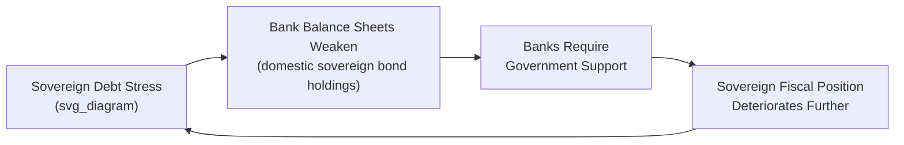
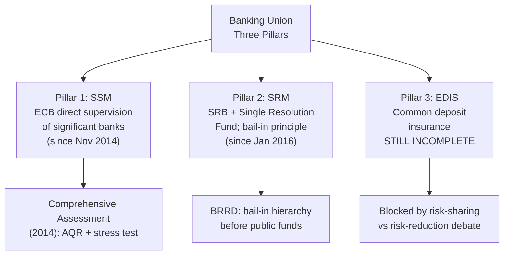

## Banking Union and Financial Integration

### Overview

Banking Union is the euro area's institutional response to a vulnerability exposed acutely during the 2009-2015 sovereign debt crisis: the coexistence of a fully centralized currency with fully **nationally fragmented** bank supervision, resolution, and deposit insurance. This mismatch allowed weak national banking systems to threaten entire sovereigns (and vice versa) through the bank-sovereign "doom loop." Launched in 2014, Banking Union was designed around three intended pillars — centralized supervision, centralized resolution, and common deposit insurance — of which the third remains incomplete. This item also situates Banking Union within the broader, still-evolving project of euro area financial integration, including the related but distinct Capital Markets Union initiative.

### The Problem Banking Union Was Designed to Solve

Prior to 2014, euro area bank supervision, deposit guarantee schemes, and resolution frameworks remained entirely national, despite the fact that:

- Banks operated within a single currency and increasingly integrated cross-border financial system.
- Many large euro area banks held significant cross-border exposures and, in several cases, operated as genuinely pan-European institutions.
- National regulatory treatment of sovereign debt as effectively risk-free (zero risk-weighting under Basel capital adequacy rules) encouraged banks to hold large quantities of **domestic** sovereign bonds, creating concentrated "home bias" exposure.

This combination generated the **bank-sovereign feedback loop ("doom loop")**: a sovereign debt crisis eroded the value of domestic banks' bond holdings, weakening bank balance sheets; weakened banks required government recapitalization or guarantees, straining sovereign finances further; a more fiscally strained sovereign saw its bond values fall further, renewing the cycle. Ireland's 2010 decision to fully guarantee its banking system's liabilities — which converted a private banking crisis into a sovereign debt crisis severe enough to require an EU/IMF bailout — is the most commonly cited illustration of this dynamic.

### Pillar 1: Single Supervisory Mechanism (SSM)

Operational since **November 2014**, the SSM gives the **European Central Bank** direct supervisory authority over "significant" euro area credit institutions, generally defined by thresholds including total assets above €30 billion (or 20% of national GDP), systemic importance, or receipt of direct ESM financial assistance. Smaller, "less significant" institutions continue to be supervised primarily by National Competent Authorities (NCAs), but under the ECB's overall oversight framework and with the ECB retaining the ability to assume direct supervision of any institution if warranted.

**Key Points**

- The SSM removes a key structural conflict of interest present in purely national supervision: national supervisors historically faced political and institutional pressure to be lenient toward large domestic "national champion" banks, whereas a supranational supervisor is intended to apply more consistent, less politically captured standards across the union.
- Prior to assuming direct supervision, the ECB conducted a **Comprehensive Assessment** (2014) of the banks it would newly supervise, comprising an Asset Quality Review (AQR) and stress test, intended to identify and address legacy balance sheet weaknesses before the new supervisory regime began.
- Non-euro EU member states may join the SSM (and broader Banking Union) through "close cooperation" arrangements; Bulgaria joined in this manner, reflecting Banking Union's structure as open to EU members beyond the euro area itself, though most non-euro members have not joined.

### Pillar 2: Single Resolution Mechanism (SRM)

Operational since **January 2016**, the SRM provides a centralized framework for resolving failing "significant" banks in an orderly manner, aiming to minimize both taxpayer-funded bailouts and disorderly disruption to the financial system and real economy.

**Single Resolution Board (SRB)**

The central resolution authority responsible for resolution planning and decision-making for significant banks and cross-border groups.

**Single Resolution Fund (SRF)**

A resolution financing fund, built up through **bank-financed contributions** (ex-ante levies on the banking sector itself, based on liabilities and risk profile) over a transition period, reaching a target level of at least 1% of covered deposits across participating banks. The SRF is intended to provide resolution financing (e.g., bridging capital or liquidity needs during resolution) without recourse to direct taxpayer funding as the primary source.

**Bank Recovery and Resolution Directive (BRRD) Framework**

Underpinning both the SRM and equivalent national frameworks for non-SSM banks, the BRRD establishes the EU-wide resolution toolkit, most notably the **bail-in** principle: losses must first be absorbed by shareholders and creditors (in a specified hierarchy: shareholders, then subordinated creditors, then senior unsecured creditors, with certain protections for insured depositors) before any public funds can be used, intended to reduce moral hazard and taxpayer exposure relative to the ad hoc, often full-guarantee bailout approaches seen during the sovereign debt crisis (e.g., Ireland 2008).

$$\text{MREL (Minimum Requirement for Own Funds and Eligible Liabilities)}: \quad \text{Loss-absorbing capacity} \geq \text{Regulatory minimum}$$

Banks are required to maintain a Minimum Requirement for Own Funds and Eligible Liabilities (MREL), ensuring sufficient bail-inable liabilities exist to absorb losses in resolution without triggering broader financial instability.

### Pillar 3: European Deposit Insurance Scheme (EDIS) — Incomplete

EDIS was intended to complete Banking Union by mutualizing deposit guarantee funding across the euro area, replacing (or reinsuring) the existing patchwork of **National Deposit Guarantee Schemes (DGS)**, each funded and backstopped at the national level per the EU's Deposit Guarantee Schemes Directive (covering deposits up to €100,000 per depositor per bank).

**Key Points**

- EDIS was formally proposed by the European Commission in **November 2015** but remains unimplemented as a common mutualized scheme as of the most recent negotiations; various phased approaches (starting with reinsurance rather than full mutualization) have been proposed but not adopted.
- The primary political obstacle is a disagreement over **sequencing between "risk reduction" and "risk sharing."** Some member states (most prominently Germany and several other core/Northern European states) have insisted that further risk reduction — addressing legacy non-performing loans (NPLs), reducing banks' concentrated domestic sovereign debt holdings, and harmonizing insolvency regimes — must occur *before* agreeing to mutualize deposit insurance risk, out of concern that mutualization without prior risk reduction could expose fiscally stronger members to losses originating in weaker banking systems.
- Other member states and EU institutions have argued that credible risk-sharing is itself a necessary condition for reducing risk (a stronger deposit guarantee reduces the likelihood of destabilizing bank runs, which itself lowers risk), creating something of a chicken-and-egg policy impasse that has persisted for roughly a decade since EDIS was first proposed.
- [Inference] The absence of EDIS is widely regarded in the academic and policy literature as the most significant remaining structural gap in Banking Union, leaving a residual, if reduced relative to the pre-2014 baseline, bank-sovereign linkage at the national level for deposit insurance purposes specifically.

### Distinguishing Banking Union from Capital Markets Union (CMU)

**Key Points**

- Banking Union addresses the **banking sector** specifically (supervision, resolution, deposit insurance for credit institutions).
- **Capital Markets Union (CMU)**, a separate but related EU initiative launched in 2015, aims to deepen and integrate EU capital markets more broadly (equity, bond, securitization, and venture capital markets) to reduce the euro area's historically heavy reliance on bank-based financial intermediation relative to the US, and to improve cross-border private risk-sharing through capital market channels (recall the Asdrubali-Sørensen-Yosha "capital markets channel" of interregional risk-sharing discussed elsewhere in this course).
- CMU progress has also been slower than originally envisioned, facing obstacles including divergent national insolvency law, taxation differences, and varying securities regulation across member states; it remains, alongside EDIS, a frequently cited example of "incomplete" euro area financial integration relative to the fully centralized monetary pillar.
- Some recent EU policy discourse (particularly post-2022) has rebranded and broadened the CMU agenda under the term **Savings and Investments Union (SIU)**, reflecting renewed political emphasis on mobilizing EU household savings into productive investment, though the underlying structural objectives substantially overlap with the earlier CMU framing.

### Evidence on Banking Union's Effectiveness

**Key Points**

- Cross-border banking sector consolidation within the euro area has remained relatively limited even after Banking Union's introduction, with genuinely pan-European banking groups still comparatively rare relative to the degree of integration implied by a fully unified banking market — suggesting Banking Union's harmonizing effects on market structure have been gradual rather than transformative.
- The **home bias in sovereign debt holdings** by domestic banks — a core driver of the doom loop — has been reduced since the crisis peak but has not been eliminated, and remains a live regulatory policy question (proposals for revised regulatory treatment of sovereign exposures, sometimes termed removing sovereign debt's "privileged regulatory treatment," have been discussed but not comprehensively implemented at the EU level).
- [Inference] Overall assessments in the literature generally credit Banking Union's first two pillars (SSM, SRM) with meaningfully strengthening euro area banking sector resilience and reducing (though not eliminating) the bank-sovereign feedback loop relative to the pre-2014 institutional baseline, while regarding the EDIS gap as a significant unresolved vulnerability that limits the extent to which Banking Union fully achieves its original stated objectives.

### Related Topics

- Institutional architecture of the euro area
- Origins of the eurozone sovereign debt crisis
- Bank-sovereign "doom loop" mechanics
- Bank Recovery and Resolution Directive (BRRD) and bail-in mechanics
- Capital Markets Union / Savings and Investments Union
- Labor mobility and fiscal transfers as adjustment mechanisms (private capital markets risk-sharing channel)
- Comprehensive Assessment and ECB stress testing methodology
- Sovereign debt regulatory treatment (risk-weighting reform proposals)
- Deposit Guarantee Schemes Directive