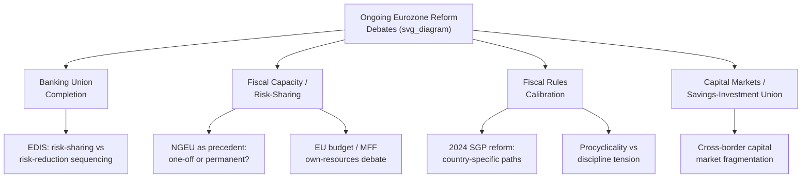

## Ongoing Debates Over Eurozone Reform

### Overview

Despite the substantial institutional build-out following the 2009-2015 sovereign debt crisis (Banking Union, ESM, SGP reforms, NextGenerationEU), the euro area's architecture remains widely regarded as institutionally incomplete relative to the requirements suggested by Optimal Currency Area theory and the fiscal-federalism benchmarks discussed elsewhere in this course. A set of interlocking reform debates continues to shape the euro area's evolution, generally organized around the questions: how much further risk-sharing should be mutualized, how should fiscal rules balance discipline against flexibility, and how should the union build fiscal capacity to respond to future shocks.

### Debate 1: Completing Banking Union — EDIS and the Risk-Sharing/Risk-Reduction Sequencing

The **European Deposit Insurance Scheme (EDIS)**, proposed by the Commission in November 2015, remains the most prominent unresolved Banking Union component.

**Key Points**

- The central and long-running dispute is over **sequencing**: several member states (traditionally led by Germany and other fiscally conservative members) have argued that further **risk reduction** — addressing legacy non-performing loans, reducing banks' concentrated domestic sovereign debt exposures, and harmonizing insolvency law — must precede any mutualization of deposit insurance risk. Other member states and EU institutions counter that credible risk-sharing is itself risk-reducing, since it lowers the likelihood of destabilizing bank runs.
- Reconciling risk sharing with market discipline has been a persistent theme in euro area reform proposals, with various expert groups arguing that risk-reduction preconditions must be addressed convincingly before introducing new risk-sharing mechanisms such as EDIS. [CEPR](https://cepr.org/voxeu/columns/whither-fiscal-capacity-emu)
- Some recent EU legislative activity has linked EDIS-related deposit insurance and resolution reforms to other files, including bank-crisis-management and deposit-insurance framework updates (sometimes referenced as CMDI/SRMR reform), reflecting continued incremental progress on banking-sector risk-reduction measures (e.g., reported declines in non-performing loan ratios at previously stressed banking systems) even as full EDIS mutualization remains unresolved.
- [Unverified] The precise legislative status and timeline for EDIS beyond what is captured in this reference material should be checked against current EU institutional sources, as this is an actively moving legislative file.

### Debate 2: A Permanent Eurozone-Level Fiscal Capacity

Since the **Van Rompuy "Towards a Genuine Economic and Monetary Union" report (December 2012)**, proposals for a dedicated euro area (or EU-level) fiscal capacity have recurred in various forms.

**Key Points**

- Fiscal capacity proposals have been conceived variously as financial support conditional on structural reforms, as a stabilization mechanism against large asymmetric shocks, or as a fiscal backstop to Banking Union functioning as a common resolution fund. [repec](https://ideas.repec.org/p/azz/ppaper/35.html)
- The European Parliament's Committee on Budgets and Committee on Economic and Monetary Affairs have argued that restoring trust in the euro area requires completing Banking Union alongside a strengthened fiscal framework with genuine shock-absorption capacity, arguing this would also help restore financial market confidence in the sustainability of euro area public finances. [europa](https://oeil.europarl.europa.eu/oeil/en/document-summary?id=1476238)
- **NextGenerationEU (NGEU)**, agreed in 2020, is widely discussed as a significant but largely **one-off** precedent for common EU debt issuance rather than a permanent fiscal capacity; a central ongoing debate is whether NGEU-style common borrowing should be institutionalized as a recurring or permanent tool, or whether it should remain an exceptional crisis-response mechanism.
- More recent IMF assessments have continued to argue that a stronger EU-level fiscal capacity could enhance euro area resilience and support deeper integration, suggesting a larger EU budget focused on European Public Goods with performance-based disbursements as one avenue to incentivize national reforms while improving the EU's capacity to manage major shocks jointly. [International Monetary Fund](https://www.imf.org/en/news/articles/2026/06/10/mcs-06112026-euro-area-imf-cs-of-2026-mission-on-common-policies-for-member-countries)
- [Inference] Discussion of fiscal capacity has increasingly been linked to specific EU-level spending priorities beyond countercyclical stabilization alone — including defense/security investment and industrial policy — reflecting how the debate's framing has evolved with the broader geopolitical and economic context since the original 2012 proposals, though the core institutional question (permanent mutualized capacity versus ad hoc arrangements) remains open.

### Debate 3: Fiscal Rules — Balancing Discipline and Flexibility

Even following the **2024 economic governance reform** (introducing country-specific, multi-year fiscal adjustment paths), debate continues over whether the reformed Stability and Growth Pact framework adequately balances:

- **Debt sustainability discipline**, particularly for high-debt members (e.g., Italy, France, Greece) facing demographic and growth headwinds.
- **Growth- and investment-friendly flexibility**, especially given competing pressures for higher defense spending, green/digital transition investment, and the general critique that overly rigid fiscal rules can be procyclical during downturns.
- Ongoing analysis of national fiscal trajectories highlights how fiscal tightening in major member states can coincide with weak growth outcomes, illustrating the continued practical tension between deficit-reduction requirements and growth performance that motivates much of the fiscal rules debate. [EPP](https://euparliamentmonitor.com/news/2026-05-12-propositions-en.html)
- The interaction between rising **defense spending commitments** and fiscal rule compliance has become a increasingly prominent theme in recent debate, with discussion of potential special treatment, off-budget financing vehicles, or flexibility clauses for defense-related expenditure given the broader European security context since 2022.

### Debate 4: Deepening Capital Markets Integration (CMU / Savings and Investments Union)

**Key Points**

- Progress on Capital Markets Union has been persistently slower than originally envisioned since its 2015 launch, with continued fragmentation across national insolvency regimes, taxation frameworks, and securities regulation cited as structural obstacles.
- The initiative has recently been rebranded and reframed in EU policy discourse as the **Savings and Investments Union (SIU)**, emphasizing mobilization of EU household savings into productive investment — reflecting continuity of the underlying integration objective under renewed political branding.
- This debate connects directly to the interregional risk-sharing framework discussed elsewhere in this course (the Asdrubali-Sørensen-Yosha decomposition): deeper, more genuinely cross-border capital markets are viewed as a means of strengthening the **private-sector** risk-sharing channel, potentially substituting in part for the still-incomplete **fiscal** risk-sharing channel.

### Debate 5: Institutional Legitimacy and the Democratic Deficit Question

**Key Points**

- A recurring, more political-economy-oriented debate concerns whether further fiscal and risk-sharing integration can proceed without commensurate deepening of democratic accountability at the EU level — since further mutualization implies EU institutions exercising greater influence over what have traditionally been core national fiscal prerogatives (taxation, spending priorities).
- This "democratic deficit" concern is frequently invoked by member states resistant to further integration, and by academic critics who argue that technocratic EU-level fiscal and banking institutions (Commission, ECB, SRB) currently exercise significant policy influence with comparatively attenuated direct electoral accountability relative to national fiscal authorities.
- [Inference] This legitimacy question is generally treated in the literature as a structural, slow-moving constraint on the pace of further Eurozone institutional reform, distinct from (but interacting with) the more technical risk-sharing and fiscal-rules debates described above.

### Synthesizing the Debates: The "Incomplete Union" Frame Revisited

**Key Points**

- All four substantive reform debates above can be understood as different facets of the same underlying structural issue introduced earlier in this chapter: the euro area combines full monetary centralization with only partial fiscal, banking, and capital-market integration, and each debate essentially concerns how far and how fast to close specific dimensions of that gap.
- The recurring political obstacle across nearly all these debates is the tension between member states favoring further mutualization/risk-sharing (often but not exclusively lower-debt-capacity or crisis-exposed members) and those favoring continued risk-reduction and national responsibility before further mutualization (often but not exclusively larger net-contributor members).
- [Speculation] Given the pattern of the past decade — proposals recurring across multiple institutional reports (Van Rompuy 2012, Five Presidents' Report 2015, ongoing EDIS negotiations, NGEU as a partial precedent) without full resolution — further meaningful institutional deepening appears more likely to occur incrementally and reactively (in response to future crises or shocks) than through a single comprehensive reform agreement, though this pattern is not a certainty and could shift with changed political circumstances.

### Related Topics

- Institutional architecture of the euro area
- Banking union and financial integration
- Fiscal rules and the Stability and Growth Pact
- NextGenerationEU and the Recovery and Resilience Facility
- Labor mobility and fiscal transfers as adjustment mechanisms
- Capital Markets Union / Savings and Investments Union
- Five Presidents' Report and "Genuine EMU" roadmap
- Multiannual Financial Framework (MFF) negotiations
- Democratic accountability in EU economic governance