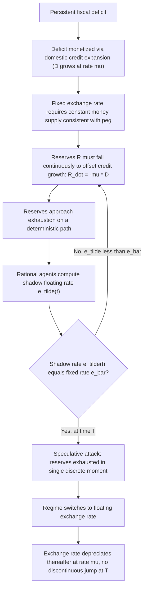

## First Generation Currency Crisis Models

### Overview

First generation currency crisis models, also known as canonical or Krugman-style models, explain how a speculative attack on a fixed exchange rate can occur even when the attack is triggered by fundamentally inconsistent government policies rather than irrational market behavior. The foundational model was developed by Paul Krugman (1979), building on earlier work by Stephen Salant and Dale Henderson (1978) on speculative attacks in commodity markets, particularly gold price stabilization schemes.

The core insight is that a currency crisis is not a random or self-fulfilling event but the predictable, logical outcome of a fundamental policy inconsistency: a government running persistent fiscal deficits financed by domestic credit creation while simultaneously trying to maintain a fixed exchange rate with finite foreign exchange reserves.

### Historical Context and Motivation

These models were originally developed to explain balance-of-payments crises in Latin America and other developing economies during the 1960s–1970s, where governments pegged their currencies while running expansionary fiscal and monetary policies. The framework was later applied to episodes such as:

- The collapse of fixed exchange rates in several Latin American countries (Mexico 1973, Argentina)
- The Mexican Peso Crisis of 1994 (partially, though this event also motivated second-generation extensions)
- Various African and transition-economy pegs

### Core Assumptions

**Key Points**

- The government maintains a fixed exchange rate $\bar{e}$
- The central bank holds a finite stock of foreign exchange reserves $R$
- The government runs a persistent fiscal deficit, financed by domestic credit expansion
- Domestic credit $D$ grows at a constant rate $\mu > 0$ because the deficit must be monetized
- Purchasing power parity (PPP) and uncovered interest parity (UIP) hold continuously
- Money demand is a standard function of income and the (endogenous) interest rate or expected depreciation
- Agents are rational and forward-looking; they know reserves are finite and will eventually be exhausted under the fixed peg

### The Mechanics of Reserve Depletion

The central bank's balance sheet identity is:

$$M = D + R$$

where $M$ is the money supply (or monetary base), $D$ is domestic credit, and $R$ is foreign exchange reserves (measured in domestic currency terms).

Under a fixed exchange rate, if money demand is roughly constant (or growing with income at a steady rate independent of the peg), then continuous domestic credit growth must be offset by continuous reserve losses to keep $M$ consistent with money demand at the fixed rate. Formally, differentiating the identity:

$$\dot{M} = \dot{D} + \dot{R}$$

If money demand growth is zero (or a constant $g$) and $\dot{D} = \mu D > 0$, then reserves must fall:

$$\dot{R} = \dot{M} - \dot{D} \approx -\mu D < 0$$

Reserves decline steadily over time. Since $R \geq 0$ is a hard constraint (a country cannot have negative usable reserves), the peg is fundamentally unsustainable.

### Why the Attack Happens Before Reserves Hit Zero

A naive intuition might suggest the peg collapses only when reserves are literally exhausted at $R = 0$. However, the central result of the Krugman model is that **rational speculators attack and exhaustively deplete remaining reserves in a single discrete moment, well before $R$ would have reached zero under passive depletion.**

**The logic:**

1. If speculators waited until $R = 0$ under the crawling depletion path, the exchange rate would have to jump (depreciate discontinuously) at that moment, since the money supply would suddenly become 100% backed by domestic credit with no reserve backing.
2. A discontinuous, anticipated jump in the exchange rate implies an anticipated capital loss for anyone holding domestic currency right before the jump.
3. Rational, forward-looking agents will not wait to suffer this loss. Instead, they will attack the currency — dumping domestic money for foreign reserves — at the precise moment when the **shadow floating exchange rate** (the exchange rate that would prevail if the currency were floated) equals the currently fixed rate.
4. This attack causes an instantaneous, discrete jump in reserves to zero (a "speculative attack" that exhausts the *remaining* reserves in one shot), followed immediately by a transition to a floating regime.
5. Because the attack occurs precisely when the shadow rate equals the fixed rate, there is **no discontinuous jump in the exchange rate at the moment of collapse** — this is the crucial "no-arbitrage" or "smooth-pasting" condition that pins down the exact timing of the crisis.

### The Shadow Exchange Rate

The shadow exchange rate $\tilde{e}(t)$ is the hypothetical floating rate that would clear the money market if the peg were abandoned at time $t$, using the domestic credit stock prevailing at that time (i.e., $R = 0$, $M = D(t)$). It is derived from the monetary model of exchange rate determination:

$$\tilde{e}(t) = \phi \, D(t) + \lambda \, \dot{\tilde{e}}(t)$$

Here, $\phi$ captures the scaling of money demand and $\lambda$ is the semi-elasticity of money demand with respect to the expected rate of depreciation (a standard Cagan-style money demand specification). Since $D(t)$ grows deterministically at rate $\mu$, this differential equation can be solved for a rational-expectations path of $\tilde{e}(t)$, which itself grows at rate $\mu$ in the post-collapse floating regime:

$$\tilde{e}(t) = \phi\lambda\mu + \phi D(t)$$

The **timing of the attack**, $T$, is determined by the condition:

$$\tilde{e}(T) = \bar{e}$$

At $T$, the shadow rate rises to meet the fixed rate; speculators attack at that exact instant, absorbing all remaining reserves, and the economy transitions smoothly onto the shadow floating path.

### Diagrammatic Representation

### Reserve Path Illustration

<svg xmlns="http://www.w3.org/2000/svg" viewBox="0 0 700 420">
<text x="350" y="25" text-anchor="middle" font-size="16" font-weight="bold" fill="#1a1a1a">Reserve Depletion and Speculative Attack (svg_diagram)</text>

<line x1="80" y1="360" x2="650" y2="360" stroke="#333" stroke-width="2" />
<line x1="80" y1="360" x2="80" y2="50" stroke="#333" stroke-width="2" />

<text x="360" y="395" text-anchor="middle" font-size="13" fill="#333">Time (t)</text>

<text x="30" y="200" text-anchor="middle" font-size="13" fill="#333" transform="rotate(-90 30 200)">Reserves (R)</text>

<path d="M 100 80 Q 300 150 480 360" fill="none" stroke="#999" stroke-width="2" stroke-dasharray="6,4" />
<text x="500" y="350" font-size="11" fill="#999">Passive path (if no attack)</text>

<path d="M 100 80 Q 280 150 360 210" fill="none" stroke="#1f77b4" stroke-width="3" />
<line x1="360" y1="210" x2="360" y2="360" stroke="#d62728" stroke-width="3" />
<text x="368" y="290" font-size="12" fill="#d62728" font-weight="bold">Discrete attack</text>
<text x="368" y="305" font-size="12" fill="#d62728" font-weight="bold">at time T</text>

<circle cx="100" cy="80" r="4" fill="#1a1a1a" />
<text x="95" y="70" font-size="11" fill="#1a1a1a">R(0)</text>
<circle cx="360" cy="210" r="4" fill="#1a1a1a" />
<text x="330" y="200" font-size="11" fill="#1a1a1a">R(T-)</text>
<circle cx="360" cy="360" r="5" fill="#d62728" />
<text x="370" y="360" font-size="12" fill="#d62728" font-weight="bold">R = 0 at T</text>
<line x1="360" y1="360" x2="360" y2="375" stroke="#d62728" stroke-width="1" stroke-dasharray="3,3" />
<text x="345" y="390" font-size="11" fill="#d62728">T</text>

<text x="480" y="385" font-size="11" fill="#999">t (would-be exhaustion)</text>

</svg>

### The Model in Discrete Analytical Form

A common simplified presentation uses a semi-log money demand function:

$$m_t - p_t = -\lambda i_t$$

Under PPP, $p_t = p^*_t + e_t$ (with $p^*_t$ constant or normalized to zero for simplicity), and under UIP with static foreign interest rate, $i_t = i^* + \dot{e}_t^e$. Before the attack, $e_t = \bar{e}$ is fixed, so $\dot{e}_t^e = 0$ and $i_t = i^*$. After the attack, the currency floats and $\dot{e}_t^e = \mu$ (matching the credit growth rate in steady state), so $i_t = i^* + \mu$.

Since money demand falls when the interest rate rises (from $i^*$ to $i^* + \mu$), the **demand for real money balances drops discretely at the moment of the regime switch**. This is the mechanism generating the discrete jump in reserves: agents need to shed money balances at the switch, and they do so by converting domestic currency to foreign reserves — but this shedding happens in the reserve stock exactly at $T$, not in the price level, preserving continuity of $e_t$ at $T$.

### Determinants of Crisis Timing

**Key Points**

- **Faster domestic credit growth** ($\mu$) → reserves deplete faster → attack happens sooner
- **Larger initial reserve stock** ($R_0$) → longer time until attack
- **Higher money demand elasticity** ($\lambda$) → affects the size of the discrete reserve drop at the attack and thus the timing
- **Lower initial money demand level** → smaller buffer before the shadow rate catches up to the peg

### Example

Consider a small open economy with a central bank holding $10 billion in reserves, pegging its currency at $\bar{e} = 1$ per US dollar. The government runs a fiscal deficit financed entirely by central bank credit, causing domestic credit to grow at $\mu = 10\%$ per year. Money demand is stable in real terms (income and foreign interest rate constant).

Under passive analysis, reserves would be projected to hit zero around year 8–10 if drawn down at a pace matching credit growth. However, first-generation model logic shows that speculators will not wait for this passive exhaustion. Instead, agents calculate the shadow floating rate path implied by $D(t)$ growing at 10% annually, and determine the exact date $T$ at which this shadow rate would equal 1.00. On that date, a coordinated attack occurs: investors sell domestic currency, the central bank loses its remaining reserves (say, $2–3 billion) in a matter of days or even hours, and the currency is forced to float, after which $e_t$ continues to depreciate smoothly at approximately 10% per year — with no sudden overshoot at the moment of collapse itself.

### Extensions to the Basic Model

**Stochastic domestic credit growth**: Later refinements (e.g., Flood and Garber, 1984) relax the assumption of deterministic credit growth, incorporating a stochastic process for $D_t$. In this case, the exact timing of the attack becomes uncertain and characterized by a probability distribution rather than a single deterministic date $T$, though the qualitative logic of anticipated, discrete reserve depletion remains.

**Flood-Garber linear model**: Robert Flood and Peter Garber (1984) provided a widely cited linearized version of Krugman's model, making the algebra more tractable while preserving the core "shadow price" collapse mechanism. This version is often the one taught in graduate courses due to its closed-form solution.

**Sterilization**: Some extensions consider whether the central bank sterilizes the reserve losses (offsetting them with further domestic credit expansion), which can accelerate the crisis, versus non-sterilized intervention.

### Key Predictions and Testable Implications

**Key Points**

- Currency crises are **predictable in principle** given observable fundamentals (fiscal deficits, credit growth, reserve levels)
- Crises occur **before** reserves are literally exhausted — there is always a discrete "attack" against a positive reserve stock
- The exchange rate itself does **not** jump discontinuously at the moment of the attack; only the *composition* of the money supply (from reserve-backed to credit-only-backed) changes discretely
- Crises are driven by **fundamentals**, not multiple equilibria or arbitrary shifts in market sentiment (a key contrast with second-generation models)

### Critiques and Limitations

**Key Points**

- The model assumes a single, deterministic (or simply stochastic) driver of crisis — persistent fiscal deficits monetized via credit creation — which does not fit many real-world crises where fiscal fundamentals appeared sound (e.g., many crises in the European Exchange Rate Mechanism in 1992, or parts of the Asian Financial Crisis of 1997–98)
- It does not incorporate strategic policymaker behavior, i.e., the government is a passive, mechanical deficit-financier rather than an optimizing agent weighing the costs and benefits of defending the peg
- It offers no role for self-fulfilling expectations or multiple equilibria, which second-generation models (Obstfeld, 1994, 1996) later introduced to explain crises in economies with seemingly sustainable fundamentals
- Empirical tests have had mixed success; many crisis episodes show signs consistent with the model (reserve depletion, credit growth) but others show crises erupting with little prior fundamental deterioration [Inference: interpretation varies significantly by country/episode studied and specification used]

### Comparison with Second Generation Models

| Dimension | First Generation | Second Generation |
| --- | --- | --- |
| Primary cause | Unsustainable fiscal/monetary fundamentals | Self-fulfilling expectations, multiple equilibria |
| Government role | Passive, mechanical policy rule | Optimizing agent weighing costs/benefits of defending peg |
| Predictability | Crisis is deterministic/probabilistic function of fundamentals | Crisis can occur even with "sound" fundamentals if expectations shift |
| Key mechanism | Reserve depletion via credit growth | Trade-off between peg-defense costs (e.g., unemployment) and credibility |
| Canonical reference | Krugman (1979); Flood & Garber (1984) | Obstfeld (1994, 1996) |

### Conclusion

First generation currency crisis models established that speculative attacks are not irrational panics but the rational, anticipated consequence of a fundamental inconsistency between fixed exchange rate commitments and expansionary domestic credit policy driven by fiscal deficits. The central analytical contribution — the "shadow exchange rate" and the timing condition under which a discrete, anticipated attack exhausts remaining reserves without triggering a jump in the exchange rate itself — remains a foundational building block in international macroeconomics, even though subsequent generations of models have expanded the framework to account for self-fulfilling crises and banking-sector vulnerabilities.

**Related Topics**

- Second generation currency crisis models (Obstfeld, self-fulfilling attacks, multiple equilibria)
- Third generation currency crisis models (balance sheet effects, banking crises, twin crises)
- The Flood-Garber linear stochastic model
- Speculative attacks in commodity markets (Salant-Henderson model)
- Monetary approach to the balance of payments
- Purchasing power parity and uncovered interest parity assumptions in open-economy models
- The 1992 European Exchange Rate Mechanism (ERM) crisis
- The 1994 Mexican Peso Crisis
- The 1997–98 Asian Financial Crisis
- Sterilized versus non-sterilized foreign exchange intervention
- Capital controls as a policy response to speculative attacks
- Contagion models in currency crises