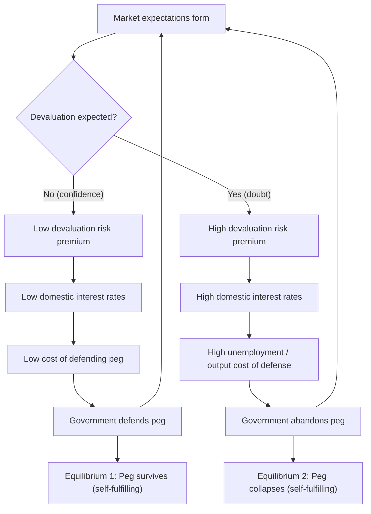

## Second Generation Models and Self-Fulfilling Crises

### Overview

Second generation currency crisis models, pioneered by Maurice Obstfeld (1994, 1996), depart fundamentally from the first generation framework by allowing a currency crisis to occur even when underlying fundamentals are broadly sound. The central innovation is that a government's commitment to a fixed exchange rate is not mechanical but the outcome of an optimizing policy decision, weighing the benefits of maintaining the peg (credibility, low inflation, reduced transaction costs) against the costs of defending it (higher interest rates, unemployment, output losses). Because this trade-off depends on market expectations themselves, multiple equilibria become possible: the same set of fundamentals can be consistent with both a "peg survives" equilibrium and a "peg collapses" equilibrium, with the outcome determined by self-fulfilling beliefs rather than by fundamentals alone.

### Motivation and Historical Context

These models were developed largely in response to crises that first generation models could not adequately explain, most notably the **1992–93 European Exchange Rate Mechanism (ERM) crisis**, in which countries such as the United Kingdom and Italy were forced to abandon their pegs despite not exhibiting the kind of chronic fiscal deficits and runaway domestic credit growth central to the Krugman framework. The ERM crisis suggested that speculative attacks could occur through a shift in market sentiment or coordination, even against currencies with reasonably sound macroeconomic fundamentals, provided the government's incentive to defend the peg was sufficiently weak or costly.

### Core Idea: The Escape Clause and Policy Trade-off

At the heart of second generation models is a government that faces an **"escape clause"** problem. The policymaker's loss function typically balances two competing objectives:

$$L = \alpha (y - y^*)^2 + \beta (\pi)^2 + \gamma \cdot \mathbb{1}[\text{peg abandoned}]$$

where $y$ is output, $y^*$ is a target (often above the natural rate, reflecting a desire to reduce unemployment), $\pi$ is inflation, and the credibility or reputational cost of abandoning the peg is captured by a fixed cost term $\gamma$ (which may also include costs like political embarrassment, contract disruption, or loss of anti-inflation credibility).

The government defends the peg as long as the benefits of doing so exceed its costs. Crucially, one of the largest costs — higher domestic interest rates needed to defend the currency against speculative pressure — is itself a function of **market expectations of devaluation**. This creates the circularity that generates multiple equilibria.

### The Circular Logic of Self-Fulfilling Crises

**Key Points**

- If markets believe the peg is credible and will be defended, they demand no devaluation risk premium, keeping domestic interest rates low. Low interest rates mean the cost of defending the peg (in terms of unemployment or recession) is low, so the government finds it optimal to defend it — validating the belief.
- If markets believe the peg is *not* credible and will be abandoned, they demand a large devaluation risk premium, pushing domestic interest rates up sharply. High interest rates raise unemployment and output costs, making defense of the peg very costly, so the government may rationally choose to abandon it — validating the *pessimistic* belief.
- **Both scenarios can be self-fulfilling equilibria for the same underlying fundamentals.** The economy sits in a region of the parameter space where either outcome is consistent with rational expectations and government optimization.

### Formal Structure: A Simple Government Loss Function Model

A widely used simplified version (following Obstfeld, 1996) specifies government loss under the fixed regime and under devaluation, then compares them.

Under the peg, if the government must raise the interest rate to $i = i^* + \theta$ (where $\theta$ is the devaluation risk premium demanded by the market) to prevent an attack, this raises unemployment via a Phillips-curve-type relationship. The costs of defense, $C(\theta)$, are increasing and convex in $\theta$.

The government abandons the peg if:

$$C(\theta) > \gamma$$

where $\gamma$ is the fixed cost of abandoning (loss of credibility, contract dislocation, etc.). Since $\theta$ itself depends on the market's belief about whether the government will abandon, this creates a **fixed-point problem**: expectations determine $\theta$, $\theta$ determines the government's optimal action, and the government's optimal action must, in equilibrium, validate the original expectations.

**Key Points**

- If $C(\theta)$ is low for all plausible $\theta$ relative to $\gamma$ — "strong fundamentals" — only the "peg survives" equilibrium exists (crisis-proof zone)
- If $C(\theta)$ is high for all plausible $\theta$ relative to $\gamma$ — "weak fundamentals" — only the "peg collapses" equilibrium exists (first-generation-style deterministic collapse)
- In an **intermediate zone of fundamentals**, both equilibria are consistent with rational expectations — this is the region where self-fulfilling crises can occur, and where "sunspots" or shifts in market sentiment (not directly tied to fundamentals) can trigger a jump from one equilibrium to another

### The Three Zones of Fundamentals

<svg xmlns="http://www.w3.org/2000/svg" viewBox="0 0 700 300">
<text x="350" y="25" text-anchor="middle" font-size="16" font-weight="bold" fill="#1a1a1a">Fundamentals and Equilibrium Zones (svg_diagram)</text>
<line x1="60" y1="150" x2="640" y2="150" stroke="#333" stroke-width="2" />
<text x="350" y="180" text-anchor="middle" font-size="12" fill="#333">Strength of Fundamentals (weak → strong)</text>
<rect x="60" y="90" width="160" height="60" fill="#f8d7d7" stroke="#c0392b" stroke-width="1.5" />
<text x="140" y="115" text-anchor="middle" font-size="12" fill="#7a1f1f" font-weight="bold">Zone 1</text>
<text x="140" y="132" text-anchor="middle" font-size="11" fill="#7a1f1f">Collapse Certain</text>
<rect x="270" y="90" width="160" height="60" fill="#fdf0c7" stroke="#b8860b" stroke-width="1.5" />
<text x="350" y="115" text-anchor="middle" font-size="12" fill="#7a5c00" font-weight="bold">Zone 2</text>
<text x="350" y="132" text-anchor="middle" font-size="11" fill="#7a5c00">Multiple Equilibria</text>
<text x="350" y="146" text-anchor="middle" font-size="10" fill="#7a5c00">(Self-Fulfilling Zone)</text>
<rect x="480" y="90" width="160" height="60" fill="#d4f0d4" stroke="#2e7d32" stroke-width="1.5" />
<text x="560" y="115" text-anchor="middle" font-size="12" fill="#1e5620" font-weight="bold">Zone 3</text>
<text x="560" y="132" text-anchor="middle" font-size="11" fill="#1e5620">Peg Survives</text>
<line x1="220" y1="150" x2="220" y2="230" stroke="#666" stroke-width="1" stroke-dasharray="4,3" />
<line x1="430" y1="150" x2="430" y2="230" stroke="#666" stroke-width="1" stroke-dasharray="4,3" />

<text x="140" y="250" text-anchor="middle" font-size="10" fill="#555">Deterministic</text>

<text x="140" y="262" text-anchor="middle" font-size="10" fill="#555">(1st Gen logic)</text>

<text x="350" y="250" text-anchor="middle" font-size="10" fill="#555">Sentiment / sunspots</text>

<text x="350" y="262" text-anchor="middle" font-size="10" fill="#555">determine outcome</text>

<text x="560" y="250" text-anchor="middle" font-size="10" fill="#555">Deterministic</text>

<text x="560" y="262" text-anchor="middle" font-size="10" fill="#555">(no attack possible)</text>

</svg>

### Role of "Sunspots" and Coordination

Because Zone 2 admits multiple rational-expectations equilibria, something outside the formal model must select which equilibrium is realized. The literature refers to these triggering factors as **"sunspots"** — extrinsic, payoff-irrelevant variables (e.g., a crisis in a neighboring country, a political scandal, a rating agency downgrade, or even seemingly unrelated news) that coordinate market beliefs and thereby determine which equilibrium is played, even though such variables have no direct effect on economic fundamentals.

**Key Points**

- Sunspot-driven shifts help explain **contagion**: a crisis in one country can shift beliefs about a second country's peg sustainability even without a change in that second country's own fundamentals, simply by shifting the second country into "attack expected" beliefs within its own Zone 2
- This also explains **herding behavior** among investors, as no individual investor wants to be the last one holding a currency about to be devalued if others are attacking

### The Escape Clause Model in More Detail

Obstfeld's escape-clause framework typically models the policymaker's decision each period as choosing between:

1. **Maintain the peg**, incurring the output/employment cost of high interest rates needed to fend off the attack
2. **Devalue/float**, incurring a fixed reputational cost $\gamma$ but avoiding the interest rate defense cost

The government's reaction function can be written as a comparison:

$$\text{Devalue if: } \quad \Omega(\theta, \text{fundamentals}) > \gamma$$

where $\Omega$ is increasing in the market-demanded risk premium $\theta$. Since $\theta$ is set by market expectations of the probability of devaluation, and this probability in turn depends on whether the government is expected to find $\Omega > \gamma$, the model is a **rational expectations fixed point**, and typically solved via a "confidence" or "temptation" function that maps expected devaluation probability into realized devaluation probability, allowing for multiple crossing points with the 45-degree line.

### Example

Consider a country with moderate fiscal deficits and reasonable reserve levels — neither obviously unsustainable (as in first generation crises) nor obviously robust. Suppose the government has publicly stated a commitment to a fixed exchange rate as an anchor for disinflation, implying a high reputational cost $\gamma$ of abandoning the peg.

**Scenario A (confidence equilibrium):** Markets believe the peg will hold. The risk premium $\theta$ is near zero, so domestic interest rates track foreign rates closely. The government faces no significant unemployment cost from maintaining the peg and does so easily. The peg survives — expectations were self-fulfilling.

**Scenario B (crisis equilibrium):** A currency crisis erupts in a neighboring, economically similar country (a "sunspot" event). Markets begin to suspect the home country might also be at risk, even though its own fundamentals have not changed. The risk premium $\theta$ rises sharply as investors demand compensation for perceived devaluation risk. Domestic interest rates spike, causing a recession. The output/employment cost of maintaining the peg now exceeds the reputational cost $\gamma$ of devaluing. The government rationally abandons the peg. The crisis was "caused" not by a change in fundamentals but by a shift in market expectations triggered by an external event.

### Distinguishing Features versus First Generation Models

| Dimension | First Generation | Second Generation |
| --- | --- | --- |
| Cause of crisis | Fundamentally inconsistent policy (excess credit growth) | Self-fulfilling expectations given a policy trade-off |
| Fundamentals required | Necessarily deteriorating | Can be broadly sound; crisis possible in "gray zone" |
| Number of equilibria | Unique | Potentially multiple in intermediate fundamentals zone |
| Government behavior | Passive rule-follower | Optimizing agent with escape clause |
| Timing of crisis | Deterministic (or simply stochastic via credit process) | Indeterminate without additional coordinating device (sunspot) |
| Role of contagion | Not naturally explained | Naturally explained via shared beliefs/sunspots |
| Canonical reference | Krugman (1979) | Obstfeld (1994, 1996) |

### Policy Implications

**Key Points**

- Since crises can be self-fulfilling, purely improving fundamentals may not be sufficient to guarantee peg survival if a country remains in the "multiple equilibria" zone — credibility-enhancing mechanisms (currency boards, capital controls, strong signaling) may be needed to narrow or eliminate this zone
- The model implies that **policy credibility and communication** matter independently of underlying fundamentals, since beliefs themselves can trigger real economic costs
- It provides a rationale for **preemptive devaluation or regime flexibility** in the "gray zone," since attempting to defend an uncertain peg can generate large, unnecessary output costs even if the defense ultimately succeeds
- It also underlies arguments for **IMF-style lending of last resort** or credible external backstops, since such mechanisms can shrink the multiple-equilibria zone by reducing the perceived cost/probability of a successful attack

### Limitations and Critiques

**Key Points**

- The theory does not pin down *which* equilibrium will be selected or *when* — sunspots are exogenous and unmodeled, which limits the model's predictive/forecasting power compared to first generation frameworks [Inference: this is widely regarded as a strength for explaining contagion but a weakness for prediction]
- Empirical identification of "self-fulfilling" crises versus fundamentals-driven crises is difficult, since weak fundamentals and shifting expectations often move together in real episodes
- Some economists argue that apparent multiplicity may partly reflect **incomplete specification of fundamentals** (i.e., what looks like a sunspot might actually be information about fundamentals not captured in the simple model), a critique that motivated aspects of third generation models incorporating balance sheet and financial sector vulnerabilities

### Conclusion

Second generation currency crisis models shift the analytical focus from mechanical fiscal-monetary inconsistency to the strategic, expectations-dependent trade-off facing a government defending a fixed exchange rate. By showing that the same fundamentals can support both a "peg survives" and a "peg collapses" equilibrium, these models explain how speculative attacks can occur even against currencies without obviously unsustainable policies, and provide a natural framework for understanding contagion and herding through the coordinating role of market sentiment. This framework, closely associated with the 1992 ERM crisis, remains central to understanding crises where deteriorating fundamentals alone cannot account for the timing or occurrence of a collapse.

**Related Topics**

- First generation currency crisis models (Krugman, Flood-Garber)
- Third generation currency crisis models (balance sheet effects, twin crises, Asian Financial Crisis)
- The 1992 European Exchange Rate Mechanism (ERM) crisis
- Contagion and herding in international financial markets
- Multiple equilibria and sunspot equilibria in macroeconomics
- Credibility and time-inconsistency in monetary policy (Kydland-Prescott, Barro-Gordon)
- Currency boards and hard pegs as commitment devices
- The role of the IMF as lender of last resort
- Global games approach to currency crises (Morris and Shin) as a refinement addressing equilibrium selection
- Optimal exchange rate regime choice (fixed vs. floating vs. intermediate)