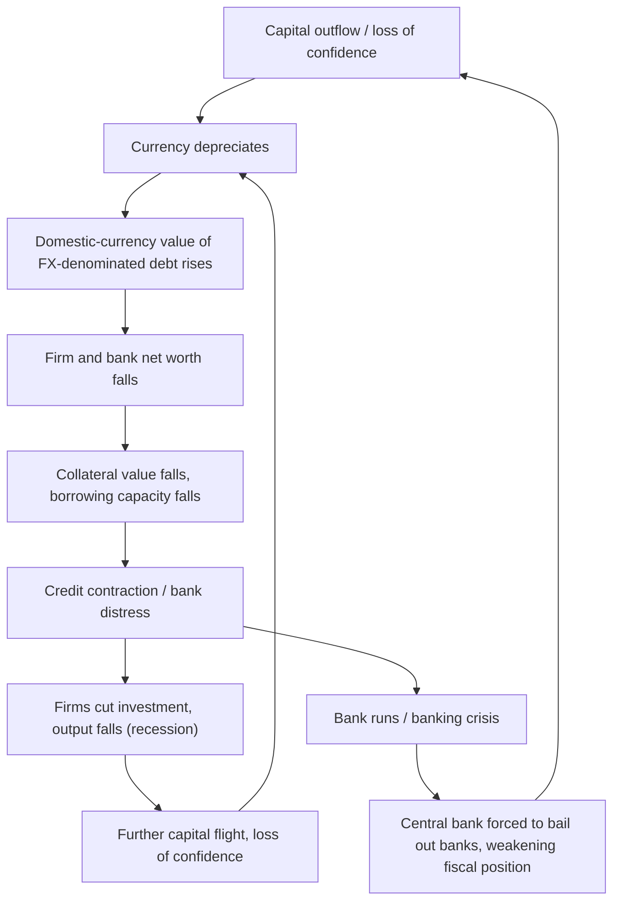

## Third Generation Models and Balance Sheet Effects

### Overview

Third generation currency crisis models emerged in the aftermath of the 1997–98 Asian Financial Crisis, which exhibited features that neither first generation (fiscal-monetary inconsistency) nor second generation (self-fulfilling speculative attacks on fiscal/monetary policy) frameworks could fully explain. The crisis-hit Asian economies — Thailand, Indonesia, South Korea, Malaysia, the Philippines — generally had sound fiscal positions, low inflation, and credible monetary policy, yet still experienced severe currency and banking crises simultaneously. Third generation models shift the analytical focus to the **financial sector, corporate and bank balance sheets, currency mismatches, and moral hazard**, and to the interaction between currency crises and banking crises — often termed **"twin crises."**

### Motivation: What First and Second Generation Models Missed

**Key Points**

- Fiscal positions in the crisis countries were largely in surplus or near balance, ruling out classic first-generation deficit-monetization dynamics
- Inflation was low, and central banks were not aggressively monetizing debt
- The crises were accompanied by simultaneous, severe **banking sector collapses**, sharp **capital flow reversals** ("sudden stops"), and significant **corporate sector distress** — phenomena absent from the earlier frameworks
- Currency depreciation itself appeared to *worsen* rather than correct the crisis, because of currency mismatches in balance sheets, a mechanism entirely absent from models built on PPP/UIP and government loss functions alone

### Core Mechanism: Currency and Maturity Mismatches

The central innovation of third generation models is attention to the **structure of balance sheets** — particularly the currency denomination and maturity structure of liabilities relative to assets — for banks, corporations, and sometimes the sovereign itself.

**Currency mismatch**: Firms and banks in emerging markets frequently borrow in foreign currency (typically US dollars) because domestic currency borrowing is expensive or unavailable at long maturities ("original sin"), while their revenues and assets are denominated in local currency.

**Maturity mismatch**: Banks and corporates often fund long-term domestic-currency assets (e.g., property, long-term loans) with short-term foreign-currency liabilities (e.g., short-term dollar interbank borrowing), a classic case of borrowing short and lending long, compounded by currency risk.

When the domestic currency depreciates:

$$\text{Value of foreign-currency debt (in domestic terms)} = D^{FC} \times e_t$$

A rise in $e_t$ (depreciation) mechanically increases the domestic-currency value of foreign-currency-denominated debt, even though the firm's revenue stream (in domestic currency) has not risen proportionally. This directly damages firm and bank net worth:

$$NW_t = A_t - D^{FC}_t \cdot e_t - D^{LC}_t$$

A depreciation reduces $NW_t$ for any firm with $D^{FC} > 0$, unless assets are also dollar-denominated or hedged.

### The Balance Sheet / Financial Accelerator Feedback Loop

This is the defining mechanism of third generation models: **depreciation, rather than restoring competitiveness and correcting the crisis (as in traditional models), can deepen it** through a vicious cycle.

This loop is sometimes referred to as a **"financial accelerator"** in the international context (drawing on Bernanke-Gertler-Gilchrist style closed-economy financial accelerator models, adapted to open-economy currency mismatch settings), or described through the **balance sheet channel of crisis propagation**.

### Twin Crises: Currency and Banking Crises Interlinked

Third generation models formalize why currency crises and banking crises tend to occur together and reinforce one another — a pattern documented empirically by Kaminsky and Reinhart (1999) in their influential "twin crises" study.

**Key Points**

- A banking crisis can trigger a currency crisis: if depositors or foreign creditors lose confidence in banks (e.g., due to bad loans, real estate bubbles bursting, or poor supervision), capital flight ensues, depleting reserves and forcing devaluation
- A currency crisis can trigger a banking crisis: depreciation increases the domestic-currency burden of banks' foreign-currency liabilities and/or their borrowers' foreign-currency debts, causing loan defaults and bank insolvency
- The two crises tend to be **mutually reinforcing**, producing a more severe and prolonged output collapse than either crisis alone would generate [Inference: the empirical magnitude of this reinforcement varies substantially by country institutional context]

### Moral Hazard and the Role of Implicit Guarantees

A second strand of third generation modeling, associated with Paul Krugman's own later work (1998) and with McKinnon and Pill (1996, "over-borrowing syndrome"), emphasizes **moral hazard** arising from implicit government guarantees to the banking/financial sector.

**Key Points**

- If banks and their foreign creditors believe the government (or IMF) will bail out failing banks, banks have an incentive to take on excessive risk, including large unhedged foreign-currency borrowing to fund risky domestic lending (e.g., real estate, speculative equity investment)
- This generates asset price bubbles financed by short-term foreign capital inflows
- When the bubble bursts or confidence falters, the same currency mismatch and maturity mismatch mechanisms above trigger a sharp reversal — a **"sudden stop"** of capital inflows (a term associated with Guillermo Calvo's work)
- The eventual government bailout of the banking system can itself worsen fiscal fundamentals, in some cases retroactively creating the very kind of unsustainable fiscal dynamics highlighted by first generation models — illustrating how these generations of models can interact rather than being mutually exclusive

### Sudden Stops and Capital Flow Reversals

The **sudden stop** phenomenon, formalized by Calvo and collaborators, describes an abrupt halt or reversal in capital inflows to an economy previously receiving substantial foreign financing. This is a key empirical feature of third generation crises:

$$\text{Current Account Balance} = S - I$$

A sudden stop in capital inflows forces an abrupt current account adjustment (since financing for the deficit disappears), typically requiring a sharp compression of domestic absorption (investment and consumption), a real depreciation, and often a deep recession — a **"sudden stop"-induced output collapse** layered on top of the balance sheet effects described above.

### Illustration: The Vicious Circle in Balance Sheet Terms

<svg xmlns="http://www.w3.org/2000/svg" viewBox="0 0 700 380">
<text x="350" y="25" text-anchor="middle" font-size="16" font-weight="bold" fill="#1a1a1a">Balance Sheet Contraction Spiral (svg_diagram)</text>
<circle cx="350" cy="210" r="150" fill="none" stroke="#ccc" stroke-width="1" stroke-dasharray="3,3" />

<rect x="290" y="50" width="120" height="50" rx="6" fill="#fbe3e3" stroke="#c0392b" />
<text x="350" y="72" text-anchor="middle" font-size="11" fill="#7a1f1f" font-weight="bold">Depreciation</text>
<text x="350" y="88" text-anchor="middle" font-size="10" fill="#7a1f1f">(e_t rises)</text>
<rect x="480" y="140" width="140" height="50" rx="6" fill="#fdf0c7" stroke="#b8860b" />
<text x="550" y="162" text-anchor="middle" font-size="11" fill="#7a5c00" font-weight="bold">FX Debt Burden Rises</text>
<text x="550" y="178" text-anchor="middle" font-size="10" fill="#7a5c00">(D_FC * e_t up)</text>
<rect x="480" y="270" width="140" height="50" rx="6" fill="#fbe3e3" stroke="#c0392b" />
<text x="550" y="292" text-anchor="middle" font-size="11" fill="#7a1f1f" font-weight="bold">Net Worth Falls</text>
<text x="550" y="308" text-anchor="middle" font-size="10" fill="#7a1f1f">Collateral value drops</text>
<rect x="290" y="360" width="120" height="10" fill="none" />
<rect x="220" y="330" width="150" height="50" rx="6" fill="#fdf0c7" stroke="#b8860b" />
<text x="295" y="352" text-anchor="middle" font-size="11" fill="#7a5c00" font-weight="bold">Credit Contracts</text>
<text x="295" y="368" text-anchor="middle" font-size="10" fill="#7a5c00">Bank distress</text>
<rect x="60" y="270" width="140" height="50" rx="6" fill="#fbe3e3" stroke="#c0392b" />
<text x="130" y="292" text-anchor="middle" font-size="11" fill="#7a1f1f" font-weight="bold">Output Falls</text>
<text x="130" y="308" text-anchor="middle" font-size="10" fill="#7a1f1f">Recession deepens</text>
<rect x="60" y="140" width="140" height="50" rx="6" fill="#fdf0c7" stroke="#b8860b" />
<text x="130" y="162" text-anchor="middle" font-size="11" fill="#7a5c00" font-weight="bold">Capital Flight</text>
<text x="130" y="178" text-anchor="middle" font-size="10" fill="#7a5c00">Confidence loss</text>

<path d="M 410 75 Q 480 100 545 140" fill="none" stroke="#555" stroke-width="1.5" marker-end="url(#arrow3g)" />
<path d="M 550 190 L 550 270" fill="none" stroke="#555" stroke-width="1.5" marker-end="url(#arrow3g)" />
<path d="M 490 305 Q 420 340 370 350" fill="none" stroke="#555" stroke-width="1.5" marker-end="url(#arrow3g)" />
<path d="M 220 355 Q 160 340 140 320" fill="none" stroke="#555" stroke-width="1.5" marker-end="url(#arrow3g)" />
<path d="M 130 270 L 130 190" fill="none" stroke="#555" stroke-width="1.5" marker-end="url(#arrow3g)" />
<path d="M 155 145 Q 220 90 290 72" fill="none" stroke="#555" stroke-width="1.5" marker-end="url(#arrow3g)" />
</svg>

### Formal Sketch: A Simple Balance Sheet Model

A stylized representation (in the spirit of Krugman, 1999, and Aghion-Bacchetta-Banerjee, 2000, 2001) links firm investment to net worth via a credit constraint:

$$I_t = f(NW_t), \quad f' > 0$$

with net worth evolving as:

$$NW_t = \pi_t + (1+r^*)\left[A_{t-1} - e_t D^{FC}_{t-1}\right]$$

If a depreciation shock raises $e_t$, and firms hold net foreign-currency liabilities ($D^{FC} > A^{FC}$), then $NW_t$ falls, reducing $I_t$ via the credit constraint, reducing output $y_t$, which can feed back into further depreciation pressure (via reduced export competitiveness offset by capital flight, or via the fiscal costs of bank bailouts) — closing the loop illustrated above. This structure can generate **multiple equilibria** analogous to second generation models, but driven by balance sheet/net worth dynamics rather than a government loss function, and can also generate genuine **real economy multiplier effects** where depreciation is contractionary rather than expansionary — contrary to standard Mundell-Fleming intuition.

### Contrast: Contractionary versus Expansionary Devaluation

**Key Points**

- In traditional open-economy models (e.g., Mundell-Fleming), devaluation is expansionary: it improves competitiveness, boosts net exports, and raises output
- In third generation balance sheet models, devaluation can be **contractionary** if the negative net worth/credit-crunch effect from currency mismatch outweighs the positive competitiveness effect — a result particularly relevant for economies with substantial unhedged foreign-currency corporate or bank debt
- Empirical work on the Asian crisis broadly found evidence of contractionary depreciation effects operating through this balance sheet channel, alongside more traditional competitiveness-driven effects [Inference: relative magnitude of each channel is debated and varies by country and time period]

### Sovereign Balance Sheet Mismatches

Third generation logic extends to the **sovereign** balance sheet as well, not just private firms and banks:

- Governments that issue foreign-currency-denominated debt (common historically in emerging markets due to "original sin" — the inability to borrow internationally in one's own currency) face a similar mismatch: depreciation raises the domestic-currency (and often GDP-relative) burden of sovereign debt service
- This can trigger sovereign debt sustainability concerns even absent any change in the primary fiscal balance, linking currency crises to sovereign debt crises
- Governments that had implicitly guaranteed private-sector foreign debts (explicitly or through anticipated bailouts) effectively convert private balance sheet mismatches into sovereign contingent liabilities, as occurred in several Asian crisis countries and, more prominently, in the 2008–2012 banking-to-sovereign crisis transmission in parts of the Eurozone

### Example

Consider a Southeast Asian economy in the mid-1990s. Domestic banks borrow heavily in US dollars at short maturities from international lenders (attracted by relatively high domestic interest rates and an implicit belief that the currency peg will hold, or that the government will bail out banks if trouble arises). Banks then on-lend these dollars, converted to local currency, to domestic real estate developers and corporations at longer maturities.

Confidence shifts — perhaps triggered by a regional neighbor's crisis (a sunspot in the second-generation sense) or a reassessment of asset quality. Foreign lenders refuse to roll over short-term dollar credit lines ("sudden stop"). To meet dollar obligations, banks and the central bank must sell local currency for dollars, depreciating the currency.

The depreciation sharply raises the local-currency value of banks' and firms' dollar debts. Firms whose revenues are in local currency (e.g., domestic property developers) see their effective debt burden spike even though their income hasn't changed, causing widespread default. Banks holding these now-defaulting loans become insolvent. The banking crisis compounds the currency crisis: depositors and remaining creditors flee further, deepening the depreciation, in the self-reinforcing loop described above. The result is a deep recession with simultaneous currency collapse, banking system failure, and — eventually, via bailout costs — fiscal deterioration, even though the crisis began with sound fiscal fundamentals.

### Comparison Across the Three Generations

| Dimension | First Generation | Second Generation | Third Generation |
| --- | --- | --- | --- |
| Root cause | Unsustainable fiscal/monetary policy | Self-fulfilling expectations on government trade-off | Balance sheet currency/maturity mismatches, moral hazard |
| Key sector | Government/central bank | Government (policy trade-off) | Banks, corporates, and financial intermediaries |
| Role of banking sector | Largely absent | Largely absent | Central; twin crises |
| Depreciation effect | Corrective (restores equilibrium) | Not the central focus | Can be contractionary (balance sheet channel) |
| Capital flows | Gradual reserve depletion | Attack on reserves via interest rate defense | Sudden stops, abrupt reversals |
| Canonical references | Krugman (1979) | Obstfeld (1994, 1996) | Krugman (1999); McKinnon-Pill (1996); Kaminsky-Reinhart (1999); Aghion-Bacchetta-Banerjee (2000, 2001) |
| Motivating episode | Latin American crises | 1992 ERM crisis | 1997–98 Asian Financial Crisis |

### Policy Implications

**Key Points**

- **Reducing currency mismatch**: encouraging local-currency borrowing, developing domestic bond markets, hedging requirements, and limits on unhedged foreign-currency exposure for banks and corporates
- **Prudential regulation of banks**: limits on foreign-currency lending/borrowing, liquidity and maturity matching requirements, stronger capital adequacy standards
- **Reducing moral hazard**: clearer limits on implicit bailout guarantees, stronger bank supervision, and credible resolution frameworks to avoid excessive risk-taking funded by cheap foreign capital
- **Reserve adequacy and capital flow management**: holding reserves sufficient to cover short-term foreign-currency liabilities (related to the "Guidotti-Greenspan rule" of reserves covering short-term external debt), and potentially using capital flow management tools to limit destabilizing short-term inflows
- **International financial architecture**: proposals for improved international lender-of-last-resort facilities to help manage sudden stops without requiring full-blown crisis-level adjustment

### Limitations and Ongoing Debates

**Key Points**

- Balance sheet models can be complex and less analytically tractable than first or second generation frameworks, often requiring numerical or partial-equilibrium approaches rather than clean closed-form solutions
- Empirically isolating the balance sheet channel from other crisis transmission mechanisms (competitiveness effects, fiscal effects, pure contagion) remains challenging
- Some researchers argue third generation models are less a wholly distinct theory than **an important complementary mechanism** layered on top of first and second generation logic, since fiscal fundamentals, government incentives, and financial sector fragility often interact in real crisis episodes rather than operating in isolation [Inference: the degree of theoretical "cleanliness" versus complementarity across generations remains a matter of academic framing rather than settled consensus]

### Conclusion

Third generation currency crisis models incorporate the financial sector explicitly, highlighting how currency and maturity mismatches on bank and corporate balance sheets can transform a currency depreciation from a corrective mechanism into a destabilizing shock that triggers credit contraction, banking crises, and deep recessions. By explaining the close empirical linkage between currency crises and banking crises — the "twin crises" phenomenon — and by incorporating moral hazard and sudden stops in capital flows, this generation of models provided the analytical tools needed to understand the 1997–98 Asian Financial Crisis and continues to inform financial stability and macroprudential policy frameworks in open emerging market economies today.

**Related Topics**

- First generation currency crisis models (Krugman, Flood-Garber)
- Second generation models and self-fulfilling crises (Obstfeld)
- Twin crises: banking and currency crisis interlinkages (Kaminsky-Reinhart)
- Sudden stops in capital flows (Calvo)
- The 1997–98 Asian Financial Crisis
- "Original sin" and foreign-currency sovereign debt
- Macroprudential regulation and bank capital/liquidity requirements
- Financial accelerator models (Bernanke-Gertler-Gilchrist)
- Global games and equilibrium selection in currency crisis models (Morris-Shin)
- Sovereign debt crises and debt sustainability analysis
- Capital flow management and capital controls
- The Guidotti-Greenspan rule on reserve adequacy