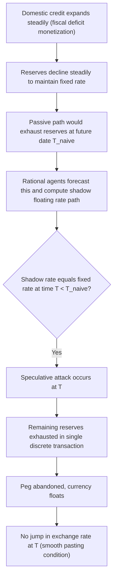

## Speculative Attacks and the Depletion of Reserves

### Overview

Speculative attacks are episodes in which market participants sell a currency en masse in anticipation of, or in an attempt to force, an exchange rate devaluation, revaluation, or regime collapse. The concept of a speculative attack, and the associated mechanics of foreign exchange reserve depletion, forms the analytical core connecting first, second, and third generation currency crisis models. This topic focuses specifically on the mechanics of how a speculative attack unfolds, why it depletes reserves discretely rather than gradually, and how central banks attempt to defend against such attacks.

### The Central Bank's Defense of a Peg

Under a fixed or managed exchange rate regime, the central bank commits to buying or selling domestic currency against foreign currency at (or near) a fixed rate $\bar{e}$. This commitment requires holding a stock of foreign exchange reserves $R$ that can be sold to absorb excess domestic currency supply when the market wants to sell the domestic currency.

The central bank's simplified balance sheet identity is:

$$M = D + R$$

where $M$ is the monetary base, $D$ is domestic credit (assets held against domestic liabilities, e.g., government bonds, loans to banks), and $R$ is net foreign assets/reserves. Since $R \geq 0$ is a hard constraint (reserves cannot go negative without alternative financing, such as swap lines or IMF support), any sustained outflow eventually threatens the fixed rate itself.

### Origins of the Salant-Henderson Framework

The theoretical roots of speculative attack modeling predate currency crisis models specifically. Stephen Salant and Dale Henderson (1978) analyzed **speculative attacks on commodity price stabilization schemes**, such as gold price support programs, showing that a government agency committed to selling a commodity at a fixed price from a finite stockpile will face a sudden, discrete depletion of that stockpile once the shadow (unregulated) price would otherwise exceed the fixed price. Paul Krugman (1979) adapted this logic directly to foreign exchange reserves defending a fixed exchange rate, producing the canonical first-generation currency crisis model.

### Why Attacks Are Discrete, Not Gradual

**Key Points**

- If domestic credit expands steadily (e.g., to finance a fiscal deficit), and money demand is roughly stable, reserves must decline steadily to keep the money supply consistent with the fixed exchange rate
- A **passive, gradual depletion path** would imply reserves eventually hit exactly zero at some future date, at which point the exchange rate would have to jump discontinuously (depreciate suddenly) because the currency would then be unbacked by reserves
- Rational, forward-looking investors will not wait for this anticipated discrete loss. Instead, they attack the currency at the moment the **shadow floating exchange rate** — the rate that would prevail if the peg were abandoned given the current stock of domestic credit — rises to equal the fixed rate
- This attack causes an **instantaneous, discrete drop in reserves to zero** at that moment (a single-period exhaustion of whatever reserves remained), immediately followed by a transition to a floating exchange rate regime
- Because the attack is timed so that the shadow rate exactly equals the fixed rate at the moment of collapse, **there is no discontinuous jump in the exchange rate itself** — only in the composition of the money supply (from reserve-backed to credit-only backed)

### Types of Speculative Attacks

**Attacks against fundamentally unsustainable pegs (first-generation logic)**: The attack is essentially inevitable and its timing is calculable (or probabilistically characterized under stochastic domestic credit growth), given the pace of reserve-depleting policies.

**Attacks driven by shifting expectations against fundamentally sustainable pegs (second-generation logic)**: The attack may or may not occur depending on market beliefs, since the peg is defensible under "confidence" but not under "doubt" — multiple equilibria can exist, and the same reserve stock and fundamentals can be consistent with either a successful defense or a successful attack.

**Attacks amplified by financial sector fragility (third-generation logic)**: Attacks interact with banking sector currency mismatches, where the anticipation of bank distress or bailout costs can itself trigger reserve outflows, and where the depreciation following an attack can worsen the very balance sheet conditions that triggered it.

### The Central Bank's Toolkit for Defending Reserves

**Key Points**

- **Direct intervention**: selling foreign currency reserves in the spot market to absorb excess domestic currency supply and support the exchange rate
- **Interest rate defense**: raising domestic interest rates sharply to make holding domestic currency assets more attractive, discouraging capital outflows — though this is costly in terms of output/employment (a mechanism central to second generation models)
- **Capital controls**: restricting the ability of residents or non-residents to convert domestic currency or move capital abroad, directly limiting the size of a potential attack
- **Sterilized intervention**: selling reserves to defend the currency while simultaneously offsetting the resulting contraction in the domestic money supply (e.g., via open market purchases of domestic bonds), attempting to defend the exchange rate without tightening domestic monetary conditions — though this is often viewed as only a temporary palliative, since it does not address the underlying incentive for private capital to exit
- **External backstops**: arranging swap lines with other central banks or securing IMF or other multilateral support to supplement reserves temporarily

### Reserve Adequacy Metrics

To assess vulnerability to speculative attack, practitioners and the IMF commonly reference several reserve adequacy benchmarks:

- **Months of import cover**: reserves relative to average monthly imports (a traditional but increasingly viewed as insufficient standalone metric)
- **Guidotti-Greenspan rule**: reserves should be sufficient to cover at least 100% of short-term external debt (debt maturing within one year), reflecting the third-generation-informed concern about sudden stops and rollover risk
- **Reserves-to-M2 ratio**: reserves relative to broad money supply, capturing the potential scale of a domestic-currency flight into foreign currency
- **IMF Assessing Reserve Adequacy (ARA) metric**: a composite measure weighting export income, broad money, short-term debt, and other portfolio liabilities to estimate an adequate reserve buffer

### Formal Timing Condition (Krugman-Flood-Garber Framework)

Using a Cagan-style money demand specification, the shadow exchange rate $\tilde{e}(t)$ solves:

$$\tilde{e}(t) = \phi D(t) + \lambda \dot{\tilde{e}}(t)$$

With domestic credit growing deterministically at rate $\mu$, i.e., $D(t) = D_0 + \mu t$, the rational expectations solution for the shadow rate is:

$$\tilde{e}(t) = \phi \mu \lambda + \phi D(t)$$

The attack occurs at time $T$ satisfying:

$$\tilde{e}(T) = \bar{e}$$

Given the reserve depletion path $R(t) = R_0 - \mu D_0' t$ under passive defense (where $D_0'$ reflects the credit growth impact net of any offsetting money demand growth), the attack at $T$ causes reserves to jump from their remaining level $R(T^-) > 0$ to exactly zero — the **discrete "attack size"** being $R(T^-)$ itself.

### Example: Anatomy of an Attack

Consider a central bank with $15 billion in reserves defending a peg. Domestic credit is expanding at 8% annually due to deficit monetization. Under passive analysis, reserves would be projected to reach zero in roughly 9 years. However:

1. Rational investors compute the shadow floating exchange rate path implied by 8% annual credit growth
2. They determine this shadow rate would equal the current fixed rate roughly 6 years into the future (before naive exhaustion), at which point remaining reserves are estimated at approximately $4 billion
3. As that date approaches, forward-looking investors begin shifting portfolios out of domestic currency and into foreign currency assets, initially gradually, then in a concentrated attack as the critical date nears
4. At the critical moment, the central bank's remaining $4 billion in reserves is depleted essentially in a single trading session (or over a very short period) as speculators exchange domestic currency for the remaining foreign currency reserves
5. The central bank, unable to continue defending the peg, allows the currency to float; the exchange rate begins depreciating smoothly thereafter, without a discontinuous jump at the moment of the attack itself, consistent with the no-arbitrage timing condition

### Self-Fulfilling Attacks and Reserve Thresholds

In second-generation and global-games-informed frameworks, the relationship between reserves and attack likelihood is more nuanced than in the pure first-generation case:

**Key Points**

- A larger reserve stock generally raises the cost of a successful attack for speculators (since more reserves must be absorbed), reducing the probability of a self-fulfilling attack in the intermediate "multiple equilibria" zone
- However, reserves alone do not eliminate vulnerability if government commitment to defend the peg is itself expected to weaken (e.g., due to anticipated unemployment costs of an interest rate defense) — high reserves do not fully immunize against attack if the market doubts the government's willingness, as opposed to ability, to defend the currency
- **Global games models** (Morris and Shin, 1998) refine the multiple-equilibria problem by introducing small amounts of private information/noise about fundamentals among speculators, which can yield a **unique equilibrium threshold** level of reserves (or fundamentals) below which attack is certain and above which it is not — resolving some of the indeterminacy of pure second-generation multiple equilibria

### Illustration: Attack Dynamics and Reserve Path

<svg xmlns="http://www.w3.org/2000/svg" viewBox="0 0 700 400">
<text x="350" y="25" text-anchor="middle" font-size="16" font-weight="bold" fill="#1a1a1a">Speculative Attack and Reserve Depletion (svg_diagram)</text>
<line x1="80" y1="340" x2="650" y2="340" stroke="#333" stroke-width="2" />
<line x1="80" y1="340" x2="80" y2="60" stroke="#333" stroke-width="2" />
<text x="365" y="375" text-anchor="middle" font-size="12" fill="#333">Time</text>
<text x="30" y="200" text-anchor="middle" font-size="12" fill="#333" transform="rotate(-90 30 200)">Reserves (R)</text>

<path d="M 100 90 L 380 220" fill="none" stroke="#1f77b4" stroke-width="3" />
<text x="180" y="140" font-size="11" fill="#1f77b4">Gradual decline</text>
<text x="180" y="155" font-size="11" fill="#1f77b4">(fiscal/credit driven)</text>

<line x1="380" y1="220" x2="380" y2="340" stroke="#d62728" stroke-width="4" />
<text x="390" y="280" font-size="12" fill="#d62728" font-weight="bold">Discrete attack</text>
<text x="390" y="296" font-size="11" fill="#d62728">Remaining reserves</text>
<text x="390" y="311" font-size="11" fill="#d62728">absorbed instantly</text>
<circle cx="380" cy="220" r="5" fill="#1a1a1a" />
<text x="330" y="212" font-size="11" fill="#1a1a1a">R(T-)</text>
<circle cx="380" cy="340" r="5" fill="#d62728" />
<text x="388" y="358" font-size="11" fill="#d62728">R(T) = 0</text>

<path d="M 380 340 L 620 340" fill="none" stroke="#2e7d32" stroke-width="2" stroke-dasharray="5,4" />
<text x="470" y="330" font-size="11" fill="#2e7d32">Floating regime (reserves not relevant)</text>
<line x1="380" y1="340" x2="380" y2="355" stroke="#666" stroke-width="1" />
<text x="375" y="368" font-size="11" fill="#666">T</text>
</svg>

### Consequences of a Speculative Attack

**Key Points**

- **Immediate reserve loss**: often the majority of remaining usable reserves is lost within days or even hours of an intense attack
- **Forced regime change**: the central bank typically abandons the peg, moving to a float, crawling peg, or a new (usually more depreciated) fixed rate
- **Interest rate spikes**: overnight and short-term interest rates often spike dramatically during the attack itself, as the central bank attempts a last-ditch defense
- **Contagion risk**: neighboring or economically similar countries can face speculative pressure themselves, particularly under second and third generation contagion channels
- **Balance sheet damage**: in economies with significant foreign-currency-denominated debt, the resulting depreciation can trigger the third-generation balance sheet feedback loop, compounding the initial currency crisis with a banking or corporate debt crisis

### Empirical Identification of Speculative Attacks

Economists typically identify speculative attack episodes using **exchange market pressure (EMP) indices**, which combine:

$$EMP_t = \Delta e_t - \alpha \Delta R_t + \beta \Delta i_t$$

where $\Delta e_t$ is the percentage change in the exchange rate, $\Delta R_t$ is the percentage change in reserves, and $\Delta i_t$ is the change in the interest rate differential, with weights $\alpha, \beta$ typically chosen so each component contributes similar volatility to the index. A crisis or attack episode is identified when the EMP index exceeds some threshold (e.g., a specified number of standard deviations above its mean), capturing episodes that manifest not only as actual depreciations but also as successfully *defended* attacks (large reserve losses and/or interest rate hikes without an eventual devaluation).

### Conclusion

Speculative attacks are the empirical and theoretical mechanism through which currency crisis models — across all three generations — actually manifest as observable events: sudden, often massive foreign exchange reserve losses concentrated in a very short window. Whether driven by mechanically unsustainable fiscal and credit policy (first generation), by shifting market expectations and government cost-benefit calculations (second generation), or by financial sector currency mismatches and moral hazard (third generation), the underlying mechanics of an attack — investors racing to convert domestic currency into foreign currency before an anticipated depreciation, exhausting central bank reserves in a compressed period — remain a unifying feature across the literature and a key focus of practical central bank reserve management and crisis prevention policy.

**Related Topics**

- First generation currency crisis models (Krugman, Flood-Garber)
- Second generation models and self-fulfilling crises (Obstfeld)
- Third generation models and balance sheet effects
- Global games and equilibrium selection (Morris-Shin)
- Exchange market pressure (EMP) indices and empirical crisis identification
- Reserve adequacy metrics (Guidotti-Greenspan rule, IMF ARA metric)
- Sterilized versus non-sterilized foreign exchange intervention
- Capital controls and their effectiveness in crisis prevention
- Sudden stops in capital flows (Calvo)
- Central bank swap lines and international lender-of-last-resort arrangements
- Contagion mechanisms in international financial crises