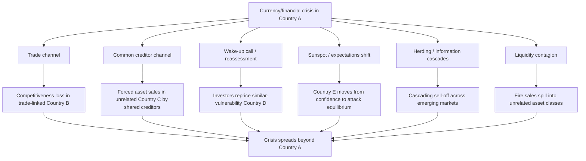

## Contagion Across Currencies and Asset Markets

### Overview

Contagion refers to the transmission of a currency or financial crisis from one country or asset market to another, in a manner and magnitude that cannot be fully explained by the receiving country's own economic fundamentals or by common shocks affecting all countries simultaneously. Contagion is a central empirical feature of major crisis episodes — the 1994 Mexican "Tequila Crisis," the 1997–98 Asian Financial Crisis, the 1998 Russian default and its spillover to Brazil and elsewhere, and the 2008–09 Global Financial Crisis — and understanding its channels is essential for interpreting why crises cluster geographically and temporally far more than fundamentals alone would predict.

### Defining Contagion: Fundamentals-Based versus "Pure" Contagion

**Key Points**

- **Fundamentals-based (real) linkages**: spillovers that occur through genuine economic channels — trade links, common creditors, similar macroeconomic vulnerabilities — and are, in principle, predictable given observable data
- **"Pure" or excess contagion**: co-movement in asset prices or capital flows across countries that exceeds what can be explained by fundamentals or common shocks, often attributed to investor behavior, liquidity constraints, or shifts in market sentiment
- Empirically distinguishing between the two is difficult, since a shock's fundamentals-based transmission and behavioral amplification frequently occur simultaneously and are hard to separate econometrically [Inference: the relative weight of each channel is a long-standing empirical debate without full consensus]

### Channels of Contagion

#### 1. Trade Linkages

If Country A devalues its currency, Country B — a trade competitor exporting similar goods to third markets, or a major trading partner of A — faces a loss of competitiveness. This can generate pressure for B to devalue as well, a pattern sometimes called **competitive devaluation** or "beggar-thy-neighbor" dynamics.

$$\text{Real effective exchange rate}_B \uparrow \text{ (appreciation relative to A)} \Rightarrow \text{Export competitiveness}_B \downarrow$$

This channel is genuinely fundamentals-based: it reflects real changes in relative prices and competitiveness, and would be predicted by standard open-economy trade models.

#### 2. Common Creditor / Financial Linkages

If a group of countries share a common set of international lenders (banks, mutual funds, hedge funds), distress in one country can force those creditors to reduce exposure across the entire portfolio, even in countries with no direct trade or macroeconomic link to the initial crisis country. This is often termed the **"common creditor" channel** (studied extensively by Kaminsky and Reinhart, 2000).

**Key Points**

- A creditor facing losses or margin calls in Country A may need to raise cash by selling assets in Country C, unrelated to A except through the shared creditor's balance sheet
- This channel can transmit crises across countries with no direct economic relationship, purely through the balance sheet constraints of internationally active financial institutions
- Related mechanisms include **portfolio rebalancing** (investors reducing exposure to an entire asset class, e.g., "emerging markets," after losses in one country) and **margin calls / leverage-driven fire sales**

#### 3. Wake-Up Call / Reassessment Contagion

A crisis in one country can prompt investors to **reassess the fundamentals of other, previously overlooked countries** that share similar structural characteristics (e.g., similar currency mismatches, similar current account deficits, similar banking sector vulnerabilities). This is sometimes called a **"wake-up call"** (Goldstein, 1998).

**Key Points**

- Unlike pure sentiment-driven contagion, wake-up call contagion is informationally rational: the crisis in Country A reveals genuinely useful information about risks that also apply to Country B, causing a legitimate Bayesian updating of beliefs about B's vulnerability
- This blurs the line between "fundamentals-based" and "pure" contagion, since the trigger is a shift in beliefs, but the underlying concern (e.g., shared currency mismatch vulnerability) is a genuine fundamental characteristic

#### 4. Sunspots and Coordination Failures (Second-Generation Logic)

As discussed in second generation crisis models, if a country's fundamentals sit in the "multiple equilibria" zone, an unrelated event elsewhere can serve as a **coordinating device ("sunspot")** that shifts market beliefs from the "confidence" equilibrium to the "attack" equilibrium, even without new fundamental information about the country itself.

$$\text{Country A crisis} \rightarrow \text{shift in beliefs about Country B (no change in B's fundamentals)} \rightarrow \text{Country B attacked}$$

This is the purest theoretical form of contagion, since by construction B's fundamentals are unchanged, and the crisis transmission occurs entirely through expectations.

#### 5. Herding and Information Cascades

**Key Points**

- If individual investors have imperfect information about a country's true condition and observe other investors selling, they may rationally infer that those investors possess negative private information, leading to **herding** even absent direct communication or coordination
- This can generate **information cascades**, where early sellers' actions trigger a self-reinforcing wave of selling that may overshoot what full-information fundamentals would justify
- Herding is often amplified by the incentive structures of fund managers evaluated relative to peers ("reputational herding"), who may rationally mimic others' portfolio decisions to avoid being an outlier if the herd turns out to be right

#### 6. Liquidity Contagion

A crisis that impairs market liquidity in one asset class or country can spill over into ostensibly unrelated markets if the same market participants (e.g., large global banks, hedge funds) need to liquidate positions elsewhere to raise cash, meet redemptions, or satisfy margin calls — a mechanism prominent in the 1998 LTCM/Russia episode and the 2008 Global Financial Crisis.

### Diagram: Contagion Transmission Channels

### Empirical Measurement of Contagion

Economists test for contagion using several approaches:

**Key Points**

- **Cross-market correlation tests**: comparing asset return correlations across countries during "tranquil" versus "crisis" periods; a statistically significant increase in correlation during crisis periods (beyond what heteroskedasticity-adjusted tests would predict) is often interpreted as evidence of contagion (Forbes and Rigobon, 2002, provide an influential correction for the bias that simple correlation tests can suffer from due to increased crisis-period volatility)
- **VAR and event-study methods**: examining whether shocks originating in one country generate statistically significant responses in others beyond what a common global factor (e.g., US interest rates, global risk aversion) would predict
- **Principal components / common factor models**: decomposing asset price co-movements into components explained by (a) global/common shocks, (b) regional or fundamentals-linked shocks, and (c) an idiosyncratic or "excess comovement" residual, with the residual often used as a proxy for contagion

### The Distinction: Interdependence versus Contagion

A key methodological debate concerns whether observed co-movement reflects **interdependence** (normal, ongoing cross-country linkages that exist in both crisis and non-crisis periods) or **contagion proper** (a discrete, crisis-specific increase in cross-market linkage). Forbes and Rigobon's widely cited correction argues that much of what appeared to be "contagion" in earlier studies was actually **interdependence**, once one properly accounts for the fact that correlation estimates are biased upward during periods of high volatility even absent any true increase in the underlying relationship between markets. [Inference: this remains a debated methodological point, and subsequent literature has proposed alternative corrections and continues to dispute the magnitude of "true" contagion versus interdependence]

### Historical Episodes Illustrating Contagion

**The Tequila Crisis (1994–95)**: Mexico's peso devaluation in December 1994 triggered capital flight from other Latin American economies (particularly Argentina) with only limited direct trade or financial links to Mexico, widely cited as an early empirical example of contagion beyond fundamentals, plausibly involving common-creditor and wake-up-call channels.

**The Asian Financial Crisis (1997–98)**: Beginning with the Thai baht devaluation in July 1997, the crisis rapidly spread to Indonesia, South Korea, Malaysia, and the Philippines, and had secondary effects on Russia and Brazil. Trade linkages, common creditor exposure (many international banks were exposed across multiple Asian economies), and wake-up-call reassessment of similar currency/banking mismatches across the region are all cited as relevant channels.

**Russia 1998 and LTCM**: Russia's August 1998 debt default and devaluation triggered a "flight to quality" that widened spreads and reduced liquidity across many unrelated emerging markets, and contributed to the near-collapse of the US hedge fund Long-Term Capital Management (LTCM), illustrating liquidity contagion transmitted through leveraged global financial institutions rather than through trade or macroeconomic fundamentals.

**The Global Financial Crisis (2008–09)**: Though centered in US and European financial institutions rather than emerging-market currency pegs, the GFC demonstrated large-scale liquidity and common-creditor contagion, as globally active banks deleveraged simultaneously across many markets, transmitting stress far beyond the originating US subprime mortgage sector.

### Example

Suppose Country X, a middle-income emerging market, devalues its currency due to a genuine first-generation-style fiscal/credit imbalance. Country Y, geographically distant, has no significant trade relationship with X and materially different fiscal fundamentals — but shares two characteristics: reliance on the same pool of international mutual fund investors, and a similarly structured banking sector with meaningful foreign-currency corporate borrowing (a third-generation-style vulnerability).

Following X's crisis, international fund managers, facing redemptions from investors alarmed by losses in X, are forced to raise cash by selling assets across their broader emerging-market portfolio, including holdings in Y (**common creditor channel**). Simultaneously, analysts covering Y begin to scrutinize its banking sector's currency mismatch more closely, having been "reminded" of this risk by events in X (**wake-up call channel**). Even though Y's own fiscal position was sound and its currency mismatch had not changed, the combination of forced selling and reassessed risk perceptions pushes Y's currency into its own "multiple equilibria" second-generation zone, and a subsequent shift in market sentiment (a further sunspot) triggers a speculative attack on Y's currency as well — despite the absence of any direct link between X and Y's underlying fundamentals.

### Policy Implications

**Key Points**

- **Regional and multilateral surveillance**: given contagion risk, international institutions (IMF, regional bodies) monitor not just individual country fundamentals but also cross-country linkages via trade, common creditors, and shared vulnerabilities
- **Reserve pooling and swap arrangements**: regional reserve-pooling mechanisms (e.g., the Chiang Mai Initiative among ASEAN+3 countries, established partly in response to the Asian Financial Crisis) aim to provide a credible backstop that can reduce contagion-driven attacks by shoring up market confidence
- **Communication and signaling**: since wake-up-call and sunspot contagion operate partly through market beliefs, clear communication of genuinely differentiated fundamentals ("decoupling" narratives) can, if credible, help limit unwarranted spillover — though credibility itself is difficult to establish during a regional crisis
- **Addressing shared vulnerabilities proactively**: since wake-up-call contagion specifically targets countries sharing a structural vulnerability with the crisis country, reducing common vulnerabilities (e.g., currency mismatches, short-term foreign debt) across a region lowers susceptibility to this channel
- **Capital flow management**: some policymakers argue temporary capital flow measures can help buffer against common-creditor and herding-driven outflows during acute contagion episodes, though this remains a contested area of policy given potential costs to long-run capital market access

### Conclusion

Contagion explains why currency and financial crises tend to cluster across countries and time far more than country-specific fundamentals alone would predict, operating through a combination of genuine economic linkages (trade, common creditors) and expectations-driven mechanisms (wake-up calls, sunspots, herding). Because contagion connects directly to the theoretical machinery of second-generation multiple-equilibria models and the balance-sheet vulnerabilities emphasized by third-generation models, understanding contagion channels is essential both for interpreting historical crisis episodes and for designing policy responses — from regional financial safety nets to prudential regulation of common vulnerabilities — aimed at reducing a country's susceptibility to crises that originate elsewhere.

**Related Topics**

- Second generation models and self-fulfilling crises (sunspots, multiple equilibria)
- Third generation models and balance sheet effects (shared vulnerability channels)
- The 1994 Mexican Peso ("Tequila") Crisis
- The 1997–98 Asian Financial Crisis
- The 1998 Russian default and LTCM crisis
- Forbes-Rigobon contagion versus interdependence methodology
- Common creditor channel (Kaminsky-Reinhart)
- Regional financial safety nets (Chiang Mai Initiative)
- Herding behavior and information cascades in financial markets
- Sudden stops and capital flow reversals (Calvo)
- Global games and equilibrium selection (Morris-Shin)
- International lender-of-last-resort facilities and IMF surveillance