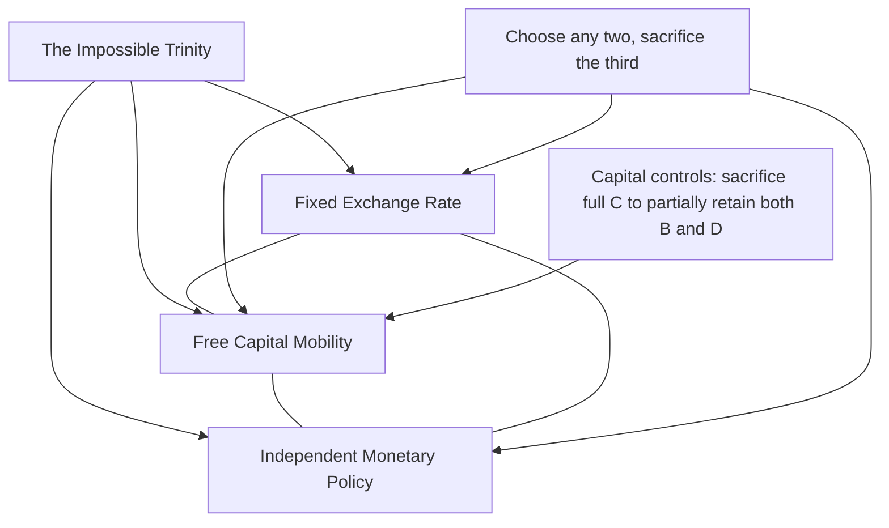

## Capital Controls as a Crisis Prevention Tool

### Overview

Capital controls are government-imposed restrictions on cross-border capital flows, encompassing a wide range of measures affecting inflows, outflows, or both. In the context of currency and balance of payments crises, capital controls are analyzed primarily as a tool for reducing vulnerability to speculative attacks, sudden stops, and contagion, by limiting the speed, volume, or composition of capital that can flee a country during periods of stress, or by discouraging the accumulation of destabilizing short-term inflows in the first place.

### Rationale for Capital Controls in Crisis Prevention

**Key Points**

- **Limiting attack size**: since speculative attacks (as in first and second generation models) require investors to convert domestic currency into foreign currency, restrictions on convertibility or capital movement can directly cap the scale of reserves that can be drained in a short period
- **Reducing sudden stop risk**: by discouraging short-term, highly liquid, "hot money" inflows in favor of longer-term, more stable flows (FDI, long-term portfolio investment), controls aim to reduce the stock of capital that could rapidly reverse
- **Addressing balance sheet vulnerabilities (third-generation logic)**: controls targeting foreign-currency borrowing, particularly short-term unhedged corporate and bank debt, can directly reduce the currency and maturity mismatches that amplify crises through the balance sheet channel
- **Preserving monetary policy autonomy**: under the "impossible trinity" (or trilemma), a country cannot simultaneously maintain a fixed exchange rate, free capital mobility, and independent monetary policy; capital controls allow a degree of independent monetary policy even while maintaining some exchange rate management

### The Trilemma Context

$$\text{Fixed Exchange Rate} + \text{Free Capital Mobility} + \text{Independent Monetary Policy} \implies \text{Inconsistent}$$

A country can achieve at most two of these three objectives simultaneously. Capital controls are, in effect, a tool for relaxing the strict trade-off, allowing a country to combine some exchange rate stability with some monetary policy independence by sacrificing full capital account openness.

### Taxonomy of Capital Controls

**By direction of flow:**

- **Controls on inflows**: restrict capital entering the country (e.g., taxes on foreign borrowing, unremunerated reserve requirements on inflows, minimum stay requirements)
- **Controls on outflows**: restrict capital leaving the country (e.g., restrictions on residents converting domestic currency, limits on capital repatriation by foreign investors, exit taxes)

**By instrument type:**

- **Price-based (market-based) controls**: taxes, tariffs, or reserve requirements that raise the cost of capital flows without outright prohibiting them (e.g., Chile's unremunerated reserve requirement, or "encaje," in the 1990s)
- **Quantity-based (administrative) controls**: outright limits, quotas, licensing requirements, or prohibitions on certain types of capital transactions

**By asset class targeted:**

- Controls on short-term portfolio flows (often the primary crisis-prevention target, given their liquidity and rapid reversibility)
- Controls on foreign direct investment (rare, since FDI is generally viewed as more stable and beneficial)
- Controls on bank and corporate foreign-currency borrowing specifically (directly targeting third-generation balance sheet mismatch risk)

### Historical Case: Chile's Encaje (Unremunerated Reserve Requirement)

Chile's capital control regime in the 1990s is among the most studied examples of a **price-based control on inflows**. Under this system, a portion of foreign capital inflows (particularly short-term portfolio flows) had to be deposited, without interest, at the central bank for a specified period, effectively taxing short-term inflows more heavily than long-term ones.

**Key Points**

- The stated goal was to **shift the composition of capital inflows toward longer maturities**, reducing sudden stop vulnerability, rather than to reduce the aggregate volume of inflows
- Empirical assessments generally find the encaje was more successful at **altering the composition** (lengthening average maturity) of inflows than at reducing their **aggregate volume**, and its effects on the real exchange rate and monetary policy autonomy are debated [Inference: empirical estimates of the policy's overall effectiveness vary across studies and time periods examined]

### Historical Case: Malaysia's Capital Controls (1998)

During the Asian Financial Crisis, Malaysia imposed comprehensive capital controls in September 1998, including fixing the exchange rate, restricting the offshore trading of its currency (the ringgit), and imposing a one-year holding period on the repatriation of portfolio capital.

**Key Points**

- This was a more **administrative, quantity-based, and outflow-oriented** approach than Chile's inflow-focused price-based measures
- The controls allowed Malaysia's central bank to lower domestic interest rates and pursue reflationary policy without fear of triggering further capital flight or currency collapse, a direct application of the trilemma logic
- The episode is frequently cited in the literature as a relatively successful use of controls in an acute crisis context, though assessments vary regarding how much of Malaysia's subsequent recovery reflected the controls themselves versus broader regional recovery dynamics and other domestic policy choices [Inference: attribution of Malaysia's recovery to controls versus other factors remains a genuinely contested empirical question in the literature]

### Costs and Criticisms of Capital Controls

**Key Points**

- **Reduced access to foreign capital**: controls can raise the cost of capital for domestic firms, particularly smaller firms without access to alternative financing, potentially reducing investment and growth
- **Circumvention and evasion**: sophisticated investors often find ways around controls (e.g., mislabeling capital account transactions as current account transactions, using derivatives or offshore structures), which can erode effectiveness over time and encourage further avoidance-driven financial innovation
- **Distortion and rent-seeking**: administrative controls can create opportunities for corruption or favoritism in the allocation of scarce foreign exchange or borrowing permissions
- **Signaling effects**: the imposition of controls, especially administrative outflow controls during a crisis, can be interpreted by markets as a signal of policy desperation or fundamental weakness, potentially triggering further capital flight in anticipation of controls (a form of "control-induced" pre-emptive attack) or damaging longer-run investor confidence in the country's institutional commitment to open markets
- **Reduced market discipline**: some economists argue that capital account openness imposes valuable discipline on domestic macroeconomic policy, and that insulating a country from this discipline via controls can permit persistently unsustainable policies to continue longer than they otherwise would

### The Evolving IMF and Academic Consensus

**Key Points**

- Historically, the IMF and much of mainstream international economics viewed capital account liberalization as an unambiguous long-run goal, with controls seen as a second-best, temporary measure at most
- Following the Asian Financial Crisis and especially the 2008–09 Global Financial Crisis, this consensus shifted meaningfully, with growing recognition — including in IMF policy statements from around 2010 onward — that **capital flow management measures (CFMs)** can play a legitimate role in a country's policy toolkit under specific circumstances, particularly for managing large and volatile short-term inflows
- The IMF's current institutional framework generally favors macroeconomic policy adjustment and macroprudential measures as first-line responses to capital flow volatility, with capital flow management measures viewed as potentially useful in certain circumstances (e.g., to address a surge of inflows that macroprudential tools cannot adequately manage) rather than a preferred first response [Unverified: the precise current IMF institutional view evolves periodically through official policy reviews; readers should consult the IMF's most recent institutional view documents for the current official position]

### Capital Controls versus Macroprudential Regulation

A related but distinct policy category is **macroprudential regulation**, which targets financial stability risks (including those arising from capital flows) through prudential rules applied to domestic financial institutions rather than direct restrictions on cross-border transactions per se.

| Dimension | Capital Controls | Macroprudential Regulation |
| --- | --- | --- |
| Target | Cross-border capital transactions directly | Domestic financial institution risk-taking (which may be influenced by capital flows) |
| Example instruments | Reserve requirements on inflows, outflow restrictions, taxes on foreign borrowing | Loan-to-value limits, countercyclical capital buffers, foreign-currency lending limits for banks |
| Overlap | Significant, especially for measures like limits on banks' foreign-currency borrowing | Significant |
| WTO/bilateral treaty constraints | Can conflict with capital account commitments in trade/investment agreements | Generally less constrained by such agreements |

In practice, many effective crisis-prevention frameworks combine elements of both — for instance, a limit on banks' foreign-currency-denominated short-term borrowing can be classified as either a capital control or a macroprudential tool depending on its precise design and the classification framework used.

### Example

Consider an emerging market economy experiencing a surge of short-term portfolio inflows attracted by high domestic interest rates relative to advanced economies (a classic "carry trade" dynamic). Policymakers are concerned that these inflows are financing a credit and asset price boom, and that a sudden shift in global risk sentiment (e.g., a change in advanced-economy monetary policy) could trigger a sudden stop and subsequent third-generation-style balance sheet crisis, since much of the inflow-financed credit is being extended in foreign currency to domestic borrowers with local-currency revenue streams.

In response, the central bank introduces a graduated unremunerated reserve requirement on new short-term portfolio inflows (Chilean-style), alongside a macroprudential limit on banks' net open foreign-currency positions and a cap on foreign-currency lending to unhedged domestic borrowers (directly targeting the third-generation mismatch channel). These measures do not prohibit capital inflows outright but raise the effective cost of short-term, speculative, and currency-mismatched flows relative to longer-term, hedged, or local-currency-denominated financing, aiming to shift the composition of the capital account toward more stable and lower-risk flows without fully closing the economy to foreign capital.

### Empirical Effectiveness: Summary of the Literature

**Key Points**

- Evidence generally supports the view that capital controls, particularly price-based inflow controls, can **alter the composition of capital flows** (favoring longer maturities) more reliably than they can **reduce aggregate flow volumes** or **materially affect the real exchange rate** [Inference: the size and persistence of composition effects vary meaningfully by study, time period, and control design]
- Evidence on whether controls **reduce the probability or severity of subsequent crises** is more mixed, given the difficulty of isolating the causal effect of controls from other concurrent policy and structural differences across countries
- There is more consistent evidence that capital controls, when used **temporarily during an acute crisis** (as in Malaysia 1998), can help create policy space for a coordinated domestic recovery response, though separating this effect from other simultaneous developments (regional recovery, other domestic reforms) remains methodologically challenging

### Conclusion

Capital controls represent one of several policy tools available for reducing a country's vulnerability to currency and balance of payments crises, operating by directly limiting the scale and speed of capital flows that can fuel or exacerbate speculative attacks, sudden stops, and balance sheet mismatches. While historically viewed with skepticism by mainstream international economic policy institutions, the experience of the Asian Financial Crisis and the Global Financial Crisis has led to a more nuanced view recognizing a legitimate, if circumscribed, role for capital flow management measures — particularly when used to shape the composition of inflows or to create policy space during acute crisis episodes — while acknowledging real costs in terms of capital access, potential circumvention, and possible signaling effects on investor confidence.

**Related Topics**

- The impossible trinity (trilemma) in open-economy macroeconomics
- Third generation models and balance sheet effects (currency mismatch reduction via controls)
- Sudden stops in capital flows (Calvo)
- Macroprudential regulation and financial stability policy
- Chile's unremunerated reserve requirement (encaje) case study
- Malaysia's 1998 capital control episode
- IMF institutional view on capital flows and capital flow management measures
- Sterilized foreign exchange intervention as an alternative/complementary tool
- Reserve adequacy metrics and self-insurance against capital flow volatility
- Carry trade dynamics and interest rate differentials in emerging markets