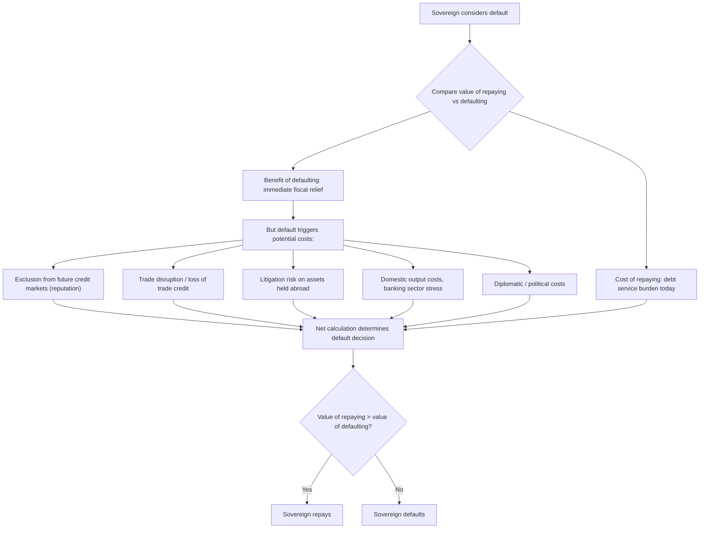

## Sovereign Borrowing and the Problem of Enforcement

### Overview

Sovereign borrowing refers to lending to national governments, typically to finance fiscal deficits, infrastructure, or crisis response, in either domestic or (more distinctively) foreign currency and often under foreign law. The defining economic puzzle of sovereign lending is the **enforcement problem**: unlike private debt contracts, there is no supranational bankruptcy court or police force that can compel a sovereign government to repay, seize its assets domestically, or force it out of office for nonpayment. This chapter's foundational question — why sovereigns repay at all, given the apparent absence of enforcement mechanisms available in domestic lending — underpins essentially all subsequent theory of sovereign debt, default, and international lending.

### The Core Enforcement Problem

**Key Points**

- In domestic lending, a creditor who is not repaid can typically sue in domestic courts, seize collateral, or force the debtor into bankruptcy proceedings that reallocate assets to creditors
- A sovereign government, by definition, holds ultimate authority within its own territory; it cannot be forced into domestic bankruptcy court against its will, and its assets located within its own borders are generally protected by **sovereign immunity**
- There is no world government, world police, or fully binding international bankruptcy regime that can compel repayment or seize a sovereign's domestic assets
- This creates the fundamental theoretical puzzle: absent effective legal enforcement, why do sovereign borrowers ever repay, and why are creditors willing to lend in the first place?

### Sovereign Immunity and Its Limits

**Sovereign immunity** is the legal doctrine, rooted in customary international law, holding that a state cannot be sued in the domestic courts of another state without its consent. Historically, this doctrine was understood as **absolute immunity**, providing near-total legal protection for a sovereign's assets and actions.

**Key Points**

- Most jurisdictions, including the United States (via the Foreign Sovereign Immunities Act of 1976) and the United Kingdom, have moved to a doctrine of **restrictive immunity**, distinguishing between a state's sovereign/public acts (*acta jure imperii*), which remain immune, and its commercial acts (*acta jure gestionis*), which are not
- Because sovereign borrowing (issuing bonds, entering loan agreements) is generally classified as a commercial activity, sovereign bonds typically include explicit **waiver of immunity clauses**, allowing creditors to sue in specified foreign courts (commonly New York or London) and, importantly, **waiver of immunity from execution**, allowing creditors to attempt to seize certain sovereign assets located abroad
- However, even with a waiver, many categories of sovereign assets remain effectively immune from seizure even abroad — including assets used for diplomatic or military purposes, central bank reserves in many jurisdictions, and assets essential to the exercise of governmental functions — significantly limiting the practical reach of legal judgments against a sovereign

### Theoretical Mechanisms Sustaining Sovereign Repayment

Given the weakness of direct legal enforcement, the theoretical literature on sovereign debt identifies several alternative mechanisms that can, in principle, sustain a positive volume of sovereign lending despite limited enforceability.

#### 1. Reputation (Eaton-Gersovitz, 1981)

The foundational model of sovereign debt, developed by Jonathan Eaton and Mark Gersovitz (1981), argues that sovereigns repay to **preserve access to future credit markets**. A government that defaults today is excluded from borrowing in the future (temporarily or permanently, depending on model specification), and if the value of continued market access exceeds the short-run gain from defaulting, the government will choose to repay.

$$V^{repay}_t \geq V^{default}_t \implies \text{Sovereign repays}$$

where $V^{repay}_t$ is the discounted lifetime utility from repaying (including the value of continued access to smoothing consumption via future borrowing) and $V^{default}_t$ is the discounted lifetime utility from defaulting (including any punishment/exclusion costs but saving the immediate debt service burden).

**Key Points**

- This mechanism relies entirely on the sovereign valuing **future access to international capital markets**, meaning its disciplining power weakens for governments with very high discount rates (impatient governments, or those facing near-term political turnover with limited concern for successors' borrowing access), or in environments where reputational punishment is not credible or not severe
- Reputation-based models generate an important prediction: debt levels and interest rates should reflect the sovereign's willingness to repay (linked to the future value of market access) rather than solely its underlying capacity to repay

#### 2. Direct Sanctions and Trade Disruption (Bulow-Rogoff, 1989)

Jeremy Bulow and Kenneth Rogoff (1989) challenged the pure reputation story, showing that if a defaulting sovereign could simply save the money it would have spent on debt service and invest it (e.g., in a risk-free foreign asset), reputation alone (i.e., exclusion from future *borrowing* only) would be insufficient to sustain positive equilibrium lending, since the sovereign could achieve at least as good an outcome through a "cash-in-advance" savings strategy without ever needing to borrow again.

**Key Points**

- Bulow-Rogoff's critique implies that **some form of direct sanction beyond mere credit exclusion** is necessary to sustain sovereign lending in equilibrium — for example, direct trade disruption, seizure of trade-related assets, or diplomatic/political costs imposed on defaulters
- This shifted the literature's attention toward **direct punishment channels**: disruption of trade credit and international trade more broadly, litigation and asset seizure attempts abroad, and reputational spillovers into other economic relationships (e.g., foreign direct investment, diplomatic relations)

#### 3. Trade Sanctions and Output Costs

Empirical and theoretical work (e.g., Rose, 2005, on trade effects of default) finds that sovereign default is often associated with **disruptions to international trade**, potentially because trade credit becomes harder to obtain, because trading partners retaliate, or because default signals broader institutional or economic distress that harms trade relationships independent of formal legal enforcement.

**Key Points**

- Default is frequently associated with significant **output costs** in the defaulting economy — recessions, banking sector stress (especially where domestic banks hold significant government debt), and reduced investment — providing a further disincentive to default beyond credit market exclusion alone
- These costs may operate through both direct channels (loss of trade financing, disruption of international commercial relationships) and indirect channels (loss of confidence, capital flight, currency crisis interactions — connecting to the currency crisis material in this course)

#### 4. Litigation and Holdout Creditors

While seizing a sovereign's core governmental assets remains difficult, creditors have in practice pursued litigation strategies to seize *other* sovereign assets abroad — commercial assets, payments due to the sovereign from third parties, or (in especially aggressive cases) sovereign property not protected by immunity.

**Key Points**

- The **Argentina "holdout" litigation** following its 2001 default is a landmark case: certain creditors (led by hedge funds sometimes termed "vulture funds") refused to participate in Argentina's debt restructuring and pursued litigation in US courts (under New York-law bonds) for full repayment
- The resulting US court rulings (notably under Judge Thomas Griesa) enforced *pari passu* (equal treatment) clauses in a novel way, effectively blocking Argentina from making payments to *restructured* bondholders unless it also paid the holdouts in full — illustrating how creative use of contractual clauses and domestic court enforcement (even absent direct seizure of core sovereign assets) can create significant practical leverage for creditors
- This episode significantly influenced subsequent sovereign bond contract design (see collective action clauses, discussed below)

### Diagram: Why Sovereigns Repay Despite Weak Enforcement

### Domestic versus External (Foreign-Law) Debt

**Key Points**

- Sovereigns typically issue both **domestic-currency debt under domestic law** (subject to domestic legal enforcement mechanisms, but also more easily subject to domestic political and legal manipulation, e.g., forced restructuring via domestic legislation) and **foreign-currency debt under foreign law** (subject to the enforcement limitations discussed above, but often viewed by creditors as offering stronger protection against unilateral domestic legal changes)
- The choice of governing law and creditor base has significant implications for a sovereign's default incentives and for the practical mechanics of any eventual restructuring, since domestic-law debt can sometimes be restructured more easily via domestic legislative action, whereas foreign-law debt typically requires creditor consent or formal legal restructuring processes in the relevant foreign jurisdiction

### Contractual Innovations Addressing the Enforcement Problem

Given the practical difficulty of direct legal enforcement, sovereign bond contracts have evolved specific clauses to manage default and restructuring risk:

**Key Points**

- **Collective Action Clauses (CACs)**: allow a qualified supermajority of bondholders (e.g., 75%) to approve a restructuring that becomes binding on all bondholders of that issue, reducing the ability of a small minority of holdout creditors to block a restructuring — a direct contractual response to the Argentina holdout litigation experience
- ***Pari passu* clauses**: require equal treatment of all creditors of the same seniority, historically intended primarily to prevent subordination of a given bond issue, but reinterpreted in the Argentina litigation to require simultaneous payment, significantly increasing its practical bite
- **Cross-default clauses**: trigger default on a given bond if the sovereign defaults on other debt obligations, effectively coordinating creditor responses across different debt instruments
- **Collective Action Clauses with aggregation features** (post-2014 reforms, particularly following the Argentina episode): allow supermajority votes to bind holdouts *across multiple bond series simultaneously*, further strengthening the ability to overcome holdout problems in complex, multi-instrument sovereign debt stocks

### Institutional and Political Economy Dimensions

**Key Points**

- Since a sovereign government is itself a political actor facing elections, coalition dynamics, and changing leadership, **domestic political economy factors** interact with the pure enforcement problem: political turnover can weaken the credibility of long-run reputational commitments, while economic distress can create powerful short-run domestic political incentives to default despite long-run reputational costs
- Institutional quality (rule of law, government stability, fiscal institutions) is empirically associated with lower sovereign borrowing costs, consistent with the interpretation that stronger domestic institutions serve as a partial substitute for weak international legal enforcement, by making a government's *ex ante* commitment to repay more credible

### Example

A middle-income country issues $5 billion in foreign-currency bonds under New York law to finance infrastructure spending, in a period of favorable global financial conditions. A subsequent adverse terms-of-trade shock and currency depreciation (echoing the balance sheet mechanics from the currency crisis chapter) sharply raise the domestic-currency burden of debt service.

The government faces a choice: continue servicing the debt at significant fiscal cost (crowding out domestic spending and risking a deep recession), or default. Considering default, the government weighs:

- **Loss of future market access**: it may be excluded from international capital markets for several years, limiting its ability to smooth future shocks via borrowing (Eaton-Gersovitz reputation channel)
- **Trade disruption risk**: exporters may face difficulty securing trade credit, and international commercial relationships may suffer
- **Litigation risk**: creditors may pursue legal action in New York courts, potentially disrupting the country's ability to access international payment systems or seize commercial assets abroad, as occurred in the Argentina case
- **Domestic economic costs**: a default may trigger a domestic banking crisis if local banks hold significant sovereign debt, and may worsen the currency crisis already underway via loss of confidence

Given these combined costs, the government may choose a **negotiated restructuring** — extending maturities, reducing the coupon rate, or applying a "haircut" to principal — rather than outright default, particularly if a sufficient supermajority of creditors can be brought to agreement via collective action clauses, avoiding both full default costs and prolonged holdout litigation.

### Conclusion

The enforcement problem lies at the heart of sovereign debt theory: because no supranational authority can compel a sovereign government to repay or seize its core domestic assets, sovereign lending relies on a combination of reputational incentives (the value of continued market access), direct sanctions (trade disruption, asset seizure abroad, litigation), and domestic political-economy and institutional factors to sustain a functioning international credit market. The tension between weak formal enforcement and the practical reality of extensive, ongoing sovereign borrowing has driven significant theoretical debate (Eaton-Gersovitz versus Bulow-Rogoff), landmark legal episodes (the Argentina holdout litigation), and substantial contractual innovation (collective action clauses, aggregated CACs) — all of which remain central to understanding how sovereign debt markets function despite the fundamental absence of a sovereign bankruptcy court.

**Related Topics**

- The Eaton-Gersovitz model of sovereign debt and reputation
- The Bulow-Rogoff critique and direct sanctions models
- Sovereign debt restructuring mechanics and haircuts
- Collective action clauses and the Argentina holdout litigation
- Sovereign immunity: restrictive versus absolute doctrines
- Domestic versus external (foreign-law) sovereign debt
- Debt sustainability analysis and fiscal space
- The role of the IMF in sovereign debt crises (lending into arrears policy)
- Odious debt and debt legitimacy debates
- Twin crises: interaction between sovereign debt and banking/currency crises
- Sovereign credit ratings and market-based risk pricing
- Proposals for a sovereign bankruptcy regime (Sovereign Debt Restructuring Mechanism)