## Debt Sustainability Analysis

### Overview

Debt sustainability analysis (DSA) is the analytical framework used to assess whether a sovereign's debt trajectory is consistent with its capacity to service that debt over time without requiring an unrealistically large or disruptive adjustment in fiscal policy, or without resorting to default, restructuring, or excessive monetization. DSA combines accounting identities that describe debt dynamics with judgment-based projections of macroeconomic and fiscal variables, and is used extensively by the IMF, World Bank, credit rating agencies, and sovereign debt investors to evaluate default risk and inform lending, program design, and restructuring negotiations.

### The Core Debt Dynamics Equation

The foundational relationship in DSA describes how the debt-to-GDP ratio evolves over time as a function of the primary fiscal balance, the interest rate on debt, the growth rate of the economy, and (for foreign-currency debt) the exchange rate.

For an economy with debt denominated in domestic currency, the standard law of motion for the debt-to-GDP ratio $d_t$ is:

$$d_t = \frac{1+r}{1+g} \, d_{t-1} - pb_t$$

where $r$ is the real interest rate on debt, $g$ is the real GDP growth rate, and $pb_t$ is the primary balance (revenue minus non-interest expenditure) as a share of GDP.

For an open economy with a share $\alpha$ of debt denominated in foreign currency, the equation extends to incorporate the real exchange rate $\epsilon_t$ (an increase representing real depreciation):

$$d_t = (1-\alpha)\frac{1+r_d}{1+g}\, d_{t-1} + \alpha \frac{(1+r_f)(1+\epsilon_t)}{(1+g)}\, d_{t-1} - pb_t$$

where $r_d$ and $r_f$ are domestic-currency and foreign-currency real interest rates respectively. This term directly captures the **third-generation-style balance sheet mechanism** from the currency crisis material: a real depreciation ($\epsilon_t$ rising) mechanically worsens the sovereign debt ratio in proportion to the share of foreign-currency debt $\alpha$.

### The Debt-Stabilizing Primary Balance

A central DSA concept is the **debt-stabilizing primary balance** — the primary surplus (or minimum deficit) required to keep the debt-to-GDP ratio constant, given prevailing interest rate and growth conditions. Setting $d_t = d_{t-1} = d$ in the simplified closed-economy equation and solving:

$$pb^{*} = \left(\frac{r-g}{1+g}\right) d$$

**Key Points**

- If $r > g$ (the interest rate exceeds the growth rate), a **positive primary surplus** is required merely to keep the debt ratio from rising — debt dynamics are inherently unfavorable, sometimes called a situation of "adverse $r$-$g$ differential" or unfavorable "snowball effect"
- If $r < g$ (growth exceeds the interest rate), the debt ratio can be stabilized or even decline even with a **primary deficit**, since GDP growth outpaces the accumulation of interest costs — a "favorable snowball effect"
- This $r-g$ differential is one of the single most important parameters in sovereign debt sustainability, and has been the subject of substantial academic and policy debate, particularly following periods of unusually low global interest rates (raising questions about the sustainability implications of elevated debt levels when $r < g$ persists) [Inference: the persistence and policy implications of a sustained low $r-g$ environment remain actively debated and are sensitive to changing global monetary conditions]

### Diagram: The Debt Dynamics "Snowball" Mechanism

```mermaid
flowchart TD
    A["Debt-to-GDP ratio at start of period: d_(t-1)"] --> B["Interest accrues at rate r"]
    A --> C["GDP grows at rate g"]
    B --> D{"Compare r and g"}
    C --> D
    D -- "r greater than g" --> E["Debt ratio rises automatically (unfavorable snowball)"]
    D -- "r less than g" --> F["Debt ratio falls automatically (favorable snowball)"]
    E --> G["Primary surplus required to stabilize debt ratio"]
    F --> H["Primary deficit can be run while still stabilizing/reducing debt ratio"]
    G --> I["Resulting debt ratio d_t"]
    H --> I
    J["Primary balance pb_t (chosen fiscal policy)"] --> I
```

### Standard DSA Framework Components

**Key Points**

- **Baseline projection**: a central scenario for debt dynamics under assumed "most likely" paths for growth, interest rates, exchange rates, and fiscal policy
- **Stress tests / sensitivity analysis**: alternative scenarios examining how the debt path responds to shocks — a growth shock, an interest rate shock, a primary balance shock, a real exchange rate shock, or combined shocks — to assess the *robustness* of sustainability, not just the central-case outcome
- **Contingent liabilities**: assessment of off-balance-sheet risks that could materialize onto the sovereign balance sheet — state-owned enterprise debt, banking sector bailout costs (directly linking to the third-generation balance sheet/twin crisis material), public-private partnership guarantees, and pension system liabilities
- **Gross financing needs (GFN)**: total financing required in a given period, including both the primary deficit and amortization of maturing debt, which can reveal near-term rollover risk even when the debt stock itself appears manageable on a stock basis
- **Debt profile vulnerabilities**: assessment of debt composition — maturity structure, currency composition, creditor base (official versus private, domestic versus external), and the share held by non-resident investors — since these characteristics affect vulnerability to shocks independent of the aggregate debt level itself

### The IMF's DSA Framework

The IMF operates formal, standardized DSA frameworks that are central to its surveillance and lending operations:

**Key Points**

- The **Market-Access Countries (MAC) DSA framework** is used for countries with significant access to international capital markets, focusing heavily on gross financing needs, debt profile vulnerabilities, and market perception indicators (e.g., sovereign spreads)
- The **Low-Income Country (LIC) DSA framework**, developed jointly with the World Bank, is tailored to countries with primarily official/concessional financing, incorporating debt distress risk ratings (low, moderate, high risk, or in debt distress) based on debt burden thresholds calibrated to each country's institutional capacity
- DSA results are formally required to determine, among other things, whether IMF financing can proceed under programs requiring a finding that debt is sustainable (or "sustainable with high probability"), directly linking the analytical framework to actual lending decisions and, in some cases, to the requirement for debt restructuring as a precondition for IMF support [Unverified: precise current thresholds and framework details are periodically revised by the IMF and should be verified against the most recent official IMF DSA methodology documents]

### Sustainable versus Unsustainable: Interpretive Challenges

**Key Points**

- DSA does not produce a single, mechanical "sustainable/unsustainable" verdict; rather, it provides a probabilistic and scenario-based assessment, since actual outcomes depend on numerous uncertain future variables (growth, global interest rates, exchange rates, political commitment to fiscal adjustment)
- A country can be **"solvent" in a narrow present-value sense** (the discounted sum of future primary surpluses is expected to cover current debt) but still face a **liquidity or rollover crisis** if near-term financing needs cannot be met even temporarily — illustrating that solvency and liquidity are related but distinct concepts in DSA
- **Multiple equilibria concerns** (echoing the second-generation currency crisis framework) can also apply to sovereign debt: if investors believe a rollover will fail, they may refuse to lend, causing the rollover to fail even if the sovereign would have been solvent under continued market access — a "self-fulfilling debt crisis" dynamic explored formally in models such as Cole and Kehoe (2000) and prominent in analyses of the 2010–12 Eurozone sovereign debt crisis

### Solvency versus Liquidity: A Formal Distinction

**Solvency** requires that the intertemporal government budget constraint holds — the present discounted value of future primary surpluses must be at least as large as the current debt stock:

$$d_{t-1} \leq \sum_{i=1}^{\infty} \frac{pb_{t+i}}{(1+r)^i}$$

**Liquidity** concerns whether the sovereign can meet *near-term* financing needs (gross financing needs) even if the longer-run solvency condition would hold under continued market access — a sovereign can be fundamentally solvent yet still default or restructure due to an inability to roll over near-term maturing debt, particularly if a loss of market confidence prevents new issuance even temporarily.

### Illustration: Debt Path Under Different $r-g$ Scenarios

<svg xmlns="http://www.w3.org/2000/svg" viewBox="0 0 700 380">
<text x="350" y="25" text-anchor="middle" font-size="16" font-weight="bold" fill="#1a1a1a">Debt-to-GDP Paths Under Different r-g Scenarios (svg_diagram)</text>
<line x1="80" y1="330" x2="650" y2="330" stroke="#333" stroke-width="2" />
<line x1="80" y1="330" x2="80" y2="60" stroke="#333" stroke-width="2" />
<text x="365" y="360" text-anchor="middle" font-size="12" fill="#333">Time</text>
<text x="30" y="200" text-anchor="middle" font-size="12" fill="#333" transform="rotate(-90 30 200)">Debt/GDP</text>

<path d="M 100 250 Q 300 200 500 90 T 630 60" fill="none" stroke="#d62728" stroke-width="3" />
<text x="500" y="80" font-size="11" fill="#d62728" font-weight="bold">r &gt; g, pb insufficient</text>
<text x="500" y="95" font-size="10" fill="#d62728">(unsustainable, rising ratio)</text>

<path d="M 100 250 Q 300 235 500 230 T 630 228" fill="none" stroke="#b8860b" stroke-width="3" />
<text x="420" y="255" font-size="11" fill="#b8860b" font-weight="bold">Debt-stabilizing primary balance</text>
<text x="420" y="270" font-size="10" fill="#b8860b">(flat ratio)</text>

<path d="M 100 250 Q 300 260 500 290 T 630 310" fill="none" stroke="#2e7d32" stroke-width="3" />
<text x="450" y="305" font-size="11" fill="#2e7d32" font-weight="bold">r &lt; g, or pb &gt; required</text>
<text x="450" y="320" font-size="10" fill="#2e7d32">(declining ratio, sustainable)</text>
<circle cx="100" cy="250" r="4" fill="#1a1a1a" />
<text x="60" y="245" font-size="10" fill="#1a1a1a">d_0</text>
</svg>

### Common DSA Pitfalls and Criticisms

**Key Points**

- **Overoptimistic growth and fiscal projections**: DSAs have historically been criticized for systematically overestimating growth and underestimating the difficulty of sustained fiscal adjustment, particularly in IMF program contexts — a pattern documented in various independent evaluations of past DSA accuracy [Inference: this is a documented historical pattern; the degree to which methodology has since improved is a matter of ongoing institutional reform and debate]
- **Fiscal multiplier uncertainty**: the assumed fiscal multiplier (the output effect of a given fiscal adjustment) significantly affects whether a projected adjustment path is realistic; underestimating the multiplier can lead to self-defeating austerity, where fiscal tightening reduces growth enough to worsen, rather than improve, the debt ratio
- **Political feasibility**: DSA is a technical exercise, but actual debt sustainability also depends on the **political feasibility** of sustained primary surpluses over many years — a dimension not always well captured by purely mechanical debt dynamics equations
- **Contingent liability underestimation**: banking sector or state-owned enterprise risks (directly connecting to third-generation balance sheet crisis dynamics) are notoriously difficult to quantify ex ante and have repeatedly proven larger than initially assumed in historical crisis episodes

### Example

Consider a country with a debt-to-GDP ratio of 70%, of which 40% is foreign-currency denominated. The real interest rate on domestic debt is 3%, on foreign debt 4%, and expected real GDP growth is 2.5%.

Using the open-economy debt dynamics formula (holding the real exchange rate constant for the baseline), the debt-stabilizing primary balance can be calculated approximately as a weighted average of the domestic and foreign $r-g$ differentials applied to the debt ratio, indicating the government needs a primary surplus of roughly 1–1.5% of GDP just to hold the ratio steady.

**Stress test**: Analysts then model a scenario in which the currency depreciates 20% in real terms (a plausible shock given the currency crisis dynamics discussed in prior chapter sections) and growth slows to 0.5% due to the associated financial disruption. Given the 40% foreign-currency debt share, this depreciation alone mechanically adds roughly 8 percentage points to the debt ratio (40% × 20%), while the growth slowdown independently worsens the $r-g$ differential. Combined, the stress scenario might show debt rising from 70% to over 90% of GDP within two to three years, absent an offsetting and likely politically difficult fiscal adjustment — illustrating precisely the kind of non-linear, shock-sensitive dynamic that baseline DSA projections alone can understate, and which explicitly connects sovereign debt sustainability to the currency crisis balance sheet channel covered earlier in this course.

### DSA and Debt Restructuring Decisions

**Key Points**

- When a DSA concludes debt is **unsustainable**, or **sustainable only with a low probability** under plausible baseline and stress scenarios, this typically triggers consideration of **debt restructuring** as a precondition for further official (including IMF) financing, since continued lending without addressing an unsustainable trajectory would simply increase eventual losses
- The **size of the required restructuring (haircut)** is itself often calibrated using DSA outputs — estimating the debt reduction needed to bring the projected debt path back within sustainable bounds under a realistic (not overly optimistic) baseline
- This creates a critical, and sometimes contentious, analytical-political intersection, since DSA assumptions (growth projections, assumed post-restructuring market access, assumed future primary balance path) directly determine the scale of creditor losses in a restructuring negotiation, giving all parties incentive to influence or contest the underlying DSA assumptions

### Conclusion

Debt sustainability analysis provides the core analytical framework connecting fiscal policy, growth, interest rates, and exchange rate dynamics to the trajectory of sovereign debt, translating the enforcement and repayment-incentive questions raised in sovereign borrowing theory into quantitative, forward-looking assessments used by international institutions, credit markets, and governments themselves. While built on a relatively simple underlying debt dynamics identity, rigorous DSA in practice requires careful attention to solvency-versus-liquidity distinctions, contingent liabilities, debt profile vulnerabilities, and the genuine uncertainty and political economy constraints surrounding future fiscal and macroeconomic projections — making it as much a matter of scenario-based judgment as of mechanical calculation, and a direct link between the sovereign debt and currency crisis literatures covered across this course.

**Related Topics**

- The debt dynamics equation and the $r-g$ differential
- Solvency versus liquidity distinctions in sovereign debt crises
- Self-fulfilling sovereign debt crises (Cole-Kehoe) and links to second-generation currency crisis logic
- The IMF's Market-Access Countries and Low-Income Country DSA frameworks
- Gross financing needs and rollover risk
- Contingent liabilities and state-owned enterprise/banking sector risk
- Fiscal multipliers and the risk of self-defeating austerity
- Sovereign debt restructuring mechanics and haircut calibration
- The 2010–12 Eurozone sovereign debt crisis as a DSA case study
- Third generation currency crisis models and balance sheet effects (foreign-currency debt channel)
- Debt sustainability and the enforcement problem in sovereign borrowing