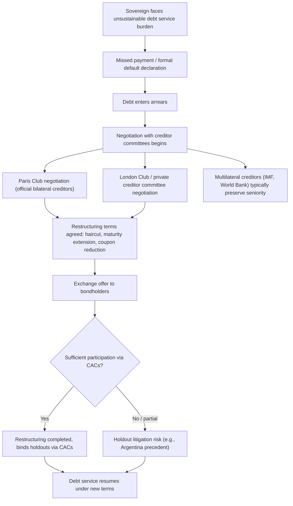

## Sovereign Default and Debt Renegotiation

### Overview

Sovereign default occurs when a government fails to meet its debt obligations — missing a scheduled interest or principal payment, or unilaterally altering contractual terms without creditor consent. Because there is no international bankruptcy court to adjudicate sovereign insolvency (as established in the enforcement problem discussion), default is typically followed not by court-supervised liquidation but by **negotiated renegotiation** between the sovereign and its creditors, resulting in a restructuring that alters the timing, currency, or amount of the original obligations. This topic covers the triggers, mechanics, legal forms, and economic consequences of sovereign default and the renegotiation processes that typically follow it.

### Defining and Classifying Default

**Key Points**

- **Default** is most commonly defined (following major rating agencies and academic databases such as Standard & Poor's and the widely used Reinhart-Rogoff dataset) as a missed or delayed payment of principal or interest beyond a specified grace period, or a restructuring that imposes a loss on creditors relative to the original contractual terms
- **Selective default** refers to default on a subset of obligations (e.g., only foreign-currency external debt, or only debt held by private creditors, while continuing to service official/multilateral debt or domestic-currency debt)
- **De facto versus de jure default**: default can occur formally (an explicit announcement of non-payment) or effectively through actions such as forced restructuring via domestic legislation, exchange rate manipulation that effectively reduces real debt burdens, or high inflation that erodes the real value of domestic-currency debt (sometimes termed "default through inflation" or financial repression)

### Triggers of Sovereign Default

**Key Points**

- **Ability-to-pay shocks**: adverse terms-of-trade shocks, natural disasters, commodity price collapses, or global interest rate increases that raise debt service costs relative to fiscal capacity — connecting directly to the debt sustainability analysis (DSA) framework
- **Willingness-to-pay considerations**: following the Eaton-Gersovitz logic, default can occur even when a country has some capacity to pay, if the government judges that the short-run benefit of default exceeds the long-run reputational and sanction costs
- **Self-fulfilling rollover crises**: as discussed in DSA, a loss of market confidence can trigger a liquidity crisis and default even for a government that would have remained solvent under continued market access (Cole-Kehoe multiple equilibria logic)
- **Currency and banking crisis spillovers**: consistent with the twin-crises and third-generation balance sheet material, a currency crisis can push foreign-currency debt service costs beyond sustainable levels, and a banking crisis can force costly government bailouts that themselves precipitate sovereign distress

### The Default and Renegotiation Process: Typical Sequence

### Key Institutional Actors in Renegotiation

**The Paris Club**: an informal group of major creditor governments (mostly advanced economies) that coordinates restructuring of **official bilateral debt**. The Paris Club operates on consensus principles including comparability of treatment (ensuring other creditors, including private ones, provide comparable relief) and case-by-case negotiation.

**The London Club**: an informal, less institutionalized forum for restructuring **private/commercial bank debt**, historically important for 1980s debt crisis restructurings and largely superseded in relevance by bondholder committee processes as sovereign debt shifted from syndicated bank loans toward tradable bonds.

**Bondholder committees and CACs**: with the shift toward bond-financed sovereign debt (particularly since the 1990s), restructuring increasingly occurs through direct **exchange offers** to bondholders, often organized informally via ad hoc bondholder committees, and increasingly governed by **collective action clauses** that allow a qualified supermajority to bind all bondholders of an issue (and, since post-2014 reforms, across aggregated series).

**The IMF**: typically plays a dual role — providing financing to support the country through the crisis (often conditional on a DSA finding of sustainability, potentially requiring restructuring as a precondition) and, historically, maintaining **preferred creditor status**, meaning IMF (and other multilateral) claims are generally not included in restructurings and are serviced ahead of other creditors.

### Measuring the Size of Restructuring: The "Haircut"

The **haircut** measures the loss imposed on creditors, typically calculated as the percentage reduction in the present value of the restructured debt relative to the present value of the original contractual claims, using a market-based discount rate:

$$\text{Haircut} = 1 - \frac{PV(\text{new claims})}{PV(\text{original claims})}$$

**Key Points**

- Haircuts can be achieved through several combined mechanisms: a reduction in **face value (principal)**, a reduction in the **coupon (interest) rate**, an **extension of maturities** (which reduces present value even without reducing nominal payments, since payments are pushed further into the future), or a combination of all three
- Historical haircuts have varied enormously by episode — from relatively modest maturity extensions with limited present-value loss, to severe cases (e.g., Argentina's 2005 restructuring, and Greece's 2012 private sector involvement) involving present-value haircuts estimated at 50–75% depending on the discount rate methodology used [Inference: precise haircut magnitudes are sensitive to the discount rate assumption and calculation methodology, and different studies of the same episode can report somewhat different figures]

### Legal Forms of Restructuring

**Exchange offers**: the dominant modern mechanism for bond restructuring, where the sovereign offers holders of old bonds the option to exchange them for new bonds with different (typically less favorable to the creditor) terms. Participation is voluntary unless CACs are triggered to bind a dissenting minority.

**Unilateral rescheduling**: less common in modern bond-market contexts but historically used, particularly for domestic-law debt, where a sovereign unilaterally alters payment terms via domestic legislation.

**Brady Plan-style restructuring**: the historically significant approach used to resolve the 1980s Latin American debt crisis, converting non-performing commercial bank loans into tradable "Brady bonds," often partially collateralized by US Treasury zero-coupon bonds purchased using funds from the IMF and World Bank, effectively combining debt reduction with credit enhancement to restore market access.

### Collective Action Problems in Restructuring

**Key Points**

- The core coordination challenge in any voluntary bond restructuring is the **holdout problem**: individual creditors have an incentive to refuse participation in a restructuring (holding out for full payment) if enough other creditors accept reduced terms, since a holdout creditor may be able to free-ride on the improved sustainability created by others' concessions, or pursue litigation for full recovery — as dramatically illustrated in the Argentina case discussed in the enforcement problem topic
- **Collective action clauses** directly address this by allowing a supermajority vote (commonly 75%) to bind all bondholders of an affected issue, and **aggregated CACs** (introduced in the wake of the Argentina litigation) extend this binding power across multiple bond series simultaneously, addressing the problem of holdouts concentrating in a single small issue to block restructuring of a series while free-riding on relief elsewhere
- Despite these contractual innovations, **coordination across genuinely heterogeneous creditor types** (bondholders under different legal jurisdictions, official bilateral creditors, multilateral institutions, and increasingly significant non-Paris-Club official creditors) remains a persistent practical challenge in modern restructurings, particularly given the rise of non-traditional official lenders in recent decades

### Economic Consequences of Default

**Key Points**

- **Output costs**: defaults are empirically associated with meaningful output declines around the default episode, though separating the causal effect of default itself from the underlying crisis that triggered default is econometrically challenging [Inference: the magnitude and precise causal attribution of output costs specifically due to default (versus the broader crisis) is debated in the empirical literature]
- **Banking sector stress**: domestic banks often hold significant quantities of sovereign debt; a default or forced restructuring can directly damage bank balance sheets, potentially triggering the twin-crisis dynamics discussed earlier in this course
- **Loss of market access**: consistent with reputation-based theory, defaulting sovereigns typically face a period of exclusion from international capital markets, though empirically this exclusion period has often proven shorter than early reputation-based models might suggest, and market access is frequently regained within a few years of a completed restructuring [Inference: the speed of market re-access varies substantially across historical episodes and depends on factors including the credibility and completeness of the restructuring]
- **Elevated future borrowing costs**: even after regaining market access, defaulting sovereigns often continue to pay a **default risk premium** (higher spreads) for an extended period, reflecting a lasting reputational effect
- **Contagion risk**: as discussed in the currency crisis contagion topic, a sovereign default can trigger spillover effects on other countries via common creditor, wake-up-call, or sentiment-driven channels

### Sovereign Debt in Domestic Currency: A Partial Escape Valve

**Key Points**

- Debt denominated in domestic currency and held partly by the domestic central bank or financial system provides governments with additional (though not costless) adjustment tools unavailable for foreign-currency debt — notably, the ability to use **inflation or financial repression** to reduce the real value of debt without a formal default
- This "inflation tax" or "default by stealth" mechanism has real economic costs of its own (erosion of central bank credibility, potential currency crisis interactions, distortion of domestic financial intermediation) and is generally viewed as economically and politically costly, but it represents a materially different adjustment channel than the outright default/renegotiation process central to foreign-currency sovereign debt

### Example

A country accumulates significant foreign-currency sovereign debt during a period of favorable global financing conditions. A subsequent combination of a global interest rate increase, a domestic currency depreciation (raising the debt-to-GDP ratio via the balance sheet channel from the DSA framework), and a sharp growth slowdown pushes the debt trajectory onto an unsustainable path under any realistic primary balance assumption.

After a period of futile efforts to maintain payments (drawing down reserves, seeking emergency bridge financing), the government formally announces a default, entering into negotiations with an ad hoc bondholder committee representing the majority of its outstanding Eurobonds. Simultaneously, it approaches the Paris Club to restructure official bilateral loans and continues servicing IMF obligations under preferred creditor status while negotiating a new IMF program conditioned on a DSA finding that, post-restructuring, the debt path would be sustainable.

The eventual restructuring combines a 30% reduction in face value, a coupon rate reduction from an average of 7% to 4%, and a maturity extension of eight years, achieving an estimated present-value haircut of approximately 45%. Because the restructuring achieves the required supermajority participation threshold under the bonds' collective action clauses, dissenting minority holders are contractually bound to the new terms, largely avoiding the kind of protracted holdout litigation that characterized the Argentina precedent. Following completion of the restructuring and a new IMF-supported program, the country gradually regains partial market access over the following two to three years, though at spreads persistently above those of comparable non-defaulting peers.

### Historical Patterns: Serial Default and Debt Intolerance

**Key Points**

- Empirical work (notably Reinhart, Rogoff, and Savastano's concept of "debt intolerance") documents that many emerging market economies have defaulted **multiple times historically**, often at debt-to-GDP levels that would appear manageable by advanced-economy standards, suggesting that sustainable debt thresholds are not universal constants but depend on a country's specific credit history, institutional quality, and market perceptions built up over time
- This pattern of **serial default** is consistent with reputation-based theory in a nuanced way: each default event may partially reset or further damage accumulated reputational capital, potentially explaining why some countries face persistently tighter sustainable debt thresholds than others with superficially similar debt ratios

### Conclusion

Sovereign default and the renegotiation process that typically follows represent the practical resolution mechanism for the enforcement and sustainability problems examined throughout this chapter: given the absence of a sovereign bankruptcy court, default triggers negotiated restructuring through a combination of official channels (Paris Club), private creditor processes (bondholder committees, exchange offers), and increasingly sophisticated contractual mechanisms (collective action clauses) designed to overcome collective action and holdout problems among heterogeneous creditors. While default imposes meaningful economic costs — output losses, banking sector stress, elevated future borrowing costs, and potential contagion — the historical record shows that sovereigns do, in practice, regularly default, renegotiate, and eventually regain market access, reflecting the fundamentally different nature of sovereign insolvency compared to corporate bankruptcy in domestic legal systems.

**Related Topics**

- Sovereign borrowing and the problem of enforcement
- Debt sustainability analysis and the debt-stabilizing primary balance
- Collective action clauses and the Argentina holdout litigation
- The Paris Club and London Club restructuring mechanisms
- The Brady Plan and the 1980s Latin American debt crisis
- Preferred creditor status and the IMF's role in sovereign crises
- Reinhart-Rogoff "debt intolerance" and serial default patterns
- Twin crises: sovereign default and banking sector interlinkages
- Odious debt and debt legitimacy debates
- Proposals for a formal sovereign bankruptcy regime (Sovereign Debt Restructuring Mechanism)
- Financial repression and domestic-currency debt as an adjustment channel
- Self-fulfilling sovereign debt crises (Cole-Kehoe)