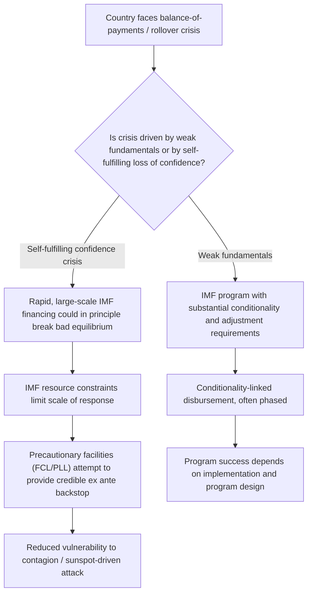

## The IMF as a Lender of Last Resort

### Overview

The International Monetary Fund (IMF) is frequently discussed as a potential **international lender of last resort (ILOLR)**, extending to the global monetary system a role analogous to that which domestic central banks play for their national banking systems. This topic examines the theoretical rationale for an international lender of last resort, the extent to which the IMF fulfills this role in practice, the mechanics of its lending facilities and conditionality framework, and the significant debates and limitations surrounding this characterization.

### The Domestic Lender of Last Resort Analogy

The classical domestic lender-of-last-resort doctrine, associated with Walter Bagehot's 19th-century writings, holds that a central bank facing a banking panic should **lend freely, against good collateral, at a penalty rate**, to solvent-but-illiquid institutions, thereby preventing a self-fulfilling liquidity crisis from becoming a solvency crisis through fire sales and contagion.

**Key Points**

- The core justification for a lender of last resort is precisely the **self-fulfilling liquidity crisis** logic seen in second-generation currency crisis models and Cole-Kehoe-style sovereign debt models: an institution (or country) that would be solvent under normal market access can nonetheless fail if creditors simultaneously refuse to roll over short-term obligations, absent a backstop able to break this bad equilibrium
- Applying this logic internationally, proponents (notably associated with economists such as Stanley Fischer, a former IMF First Deputy Managing Director) have argued the IMF should function as an ILOLR, providing rapid, substantial liquidity to countries facing self-fulfilling balance-of-payments or rollover crises, to prevent otherwise-avoidable defaults, currency collapses, and economic contraction

### How the IMF Differs from a True Lender of Last Resort

**Key Points**

- A domestic central bank can create its own currency in unlimited quantities (subject to inflation consequences), giving it, in principle, unlimited firepower in its own currency; the **IMF cannot create international reserve currency** at will — its lending capacity is constrained by member quota subscriptions, borrowing arrangements, and periodic quota reviews
- The IMF's resources, while substantial, are **finite and quota-based**, unlike a central bank's theoretically unlimited domestic liquidity creation capacity — meaning the IMF cannot, even in principle, function as an unlimited backstop in the way Bagehot's doctrine envisions for domestic banking panics
- IMF lending is typically **conditional** (attached to policy conditionality, discussed below), unlike Bagehot's prescription of lending freely against good collateral without requiring the borrower to undertake broader policy reform — a structural difference that shapes much of the debate over whether the IMF genuinely performs an ILOLR function or a fundamentally different one

### IMF Quota System and Resource Base

**Key Points**

- The IMF's lending capacity derives primarily from **member country quota subscriptions**, which determine both a country's financial commitment to the Fund and its voting power and access limits to IMF resources
- Quotas are supplemented by borrowing arrangements including the **New Arrangements to Borrow (NAB)** and **bilateral borrowing agreements**, which provide additional, largely temporary or supplementary firepower during periods of elevated global demand for IMF resources
- Periodic **quota reviews** adjust the overall size of IMF resources and the relative quota shares of member countries, though the process has historically been criticized as slow relative to the pace of change in the global economy, and as contentious given its implications for the relative voting power and representation of emerging economies

### IMF Lending Facilities

The IMF maintains a range of lending instruments differentiated by the nature of the balance-of-payments need, the degree of conditionality attached, and the speed of disbursement.

**Key Points**

- **Stand-By Arrangements (SBA)**: the IMF's classic, most frequently used facility for addressing short- to medium-term balance-of-payments needs, typically involving standard policy conditionality
- **Extended Fund Facility (EFF)**: designed for countries with longer-term structural balance-of-payments problems requiring more extended adjustment periods and structural reforms
- **Flexible Credit Line (FCL)**: a **precautionary, largely unconditional** facility available to countries with very strong fundamentals and policy track records, designed explicitly to provide crisis insurance and reduce the risk of contagion-driven attacks (echoing the second-generation logic that a credible backstop can shrink the "multiple equilibria" vulnerable zone) without requiring the country to actually be in crisis or accept ex post conditionality
- **Precautionary and Liquidity Line (PLL)**: similar in spirit to the FCL but for countries with sound fundamentals that do not fully meet the FCL's stringent qualification criteria, involving lighter conditionality than standard programs
- **Rapid Financing Instrument (RFI) / Rapid Credit Facility (RCF)**: provide rapid, limited-conditionality emergency financing for urgent balance-of-payments needs (e.g., natural disasters, commodity price shocks), particularly relevant for low-income countries under the RCF
- **Concessional facilities for low-income countries** (under the Poverty Reduction and Growth Trust): provide below-market-rate financing tailored to low-income member needs

[Unverified: exact facility names, terms, and access limits are periodically revised by the IMF Executive Board; current details should be verified against the IMF's official lending facilities documentation]

### Diagram: The IMF's Potential ILOLR Function

### IMF Conditionality

**Key Points**

- IMF lending is generally attached to **policy conditionality** — commitments to specific fiscal, monetary, exchange rate, or structural reforms, monitored through periodic program reviews that determine continued disbursement of financing tranches
- The stated rationale for conditionality includes ensuring the borrowing country's policies are consistent with restoring external viability (linking back to debt sustainability analysis), and protecting the IMF's own resources (given its revolving, quota-based structure) by ensuring repayment capacity is restored
- Conditionality has been a persistent source of controversy: critics argue it can impose excessively contractionary fiscal adjustment (echoing the fiscal multiplier concerns discussed in DSA), that "one-size-fits-all" policy prescriptions have sometimes been poorly calibrated to specific country circumstances, and that conditionality can create political costs for borrowing governments that discourage countries from seeking IMF assistance even when it might otherwise be beneficial (the so-called "stigma" problem)
- In response to some of these criticisms, the IMF has since developed the precautionary, low-conditionality facilities described above (FCL, PLL) specifically to provide crisis-prevention insurance without the stigma and heavy conditionality of traditional programs

### The "Stigma" Problem and Precautionary Facilities

**Key Points**

- Because seeking an IMF program has historically been associated with crisis and policy failure, some countries with genuinely sound fundamentals have been reluctant to access IMF resources even preventively, for fear that doing so itself signals weakness and triggers exactly the kind of adverse market reaction (a self-fulfilling loss of confidence) the facility was meant to prevent
- The **Flexible Credit Line**, introduced in 2009 partly in response to the Global Financial Crisis, was specifically designed to address this stigma problem by being available only to countries with very strong ex ante policy frameworks, and by involving no ex post conditionality, effectively functioning as a **pre-qualified insurance line** rather than a crisis-response program
- Empirical assessment of whether these precautionary facilities have successfully reduced contagion vulnerability and stigma is an active area of study, with some evidence that access to such facilities is associated with lower borrowing costs and reduced vulnerability to speculative pressure, though take-up has been limited to a relatively small number of qualifying countries [Inference: broader empirical consensus on the overall effectiveness of precautionary facilities in preventing self-fulfilling crises remains an evolving area of study]

### Moral Hazard Debates

**Key Points**

- A long-standing criticism, associated particularly with debates following the 1990s emerging market crises, is that the expectation of IMF (and broader international community) bailouts can create **moral hazard**, encouraging both borrowing countries and their private creditors to take on excessive risk (including the currency and maturity mismatches central to third-generation crisis models) in the expectation that a crisis will be met with rescue financing rather than losses
- This debate parallels the "too big to fail" moral hazard concern in domestic banking regulation, and has motivated calls for greater **private sector burden-sharing** in crisis resolution (i.e., "bailing in" private creditors via restructuring alongside or instead of full official bailouts), reflected in the increased emphasis on collective action clauses and orderly restructuring frameworks discussed in the sovereign default topic
- Counterarguments hold that moral hazard concerns, while theoretically valid, may be **overstated in practice**, given that IMF programs typically impose significant conditionality costs and reputational damage on borrowing governments, and that private creditors in many historical crises (e.g., the Argentina holdout episode) have in fact borne substantial losses rather than being fully bailed out

### The IMF's Comparative Advantages and Limitations as ILOLR

| Dimension | True Domestic LOLR (Central Bank) | IMF |
| --- | --- | --- |
| Resource creation | Can create unlimited domestic currency | Finite, quota-based resources |
| Speed of response | Immediate (can act within hours/days) | Faster under FCL/RFI, slower under standard programs requiring negotiated conditionality |
| Conditionality | Generally none (Bagehot's rule: lend freely against good collateral) | Typically substantial, except in precautionary facilities |
| Currency of lending | Domestic currency (no exchange rate risk for the lender) | Special Drawing Rights (SDR)-denominated, but ultimately must be usable for foreign-currency obligations |
| Governance | Single national authority | Multilateral governance, quota-weighted voting, requiring broad member consensus for major resource or policy changes |
| Political constraints | Generally more insulated from day-to-day political pressure | Subject to significant political economy dynamics among member states, particularly major shareholders |

### Regional and Bilateral Complements to the IMF

**Key Points**

- Given the IMF's resource constraints and the historical stigma problem, regional financial arrangements have developed partly as complementary or alternative backstops, including the **Chiang Mai Initiative** (ASEAN+3, discussed in the contagion topic), the **European Stability Mechanism (ESM)**, and various bilateral central bank **swap line** arrangements (notably extensive US Federal Reserve dollar swap lines extended to numerous central banks, particularly prominent during the 2008–09 Global Financial Crisis and the COVID-19 shock)
- These regional and bilateral mechanisms can sometimes provide faster, less conditional, and more geographically or politically tailored liquidity support than the IMF, though they typically have more limited overall resource bases and narrower country coverage
- The overall **global financial safety net** is thus better understood as a layered system — national reserves (self-insurance), bilateral swap lines, regional financing arrangements, and the IMF — rather than the IMF alone functioning as a comprehensive global lender of last resort

### Example

Consider a middle-income country with generally sound macroeconomic fundamentals that experiences a sharp, sentiment-driven capital outflow following a crisis in a neighboring economy (a second-generation-style contagion event, as discussed in the contagion topic). Investors, uncertain whether the country's own fundamentals can withstand a broader regional shock, begin withdrawing short-term portfolio investments, pushing the country toward a self-fulfilling rollover crisis despite reasonably strong underlying fiscal and external positions.

If the country had previously qualified for and maintained an IMF Flexible Credit Line, the mere existence of this large, pre-approved, low-conditionality credit line may itself help stabilize market confidence, potentially averting the need to actually draw on the facility — an application of the "confidence-restoring backstop" logic central to the ILOLR rationale. If, however, the country lacked such a precautionary arrangement, it would need to negotiate a new program under time pressure, likely involving a standard Stand-By Arrangement with meaningful conditionality, a process that takes longer to arrange and disburse and may itself carry stigma effects that could, paradoxically, further unsettle market confidence during the negotiation period — illustrating the practical stakes of the precautionary facility design choices discussed above.

### Conclusion

The IMF plays a role functionally analogous to, but structurally distinct from, a true domestic lender of last resort: it provides emergency and precautionary financing intended to help countries manage balance-of-payments and rollover crises, including those with a self-fulfilling, confidence-driven component consistent with second-generation currency crisis and Cole-Kehoe-style sovereign debt logic. However, unlike a domestic central bank, the IMF cannot create unlimited reserve currency, operates with finite quota-based resources, and has historically attached significant policy conditionality to its lending — differences that have driven the development of precautionary, low-conditionality facilities (FCL, PLL) aimed at reducing stigma and providing more credible ex ante crisis insurance, while broader debates over moral hazard, resource adequacy, and the appropriate scope of conditionality continue to shape ongoing reform of the IMF's role within the broader global financial safety net.

**Related Topics**

- Sovereign borrowing and the problem of enforcement
- Debt sustainability analysis and the role of IMF program design
- Sovereign default and debt renegotiation
- Second generation currency crisis models and self-fulfilling attacks
- Self-fulfilling sovereign debt crises (Cole-Kehoe)
- Bagehot's lender-of-last-resort doctrine in domestic banking
- IMF conditionality and structural adjustment debates
- Regional financial arrangements (Chiang Mai Initiative, European Stability Mechanism)
- Central bank bilateral swap lines
- Moral hazard in international bailouts
- The global financial safety net as a layered system
- IMF quota reform and governance debates