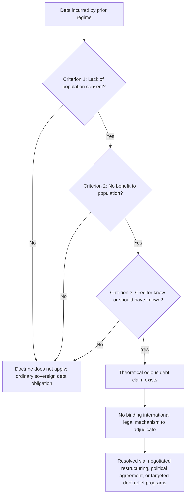
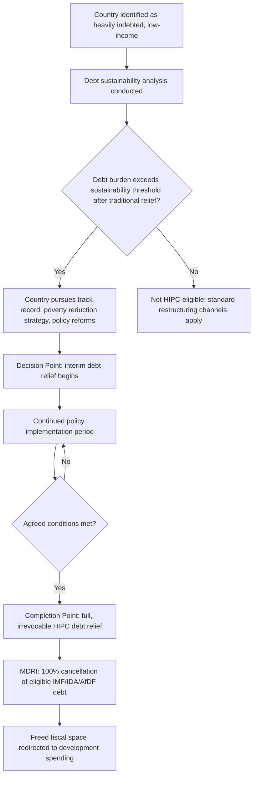

## Odious Debt and Debt Relief Initiatives

### Overview

Odious debt is a legal and normative doctrine holding that certain sovereign debts should not be considered binding obligations of a state or its people when the debt was incurred by an illegitimate regime, without benefiting the population, and with the lending creditor's knowledge of these circumstances. Alongside this contested legal doctrine, this topic covers the major multilateral **debt relief initiatives** — most notably the Heavily Indebted Poor Countries (HIPC) Initiative and the Multilateral Debt Relief Initiative (MDRI) — developed to address unsustainable debt burdens in low-income countries, connecting the theoretical enforcement and sustainability material earlier in this chapter to concrete historical debt relief policy.

### The Odious Debt Doctrine: Origins and Legal Status

The doctrine traces to the writings of Alexander Sack, a Russian legal scholar, in the 1920s, who articulated criteria under which a successor government might legitimately repudiate debts incurred by a prior regime.

**Key Points**

- Sack's classical formulation requires three conditions for a debt to be considered "odious": (1) the debt was contracted **without the consent of the population** (i.e., by a despotic or non-representative regime), (2) the debt did **not benefit the population** (e.g., funds were used for repression, personal enrichment of rulers, or purposes contrary to the population's interests), and (3) **creditors knew or should have known** these circumstances at the time of lending
- Despite its historical pedigree and continued academic and advocacy interest, odious debt **has never been formally codified into binding international law** and has been applied in practice only inconsistently and controversially, typically through ad hoc political and diplomatic processes rather than a recognized legal adjudication mechanism
- The doctrine sits in tension with the general principle of **state continuity** in international law — that a state's obligations persist across changes in government — which creditors and many legal scholars argue is essential for the basic functioning of sovereign credit markets, since abandoning this principle could undermine the enforceability of sovereign debt more broadly

### Historical Invocations and Precedents

**Key Points**

- The doctrine's most frequently cited historical precedent, and Sack's own primary reference point, is the **Cuban debt repudiation** following the Spanish-American War (1898), where the United States argued that certain Cuban debts incurred under Spanish colonial rule were not binding on the new Cuban government, as they were used to suppress the Cuban independence movement itself
- Modern invocations have included debates over debts incurred by apartheid-era South Africa, by the Mobutu regime in Zaire (Democratic Republic of Congo), by Saddam Hussein's government in Iraq, and by various other regimes widely characterized as illegitimate, kleptocratic, or repressive
- In most modern cases, actual debt relief for these situations has generally been achieved through **negotiated restructuring, political agreement, or targeted multilateral debt relief programs**, rather than through formal legal recognition of an odious debt claim — reflecting the doctrine's continued lack of binding legal status in practice [Inference: the degree to which "odious debt" reasoning has *informally* influenced negotiated outcomes, even without formal legal recognition, is difficult to establish with precision and is debated among legal scholars]

### Practical and Economic Critiques of the Odious Debt Doctrine

**Key Points**

- **Ex ante lending discipline concern**: if a formal odious debt doctrine were reliably enforceable, this could in principle *improve* creditor screening of borrower legitimacy (an argument in the doctrine's favor), but critics counter that in practice it is extremely difficult to define and adjudicate "illegitimacy" and "benefit to the population" in advance or even after the fact, creating substantial legal uncertainty
- **Retroactive application risk**: if a successor government could too easily repudiate a prior government's debts as "odious," this could undermine the enforceability of sovereign debt generally, potentially raising borrowing costs even for legitimate governments, since creditors would need to price in the risk of future repudiation
- **Determination mechanism**: there is no agreed, impartial international body empowered to formally adjudicate odious debt claims, meaning that in practice, disputes are resolved through political negotiation, unilateral action, or ordinary debt restructuring processes rather than through a distinct "odious debt" legal channel

### Diagram: Odious Debt Doctrine — Criteria and Practical Path

### Multilateral Debt Relief: The HIPC Initiative

Distinct from (though sometimes conceptually overlapping with) odious debt claims, the **Heavily Indebted Poor Countries (HIPC) Initiative**, launched by the IMF and World Bank in 1996 and enhanced in 1999, represents the major formal multilateral mechanism for providing debt relief to low-income countries facing unsustainable debt burdens.

**Key Points**

- HIPC eligibility and relief amounts are determined through a formal **debt sustainability analysis** (connecting directly to the DSA framework covered earlier in this chapter), assessing whether a country's debt burden, after traditional relief mechanisms, remains above established sustainability thresholds
- The initiative operates through a **two-stage process**: a "decision point," at which a country demonstrating a track record of sound policy and a poverty-reduction strategy becomes eligible for interim debt relief, and a "completion point," at which full, irrevocable debt relief is granted upon meeting further agreed policy conditions
- Crucially, HIPC involves **comparable treatment across creditor types** — coordinating relief from multilateral creditors (IMF, World Bank, regional development banks), Paris Club bilateral creditors, and, to varying degrees of success, private and non-Paris-Club bilateral creditors — addressing the collective action and coordination problems discussed in the sovereign default topic

### The Multilateral Debt Relief Initiative (MDRI)

**Key Points**

- Launched in 2005, the **MDRI** went further than HIPC by providing **100% cancellation** of eligible debt owed to the IMF, World Bank's International Development Association (IDA), and the African Development Fund, for countries that had reached the HIPC completion point
- MDRI was motivated partly by recognition that even after HIPC relief, many countries retained debt burdens viewed as inconsistent with achieving the Millennium Development Goals, and partly by sustained advocacy campaigns (e.g., the Jubilee 2000 movement) pressing for more complete debt cancellation for the poorest countries
- Together, HIPC and MDRI are credited with substantially reducing debt burdens across dozens of low-income countries, freeing up fiscal space historically directed toward debt service for redirection toward health, education, and other development spending [Inference: the precise magnitude of resulting development spending increases attributable specifically to debt relief, versus other concurrent factors, varies across empirical studies]

### Diagram: HIPC/MDRI Process Flow

### The Return of Debt Distress: Post-HIPC Vulnerabilities

**Key Points**

- Despite the substantial relief provided by HIPC and MDRI, a number of formerly HIPC-eligible countries have since **re-accumulated significant debt burdens**, reflecting renewed borrowing (including from a broader and more diverse creditor base than in the original HIPC era) amid continued development financing needs, commodity price volatility, and, in some cases, weaker fiscal discipline
- The rise of **non-Paris-Club official creditors** — most notably substantially increased bilateral lending from China, alongside other non-traditional bilateral and commercial creditors — has complicated the debt relief and restructuring landscape considerably, since these creditors often do not participate in traditional Paris Club coordination mechanisms, creating new collective action and transparency challenges echoing, in a modern form, the coordination problems discussed in the sovereign default topic
- In response to renewed debt distress concerns, particularly following the economic disruption of the COVID-19 pandemic, the G20 established the **Debt Service Suspension Initiative (DSSI)** (2020) and the subsequent **Common Framework for Debt Treatment** (2020), aiming to extend more systematic, broader-creditor-base coordination for debt restructuring involving both traditional Paris Club and newer official bilateral creditors [Unverified: the Common Framework's practical effectiveness and specific case outcomes have evolved considerably since its introduction and should be verified against current reporting for the most up-to-date assessment]

### Debt Relief versus Odious Debt: A Conceptual Distinction

| Dimension | Odious Debt Doctrine | HIPC/MDRI Debt Relief |
| --- | --- | --- |
| Legal basis | Contested, uncodified customary law argument | Formal multilateral institutional programs (IMF/World Bank) |
| Trigger | Illegitimacy of the regime that incurred the debt | Debt sustainability threshold breach, regardless of the legitimacy of the original borrowing regime |
| Determination mechanism | No agreed international adjudicator | Formal, though negotiated, IMF/World Bank DSA-based process |
| Creditor participation | Often unilateral/contested repudiation | Coordinated, multi-creditor participation (with varying success) |
| Primary aim | Justice/legitimacy-based debt non-recognition | Restoring debt sustainability and freeing development fiscal space |

### Example

Consider a low-income country that, decades earlier, accumulated substantial external debt under a non-representative government that used a significant portion of borrowed funds for military spending and does not appear, in retrospect, to have generated broad-based development benefits for the population — a textbook candidate for odious debt arguments under Sack's classical criteria.

In practice, rather than pursuing a formal (and legally uncertain) odious debt claim, the country — now under a different government — instead qualifies for the HIPC Initiative based on a standard debt sustainability analysis showing its debt burden exceeds sustainable thresholds. It develops a poverty reduction strategy, reaches the HIPC decision point with interim relief, implements agreed policy reforms over several years, and eventually reaches the completion point, receiving full and irrevocable relief under HIPC, followed by 100% cancellation of eligible remaining multilateral debt under MDRI.

While advocacy groups and some legal scholars may characterize the underlying original debt as "odious" in the historical/moral sense, the actual relief achieved flows through the technical, institutionally coordinated HIPC/MDRI channel rather than through any formal legal finding of debt illegitimacy — illustrating how, in practice, the *debt sustainability and coordinated relief* framework has proven far more operationally significant than the *odious debt legal doctrine* itself, despite the latter's continued prominence in academic and advocacy discourse.

### Conclusion

Odious debt represents a normatively significant but legally unsettled doctrine, offering a framework for arguing that certain sovereign debts should not bind successor governments or populations, but lacking any formal, internationally recognized adjudication mechanism and applied only inconsistently in practice. By contrast, the HIPC Initiative and MDRI represent the major formal, institutionally coordinated channels through which substantial debt relief has actually been delivered to low-income countries facing unsustainable debt burdens — grounded not in judgments about the legitimacy of how debt was originally incurred, but in the technical debt sustainability analysis framework covered earlier in this chapter. The more recent emergence of a more diverse, less traditionally coordinated creditor base, however, has renewed concerns about debt distress and coordination challenges in the low-income country context, motivating ongoing reform efforts such as the G20 Common Framework.

**Related Topics**

- Sovereign borrowing and the problem of enforcement
- Debt sustainability analysis and sustainability thresholds
- Sovereign default and debt renegotiation
- The Paris Club and coordination among official bilateral creditors
- The rise of non-Paris-Club creditors (China as an official bilateral lender)
- The G20 Debt Service Suspension Initiative and Common Framework for Debt Treatment
- The IMF as a lender of last resort
- Jubilee 2000 and civil society debt relief advocacy
- State succession and continuity of obligations in international law
- Collective action clauses and creditor coordination problems
- The Millennium Development Goals and development financing