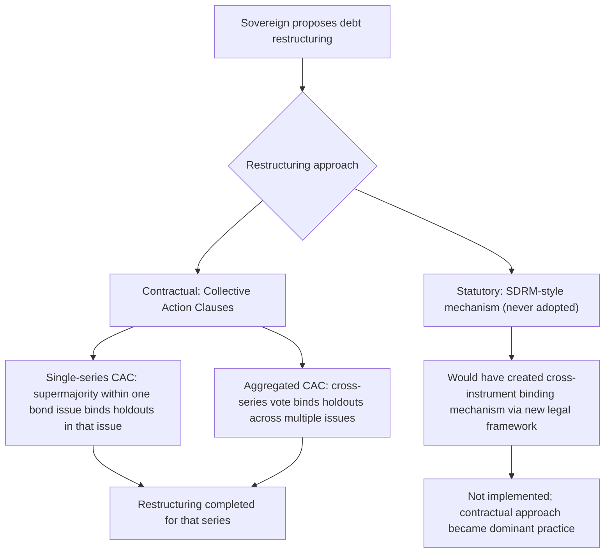
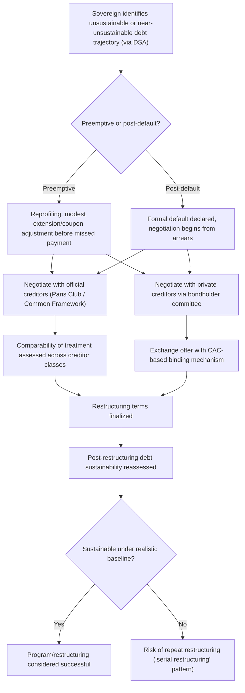

## Mechanisms for Sovereign Debt Restructuring

### Overview

Sovereign debt restructuring encompasses the formal and informal processes, institutions, and contractual tools through which a sovereign's debt obligations are renegotiated and altered following default or in anticipation of unsustainable debt dynamics. This topic synthesizes and extends the mechanisms introduced across this chapter — collective action clauses, the Paris and London Clubs, statutory reform proposals, and market-based exchange processes — providing a consolidated technical treatment of how sovereign debt is actually restructured in the absence of a formal international bankruptcy regime.

### The Absence of a Sovereign Bankruptcy Court

**Key Points**

- As established in the enforcement problem discussion, there is no supranational court empowered to place a sovereign into bankruptcy, appoint a receiver, or bind all creditors to a court-approved reorganization plan in the way domestic corporate bankruptcy law (e.g., US Chapter 11) operates
- This absence is the foundational reason sovereign debt restructuring has developed as a **decentralized, contractually and diplomatically negotiated process** rather than a centralized legal one, giving rise to the range of contractual and institutional mechanisms surveyed in this topic
- The debate over whether to create a **formal statutory sovereign bankruptcy mechanism** — most prominently the IMF's proposed **Sovereign Debt Restructuring Mechanism (SDRM)** in the early 2000s — versus relying on **contractual, market-based solutions** (collective action clauses) represents one of the central policy debates in this field, discussed in detail below

### Two Broad Approaches: Statutory versus Contractual

| Dimension | Statutory Approach (e.g., SDRM) | Contractual Approach (CACs) |
| --- | --- | --- |
| Legal basis | Would require new international treaty/legal architecture | Built into existing bond contracts under national law |
| Binding power over holdouts | Comprehensive, treaty-based binding mechanism | Binding only within the scope of the specific contractual clause and threshold |
| Implementation status | Never adopted; proposed and debated, not implemented | Widely adopted in practice since the mid-2000s, especially post-Argentina |
| Coordination across instruments | Would in principle cover all a sovereign's debt simultaneously | Requires aggregation clauses to bind across multiple bond series; still leaves gaps for non-bond debt (bilateral loans) |
| Political feasibility | Requires broad international treaty consensus; proved politically unachievable | Achieved through market practice and individual issuer/underwriter adoption |

### The Statutory Proposal: The Sovereign Debt Restructuring Mechanism (SDRM)

**Key Points**

- Proposed by the IMF (led notably by then-First Deputy Managing Director Anne Krueger) in the early 2000s, the SDRM would have created a **formal legal mechanism**, akin to an international bankruptcy framework, allowing a qualified supermajority of a sovereign's creditors (across debt instruments, not just within a single bond series) to approve a restructuring binding on all creditors, alongside features such as a stay on litigation during negotiations (analogous to an automatic stay in domestic bankruptcy law)
- The proposal faced **significant opposition**, particularly from major creditor-country financial industries and some governments, on grounds including concerns about ceding sovereignty over debt contract enforcement to a new international legal body, concerns that it might reduce debt discipline (a moral hazard-adjacent argument), and disagreement over the appropriate institutional home for such a mechanism (with some viewing IMF sponsorship as a conflict of interest given the IMF's own role as a large sovereign creditor)
- The SDRM was **ultimately not adopted**, and the international community instead moved toward the contractual approach — widespread adoption of collective action clauses — as the primary practical response to the collective action and holdout problems the SDRM was designed to address

### Contractual Mechanisms: Collective Action Clauses in Detail

Building on the collective action clause concept introduced in the enforcement and default topics, this section details the specific mechanics.

**Key Points**

- **Standard (single-series) CACs**: require a qualified majority (historically often 75%, though thresholds vary by contract) of holders **within a single bond issue** to approve a restructuring that then becomes binding on the remaining holders of that same issue
- **Aggregated CACs** (developed and increasingly standard following the Argentina litigation, formalized in updated International Capital Market Association model clauses around 2014): allow a **two-limb voting structure** — a lower threshold applied across an aggregated pool of multiple bond series (e.g., 66⅔%) combined with a minimum threshold within each individual series (e.g., 50%) — designed to prevent holdouts from concentrating in a single small series to block restructuring of that series while benefiting from relief achieved in others
- **Engagement/consent solicitation clauses**: some modern contracts include provisions facilitating early creditor engagement and information-sharing during a restructuring negotiation, intended to streamline the process and improve creditor coordination even before formal voting occurs

### Official Sector Coordination Mechanisms

**The Paris Club**: as discussed in the sovereign default topic, coordinates restructuring of **official bilateral debt** among major (traditionally Western/OECD) creditor governments, operating on informal consensus principles and case-by-case negotiation, with the **comparability of treatment** principle requiring the debtor to seek broadly comparable relief from other creditor categories.

**The evolving role of non-Paris-Club official creditors**: as discussed in the odious debt and debt relief topic, the significant rise of bilateral lending from countries outside the traditional Paris Club — most notably China — has created a substantial coordination gap, since these creditors are not bound by Paris Club processes or principles, complicating comprehensive, comparable-treatment restructurings.

**The G20 Common Framework for Debt Treatment (2020)**: developed specifically to extend more systematic coordination between traditional Paris Club creditors and major non-Paris-Club official bilateral creditors (explicitly designed with China's expanded lending role in mind), aiming to establish agreed principles for comparability of treatment across this broader and more heterogeneous official creditor base. [Unverified: the Common Framework's practical track record across specific restructuring cases has continued to evolve and should be checked against current reporting for the latest case outcomes and assessment of its effectiveness]

### Private Sector Coordination: Bondholder Committees and Exchange Offers

**Key Points**

- With the shift from syndicated bank lending (historically coordinated via the London Club) toward tradable bonds held by a diffuse and often difficult-to-identify investor base, modern private-sector restructuring typically proceeds through **ad hoc bondholder committees**, often organized around the largest identifiable institutional holders, which negotiate indicative terms with the sovereign
- The restructuring is then formally implemented through an **exchange offer**: the sovereign offers holders of existing bonds the opportunity to exchange them voluntarily for new instruments with different terms (typically reduced face value, lower coupons, and/or extended maturities), with CACs used to bind any remaining holdouts once the required voting threshold is achieved
- **Principal Reduction Instruments and value recovery instruments**: some restructurings incorporate instruments such as **GDP-linked warrants** or **value recovery instruments**, which provide creditors additional payments if the debtor's subsequent economic performance exceeds specified benchmarks, intended to better align creditor and debtor interests around shared upside while allowing more debt relief in the base case

### The Role of Litigation and Holdout Risk (Recap and Extension)

**Key Points**

- Even with widespread CAC adoption, litigation risk from holdout creditors has not been entirely eliminated, particularly for **older bond issues predating aggregated CAC adoption**, which remain governed by pre-2014-style single-series clauses or, in some historical cases, no CACs at all
- The Argentina precedent (discussed in the enforcement problem topic) demonstrated that creative interpretation of standard contractual clauses (*pari passu*) can create substantial practical leverage for holdouts even without seizing core sovereign assets, by blocking payment flows to *cooperating* creditors through the international payment system — a risk that continues to inform both contract drafting and sovereign litigation strategy in ongoing and future restructurings

### Sequencing and Timing: Preemptive versus Post-Default Restructuring

**Key Points**

- **Preemptive (or "reprofiling") restructurings**: undertaken before an actual payment default, typically involving relatively modest maturity extensions or coupon adjustments, often pursued when a sovereign anticipates a liquidity (rather than solvency) problem and seeks to avoid the formal default classification and associated reputational and market access costs
- **Post-default restructurings**: undertaken after a missed payment has already occurred, typically involving more substantial haircuts and longer negotiation periods, and carrying the formal "default" designation with its associated reputational and credit rating consequences
- The choice and feasibility of preemptive restructuring is closely tied to the debt sustainability analysis and self-fulfilling crisis dynamics discussed earlier in this chapter: a credible, early, and sufficiently generous restructuring offer may successfully avert a self-fulfilling rollover crisis, whereas an inadequate offer, or one perceived as too small, risks failing to restore confidence while still imposing reputational costs similar to those of outright default

### Diagram: The Restructuring Decision Tree

### Comparability of Treatment and Inter-Creditor Equity

**Key Points**

- A persistent technical and political challenge in restructuring involving multiple creditor classes (official bilateral, multilateral, and private) is ensuring **comparability of treatment** — that no single creditor class receives disproportionately favorable treatment relative to others bearing similar seniority, since perceived unfairness can undermine both the negotiation process and future creditor cooperation
- **Multilateral creditors** (IMF, World Bank, regional development banks) are conventionally treated as having **preferred creditor status**, generally excluded from restructuring/haircuts, a practice justified by their role in providing crisis financing precisely when private markets withdraw, though this convention itself is sometimes debated, particularly as multilateral exposure has grown in some heavily indebted countries
- Achieving genuine comparability across increasingly heterogeneous creditor bases (including non-Paris-Club bilateral lenders, diverse private bondholders, and syndicated commercial loans) remains one of the most significant practical challenges in modern sovereign debt restructuring, motivating ongoing reform discussions such as the G20 Common Framework

### Example

A country facing a debt sustainability crisis, with debt held across Paris Club bilateral creditors, a large Chinese bilateral loan portfolio, a syndicated commercial bank loan, and several series of international bonds issued in different years under different (some pre-2014, some post-2014) contractual terms, seeks a comprehensive restructuring.

The process unfolds across parallel tracks: the government engages the Paris Club and, given China's substantial exposure, invokes the G20 Common Framework to coordinate comparable treatment between traditional and non-traditional official creditors — a genuinely novel coordination challenge given differing transparency norms and negotiating practices. Simultaneously, it forms informal engagement with an ad hoc bondholder committee representing its Eurobond holders, ultimately proposing an exchange offer combining face value reduction, coupon cuts, and maturity extension.

For its more recently issued bonds (containing aggregated CACs), the government can, once a sufficient cross-series supermajority is achieved, bind any remaining holdout minority. For an older bond series issued under pre-2014, single-series-only CAC terms, however, achieving the necessary single-series threshold proves more difficult, and a small holdout minority in that specific series threatens to pursue *pari passu*-style litigation reminiscent of the Argentina precedent. The government ultimately offers modestly improved terms specifically for that legacy series to secure sufficient participation, illustrating how the **vintage of contractual technology** embedded in different bond issues can materially affect the practical difficulty and even the terms of an otherwise coordinated restructuring effort.

### Conclusion

In the absence of a formal international sovereign bankruptcy regime — a statutory approach proposed via the SDRM but never adopted — sovereign debt restructuring has developed as a decentralized process combining contractual innovation (single-series and aggregated collective action clauses), official sector coordination bodies (the Paris Club, and increasingly the G20 Common Framework addressing non-traditional creditors), and private-sector negotiation mechanisms (bondholder committees, exchange offers). While this contractual, market-based system has achieved substantial practical success — particularly through the widespread post-Argentina adoption of aggregated CACs — genuine challenges remain in achieving comprehensive, timely, and equitable restructuring across an increasingly heterogeneous global creditor base, a challenge at the center of ongoing sovereign debt architecture reform efforts.

**Related Topics**

- Sovereign borrowing and the problem of enforcement
- Sovereign default and debt renegotiation
- Debt sustainability analysis and restructuring calibration
- The Sovereign Debt Restructuring Mechanism (SDRM) proposal
- Collective action clauses: single-series versus aggregated
- The Paris Club, London Club, and the G20 Common Framework for Debt Treatment
- The Argentina holdout litigation and *pari passu* clause interpretation
- Preferred creditor status of multilateral institutions
- GDP-linked warrants and value recovery instruments
- Odious debt and debt relief initiatives (HIPC/MDRI)
- The rise of non-Paris-Club official creditors (China as bilateral lender)
- Preemptive versus post-default restructuring strategies