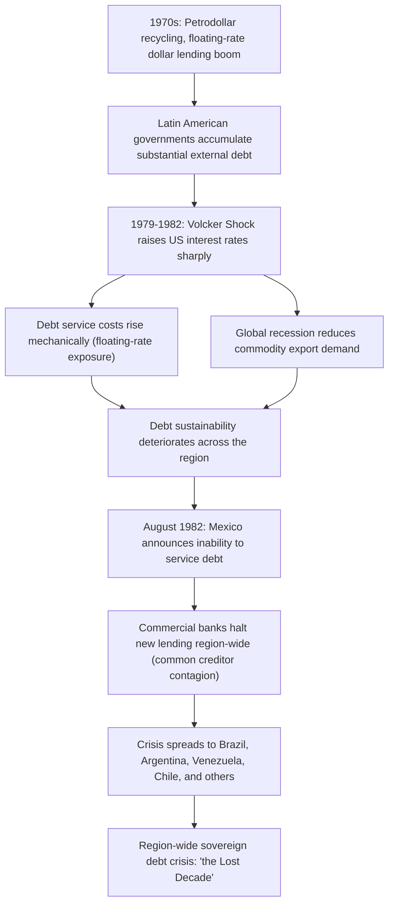
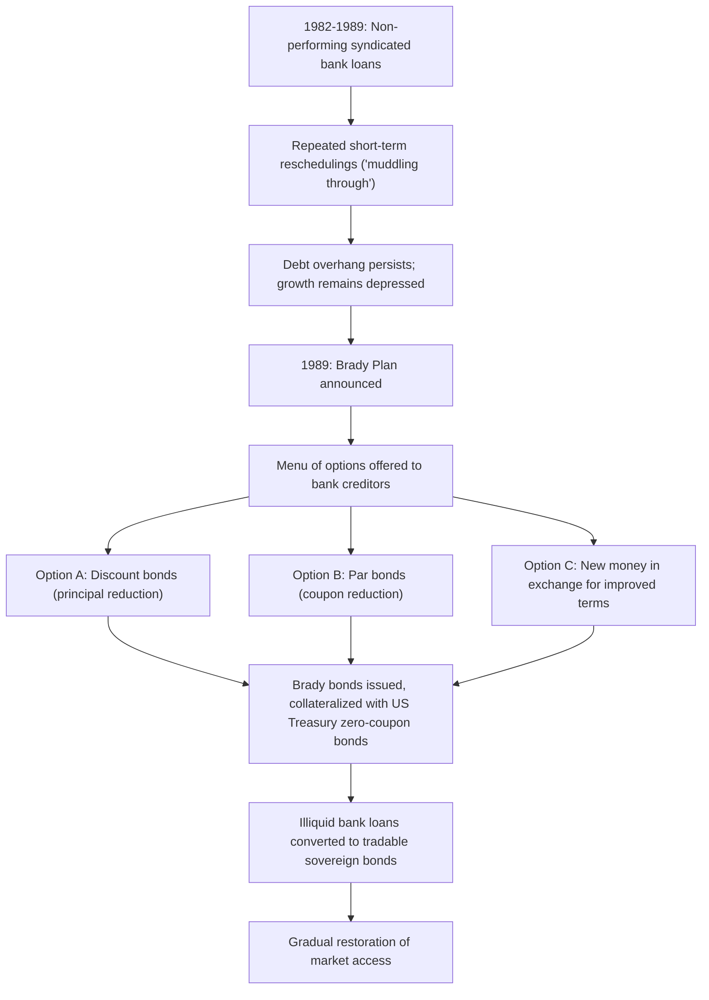

## The Latin American Debt Crisis of the 1980s

### Overview

The Latin American debt crisis, precipitated by Mexico's announcement in August 1982 that it could not meet its external debt obligations, marked the onset of a region-wide sovereign debt crisis that engulfed most major Latin American economies throughout the 1980s — a period subsequently termed the region's "lost decade." The crisis represents one of the most significant applications of the sovereign borrowing, enforcement, default, and restructuring frameworks developed earlier in this course, and its resolution through the Brady Plan established institutional and financial precedents that continue to influence sovereign debt restructuring practice today.

### Origins: The 1970s Lending Boom

**Key Points**

- Following the 1973 and 1979 oil price shocks, oil-exporting countries accumulated large current account surpluses ("petrodollars"), which were substantially **recycled through international commercial banks** as loans to developing countries, including heavily to Latin America
- Latin American governments, pursuing import-substitution industrialization and infrastructure development, borrowed extensively, often at **floating interest rates** tied to benchmarks such as LIBOR, exposing them directly to future global interest rate movements
- Commercial bank lending to the region expanded through **syndicated loan structures**, in which large loans were shared across many banks, spreading individual bank exposure but also creating the coordination challenges that would later complicate restructuring negotiations (foreshadowing the London Club mechanism discussed in the sovereign default topic)
- Much of this borrowing occurred under conditions of negative or low real interest rates during the mid-1970s, creating a perception among both borrowers and lenders that debt levels were manageable — a dynamic connecting directly to the debt sustainability framework's $r-g$ differential, which was favorable during this period but would soon reverse sharply

### The Trigger: US Monetary Tightening and the Volcker Shock

**Key Points**

- Beginning in 1979, the US Federal Reserve under Chairman Paul Volcker sharply raised interest rates to combat domestic inflation, an episode commonly termed the **"Volcker Shock."** Given the predominance of floating-rate, dollar-denominated debt in Latin American borrowing, this **mechanically and dramatically raised debt service costs** across the region
- Higher US interest rates also contributed to a **global recession**, reducing demand for Latin American commodity exports and worsening the region's terms of trade, directly damaging the primary balance and growth components of the debt sustainability equation covered earlier in this chapter
- The resulting sharp increase in $r$ (interest rates) combined with falling $g$ (growth) created precisely the **unfavorable "snowball" dynamic** described in the debt sustainability analysis framework, making previously serviceable debt levels rapidly unsustainable across multiple economies simultaneously

### The Trigger Event: Mexico's 1982 Announcement

In August 1982, Mexico's finance minister informed US and IMF officials that Mexico could not meet upcoming debt service payments, precipitating an immediate crisis of confidence that rapidly spread across the region.

**Key Points**

- The announcement triggered an immediate **halt to new lending** by commercial banks not just to Mexico but across Latin America, illustrating the **common creditor contagion channel** discussed in the currency crisis contagion topic — banks heavily exposed to the region simultaneously reassessed and curtailed lending to other Latin American borrowers, regardless of those countries' individual fundamentals
- Within months, similar debt servicing crises emerged in Brazil, Argentina, Venezuela, Chile, and numerous other Latin American economies, illustrating a textbook case of **contagion via shared creditor exposure and wake-up-call reassessment**

### Initial Response: Muddling Through and Short-Term Reschedulings

**Key Points**

- The initial international response, spanning roughly 1982–1985, involved a series of **short-term debt reschedulings** — maturity extensions on existing bank loans, combined with new "involuntary lending" (additional bank loans provided largely to enable continued interest payments on existing debt, sometimes termed "extend and pretend" or "defensive lending")
- The IMF played a central coordinating role during this period, providing financing conditional on austerity-oriented adjustment programs (fiscal consolidation, monetary tightening, and structural reforms), consistent with the IMF conditionality framework discussed earlier in this chapter
- This approach reflected an implicit assumption that the crisis was primarily a **temporary liquidity problem** rather than a fundamental **solvency problem** — a distinction directly paralleling the solvency-versus-liquidity framework in debt sustainability analysis — an assumption that proved largely incorrect as the crisis persisted for years without genuine resolution

### The "Lost Decade": Economic Consequences

**Key Points**

- Throughout the 1980s, most major Latin American economies experienced **stagnant or negative per-capita income growth**, elevated inflation (in several cases escalating into hyperinflation, notably in Argentina, Brazil, and Peru), and sharply curtailed investment, as scarce foreign exchange and fiscal resources were directed toward debt service rather than productive investment
- The prolonged crisis illustrated the **significant output costs of unresolved sovereign debt distress** discussed in the sovereign default topic — with the added complication that the "muddling through" approach of repeated short-term reschedulings, rather than decisive restructuring, may have **prolonged and deepened these costs** relative to an earlier, more comprehensive resolution [Inference: the counterfactual comparison to an earlier comprehensive restructuring is necessarily speculative, though widely discussed in retrospective assessments of the crisis]
- The **Baker Plan** (1985), proposed by US Treasury Secretary James Baker, attempted to shift strategy toward encouraging new lending combined with structural reforms to restore growth, but achieved only limited success in materially resolving the underlying debt overhang

### The Debt Overhang Problem

A key theoretical concept clarified by the Latin American crisis experience is the **debt overhang** problem, formalized in the economic literature (notably by Krugman, 1988, and Sachs, 1989).

**Key Points**

- Debt overhang describes a situation in which **existing debt is so large that expected future debt service effectively acts as a tax on new investment and growth** — since a substantial share of any future economic improvement would be captured by existing creditors rather than benefiting the country or incentivizing new investment, both domestic and foreign investors have reduced incentive to invest even in fundamentally sound projects
- This creates a **theoretical case for debt reduction (rather than merely rescheduling) being in creditors' collective interest**: on the "debt relief Laffer curve" logic, beyond a certain debt level, further debt actually reduces the *expected present value* of repayment, since it discourages the very growth needed to generate repayment capacity — meaning creditors might, in aggregate, be better off accepting a partial write-down than continuing to press for full nominal repayment on an unpayable debt stock
- This insight provided crucial intellectual justification for the shift toward **debt reduction** (rather than pure rescheduling) that characterized the eventual resolution via the Brady Plan

### The Brady Plan: Resolution Through Debt Reduction

Announced in 1989 by US Treasury Secretary Nicholas Brady, the **Brady Plan** represented a fundamental shift in strategy from rescheduling toward **negotiated debt and debt-service reduction**, combined with credit enhancement to restore market access.

**Key Points**

- Under the Brady Plan framework, commercial bank creditors were offered a **menu of options**, typically including: (a) exchanging existing loans for new **"Brady bonds"** at a discount to face value (principal reduction), (b) exchanging loans for Brady bonds at par but with a reduced coupon rate (interest reduction), or (c) providing new money in exchange for more favorable terms on existing exposure
- Brady bonds were typically **partially collateralized**, with **principal collateral** often consisting of US Treasury zero-coupon bonds (purchased using a combination of the debtor country's own reserves, and financing support from the IMF, World Bank, and Japanese Export-Import Bank), and sometimes **rolling interest guarantees** covering a limited number of future coupon payments — this collateralization was central to restoring investor confidence and creating a liquid, tradable instrument out of previously illiquid syndicated bank loans
- Mexico was the first country to complete a Brady restructuring in 1989–1990, followed over the subsequent several years by most other major Latin American debtors including Argentina, Brazil, Venezuela, and others, as well as several countries outside the region
- The Brady Plan is widely credited with **effectively ending the acute phase of the Latin American debt crisis**, restoring gradual market access for the region and creating a template — debt reduction combined with credit enhancement and conversion into tradable instruments — that influenced subsequent sovereign debt restructuring practice, including the eventual shift toward the bond-based, CAC-governed restructuring mechanisms discussed in the mechanisms for sovereign debt restructuring topic

### Diagram: From Bank Loans to Brady Bonds

### Comparability with Modern Restructuring Frameworks

| Dimension | 1980s Latin American Crisis (London Club era) | Modern Bond-Based Restructuring |
| --- | --- | --- |
| Primary creditor type | Syndicated commercial bank loans | Diffuse international bondholders |
| Coordination mechanism | London Club, informal bank steering committees | Bondholder committees, exchange offers |
| Holdout problem | Limited (fewer, larger, more coordinated bank creditors) | More significant (diffuse bondholders), addressed via CACs |
| Resolution instrument | Brady bonds (collateralized, tradable) | Uncollateralized new bonds via exchange offer |
| Timeline to resolution | Approximately 7 years (1982-1989) from crisis onset to Brady Plan template establishment | Varies significantly by case; often faster with aggregated CACs |

### Lessons and Legacy

**Key Points**

- The crisis provided strong empirical support for the **debt overhang** concept and demonstrated the economic costs of delayed, incomplete debt resolution (the "muddling through" years) relative to a more decisive restructuring approach — an insight that has informed subsequent debt sustainability analysis practice, which now explicitly weighs whether continued financing versus restructuring better serves both debtor and creditor interests
- The Brady Plan's structural innovation — converting distressed bank loans into **standardized, tradable, partially collateralized bonds** — helped catalyze the broader shift of emerging market sovereign finance from **relationship-based bank lending toward securitized bond markets**, a structural transformation that shaped the subsequent creditor landscape (and associated coordination challenges) relevant to later crises including the Asian Financial Crisis, Argentina's 2001 default, and the modern bond-based restructuring mechanisms discussed elsewhere in this chapter
- The crisis also reinforced the practical significance of **contagion via common creditor exposure**, foreshadowing similar dynamics observed in the Tequila Crisis, Asian Financial Crisis, and other episodes covered in the currency crisis chapter

### Example

Consider Brazil's experience through the crisis: after suspending debt payments in 1987 amid mounting economic strain, Brazil pursued a combination of IMF-supported adjustment programs and periodic rescheduling agreements with its commercial bank creditor committee throughout the late 1980s, without achieving durable resolution — inflation accelerated toward hyperinflation, investment stagnated, and per-capita income showed little sustained improvement, illustrating the debt overhang dynamic in acute form.

Following the Brady Plan's introduction, Brazil eventually completed its own Brady restructuring in 1994, converting a substantial stock of non-performing bank debt into a menu of collateralized Brady bond instruments, achieving meaningful debt and debt-service reduction. This restructuring coincided with (and is often credited as contributing to) the broader macroeconomic stabilization achieved through Brazil's Real Plan of the mid-1990s, illustrating how resolving the debt overhang through the Brady mechanism helped restore conditions conducive to renewed investment and growth, consistent with the theoretical debt overhang logic discussed above.

### Conclusion

The Latin American debt crisis of the 1980s stands as a foundational case study connecting nearly every theoretical concept developed in this chapter: unsustainable floating-rate dollar borrowing exposed to a sharp global interest rate shock (debt sustainability dynamics), an enforcement and coordination problem among diffuse commercial bank creditors (the enforcement and default frameworks), a prolonged period of inadequate "muddling through" restructuring illustrating the debt overhang problem, and eventual resolution through the innovative Brady Plan combining debt reduction with credit enhancement. The crisis's decade-long resolution timeline and associated "lost decade" of regional economic stagnation offered enduring lessons about the costs of delayed, insufficient debt restructuring — lessons that continue to inform debt sustainability analysis and restructuring policy today, even as the creditor landscape has since shifted decisively from syndicated bank loans toward the bond-based, CAC-governed structures discussed in the mechanisms for sovereign debt restructuring topic.

**Related Topics**

- Sovereign borrowing and the problem of enforcement
- Debt sustainability analysis and the $r-g$ differential
- Sovereign default and debt renegotiation
- Mechanisms for sovereign debt restructuring
- The debt overhang problem (Krugman 1988, Sachs 1989)
- The Brady Plan and Brady bonds
- The London Club and syndicated bank loan restructuring
- Contagion across currencies and asset markets (common creditor channel)
- The 1994 Mexican Peso Crisis (as a subsequent, distinct episode in the same region)
- Hyperinflation episodes in Argentina, Brazil, and Peru
- IMF conditionality and structural adjustment programs
- Brazil's Real Plan and post-Brady macroeconomic stabilization