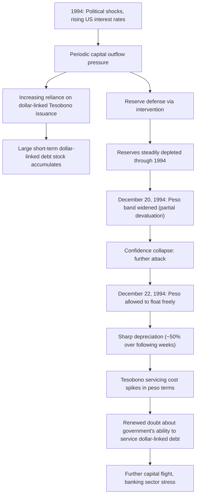

## The 1994 Mexican Peso Crisis

### Overview

The 1994 Mexican Peso Crisis, often called the **"Tequila Crisis,"** began with Mexico's sudden devaluation and subsequent float of the peso in December 1994, precipitating a severe financial crisis that combined elements of first-generation fiscal/monetary imbalance, second-generation confidence dynamics, and — critically — a debt-specific dimension involving short-term dollar-indexed government securities (*Tesobonos*) that anticipated key features of the third-generation balance sheet crisis framework applied more fully to the Asian Financial Crisis. The episode also produced the first major modern instance of significant financial contagion (as discussed in the currency crisis contagion topic) and prompted an unprecedented scale of emergency international financial support.

### Background: The Mexican Economic Reform Context

**Key Points**

- Throughout the early 1990s, Mexico pursued substantial macroeconomic and structural reform, including trade liberalization, privatization, and fiscal consolidation, culminating in Mexico's accession to the **North American Free Trade Agreement (NAFTA)**, effective January 1994, which generated considerable investor optimism and substantial capital inflows
- Mexico operated a **crawling peg / managed exchange rate band** for the peso against the US dollar, intended to serve as a nominal anchor supporting the broader disinflation and reform program
- Large capital inflows during the early 1990s financed a growing **current account deficit**, reaching levels of roughly 6–7% of GDP by 1994, raising sustainability concerns among some analysts even before the crisis unfolded, though the prevailing view among many investors at the time remained relatively optimistic given the reform momentum [Inference: the degree to which the pre-crisis current account deficit alone should have signaled clear unsustainability, versus being consistent with a legitimate capital-inflow-financed development phase, remains debated in retrospective assessments]

### The Political and Economic Shocks of 1994

**Key Points**

- 1994 was marked by significant political instability, including the **Zapatista uprising in Chiapas** (January 1994) and the **assassination of presidential candidate Luis Donaldo Colosio** (March 1994), both of which contributed to rising political risk premiums and periodic capital outflow pressure throughout the year
- The **US Federal Reserve raised interest rates** substantially during 1994, reducing the relative attractiveness of Mexican peso-denominated assets and increasing pressure on the currency, an early example of the kind of external interest rate shock that would recur in various emerging market crisis episodes
- In response to periodic capital outflow pressure during 1994, the Mexican government increasingly financed its financing needs and defended reserves by issuing **Tesobonos** — short-term government securities denominated in pesos but **indexed to the US dollar exchange rate**, effectively providing investors currency protection while allowing the government to avoid an outright, and politically costly, devaluation

### The Tesobono Mechanism: A Precursor to Third-Generation Balance Sheet Logic

**Key Points**

- Tesobonos functioned as **dollar-linked debt issued by the sovereign itself**, meaning that unlike ordinary peso-denominated debt, a devaluation would **not** reduce the real value of this obligation — the government bore the currency risk directly, rather than transferring it to bondholders
- As reserves came under pressure throughout 1994, the Mexican government's reliance on short-term Tesobono issuance grew substantially, both to attract nervous investors (who required currency protection) and to roll over maturing obligations — creating a **large, increasingly short-maturity, dollar-linked liability stock** that would prove central to the crisis's severity
- This structure meant that once the peso was devalued, the domestic-currency (and fiscal) cost of servicing this debt rose sharply — an early, sovereign-level illustration of the **currency mismatch balance sheet mechanism** later formalized more fully in third-generation currency crisis models (applied there primarily to private banks and corporates, but operating through an analogous mechanism at the sovereign level in Mexico's case)

### The Devaluation and Its Aftermath

**Key Points**

- On **December 20, 1994**, the Mexican government widened the peso's trading band, a move intended as a modest, controlled adjustment but instead interpreted by markets as a signal of weakness, triggering intensified capital flight
- Within days, on **December 22, 1994**, the government abandoned the peg entirely, allowing the peso to float; the currency depreciated sharply, losing roughly half its value against the dollar within weeks
- The devaluation, rather than resolving the crisis, **intensified it**: because a substantial share of government debt (Tesobonos) was dollar-indexed, the devaluation directly and mechanically worsened Mexico's fiscal position and debt service burden, threatening the sovereign's ability to roll over this large, increasingly short-term obligation — creating exactly the kind of **self-fulfilling rollover crisis** dynamic later formalized by Cole and Kehoe (2000) and discussed in the debt sustainability analysis topic

### The International Response: An Unprecedented Rescue Package

**Key Points**

- Facing the risk of a sovereign default that could severely damage US financial and economic interests (given extensive US bank and investor exposure, and the newly signed NAFTA relationship), the **US Treasury and Federal Reserve, together with the IMF**, assembled a rescue package of unprecedented scale for the time — approximately $50 billion in total support, including a substantial commitment from the US Exchange Stabilization Fund
- This scale of bilateral US support, provided outside normal IMF channels and involving direct US executive action (given resistance to the plan in the US Congress), was **highly unusual** and reflected the perceived systemic and strategic importance of preventing a Mexican default, foreshadowing later debates about the scale, scope, and appropriate governance of emergency international financial support (connecting to the IMF-as-lender-of-last-resort discussion earlier in this chapter)
- The rescue package enabled Mexico to **meet its Tesobono obligations as they matured**, avoiding an outright sovereign default, while the government implemented a sharp fiscal and monetary tightening program

### Contagion: The "Tequila Effect"

As discussed in the currency crisis contagion topic, the Mexican crisis produced the first major modern demonstration of significant financial contagion, subsequently termed the **"Tequila Effect."**

**Key Points**

- **Argentina** experienced substantial capital outflows and a severe banking sector crisis in early 1995 despite having a currency board arrangement (fixing the peso to the US dollar) and materially different macroeconomic fundamentals from Mexico, illustrating **contagion largely disconnected from direct fundamentals-based linkages** — closer to the "wake-up call" and common-creditor channels discussed in the contagion topic, as investors reassessed emerging market risk broadly following the Mexican episode
- Other Latin American economies, and to a lesser degree some emerging markets outside the region, experienced elevated spreads and capital outflow pressure during this period, consistent with a broad **reassessment of emerging market risk premiums** following Mexico's crisis rather than country-specific fundamental deterioration alone
- The episode substantially informed the subsequent academic literature on contagion (including work by Calvo and Reinhart, among others) examining how crises transmit across countries with limited direct economic linkage

### Comparative Analysis Across Crisis Generation Frameworks

**Key Points**

- **First-generation elements**: the large pre-crisis current account deficit, financed increasingly by short-term and reserve-depleting flows, reflects fiscal/monetary imbalance dynamics consistent with the Krugman framework, even though Mexico's overall fiscal deficit was not extreme by historical crisis-country standards
- **Second-generation elements**: the political shocks of 1994 and the subsequent confidence collapse following the December 20 band-widening announcement illustrate how a policy signal, interacting with pre-existing market nervousness, can trigger a shift from a "confidence" to an "attack" equilibrium — consistent with the multiple-equilibria logic of second-generation models
- **Proto-third-generation elements**: the Tesobono mechanism's currency mismatch, and the way devaluation *worsened* rather than resolved the crisis by increasing the domestic-currency debt service burden, directly anticipates the balance sheet feedback loop later formalized more comprehensively (primarily at the private-sector level) in third-generation models applied to the Asian Financial Crisis
- The crisis is thus frequently cited as an important **transitional case study**, exhibiting features across all three generations of currency crisis theory and helping motivate the subsequent development of third-generation balance sheet models

### Illustration: Tesobono Debt Burden Dynamics

<svg xmlns="http://www.w3.org/2000/svg" viewBox="0 0 700 380">
<text x="350" y="25" text-anchor="middle" font-size="16" font-weight="bold" fill="#1a1a1a">Tesobono Burden Before and After Devaluation (svg_diagram)</text>
<line x1="80" y1="330" x2="650" y2="330" stroke="#333" stroke-width="2" />
<line x1="80" y1="330" x2="80" y2="60" stroke="#333" stroke-width="2" />
<text x="365" y="360" text-anchor="middle" font-size="12" fill="#333">Time (1994 → 1995)</text>
<text x="30" y="200" text-anchor="middle" font-size="12" fill="#333" transform="rotate(-90 30 200)">Peso Value of Tesobono Debt</text>
<path d="M 100 280 L 380 270" fill="none" stroke="#1f77b4" stroke-width="3" />
<text x="150" y="260" font-size="11" fill="#1f77b4">Stable peso cost pre-devaluation</text>
<line x1="380" y1="270" x2="380" y2="120" stroke="#d62728" stroke-width="4" />
<text x="390" y="200" font-size="12" fill="#d62728" font-weight="bold">Dec 1994 devaluation</text>
<text x="390" y="216" font-size="11" fill="#d62728">Peso cost nearly doubles</text>
<path d="M 380 120 L 630 110" fill="none" stroke="#c0392b" stroke-width="3" />
<text x="450" y="100" font-size="11" fill="#c0392b">Elevated debt burden persists</text>
<circle cx="380" cy="270" r="4" fill="#1a1a1a" />
<circle cx="380" cy="120" r="4" fill="#1a1a1a" />
</svg>

### Resolution and Recovery

**Key Points**

- With the emergency financing package in place, Mexico successfully met its Tesobono obligations as they matured through 1995, avoiding formal sovereign default
- The government implemented a sharp macroeconomic stabilization program including significant fiscal tightening and high interest rates, producing a severe but relatively **short-lived recession** in 1995 (Mexican GDP contracted substantially that year), followed by a comparatively rapid recovery beginning in 1996, aided by strengthened export competitiveness following the devaluation and by recovering investor confidence as the emergency financing successfully prevented default
- Mexico **repaid the US rescue loans ahead of schedule**, an outcome frequently cited as demonstrating the rescue's ultimate success in both averting default and being consistent with eventual full recovery of the emergency financing extended

### Lessons and Legacy

**Key Points**

- The crisis highlighted the **specific dangers of short-term, foreign-currency-linked sovereign debt** (the Tesobono mechanism) as a vulnerability distinct from, though related to, the general fiscal sustainability concerns of first-generation models — reinforcing the debt profile vulnerability considerations later formalized in the IMF's debt sustainability analysis frameworks
- The scale and unconventional structure of the US-led rescue package raised significant **moral hazard debates** (as discussed in the IMF-as-lender-of-last-resort topic), with critics arguing it may have encouraged excessive risk-taking by investors in subsequent emerging market lending, anticipating similar rescue support in future crises — a concern frequently revisited following the subsequent Asian Financial Crisis
- The episode substantially advanced the academic and policy understanding of **financial contagion**, directly motivating much of the subsequent theoretical and empirical literature discussed in the currency crisis contagion topic
- The Tesobono experience is frequently cited as a cautionary case study informing subsequent policy emphasis on **debt profile management** — avoiding excessive reliance on short-term, foreign-currency-linked instruments — a theme carried forward into modern debt sustainability analysis practice

### Conclusion

The 1994 Mexican Peso Crisis represents a pivotal episode bridging first, second, and third-generation currency crisis theory, combining underlying fiscal and current account vulnerabilities with a second-generation-style confidence collapse triggered by political shocks and a poorly received policy signal, compounded by a sovereign-level currency mismatch (the Tesobono mechanism) that anticipated the balance sheet dynamics later formalized more fully in third-generation models. The unprecedented scale of the US-led rescue package established an important, if controversial, precedent for emergency international financial support, while the episode's rapid regional contagion effects — the "Tequila Effect" — substantially shaped the subsequent academic and policy literature on financial contagion covered throughout this course.

**Related Topics**

- First generation currency crisis models (fiscal/current account vulnerability dimension)
- Second generation models and self-fulfilling crises (political shock and confidence collapse dimension)
- Third generation models and balance sheet effects (Tesobono currency mismatch as precursor)
- Contagion across currencies and asset markets (the "Tequila Effect")
- Debt sustainability analysis (debt profile and short-term foreign-currency debt vulnerability)
- The IMF as a lender of last resort (moral hazard debate following the rescue package)
- Self-fulfilling sovereign debt/rollover crises (Cole-Kehoe)
- The 1997-98 Asian Financial Crisis (subsequent, more developed third-generation case)
- NAFTA and Mexican structural reform in the early 1990s
- Currency board arrangements (Argentina's response and vulnerability during the Tequila Effect)
- US Exchange Stabilization Fund and unconventional bilateral crisis financing