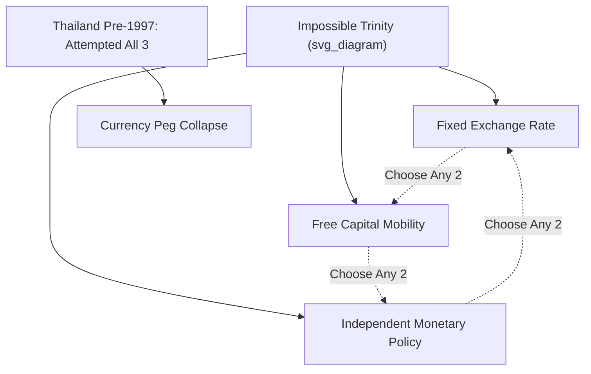
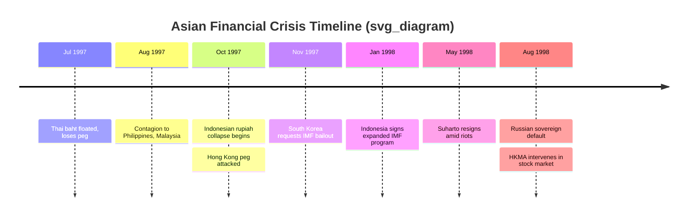

## The 1997 to 1998 Asian Financial Crisis

### Overview

The 1997–1998 Asian Financial Crisis (AFC) was a currency and banking crisis that began in Thailand in July 1997 and spread rapidly to South Korea, Indonesia, Malaysia, and the Philippines, with secondary effects on Hong Kong, Singapore, Taiwan, and eventually Russia and Brazil. It is a canonical case study in international economics for analyzing fixed exchange rate collapse, capital account liberalization risks, twin banking-currency crises, and the role of the IMF in crisis lending.

The crisis is distinguished from earlier emerging-market crises (e.g., the 1994 Mexican Peso Crisis) because it struck economies with strong fiscal fundamentals, high savings rates, and decades of rapid growth — the so-called "Asian Tigers" and "Tiger Cub" economies. This made it a formative case for "third-generation" crisis models emphasizing balance-sheet mismatches, moral hazard, and financial-sector fragility rather than pure fiscal profligacy.

### Pre-Crisis Macroeconomic Setting

**Key Points**

- Rapid GDP growth (6-9% annually) throughout the 1980s–1990s in Thailand, Indonesia, Malaysia, South Korea, and the Philippines, often called the "East Asian Miracle."
- Large current account deficits financed by short-term foreign capital rather than long-term FDI, particularly in Thailand (deficit exceeding 8% of GDP by 1996).
- De facto pegged exchange rate regimes, most tied closely to the US dollar, providing an illusion of exchange rate stability that encouraged unhedged foreign-currency borrowing.
- Financial liberalization without adequate prudential regulation: domestic banks and finance companies borrowed short-term in US dollars and lent long-term in local currency (a currency and maturity mismatch).
- Crony capitalism and weak corporate governance, especially in South Korea's chaebol-dominated industrial structure and Indonesia's politically-connected conglomerates.
- Asset price bubbles in real estate and equities, fueled by capital inflows seeking high domestic yields.

### The Dollar Peg and the Impossible Trinity

The crisis is a textbook application of the **Impossible Trinity (Trilemma)**: a country cannot simultaneously maintain (1) a fixed exchange rate, (2) free capital mobility, and (3) independent monetary policy. Pre-crisis Thailand and its neighbors attempted all three.

$$\text{Fixed FX} + \text{Free Capital Mobility} + \text{Independent Monetary Policy} = \text{Unsustainable}$$

As capital flowed in, central banks (notably the Bank of Thailand) had to choose between letting the baht appreciate (hurting export competitiveness) or sterilizing inflows (which is costly and imperfect). When capital reversed, defending the peg required draining foreign reserves and/or raising interest rates sharply — both fiscally and politically costly, and ultimately unsustainable given the scale of outflows.

### Chronology of Key Events

**Thailand (the trigger, July 1997)**

- Speculative attacks on the Thai baht intensified through early 1997 as hedge funds and investors bet the peg to the US dollar was unsustainable given deteriorating current account and property-sector distress.
- On July 2, 1997, the Bank of Thailand abandoned the baht's peg to the dollar after exhausting foreign exchange reserves defending it, allowing the currency to float. The baht depreciated sharply, losing roughly half its value against the dollar within months.
- Finance company failures cascaded as dollar-denominated debts became far more expensive in baht terms.

**Contagion to the Philippines, Malaysia, Indonesia**

- The Philippine peso and Malaysian ringgit came under speculative pressure within weeks; both central banks initially defended their pegs before allowing depreciation.
- Indonesia's rupiah, initially seen as less vulnerable, depreciated most severely of all — losing over 80% of its value against the dollar by early 1998 — due to weak banking supervision, corporate dollar debt, and political uncertainty around the Suharto regime.

**South Korea (November 1997)**

- Despite being a larger, more industrialized economy, South Korea was engulfed by contagion due to chaebol over-leverage, short-term foreign bank debt, and a fragile merchant banking sector.
- The Korean won collapsed, and South Korea requested an IMF bailout on November 21, 1997 — at the time the largest rescue package in IMF history (~$58 billion combined with World Bank and Asian Development Bank support).

**Hong Kong and the Peg Defense (October 1997)**

- Hong Kong's currency board withstood speculative attacks on the Hong Kong dollar peg, notably defending it through direct intervention in equity markets in August 1998 (the Hong Kong Monetary Authority's controversial stock market intervention), an example of unorthodox crisis response outside typical IMF-style prescriptions.

**Russia and Brazil (1998)**

- Contagion effects and a broader "flight to quality" among global investors contributed to the Russian financial crisis (August 1998, including a sovereign debt default) and pressured Brazil later in 1998, illustrating how emerging-market crises can transmit through global capital markets even absent direct trade or regional linkages.

### Timeline Diagram

### Transmission Mechanisms

**Key Points**

- **Currency contagion**: Competitive devaluation pressure — once Thailand devalued, neighboring exporters faced pressure to remain competitive, incentivizing further devaluations (a beggar-thy-neighbor dynamic).
- **Financial contagion**: Common creditor effect — international banks and funds exposed to Thailand faced margin calls and liquidity pressure, forcing them to liquidate positions in other emerging markets (Korea, Indonesia) regardless of those countries' individual fundamentals.
- **Trade linkage contagion**: Intra-regional trade meant that demand contraction in one country reduced export demand for others.
- **Herding and information cascades**: Investors, unable to distinguish between countries with genuinely poor fundamentals, treated "emerging Asia" as a single asset class and withdrew broadly — a phenomenon economists call "wake-up call" contagion.

### Balance Sheet Mismatches: The Core Mechanism

A central analytical contribution from this crisis (associated with economists like Paul Krugman and later "third-generation crisis models") is the emphasis on **corporate and bank balance sheet mismatches** rather than pure fiscal deficits:

- **Currency mismatch**: Firms and banks held foreign-currency (mostly USD) liabilities but earned revenue in local currency. Depreciation instantly increased the local-currency value of debt service obligations, often insolvency-inducing.
- **Maturity mismatch**: Short-term foreign borrowing funded long-term domestic investments (e.g., real estate). When short-term credit lines were not rolled over, this created acute liquidity crises.
- This differs from Mexico's 1994 crisis (more fiscally-driven) and motivated new theoretical work distinguishing first-generation (Krugman, 1979 — fiscal deficits monetized, depleting reserves), second-generation (Obstfeld — self-fulfilling speculative attacks based on multiple equilibria), and third-generation models (balance sheet/moral hazard-driven).

### Formal Model Sketch: Speculative Attack Logic

A simplified version of the reserve-depletion logic (first-generation model, adapted):

$$R_t = R_0 - \sum_{i=1}^{t} (M_i - M_i^*)$$

Where $R_t$ is reserves at time $t$, $R_0$ is initial reserves, $M_i$ is domestic credit growth, and $M_i^*$ is the growth rate consistent with the peg. When $R_t \to 0$, a speculative attack becomes rational, and investors attack the currency before reserves are literally exhausted — leading to a discrete, sudden collapse rather than a gradual decline.

For second-generation "self-fulfilling" logic applicable to Thailand/Korea, the cost-benefit calculation of defending a peg was:

$$\text{Defend if: } C_{\text{defend}}(i^*) < C_{\text{abandon}}(\text{depreciation, credibility loss})$$

As speculative pressure raised the interest rate $i^*$ needed to defend the peg (via capital account outflow pressure), the domestic economic cost of defense (recession, banking-sector stress from higher rates) eventually exceeded the cost of abandoning the peg, making devaluation the rational, self-fulfilling outcome once market expectations shifted.

### IMF Response and Conditionality

**Key Points**

- The IMF, along with the World Bank and Asian Development Bank, assembled rescue packages for Thailand (~$17bn), Indonesia (~$43bn total including bilateral support), and South Korea (~$58bn).
- **Standard conditionality** included: fiscal austerity (spending cuts, tax increases), tight monetary policy (high interest rates to defend currencies and control inflation), and structural reforms (bank closures, corporate restructuring, trade and capital account liberalization).
- This conditionality was **highly controversial**. Critics — most prominently Joseph Stiglitz (then World Bank Chief Economist) — argued that fiscal austerity and high interest rates were inappropriate given the crisis originated in the private financial sector, not government overspending, and that such policies worsened the recession by choking credit and demand precisely when economies needed stimulus.
- [Inference] Malaysia's decision to reject an IMF program and instead impose capital controls (September 1998) under Prime Minister Mahathir Mohamad is often cited as a natural experiment for evaluating capital control effectiveness, though economists disagree on whether Malaysia's relatively faster recovery was primarily attributable to the controls themselves or to timing and other structural factors.
- The IMF's own post-crisis evaluations (Independent Evaluation Office reports, early 2000s) acknowledged that some structural conditionality (e.g., detailed demands on Indonesia's clove monopoly, banking system overhauls) was overly broad and not well-tailored to the crisis's core liquidity nature.

### Comparative Country Outcomes Table

| Country | Peg Regime Pre-Crisis | Currency Depreciation (approx., 1997-98 trough) | IMF Program | Recovery Path |
| --- | --- | --- | --- | --- |
| Thailand | De facto USD peg | ~50% | Yes (~$17bn) | Gradual; GDP contracted ~10% in 1998 |
| Indonesia | Managed float/crawling peg | 80%+ | Yes (~$43bn total) | Severe; GDP contracted ~13%; political regime change |
| South Korea | Managed float | ~50% | Yes (~$58bn combined) | Rapid V-shaped recovery by 1999-2000 |
| Malaysia | De facto USD peg | ~40% | No (rejected IMF terms) | Imposed capital controls; recovered by 1999 |
| Philippines | Managed float | ~40% | Existing program extended | Milder impact; less pre-crisis excess |
| Hong Kong | Currency board (USD) | Peg held | No | Defended via reserves/equity intervention; recession via high rates |

### Malaysia's Capital Controls: A Policy Divergence Case

**Example**

In September 1998, Malaysia fixed the ringgit to the US dollar and imposed capital controls restricting the repatriation of portfolio capital for twelve months, alongside cutting interest rates to stimulate the domestic economy — directly opposite to IMF-style prescriptions being applied to Thailand, Korea, and Indonesia at the time.

- **Rationale**: Insulate the domestic economy from destabilizing short-term "hot money" flows and regain monetary policy autonomy (effectively resolving the trilemma by sacrificing capital mobility instead of the peg).
- [Inference] Empirical assessments are mixed: some studies find Malaysia's output recovery was comparable to or faster than IMF-program countries with fewer social costs, while others argue Malaysia's relatively sound banking sector pre-crisis (compared to Indonesia) was a more important explanatory factor than the controls themselves.
- This episode significantly influenced later IMF thinking, contributing to the institution's gradual, post-2008 acceptance of capital flow management measures ("macroprudential" capital controls) as legitimate policy tools in certain circumstances — a marked shift from the Washington Consensus-era orthodoxy of the 1990s.

### Structural Aftermath and Reforms

**Key Points**

- **Foreign exchange reserve accumulation**: Nearly all crisis-affected countries (and China, which was not directly hit) subsequently built large FX reserve buffers as "self-insurance" against future sudden stops — a major driver of global current account imbalances in the 2000s.
- **Chaebol reform in South Korea**: Government-led restructuring reduced cross-subsidiary debt guarantees and forced restructuring/bankruptcy of several large conglomerates (e.g., Daewoo's 1999 collapse).
- **Banking sector consolidation**: Widespread bank closures and mergers, foreign ownership liberalization (e.g., foreign banks acquiring stakes in Korean and Thai banks).
- **Regional financial cooperation**: Led to the Chiang Mai Initiative (2000), a network of bilateral currency swap agreements among ASEAN+3 countries designed to provide regional liquidity support independent of the IMF, later multilateralized into the Chiang Mai Initiative Multilateralization (CMIM, 2010).
- **Exchange rate regime shifts**: Most affected countries moved from hard or soft pegs to managed floats, reducing (though not eliminating) trilemma-related vulnerabilities.

### Diagram: Crisis Transmission Channels

<svg xmlns="http://www.w3.org/2000/svg" viewBox="0 0 800 480" font-family="sans-serif">
<text x="400" y="30" text-anchor="middle" font-size="18" font-weight="bold">Asian Financial Crisis: Transmission Channels (svg_diagram)</text>
<rect x="320" y="60" width="160" height="50" rx="6" fill="#fde68a" stroke="#92400e" />
<text x="400" y="90" text-anchor="middle" font-size="14" font-weight="bold">Thailand: Baht Float</text>
<rect x="60" y="180" width="160" height="50" rx="6" fill="#bfdbfe" stroke="#1e40af" />
<text x="140" y="205" text-anchor="middle" font-size="13">Currency Contagion</text>
<text x="140" y="222" text-anchor="middle" font-size="11">Competitive devaluation</text>
<rect x="320" y="180" width="160" height="50" rx="6" fill="#bfdbfe" stroke="#1e40af" />
<text x="400" y="205" text-anchor="middle" font-size="13">Financial Contagion</text>
<text x="400" y="222" text-anchor="middle" font-size="11">Common creditor sell-off</text>
<rect x="580" y="180" width="160" height="50" rx="6" fill="#bfdbfe" stroke="#1e40af" />
<text x="660" y="205" text-anchor="middle" font-size="13">Trade Linkages</text>
<text x="660" y="222" text-anchor="middle" font-size="11">Reduced regional demand</text>
<rect x="60" y="300" width="160" height="50" rx="6" fill="#fecaca" stroke="#991b1b" />
<text x="140" y="325" text-anchor="middle" font-size="13">Malaysia</text>
<text x="140" y="342" text-anchor="middle" font-size="11">Ringgit pressure</text>
<rect x="240" y="300" width="160" height="50" rx="6" fill="#fecaca" stroke="#991b1b" />
<text x="320" y="325" text-anchor="middle" font-size="13">Indonesia</text>
<text x="320" y="342" text-anchor="middle" font-size="11">Rupiah collapse (80%+)</text>
<rect x="420" y="300" width="160" height="50" rx="6" fill="#fecaca" stroke="#991b1b" />
<text x="500" y="325" text-anchor="middle" font-size="13">South Korea</text>
<text x="500" y="342" text-anchor="middle" font-size="11">Won collapse, IMF program</text>
<rect x="600" y="300" width="160" height="50" rx="6" fill="#fecaca" stroke="#991b1b" />
<text x="680" y="325" text-anchor="middle" font-size="13">Philippines</text>
<text x="680" y="342" text-anchor="middle" font-size="11">Peso pressure</text>
<rect x="240" y="410" width="320" height="50" rx="6" fill="#ddd6fe" stroke="#5b21b6" />
<text x="400" y="435" text-anchor="middle" font-size="13" font-weight="bold">Global Spillover: Russia (1998), Brazil (1998)</text>
<line x1="400" y1="110" x2="140" y2="180" stroke="#374151" stroke-width="1.5" />
<line x1="400" y1="110" x2="400" y2="180" stroke="#374151" stroke-width="1.5" />
<line x1="400" y1="110" x2="660" y2="180" stroke="#374151" stroke-width="1.5" />
<line x1="140" y1="230" x2="140" y2="300" stroke="#374151" stroke-width="1.5" />
<line x1="400" y1="230" x2="320" y2="300" stroke="#374151" stroke-width="1.5" />
<line x1="400" y1="230" x2="500" y2="300" stroke="#374151" stroke-width="1.5" />
<line x1="660" y1="230" x2="680" y2="300" stroke="#374151" stroke-width="1.5" />
<line x1="320" y1="350" x2="400" y2="410" stroke="#374151" stroke-width="1.5" />
<line x1="500" y1="350" x2="400" y2="410" stroke="#374151" stroke-width="1.5" />
</svg>

### Key Debates and Interpretive Frameworks

**Key Points**

- **Fundamentals vs. panic-driven view**: Was the crisis driven by genuinely deteriorating fundamentals (current account deficits, over-investment, crony lending) or by a self-fulfilling panic/liquidity crisis unrelated to fundamentals (the Radelet-Sachs "financial panic" hypothesis)? Most modern assessments treat it as a hybrid: weak fundamentals created vulnerability, but the severity and speed of collapse reflected panic-driven capital flight beyond what fundamentals alone would predict.
- **Moral hazard debate**: Some economists (e.g., associated with the "Asian crony capitalism" narrative) argued implicit government guarantees to connected firms and banks encouraged excessive risk-taking ex ante. Others countered that moral hazard alone cannot explain the suddenness and scale of the reversal.
- **IMF conditionality critique**: The Stiglitz-led critique holds substantial influence in current international economics pedagogy as a case study in how crisis-lending conditionality should be tailored to the crisis's underlying cause (liquidity vs. solvency vs. fiscal).
- [Speculation] Some scholars have argued the crisis catalyzed a durable shift in Asian economic policy toward export-oriented reserve accumulation that materially contributed to global pre-2008 imbalances, though the precise causal weight relative to other factors (e.g., China's WTO accession) remains debated among economists.

### Relevance to International Economics Curriculum

**Key Points**

- Serves as the primary applied case for the **Mundell-Fleming/Impossible Trinity framework**.
- Core reference case for comparing **first-, second-, and third-generation currency crisis models**.
- Central to debates on **capital account liberalization sequencing** — the consensus shifted post-1997 toward liberalizing capital accounts only after developing robust domestic financial regulation and supervision.
- Foundational to study of **IMF governance and conditionality design**.
- Directly comparable to the 1994 Mexican Peso Crisis, 1998 Russian Crisis, 2001 Argentine Crisis, and 2008 Global Financial Crisis for cross-crisis pattern analysis.

**Next Steps**

- The Impossible Trinity (Mundell-Fleming Trilemma) in depth
- First-, second-, and third-generation currency crisis models
- The 1994 Mexican Peso ("Tequila") Crisis
- Capital account liberalization and sequencing debates
- IMF conditionality and the Washington Consensus
- The Chiang Mai Initiative and regional financial safety nets
- Sudden stops and the "original sin" hypothesis (currency mismatch in emerging market debt)
- The 2008 Global Financial Crisis (comparative case study)
- Foreign exchange reserve accumulation and global imbalances (2000s)