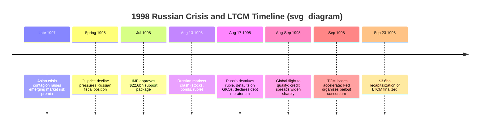

## The 1998 Russian Default and the LTCM Episode

### Overview

The 1998 Russian financial crisis and the near-collapse of Long-Term Capital Management (LTCM) constitute a linked pair of episodes illustrating how sovereign default in an emerging market can transmit through global capital markets to threaten systemic stability in the developed financial core. Russia's default in August 1998 triggered a "flight to quality" that exposed extreme leverage and correlated risk-taking at LTCM, a highly sophisticated US hedge fund, culminating in a Federal Reserve-organized private-sector bailout in September 1998. Together, these events are a foundational case study in contagion, sovereign credit risk, leverage, liquidity risk, and the "too big to fail" problem as it first appeared outside the traditional banking sector.

### Background: Russia's Post-Soviet Economic Fragility

**Key Points**

- Following the 1991 Soviet collapse, Russia underwent rapid, poorly sequenced market liberalization ("shock therapy"), including price liberalization, privatization (notably the controversial "loans-for-shares" scheme that concentrated state assets among politically connected oligarchs), and incomplete institutional and legal reform.
- Chronic fiscal deficits were financed increasingly through short-term ruble-denominated treasury bills known as **GKOs** (Gosudarstvennoe Kratkosrochnoe Obyazatelstvo), which by mid-1998 offered extremely high yields (at times exceeding 100% annualized) reflecting mounting default risk.
- The ruble was managed within a crawling-peg-like exchange rate corridor against the US dollar, requiring the Central Bank of Russia to expend reserves to maintain the peg.
- Tax collection was weak and inconsistent, with widespread barter and non-monetary settlement ("nonmonetary economy") undermining genuine fiscal capacity even as headline deficit figures suggested manageable strain.
- Falling global oil prices through 1997-1998 severely reduced export revenue, a critical fiscal and current-account channel given Russia's commodity dependence.
- [Inference] Contagion from the concurrent 1997 Asian Financial Crisis is widely regarded as an important amplifying factor, as global investors reassessed risk appetite toward emerging markets broadly, raising GKO yields and increasing rollover risk for Russia specifically, though the extent to which Russia would have faced crisis absent Asian contagion remains a matter of some scholarly disagreement.

### Chronology of the Russian Crisis

**The IMF Package (July 1998)**

An International Monetary Fund-led package of approximately $22.6 billion (with World Bank and Japanese co-financing) was approved in July 1998 to support the ruble and shore up investor confidence. [Unverified] Despite this support, market confidence continued to deteriorate rapidly, and the package proved insufficient to prevent the crisis roughly one month later, illustrating the limits of catalytic IMF financing when underlying fiscal and political credibility is severely compromised.

**The August 17, 1998 Default**

On August 17, 1998, the Russian government and central bank announced a triple policy action:

1. **Ruble devaluation**: widening (and effectively abandoning) the exchange rate corridor, leading to sharp ruble depreciation.
2. **GKO default/restructuring**: a unilateral restructuring of domestic ruble-denominated treasury debt, effectively a default on short-term obligations.
3. **Debt service moratorium**: a 90-day moratorium on certain private-sector foreign debt payments by Russian banks and corporations.

This combination — devaluation plus default plus moratorium — was unusual and particularly damaging to confidence because it combined currency, sovereign debt, and banking-sector stress simultaneously, a "triple crisis" pattern.

### Transmission Mechanism: From Moscow to Greenwich, Connecticut

**Key Points**

- **Flight to quality / flight to liquidity**: Investors globally rebalanced portfolios away from perceived risky assets (emerging market debt, and by extension many forms of credit risk) toward US Treasury securities, causing Treasury yields to fall sharply and credit spreads on virtually all risky instruments to widen dramatically — even in markets with no direct Russian exposure.
- **Correlation breakdown**: Historically uncorrelated or weakly correlated asset classes (e.g., on-the-run vs. off-the-run Treasuries, different sovereign spreads, mortgage-backed securities, merger-arbitrage spreads) moved together in the crisis, invalidating the statistical assumptions embedded in many quantitative hedge fund models, including LTCM's.
- **Liquidity spirals**: As spreads widened, funds needing to reduce risk sold assets, further widening spreads and forcing further deleveraging — a self-reinforcing liquidity spiral distinct from a pure solvency problem.

### Long-Term Capital Management: Background

**Key Points**

- LTCM was a hedge fund founded in 1994 by John Meriwether (former Salomon Brothers bond trader), with a partner roster including Nobel laureates Myron Scholes and Robert Merton (awarded the 1997 Nobel Memorial Prize in Economic Sciences for options pricing theory) and several former academics and Federal Reserve officials.
- The fund's core strategy was **relative value / convergence arbitrage**: identifying pairs or groups of securities whose prices had temporarily diverged from historical or theoretical relationships (e.g., on-the-run vs. off-the-run US Treasuries, sovereign bond spreads, swap spreads, merger arbitrage, and equity volatility trades), and taking large, highly leveraged positions betting on convergence back to normal relationships.
- Because individual convergence trades offered thin margins, LTCM employed **extreme leverage** — reportedly on the order of 25:1 balance-sheet leverage at its peak, with notional derivatives exposure vastly exceeding that (estimates around $1.25 trillion in notional derivatives positions against roughly $4.7 billion in capital by mid-1998).
- The fund's risk models relied heavily on historical volatility and correlation estimates (in the spirit of Value-at-Risk methodology), which assumed relationships that broke down precisely when correlated, systemic shocks occurred — a manifestation of what is often termed **model risk** or the limits of VaR during tail events.

### Why Russia Broke LTCM

**Key Points**

- LTCM had some direct exposure to Russian and emerging-market instruments, but [Inference] the more consequential channel was indirect: the global flight-to-quality after the Russian default caused simultaneous, correlated losses across nearly all of LTCM's ostensibly diversified positions, since many were fundamentally "short volatility" or "short liquidity" bets that all moved against the fund at once.
- Swap spreads, historically stable, widened dramatically as investors fled to the safety and liquidity of on-the-run Treasuries over swaps and off-the-run bonds — directly opposing several of LTCM's core convergence positions.
- The fund's extreme leverage meant relatively modest percentage losses in underlying positions translated into catastrophic losses in equity capital: LTCM's capital fell from approximately $4.7 billion at the start of 1998 to roughly $600 million by late September 1998, a decline of nearly 90%.
- LTCM's illiquid, concentrated positions could not be unwound quickly without moving markets further against itself — the fund was, in effect, too large relative to the markets it traded in to exit positions without self-defeating price impact.

### The Federal Reserve-Organized Bailout

**Key Points**

- By mid-September 1998, the Federal Reserve Bank of New York, under President William McDonough, became concerned that a disorderly LTCM failure could trigger a broader systemic crisis, given the fund's vast web of counterparty exposures across major investment banks and dealers.
- On September 23, 1998, the New York Fed organized (but did not directly fund with public money) a consortium of 14 major banks and securities firms to inject approximately $3.6 billion in exchange for roughly 90% ownership of the fund, averting an immediate disorderly liquidation.
- This is a critical distinction frequently tested in coursework: **no direct taxpayer funds were used**; the Fed's role was as a convener/facilitator using moral suasion, leveraging its supervisory relationships with the major dealer banks who were themselves LTCM's counterparties and thus had self-interest in an orderly resolution.
- The episode is widely cited as an early and influential case study in the **"too big to fail"** and **systemic risk** debates, predating and informing regulatory discussions that intensified dramatically after the 2008 Global Financial Crisis, particularly around the risks posed by highly leveraged, interconnected, and opaque non-bank financial institutions.
- Federal Reserve Chairman Alan Greenspan's congressional testimony after the episode acknowledged the systemic risk concern while also drawing criticism that the intervention created moral hazard by seemingly protecting a hedge fund's creditors and counterparties from the full consequences of its risk-taking.

### Contagion Diagram

<svg xmlns="http://www.w3.org/2000/svg" viewBox="0 0 820 420" font-family="sans-serif">
<text x="410" y="28" text-anchor="middle" font-size="17" font-weight="bold">Russia to LTCM: Transmission Channel (svg_diagram)</text>
<rect x="60" y="60" width="200" height="55" rx="6" fill="#fecaca" stroke="#991b1b" />
<text x="160" y="88" text-anchor="middle" font-size="13" font-weight="bold">Aug 17 1998</text>
<text x="160" y="105" text-anchor="middle" font-size="12">Russia devalues, defaults, moratorium</text>
<rect x="330" y="60" width="200" height="55" rx="6" fill="#fde68a" stroke="#92400e" />
<text x="430" y="88" text-anchor="middle" font-size="13" font-weight="bold">Global Flight to Quality</text>
<text x="430" y="105" text-anchor="middle" font-size="12">Sell risk, buy Treasuries</text>
<rect x="600" y="60" width="180" height="55" rx="6" fill="#fde68a" stroke="#92400e" />
<text x="690" y="88" text-anchor="middle" font-size="13" font-weight="bold">Spread Widening</text>
<text x="690" y="105" text-anchor="middle" font-size="12">Swap, credit, EM spreads</text>
<rect x="330" y="180" width="200" height="55" rx="6" fill="#bfdbfe" stroke="#1e40af" />
<text x="430" y="208" text-anchor="middle" font-size="13" font-weight="bold">LTCM Positions</text>
<text x="430" y="225" text-anchor="middle" font-size="12">Convergence trades reverse</text>
<rect x="330" y="270" width="200" height="55" rx="6" fill="#bfdbfe" stroke="#1e40af" />
<text x="430" y="298" text-anchor="middle" font-size="13" font-weight="bold">Leverage Amplification</text>
<text x="430" y="315" text-anchor="middle" font-size="12">~25:1; capital $4.7bn to $0.6bn</text>
<rect x="330" y="360" width="200" height="45" rx="6" fill="#ddd6fe" stroke="#5b21b6" />
<text x="430" y="387" text-anchor="middle" font-size="13" font-weight="bold">Fed-Organized Bailout</text>
<line x1="260" y1="87" x2="330" y2="87" stroke="#374151" stroke-width="1.5" marker-end="url(#arrow)" />
<line x1="530" y1="87" x2="600" y2="87" stroke="#374151" stroke-width="1.5" marker-end="url(#arrow)" />
<line x1="430" y1="115" x2="430" y2="180" stroke="#374151" stroke-width="1.5" marker-end="url(#arrow)" />
<line x1="690" y1="115" x2="500" y2="180" stroke="#374151" stroke-width="1.5" marker-end="url(#arrow)" />
<line x1="430" y1="235" x2="430" y2="270" stroke="#374151" stroke-width="1.5" marker-end="url(#arrow)" />
<line x1="430" y1="325" x2="430" y2="360" stroke="#374151" stroke-width="1.5" marker-end="url(#arrow)" />
</svg>

### Analytical Frameworks Illustrated by This Case

**Key Points**

- **Sovereign default risk and self-fulfilling debt crises**: Russia's GKO market exhibited features consistent with self-fulfilling crisis dynamics — rising yields reflected default risk, but rising yields also increased the debt-service burden, worsening the fiscal position and making default more likely (a debt-dynamics feedback loop).
- **Flight to quality and liquidity premia**: The episode is a canonical illustration of how liquidity risk (not just credit risk) is priced in stressed markets — the divergence between on-the-run and off-the-run Treasury yields, despite near-identical credit risk, reflects a pure liquidity premium that widened sharply during the crisis.
- **Value-at-Risk (VaR) and model risk**: LTCM's reliance on historically estimated correlations exemplifies the general critique that risk models calibrated on "normal" periods systematically underestimate tail risk, since correlations tend to converge toward 1 (all assets falling together) during systemic crises — a dynamic sometimes summarized as "correlations go to one in a crisis."
- **Leverage and fragility**: The relationship between leverage and fragility can be expressed simply: if $E$ is equity capital and $A$ is total assets, leverage ratio $L = A/E$. A decline in asset value of $\Delta A$ produces a proportionally larger decline in equity of $\Delta E = \Delta A$, but as a percentage of a much smaller equity base:

$$\% \Delta E = \frac{\Delta A}{E} = L \times \frac{\Delta A}{A}$$

At $L \approx 25$, a mere 4% adverse move in asset value could theoretically wipe out 100% of equity capital, illustrating why LTCM's losses were so devastating relative to seemingly modest moves in underlying spreads.

- **Systemic risk and interconnectedness**: LTCM's failure risk was transmitted not through a single exposure but through its dense web of counterparty relationships with virtually every major derivatives dealer, illustrating why regulators began focusing on network/interconnectedness risk in addition to individual institutional solvency — a theme that became central to post-2008 macroprudential regulation (e.g., the designation of "systemically important financial institutions," or SIFIs).
- **Moral hazard debate**: Critics argued the Fed-orchestrated rescue, even without direct public funds, signaled that sufficiently large and interconnected non-bank institutions would be protected from disorderly failure, potentially encouraging future excessive risk-taking — a direct conceptual precursor to "too big to fail" debates in 2008.

### Comparative Notes: Russia 1998 vs. Asian Financial Crisis 1997

| Dimension | Asian Financial Crisis (1997) | Russian Crisis (1998) |
| --- | --- | --- |
| Primary vulnerability | Private-sector currency/maturity mismatch | Sovereign fiscal weakness, weak tax base |
| Exchange rate regime | De facto USD pegs | Crawling peg/corridor |
| Default type | Mostly private-sector distress, some sovereign support needed | Explicit sovereign default (GKOs) plus moratorium |
| Primary global spillover channel | Regional trade and common-creditor contagion | Global flight-to-quality, developed-market spread widening |
| Key financial-sector victim | Domestic banks and finance companies | Global hedge fund (LTCM) and international banks |
| Resolution mechanism | IMF-led sovereign bailout packages | IMF package (partial success) + Fed-organized private consortium for LTCM |

### Aftermath and Regulatory Legacy

**Key Points**

- Russia's economy stabilized relatively quickly post-default; the ruble devaluation, combined with a subsequent recovery in oil prices, supported an export-led recovery beginning in 1999-2000 under incoming President Vladimir Putin's administration, alongside renewed fiscal discipline.
- LTCM was wound down in an orderly fashion through 1999-2000 following the recapitalization, ultimately repaying its rescue consortium, though original equity holders suffered near-total losses.
- The episode prompted the **President's Working Group on Financial Markets** to issue a 1999 report on hedge funds and systemic risk, recommending enhanced counterparty risk management and disclosure — though comprehensive hedge fund regulation was not substantially implemented until after the 2008 crisis (e.g., relevant provisions of the Dodd-Frank Act, 2010).
- [Inference] Many economists and regulators view the LTCM episode as a missed opportunity for more decisive regulatory reform of leverage and derivatives markets, arguing that lessons about correlation risk, leverage, and interconnectedness identified in 1998 were insufficiently institutionalized before the far larger 2008 crisis exposed similar (and larger-scale) versions of the same vulnerabilities.

**Next Steps**

- Sovereign debt default and restructuring mechanics (Paris Club, London Club, collective action clauses)
- Value-at-Risk (VaR) methodology and its critiques
- Convergence/relative value arbitrage strategies
- The 1994 Mexican Peso Crisis (comparative sovereign crisis case)
- The 1997-1998 Asian Financial Crisis (contagion precursor)
- Systemic risk, SIFIs, and macroprudential regulation post-2008
- The 2008 Global Financial Crisis and shadow banking
- Liquidity risk vs. credit risk in fixed income pricing
- The "too big to fail" doctrine and moral hazard in financial regulation