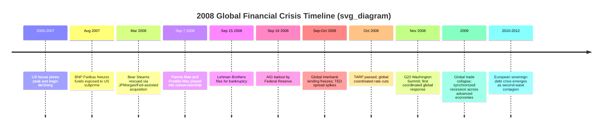

## The 2008 Global Financial Crisis and Its International Transmission

### Overview

The 2008 Global Financial Crisis (GFC) originated in the US subprime mortgage market and the broader "shadow banking" system, escalating into the most severe global financial and economic disruption since the Great Depression. Unlike the 1997-98 Asian Financial Crisis (emerging-market currency/banking crisis) or the 1998 Russia/LTCM episode (sovereign default triggering hedge fund contagion), the 2008 crisis originated at the core of the global financial system — the United States and, secondarily, Western Europe — and transmitted outward to both advanced and emerging economies through trade, financial, and confidence channels simultaneously. It is the primary case study for systemic risk in securitized finance, cross-border bank funding fragility, and the limits of monetary policy at the zero lower bound.

### Pre-Crisis Build-Up: The US Housing and Securitization Boom

**Key Points**

- Sustained US house price appreciation from the late 1990s through 2006, fueled by low interest rates (following the 2001 recession and dot-com bust), financial innovation, and expanded mortgage credit access.
- **Subprime mortgage lending**: expansion of mortgage credit to borrowers with weaker credit histories, often via adjustable-rate mortgages (ARMs) with low "teaser" introductory rates that reset higher after 2-3 years.
- **Securitization chain**: mortgages were pooled into **Mortgage-Backed Securities (MBS)** and further repackaged into **Collateralized Debt Obligations (CDOs)**, tranched by seniority (equity, mezzanine, senior/AAA), theoretically diversifying risk but in practice concentrating correlated exposure to US housing prices across the global financial system.
- **Credit rating agency role**: Agencies (Moody's, S&P, Fitch) assigned AAA ratings to senior tranches of many CDOs based on historical default correlation assumptions that underestimated the risk of a nationwide house price decline — a systemic, correlated risk rather than the idiosyncratic, diversifiable risk the rating models were built to assess.
- **Shadow banking growth**: Non-bank financial intermediaries (investment banks, structured investment vehicles, money market funds) increasingly performed bank-like maturity transformation (funding long-term assets with short-term liabilities such as repo and asset-backed commercial paper) without deposit insurance or the same prudential regulation as commercial banks.
- **Credit Default Swaps (CDS)**: Insurance-like derivative contracts allowing investors to hedge or speculate on default risk; American International Group (AIG) sold enormous volumes of CDS protection on CDOs, creating a massive, poorly capitalized concentration of tail risk.
- **Global imbalances context**: Large current account surpluses in China, oil exporters, and other economies were recycled into US Treasury and agency debt, contributing to the "global saving glut" (a term associated with Ben Bernanke) that helped keep US long-term interest rates low despite Federal Reserve tightening from 2004-2006 — a contributing macro-financial backdrop, though its precise causal weight relative to domestic US regulatory and lending practices remains debated among economists.

### Chronology of the Crisis

**The Trigger Events**

- **August 2007**: BNP Paribas froze redemptions on three investment funds due to an inability to value subprime-related assets — often cited as the first visible sign of interbank funding market stress ("the beginning of the credit crunch").
- **March 2008**: Bear Stearns, facing a liquidity run, was acquired by JPMorgan Chase in a Federal Reserve-facilitated transaction, an early signal that investment banks (not just commercial banks) faced systemic funding risk.
- **September 7, 2008**: The US government placed Fannie Mae and Freddie Mac (government-sponsored mortgage entities) into conservatorship, reflecting the scale of mortgage-related losses.
- **September 15, 2008**: Lehman Brothers filed for Chapter 11 bankruptcy after the US Treasury and Federal Reserve declined to arrange a rescue — the largest bankruptcy in US history and the event most associated with the acute phase of the crisis, given Lehman's extensive counterparty relationships globally.
- **September 16, 2008**: The Federal Reserve extended an $85 billion credit facility to AIG to prevent its disorderly collapse, reflecting concern about AIG's CDS exposure to major global banks.

### The Lehman Shock and Global Interbank Freeze

**Key Points**

- Lehman's failure triggered acute counterparty risk aversion: banks became unwilling to lend to one another even at short maturities, fearing hidden exposure to failing institutions — reflected in a sharp spike in the **TED spread** (the spread between interbank lending rates like LIBOR and short-term US Treasury yields), a standard proxy for perceived banking-sector credit risk.
- Money market funds, previously considered near-riskless cash-equivalent vehicles, faced stress after the Reserve Primary Fund "broke the buck" (its net asset value fell below $1.00 per share) due to Lehman commercial paper holdings, triggering a broader run on prime money market funds and further tightening short-term credit markets.
- This interbank freeze had **direct international transmission** because non-US banks (particularly European banks) held substantial dollar-denominated assets funded by short-term dollar wholesale borrowing; when dollar funding markets seized up, non-US banks faced acute dollar liquidity shortages even without direct subprime exposure.

### International Transmission Channels

**Trade Channel**

- Global trade volumes collapsed sharply in late 2008 and early 2009 — a decline proportionally larger than the decline in global GDP, a pattern termed the **"Great Trade Collapse."**
- [Inference] The severity of the trade collapse relative to output declines is generally attributed to the role of global value chains and vertical specialization, whereby a single final good crosses multiple borders during production, amplifying the trade impact of even modest demand declines, alongside compositional effects (durable goods and capital goods, which are more trade-intensive, fell disproportionately) and a temporary contraction in trade finance availability.
- Export-dependent economies (Germany, Japan, South Korea, China's coastal manufacturing regions) experienced sharp, immediate GDP contractions despite having no direct exposure to US subprime assets — illustrating pure demand-channel contagion distinct from financial contagion.

**Financial/Banking Channel**

- **European bank exposure**: Many large European banks (UK, German, French, Swiss, and others) had purchased substantial volumes of US MBS/CDO products and/or relied heavily on short-term US dollar wholesale funding markets, transmitting US losses directly onto European bank balance sheets.
- **Cross-border bank deleveraging**: As global banks faced capital and liquidity pressure, they reduced cross-border lending broadly, transmitting credit contraction to borrowers in both advanced and emerging markets who had no direct link to the original US mortgage problem — a phenomenon extensively documented in post-crisis international banking research.
- **Dollar funding shortage abroad**: Non-US banks' dollar liquidity crunch was severe enough that the Federal Reserve established **central bank liquidity swap lines** with major foreign central banks (ECB, Bank of England, Bank of Japan, Swiss National Bank, and later others) starting in December 2007 and expanding dramatically after September 2008, allowing foreign central banks to lend dollars to their domestic banks — an unprecedented instance of international central bank cooperation functioning as a global lender-of-last-resort mechanism.

**Confidence/Portfolio Channel**

- Global "flight to safety" led investors to sell emerging-market assets broadly and purchase US Treasuries (notably, US Treasury yields fell even though the crisis originated in the US — reflecting the dollar's continued "safe haven" status despite the crisis's US origin).
- Emerging-market currencies depreciated sharply against the dollar in late 2008 as capital flowed out, even in countries with strong fundamentals, echoing (on a smaller scale) the common-creditor contagion mechanism seen in the 1997-98 Asian Financial Crisis.

### Transmission Diagram

<svg xmlns="http://www.w3.org/2000/svg" viewBox="0 0 820 460" font-family="sans-serif">
<text x="410" y="26" text-anchor="middle" font-size="16" font-weight="bold">2008 GFC: International Transmission Channels (svg_diagram)</text>
<rect x="310" y="55" width="200" height="50" rx="6" fill="#fecaca" stroke="#991b1b" />
<text x="410" y="83" text-anchor="middle" font-size="13" font-weight="bold">Lehman Brothers Failure</text>
<text x="410" y="98" text-anchor="middle" font-size="11">Sep 15, 2008</text>
<rect x="60" y="150" width="200" height="55" rx="6" fill="#fde68a" stroke="#92400e" />
<text x="160" y="175" text-anchor="middle" font-size="12" font-weight="bold">Financial Channel</text>
<text x="160" y="192" text-anchor="middle" font-size="11">Bank losses, dollar funding freeze</text>
<rect x="310" y="150" width="200" height="55" rx="6" fill="#fde68a" stroke="#92400e" />
<text x="410" y="175" text-anchor="middle" font-size="12" font-weight="bold">Trade Channel</text>
<text x="410" y="192" text-anchor="middle" font-size="11">Global trade collapse</text>
<rect x="560" y="150" width="200" height="55" rx="6" fill="#fde68a" stroke="#92400e" />
<text x="660" y="175" text-anchor="middle" font-size="12" font-weight="bold">Confidence Channel</text>
<text x="660" y="192" text-anchor="middle" font-size="11">Flight to safety, EM outflows</text>
<rect x="60" y="260" width="200" height="55" rx="6" fill="#bfdbfe" stroke="#1e40af" />
<text x="160" y="285" text-anchor="middle" font-size="12" font-weight="bold">European Banks</text>
<text x="160" y="302" text-anchor="middle" font-size="11">MBS losses, dollar shortage</text>
<rect x="310" y="260" width="200" height="55" rx="6" fill="#bfdbfe" stroke="#1e40af" />
<text x="410" y="285" text-anchor="middle" font-size="12" font-weight="bold">Exporters</text>
<text x="410" y="302" text-anchor="middle" font-size="11">Germany, Japan, Korea, China</text>
<rect x="560" y="260" width="200" height="55" rx="6" fill="#bfdbfe" stroke="#1e40af" />
<text x="660" y="285" text-anchor="middle" font-size="12" font-weight="bold">Emerging Markets</text>
<text x="660" y="302" text-anchor="middle" font-size="11">Currency depreciation, outflows</text>
<rect x="220" y="360" width="380" height="55" rx="6" fill="#ddd6fe" stroke="#5b21b6" />
<text x="410" y="385" text-anchor="middle" font-size="13" font-weight="bold">Fed Dollar Swap Lines with Foreign Central Banks</text>
<text x="410" y="402" text-anchor="middle" font-size="11">ECB, BoE, BoJ, SNB and others</text>
<line x1="410" y1="105" x2="160" y2="150" stroke="#374151" stroke-width="1.4" />
<line x1="410" y1="105" x2="410" y2="150" stroke="#374151" stroke-width="1.4" />
<line x1="410" y1="105" x2="660" y2="150" stroke="#374151" stroke-width="1.4" />
<line x1="160" y1="205" x2="160" y2="260" stroke="#374151" stroke-width="1.4" />
<line x1="410" y1="205" x2="410" y2="260" stroke="#374151" stroke-width="1.4" />
<line x1="660" y1="205" x2="660" y2="260" stroke="#374151" stroke-width="1.4" />
<line x1="160" y1="315" x2="300" y2="360" stroke="#374151" stroke-width="1.4" />
<line x1="660" y1="315" x2="520" y2="360" stroke="#374151" stroke-width="1.4" />
</svg>

### Policy Response: Domestic and International Coordination

**Monetary Policy**

- Coordinated interest rate cuts by major central banks (Federal Reserve, ECB, Bank of England, and others) in October 2008.
- The Federal Reserve reduced its policy rate to near zero (0-0.25%) by December 2008, reaching the **zero lower bound (ZLB)**, prompting adoption of unconventional policy tools.
- **Quantitative Easing (QE)**: Large-scale asset purchases (Treasuries, agency MBS) by the Federal Reserve beginning in 2008-2009 (later followed by additional rounds, QE2 and QE3), and subsequently adopted in varying forms by the Bank of England, Bank of Japan, and eventually the ECB.
- **Central bank swap lines**: As noted, a critical and internationally-oriented monetary tool addressing dollar funding shortages abroad — widely regarded by economists as one of the more successful and underappreciated crisis-response innovations.

**Fiscal Policy**

- **Troubled Asset Relief Program (TARP, October 2008)**: US $700 billion program initially designed to purchase troubled mortgage assets, later redirected substantially toward direct bank capital injections.
- Coordinated fiscal stimulus across G20 economies in 2009, following the November 2008 Washington Summit and subsequent April 2009 London Summit, representing an unusually synchronized global fiscal expansion (China's stimulus package, at roughly 4 trillion yuan, was particularly large relative to GDP and significant for supporting global commodity demand).

**Regulatory Response**

- **Basel III** (developed 2009-2011, phased implementation from 2013 onward): substantially raised bank capital and liquidity requirements internationally, introduced countercyclical capital buffers, and added new liquidity standards (Liquidity Coverage Ratio, Net Stable Funding Ratio) directly responding to the funding fragility exposed in 2008.
- **Dodd-Frank Act (2010, US)**: comprehensive US financial reform including the Volcker Rule (restricting proprietary trading by banks), enhanced derivatives clearing requirements, and creation of the Financial Stability Oversight Council (FSOC) to monitor systemic risk.
- **G20 elevation**: The G20 (rather than the previously dominant G7/G8) became the primary international forum for global economic policy coordination, reflecting the recognition that emerging economies (particularly China) were now systemically important to global financial stability.

### The Second Wave: European Sovereign Debt Crisis (2010-2012)

**Key Points**

- The 2008 GFC directly precipitated the **European sovereign debt crisis**, as bank bailouts and recession-driven revenue declines sharply worsened fiscal positions in several Eurozone countries (Greece, Ireland, Portugal, Spain, Cyprus — sometimes referred to, controversially, by the acronym "PIIGS").
- Greece's crisis (from late 2009) was compounded by the revelation that previous governments had understated fiscal deficits, undermining market confidence in Eurozone sovereign debt broadly.
- This second wave illustrated a distinctive Eurozone-specific vulnerability: member states shared a common currency (removing the exchange rate adjustment channel available to non-euro crisis economies) without a shared fiscal union or lender-of-last-resort central bank mandate for sovereign debt, a structural gap subsequently addressed partially through the creation of the European Stability Mechanism (ESM) and the ECB's 2012 "Outright Monetary Transactions" (OMT) commitment (associated with President Mario Draghi's "whatever it takes" pledge).
- [Inference] Many economists view the European sovereign debt crisis as a distinct, second-generation crisis arising from the interaction between the 2008 GFC's fiscal legacy and the Eurozone's incomplete monetary union architecture, rather than a simple continuation of the original US-centered crisis, though the two are causally and temporally linked.

### Comparative Analysis: 2008 GFC vs. 1997-98 Asian Financial Crisis

| Dimension | 1997-98 Asian Financial Crisis | 2008 Global Financial Crisis |
| --- | --- | --- |
| Origin | Emerging-market periphery (Thailand, etc.) | Advanced-economy core (US) |
| Core vulnerability | Currency/maturity mismatch, pegged FX | Securitized mortgage credit, shadow banking leverage |
| Primary institutions affected | Domestic banks, finance companies | Investment banks, GSEs, insurance (AIG), shadow banking |
| International lender of last resort | IMF (conditional lending) | Federal Reserve (dollar swap lines) + IMF (secondary role) |
| Transmission to advanced economies | Limited (Russia, some hedge fund exposure) | Severe and direct (core-to-core and core-to-periphery) |
| Exchange rate role | Central (peg collapses) | Secondary (dollar strengthened as safe haven despite US origin) |
| Post-crisis regulatory response | National banking sector reform, reserve accumulation | Global: Basel III, Dodd-Frank, G20 coordination |

### Analytical Frameworks Illustrated

**Key Points**

- **Global Financial Cycle**: The 2008 crisis is frequently cited as the paradigmatic illustration of a "global financial cycle" (a concept associated with economist Hélène Rey) in which US monetary conditions, risk appetite, and dollar funding availability drive correlated capital flow and asset price movements worldwide, constraining monetary policy independence even under floating exchange rates — a challenge to the conventional Mundell-Fleming trilemma, sometimes framed as a "dilemma" rather than a trilemma when capital is highly mobile.
- **Global imbalances and the "savings glut" hypothesis**: The pre-crisis buildup illustrates how current account imbalances (surpluses in export-oriented/commodity economies recycled into US debt) can interact with domestic financial regulation gaps to inflate asset bubbles.
- **Shadow banking and regulatory arbitrage**: The crisis demonstrated how financial activity migrating outside traditionally regulated banking (into investment banks, SIVs, money market funds) can recreate bank-like fragility (maturity transformation, runs) without corresponding safety nets or oversight — motivating the post-crisis expansion of macroprudential regulation to cover systemically important non-bank entities.
- **Lender of last resort in a globalized financial system**: The Fed's dollar swap line network is a key case study in how lender-of-last-resort functions must adapt when a currency (the US dollar) is used extensively outside its home jurisdiction's banking system — a defining feature of the dollar's international reserve currency role.

### Related Comparative Cases

**Key Points**

- The **Great Trade Collapse of 2008-09** is itself a distinct sub-topic examining why global trade fell proportionally more than output.
- The **European Sovereign Debt Crisis (2010-2012)** functions as a direct causal continuation deserving separate, focused treatment.
- **China's 2008-09 stimulus response** is a significant case study in how a large emerging economy's fiscal policy choices influenced global commodity markets and growth trajectories during a core-country crisis.

**Next Steps**

- The European Sovereign Debt Crisis (2010–2012) in depth
- Basel III capital and liquidity standards
- Shadow banking and securitization mechanics (MBS, CDOs, CDS)
- The Global Financial Cycle and Mundell-Fleming "dilemma" reformulation
- Central bank swap lines and international lender-of-last-resort functions
- The Great Trade Collapse of 2008–2009
- Comparative analysis: 1997–98 Asian Financial Crisis vs. 2008 GFC
- Quantitative Easing and unconventional monetary policy
- Dodd-Frank Act and post-crisis US financial regulation
- G20 governance and global economic policy coordination