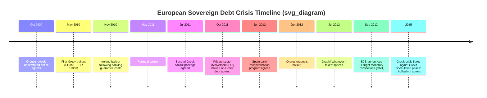

## The European Sovereign Debt Crisis

### Overview

The European Sovereign Debt Crisis (roughly 2009-2015, with acute phases in 2010-2012) was a crisis of sovereign creditworthiness, banking-sector fragility, and monetary union design that struck several Eurozone member states following the 2008 Global Financial Crisis. It centered on Greece, Ireland, Portugal, Spain, and Cyprus (with Italy experiencing significant contagion pressure without a formal bailout), and it is the primary case study in international economics for understanding the structural vulnerabilities of a currency union lacking fiscal union, a shared banking backstop, and a lender-of-last-resort mandate for sovereign debt.

### Structural Preconditions: Why the Eurozone Was Vulnerable

**Key Points**

- The euro (introduced 1999, cash circulation 2002) created a **monetary union without a fiscal union**: member states share a single currency and central bank (ECB) but retain independent national fiscal policy, subject only to the non-binding Stability and Growth Pact (SGP) deficit/debt targets (3% of GDP deficit, 60% of GDP debt).
- Under the Optimum Currency Area (OCA) framework, a currency union functions best with high labor mobility, fiscal transfers, wage/price flexibility, and synchronized business cycles across members — the Eurozone was widely assessed, even pre-crisis, as only partially satisfying these criteria, particularly given limited intra-EU labor mobility (language, cultural barriers) and no meaningful fiscal transfer mechanism.
- Euro adoption caused a **convergence of sovereign bond yields** across member states during the 2000s: peripheral economies (Greece, Portugal, Ireland, Spain) borrowed at rates close to German bunds, reflecting market assumptions of implicit mutual support/reduced redenomination risk — this cheap financing fueled credit booms, particularly property bubbles in Ireland and Spain and public-sector expansion in Greece.
- Because member states no longer control their own currency, they cannot devalue to restore export competitiveness or use domestic monetary policy to respond to asymmetric shocks — the classic "loss of the exchange rate adjustment channel" central to OCA theory.
- The ECB's mandate is Eurozone-wide price stability; it is not explicitly structured as a lender of last resort for individual sovereign governments, unlike national central banks in countries with their own currency (e.g., the Bank of England for UK gilts) — a structural gap directly implicated in the crisis's self-fulfilling dynamics.

### Country-Specific Origins

**Greece**

- Chronic fiscal deficits and public debt accumulation over the 2000s, compounded by weak tax collection and a large public-sector wage bill.
- In October 2009, the newly elected government revealed that the previous administration had significantly understated the budget deficit (revised from an estimated ~6% of GDP to over 12%, later revised further upward), triggering an immediate collapse in market confidence and a sharp rise in Greek bond yields.
- [Inference] The credibility shock from the statistical revision is generally regarded by economists as a critical catalyst distinguishing the Greek case from a purely gradual fiscal deterioration, since it revealed a governance/transparency problem on top of the underlying fiscal weakness.

**Ireland**

- Pre-crisis fiscal position was comparatively strong (budget surpluses in the mid-2000s), but a massive property and bank-lending bubble (Irish banks' balance sheets grew to a multiple of GDP) meant the 2008 financial crisis wiped out bank capital.
- The Irish government's September 2008 decision to provide a blanket guarantee of bank liabilities transformed a private banking-sector solvency crisis into a sovereign fiscal crisis, since the state assumed contingent liabilities far exceeding its fiscal capacity.

**Portugal**

- Chronic low growth, competitiveness problems, and persistent fiscal deficits through the 2000s, without Greece's dramatic statistical revision or Ireland's acute banking shock — a more gradual erosion of debt sustainability.

**Spain**

- Similar to Ireland: a large property bubble and associated bank (particularly regional savings bank, or "cajas") lending excess, with pre-crisis fiscal accounts relatively sound; the crisis was primarily transmitted through the banking sector needing recapitalization.

**Cyprus**

- Banking sector heavily exposed to Greek sovereign debt and Greek bank assets; the 2012 Greek debt restructuring inflicted large losses on Cypriot banks, precipitating a 2012-2013 Cypriot banking crisis requiring an EU/IMF bailout, notably including a controversial "bail-in" of uninsured bank depositors.

### Chronology

### The Self-Fulfilling Sovereign Debt Spiral

**Key Points**

- A core analytical mechanism: rising bond yields increase a government's debt-service cost, worsening the fiscal position and increasing default risk, which in turn justifies (and further raises) high yields — a feedback loop conceptually similar to the Russian GKO dynamic (see the 1998 Russian default case study) but occurring within a currency union context that removed the option of monetizing debt via domestic currency devaluation or central bank purchases (absent ECB action).
- This can be expressed via a simplified debt-dynamics identity. The change in the debt-to-GDP ratio $d$ depends on the primary balance $pb$ (as % of GDP), the interest rate $i$, and the nominal growth rate $g$:

$$\Delta d_t = \frac{(i - g)}{1+g} d_{t-1} - pb_t$$

When market-driven interest rates $i$ rise sharply above growth $g$ (as occurred for Greece, Portugal, and briefly Spain/Italy), the debt ratio can spiral upward even absent new borrowing, absent decisive offsetting austerity — illustrating why yield spikes alone can render debt paths unsustainable, independent of underlying "fundamentals" in a narrower sense.

- **Bank-sovereign "doom loop"**: domestic banks in crisis countries held large quantities of their own government's bonds; sovereign credit deterioration weakened bank balance sheets (reducing the value of bank bond holdings), while bank distress increased the likelihood of state-funded bailouts, further worsening sovereign finances — a mutually reinforcing negative feedback loop distinctive to this crisis and directly motivating later proposals for European banking union (breaking the sovereign-bank nexus).

### Bailout Mechanisms and Institutional Response

**Key Points**

- **The "Troika"**: Bailout programs were negotiated and monitored jointly by the European Commission, the European Central Bank, and the International Monetary Fund, an unusual tripartite arrangement combining EU-specific institutions with the IMF's traditional crisis-lending expertise and conditionality framework.
- **European Financial Stability Facility (EFSF, 2010)**: a temporary bailout fund created by Eurozone member states to provide financial assistance, later succeeded by the permanent **European Stability Mechanism (ESM, 2012)**.
- **Conditionality**: Bailout programs required austerity measures (spending cuts, tax increases), labor market reforms, privatization, and pension reforms — provoking substantial political controversy and, particularly in Greece, significant social unrest and multiple changes of government.
- **Private Sector Involvement (PSI, 2011-2012)**: Greece's second bailout included a negotiated restructuring imposing losses (a "haircut," roughly 50-53% nominal reduction) on private holders of Greek government bonds — one of the largest sovereign debt restructurings in history by volume, and notable for demonstrating that even Eurozone sovereign debt was not risk-free, reversing the pre-crisis market assumption.

### The ECB's Pivotal Role

**Key Points**

- Early in the crisis, the ECB's role was constrained by its mandate and by political sensitivities around the central bank effectively financing government deficits (monetary financing being prohibited under EU treaties).
- **Securities Markets Programme (SMP, 2010-2012)**: limited ECB purchases of distressed sovereign bonds in secondary markets, viewed as insufficiently decisive to fully stem contagion.
- **"Whatever it takes" (July 26, 2012)**: ECB President Mario Draghi's statement that the ECB would do "whatever it takes to preserve the euro" is widely regarded as the single most consequential turning point in the crisis, sharply reducing peripheral bond yields even before any bonds were purchased — a striking illustration of the power of credible central bank commitment (an "announcement effect") in resolving self-fulfilling confidence crises.
- **Outright Monetary Transactions (OMT, announced September 2012)**: a program allowing potentially unlimited ECB purchases of short-term sovereign bonds of countries under an ESM program, conditional on compliance with program terms; notably, OMT was **never actually activated**, yet its mere existence is credited with stabilizing markets — a textbook case of a credible backstop working through expectations rather than실제 (actual) intervention.
- [Inference] Economists broadly agree the OMT announcement was decisive in ending the most acute phase of bond market contagion, though the extent to which the underlying fiscal and structural problems were genuinely resolved (versus merely having the crisis's most acute symptoms suppressed) remains an active point of debate, particularly regarding Greece's continued need for a third bailout in 2015.

### Contagion and the Bank-Sovereign Doom Loop Diagram

<svg xmlns="http://www.w3.org/2000/svg" viewBox="0 0 800 420" font-family="sans-serif">
<text x="400" y="26" text-anchor="middle" font-size="16" font-weight="bold">The Bank-Sovereign Doom Loop (svg_diagram)</text>
<ellipse cx="230" cy="150" rx="150" ry="65" fill="#fecaca" stroke="#991b1b" stroke-width="1.5" />
<text x="230" y="145" text-anchor="middle" font-size="13" font-weight="bold">Sovereign Credit</text>
<text x="230" y="163" text-anchor="middle" font-size="13" font-weight="bold">Deterioration</text>
<ellipse cx="570" cy="150" rx="150" ry="65" fill="#bfdbfe" stroke="#1e40af" stroke-width="1.5" />
<text x="570" y="145" text-anchor="middle" font-size="13" font-weight="bold">Domestic Bank</text>
<text x="570" y="163" text-anchor="middle" font-size="13" font-weight="bold">Balance Sheet Weakness</text>
<path d="M 330 130 Q 400 90 470 130" stroke="#374151" stroke-width="1.6" fill="none" marker-end="url(#arrow2)" />
<text x="400" y="85" text-anchor="middle" font-size="11">Bond value falls,</text>
<text x="400" y="98" text-anchor="middle" font-size="11">bank capital erodes</text>
<path d="M 470 175 Q 400 220 330 175" stroke="#374151" stroke-width="1.6" fill="none" marker-end="url(#arrow2)" />
<text x="400" y="235" text-anchor="middle" font-size="11">State bailout need,</text>
<text x="400" y="248" text-anchor="middle" font-size="11">contingent liability rises</text>
<rect x="150" y="310" width="500" height="70" rx="6" fill="#fde68a" stroke="#92400e" />
<text x="400" y="335" text-anchor="middle" font-size="12" font-weight="bold">Structural Fix: Banking Union</text>
<text x="400" y="355" text-anchor="middle" font-size="11">Single Supervisory Mechanism + Single Resolution Mechanism</text>
<text x="400" y="370" text-anchor="middle" font-size="11">— aims to sever the sovereign-bank balance sheet link</text>
</svg>

### Internal Devaluation and Adjustment Without Exchange Rate Flexibility

**Key Points**

- Since Eurozone members cannot devalue their currency to restore export competitiveness, crisis countries were forced into **"internal devaluation"**: reducing relative wages and prices (and thus relative unit labor costs) through domestic wage cuts, public-sector layoffs, and structural reform, rather than through nominal exchange rate adjustment.
- This process is generally slower and more socially/politically costly than nominal devaluation, contributing to deep and prolonged recessions in Greece (cumulative GDP decline of roughly 25% from peak to trough, comparable in depth to the Great Depression in the US) and significant, prolonged unemployment increases in Spain and Greece (youth unemployment exceeding 50% at the crisis's worst points).
- This dynamic is frequently used pedagogically to illustrate, in reverse, the value of the exchange rate as a "shock absorber" under the Mundell-Fleming framework, and why the OCA criteria (particularly wage/price flexibility as a substitute adjustment mechanism) matter significantly for currency union design.

### Institutional Reforms Following the Crisis

**Key Points**

- **European Banking Union**: comprising the **Single Supervisory Mechanism (SSM, 2014)**, placing significant Eurozone banks under direct ECB supervision, and the **Single Resolution Mechanism (SRM, 2016)**, providing a centralized framework for resolving failing banks — both designed to weaken the bank-sovereign doom loop identified above.
- **European Stability Mechanism (ESM)**: established as a permanent crisis-response institution (replacing the temporary EFSF), with a paid-in and callable capital structure enabling it to raise funds for future bailout lending.
- **Fiscal governance reforms**: the "Six-Pack," "Two-Pack," and Fiscal Compact (2011-2013) strengthened EU-level monitoring and enforcement of national fiscal rules, though enforcement in practice has remained politically constrained.
- [Inference] A genuine fiscal union (common Eurozone-level fiscal capacity or debt issuance, sometimes termed "Eurobonds") remains politically unresolved as of the crisis's aftermath, and many economists continue to view the absence of a substantial common fiscal backstop as an unresolved structural vulnerability for the currency union, though the EU's 2020 collectively-financed pandemic recovery fund (NextGenerationEU) is sometimes cited as a partial, precedent-setting step in that direction.

### Comparative Analysis: European Sovereign Debt Crisis vs. Prior Crises

| Dimension | Asian Financial Crisis (1997-98) | Russia/LTCM (1998) | 2008 GFC | European Sovereign Debt Crisis (2010-15) |
| --- | --- | --- | --- | --- |
| Core vulnerability | Pegged FX + private currency mismatch | Sovereign fiscal weakness + hedge fund leverage | Securitized mortgage credit, shadow banking | Currency union without fiscal union; bank-sovereign nexus |
| Adjustment mechanism available | Currency float/devaluation | Ruble devaluation | Dollar remained flexible; Fed easing | None (shared currency) — forced internal devaluation |
| Lender of last resort | IMF | Fed (private consortium) / IMF | Federal Reserve (swap lines, QE) | ECB (eventually, via OMT) + ESM/IMF (Troika) |
| Key resolution turning point | IMF programs, float adoption | Fed-brokered recapitalization | TARP, coordinated rate cuts, QE | Draghi's "whatever it takes" + OMT |
| Debt restructuring | Limited | Explicit GKO default | Limited sovereign restructuring | Greek PSI (2012) — major sovereign haircut |

### Key Analytical Takeaways for International Economics

**Key Points**

- The crisis is the definitive real-world test of **Optimum Currency Area theory**, demonstrating the practical costs of monetary union absent labor mobility, fiscal transfers, and wage/price flexibility.
- It reframed sovereign debt theory by demonstrating that **advanced-economy government debt is not inherently risk-free** when a country does not control its own currency (a distinction sometimes summarized by contrasting Eurozone members with countries like the UK, US, or Japan, which issue debt in a currency they control and whose central bank can act as lender of last resort).
- It highlighted the importance of **central bank credibility and communication** as a crisis-management tool, given OMT's effectiveness despite never being activated.
- It illustrated the **bank-sovereign nexus** as a distinctive channel of financial fragility, motivating a wave of banking union reforms globally, not just in Europe.
- [Inference] Some economists frame the crisis as evidence that currency unions require either much deeper fiscal integration or robust exit/restructuring mechanisms, while others argue the eventual (if slow and costly) stabilization without any member state exiting the euro demonstrates the union's underlying political durability exceeds what pure economic OCA criteria would predict.

**Next Steps**

- Optimum Currency Area (OCA) theory in depth
- The Greek debt restructuring (PSI) mechanics and sovereign debt restructuring frameworks
- European Banking Union: SSM and SRM architecture
- Internal devaluation vs. nominal devaluation as adjustment mechanisms
- Central bank credibility and the economics of forward guidance
- Comparative currency union design (Eurozone vs. other monetary unions, e.g., CFA franc zone)
- Sovereign debt sustainability analysis and debt dynamics equations
- The 2008 Global Financial Crisis (causal precursor)
- The 1998 Russian default (comparative sovereign default case)