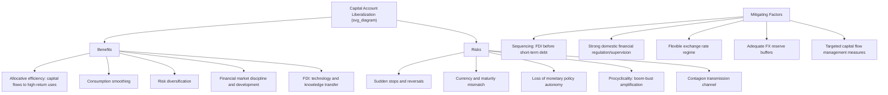

## Benefits and Risks of Capital Account Liberalization

### Overview

Capital account liberalization (CAL) refers to the removal of government-imposed restrictions on cross-border capital flows — including foreign direct investment, portfolio investment (equity and debt), bank lending, and short-term speculative flows. It is a central and historically contentious topic in international economics, sitting at the intersection of growth theory, financial stability analysis, and international policy debate. The consensus view has shifted substantially over recent decades: from the near-unconditional endorsement associated with the "Washington Consensus" era of the 1980s-1990s, toward a more nuanced, sequencing- and institution-dependent view following the 1997-98 Asian Financial Crisis and the 2008 Global Financial Crisis.

### Defining the Capital Account and Its Components

**Key Points**

- The **capital account** (more precisely, in modern balance-of-payments terminology, the **financial account**) records cross-border transactions in financial assets and liabilities, distinct from the **current account** (trade in goods/services, income, and transfers).
- Major categories of capital flows, generally ordered from most to least stable/long-term:
  1. **Foreign Direct Investment (FDI)**: acquisition of lasting management interest (conventionally ≥10% equity ownership) in an enterprise in another economy; typically the most stable flow category, less prone to sudden reversal.
  2. **Portfolio equity investment**: purchases of foreign stocks without controlling interest; more liquid and volatile than FDI.
  3. **Portfolio debt investment**: purchases of foreign bonds (sovereign or corporate); volatility depends heavily on maturity structure.
  4. **Bank lending and other investment**: cross-border loans, trade credit, currency and deposits; short-term bank lending is generally regarded as the most volatile and crisis-prone category.
  5. **Financial derivatives**: cross-border derivative positions, used for hedging or speculation.
- **Capital account liberalization** encompasses removing restrictions across some or all of these categories — full liberalization (a fully open capital account) is a spectrum endpoint, not a binary state; most economies maintain a mix of open and restricted channels.

### Theoretical Case for Liberalization

**Key Points**

- **Neoclassical growth/allocative efficiency argument**: In a world of differing capital-to-labor ratios, capital should flow from capital-abundant, lower-return advanced economies to capital-scarce, higher-return developing economies, raising global output and facilitating faster capital accumulation and growth in recipient countries — analogous to the standard gains-from-trade argument applied to capital rather than goods.
- **Consumption smoothing**: Open capital accounts allow countries to borrow during temporary negative shocks (e.g., poor harvests, terms-of-trade deterioration) and save/lend during positive shocks, smoothing consumption relative to a closed-economy scenario where consumption must track domestic output exactly.
- **Risk sharing and diversification**: International portfolio diversification allows investors and countries to hedge idiosyncratic domestic risk, in principle reducing consumption volatility (formally related to international risk-sharing models building on the permanent income hypothesis).
- **Financial market development and discipline**: Exposure to foreign capital and international investors can pressure domestic institutions toward improved corporate governance, financial market depth, and macroeconomic policy discipline, as poor policies are more quickly and visibly penalized via capital flight or rising risk premia.
- **Technology and knowledge transfer**: FDI in particular is associated with spillovers in managerial practices, technology, and human capital development in recipient economies, an argument distinct from the pure financial-flow allocative efficiency case.

### The Empirical Puzzle: Weak Growth Evidence

**Key Points**

- [Inference] A substantial body of empirical research, notably associated with economists such as Eswar Prasad, Kenneth Rogoff, and Dani Rodrik in the 2000s, found that the theoretically predicted growth benefits of capital account liberalization are difficult to identify robustly in cross-country data, particularly for developing economies — a finding sometimes termed the **"Lucas paradox"** (the empirical observation that capital does not flow as strongly from rich to poor countries as basic neoclassical theory predicts, and that liberalization episodes do not reliably produce measurable growth acceleration).
- Proposed explanations for weaker-than-predicted growth benefits include: threshold effects (benefits materialize only above certain levels of financial sector development, institutional quality, or trade openness); the composition of capital flows mattering more than gross volume (FDI-heavy liberalization tends to show more favorable outcomes than short-term debt-heavy liberalization); and the possibility that liberalization's main empirical benefit is indirect (financial market development, discipline effects) rather than a direct growth channel.
- This empirical ambiguity is a central reason the post-1990s "unconditional liberalization is beneficial" consensus weakened considerably among academic economists and, eventually, at the IMF itself.

### Risks and Costs of Capital Account Liberalization

**Sudden Stops and Reversals**

- A **"sudden stop"** (terminology developed by economist Guillermo Calvo) refers to an abrupt, large reduction or reversal in capital inflows, often triggering sharp currency depreciation, credit contraction, and recession — the mechanism central to the 1997-98 Asian Financial Crisis (see the dedicated case study) and numerous other emerging-market crises.
- Short-term, debt-based capital flows (particularly foreign-currency-denominated bank lending) are disproportionately associated with sudden stop risk relative to FDI, motivating the widely cited policy principle of favoring FDI-heavy liberalization sequencing over short-term debt-heavy liberalization.

**Currency and Maturity Mismatches**

- Open capital accounts enable domestic firms and banks to borrow in foreign currency, often at lower nominal interest rates than domestic-currency borrowing — but this creates balance-sheet currency mismatches (foreign-currency liabilities, domestic-currency revenue) that amplify the domestic financial impact of exchange rate depreciation, a mechanism central to the "third-generation" crisis models discussed in the Asian Financial Crisis case study.
- This vulnerability is sometimes discussed under the **"original sin"** hypothesis (a term from economists Barry Eichengreen and Ricardo Hausmann), describing the historical inability of most emerging markets to borrow internationally in their own currency, structurally embedding currency mismatch risk into their external liabilities.

**Loss of Monetary Policy Autonomy (The Trilemma)**

- Per the **Impossible Trinity**, an open capital account combined with a fixed or managed exchange rate forces a country to sacrifice independent monetary policy — capital account liberalization is therefore not a policy choice made in isolation but interacts directly with exchange rate regime choice.
- Even under floating exchange rates, the **"Global Financial Cycle"** literature (associated with economist Hélène Rey) argues that highly open capital accounts subject domestic financial conditions to global (particularly US) monetary policy and risk-appetite cycles regardless of the exchange rate regime, suggesting the classical trilemma may function more like a **"dilemma"** (only two effective choices: capital controls, or accepting global financial cycle influence) under conditions of very high capital mobility.

**Procyclicality and Boom-Bust Dynamics**

- Capital inflows tend to be procyclical: flows surge during periods of strong domestic growth and global risk appetite, fueling credit booms and asset price bubbles, then reverse sharply during downturns or global risk-off episodes, amplifying rather than smoothing the domestic business cycle — the opposite of the theoretical consumption-smoothing benefit under idealized conditions.
- This procyclicality is closely linked to the **"push versus pull factors"** framework in the capital flows literature: "push" factors (global interest rates, global risk appetite, advanced-economy monetary policy) often dominate "pull" factors (domestic country-specific fundamentals) in driving flow volume and timing, meaning liberalized emerging markets can experience large capital flow swings driven by conditions entirely outside their control.

**Contagion**

- Open capital accounts create channels for financial contagion — as illustrated by the Asian Financial Crisis's common-creditor contagion mechanism and the 2008 GFC's cross-border bank deleveraging channel — whereby a shock in one liberalized economy or in global financial centers transmits to others via portfolio rebalancing, common lender exposure, or general risk-aversion shifts, independent of underlying domestic fundamentals.

### Diagram: The Liberalization Trade-Off

### Sequencing: The "Order of Liberalization" Debate

**Key Points**

- A substantial policy literature, heavily informed by the Asian Financial Crisis experience, argues that the **sequencing** of liberalization matters as much as, or more than, the overall degree of openness.
- Widely cited sequencing principles (associated broadly with economists such as Ronald McKinnon):
  1. Achieve macroeconomic stabilization and sound fiscal policy first.
  2. Liberalize the current account (trade) before the capital account.
  3. Develop and strengthen domestic financial sector regulation and supervision before opening to volatile short-term capital flows.
  4. Liberalize long-term flows (FDI) before short-term, more volatile flows (portfolio debt, short-term bank borrowing).
  5. Consider exchange rate flexibility as a complement to, or precondition for, full capital account opening (to avoid combining an open capital account with a rigid peg — the classic trilemma trap).
- [Inference] Countries that liberalized capital accounts rapidly and comprehensively without first strengthening domestic financial regulation and supervision (several pre-1997 East Asian economies being a widely cited example) are generally regarded by economists as having been more vulnerable to crisis than economies that liberalized more gradually or maintained stronger prudential oversight, though isolating sequencing as the dominant causal factor (versus other contemporaneous policy or structural differences) is difficult given the limited number of comparable historical episodes.

### The Evolving IMF Institutional View

**Key Points**

- The IMF's Articles of Agreement, unlike its stance on current account convertibility, have historically not mandated capital account liberalization as a condition of membership, reflecting long-standing institutional caution on this specific issue.
- Nonetheless, IMF policy advice through the 1980s-1990s often favored fairly rapid liberalization as part of broader market-oriented reform packages associated with the Washington Consensus.
- Following the Asian Financial Crisis and especially after Malaysia's 1998 capital controls episode (see the Asian Financial Crisis case study) appeared to produce a reasonably orderly recovery, and further reinforced by the 2008 GFC and subsequent emerging-market capital flow volatility, the IMF adopted a formal **"Institutional View" on capital flows (2012)**.
- The 2012 Institutional View explicitly recognizes that **capital flow management measures (CFMs)**, including certain forms of capital controls, can be appropriate policy tools under specific circumstances (e.g., to address systemic financial stability risks or manage large and volatile inflows/outflows), rather than viewing all capital controls as inherently distortionary and undesirable — a substantial and historically significant shift from earlier institutional orthodoxy.

### Capital Flow Management Measures (CFMs): Types and Design

**Key Points**

- **Price-based controls**: taxes on capital inflows or outflows (e.g., Brazil's 2009-2013 IOF tax on portfolio inflows; Chile's historically well-studied unremunerated reserve requirement, or URR, on short-term inflows in the 1990s), designed to alter the cost/incentive structure of flows without outright prohibition.
- **Quantity-based controls**: outright limits or prohibitions on certain transactions (e.g., limits on foreign currency borrowing, restrictions on repatriation timing, as in Malaysia's 1998 measures).
- **Macroprudential capital flow measures**: regulations targeting financial stability risk associated with capital flows specifically (e.g., differentiated reserve requirements on foreign-currency bank liabilities, loan-to-value limits tied to foreign-currency lending) — increasingly viewed as a distinct, more "targeted" and less distortionary category than broad-based capital controls.
- [Inference] The empirical literature on CFM effectiveness generally finds that such measures can usefully alter the composition of inflows (shifting toward longer maturities, for example) and provide some additional monetary policy room, but the evidence on their ability to meaningfully reduce the total volume of inflows or asset price pressure over longer time horizons is more mixed, and effectiveness appears to depend significantly on specific country and measure design.

### FDI vs. Portfolio/Debt Flows: A Comparative Risk Framework

| Flow Type | Volatility | Reversibility | Typical Crisis Association | Growth/Spillover Benefit |
| --- | --- | --- | --- | --- |
| FDI | Low | Difficult to reverse quickly | Rarely a direct crisis trigger | High (technology, management, long-term) |
| Portfolio equity | Moderate-High | Relatively liquid, reversible | Moderate contagion risk | Moderate (market discipline, liquidity) |
| Portfolio debt | High | Reversible at maturity/rollover | High (rollover/sudden stop risk) | Moderate (financing access) |
| Short-term bank lending | Very High | Immediately reversible | Very High (core Asian crisis mechanism) | Low-moderate (credit access, but crisis-prone) |

### Case Illustration: Chile's Unremunerated Reserve Requirement (1991-1998)

**Example**

Chile's URR required a portion (initially 20%, later adjusted) of most capital inflows to be deposited, unremunerated, at the central bank for a fixed period (initially one year) regardless of how long the underlying investment was actually held — effectively a tax that was proportionally larger for shorter-maturity inflows. [Inference] This measure is widely cited in the international economics literature as a relatively successful example of a price-based CFM that shifted the composition of Chile's capital inflows toward longer maturities without triggering major distortions to overall FDI inflows, although economists continue to debate the extent to which it meaningfully reduced aggregate inflow volume versus primarily affecting composition, and whether Chile's broader strong macroeconomic and regulatory framework was the more important factor in its relatively favorable 1990s outcomes.

### Synthesis: Conditions Under Which Liberalization Benefits Are More Likely to Dominate

**Key Points**

- Strong domestic financial sector regulation and supervision, sufficient to manage the balance-sheet risks that open capital accounts introduce.
- Sound macroeconomic fundamentals (fiscal discipline, credible monetary policy) reducing the likelihood that liberalization simply finances unsustainable domestic imbalances.
- Exchange rate flexibility, avoiding the trilemma trap of combining open capital accounts with rigid pegs.
- Adequate foreign exchange reserve buffers as self-insurance against sudden stops.
- Gradual, well-sequenced implementation favoring FDI and long-term flows before short-term debt liberalization.
- Institutional capacity to deploy targeted capital flow management measures when systemic risks emerge, consistent with the IMF's post-2012 Institutional View.

**Next Steps**

- Sudden stops and the Calvo (2000) framework
- The "original sin" hypothesis and currency mismatch in emerging-market debt
- The Impossible Trinity / trilemma vs. "dilemma" debate (Global Financial Cycle)
- The IMF's 2012 Institutional View on capital flows
- Capital flow management measures: design and empirical effectiveness
- The 1997–98 Asian Financial Crisis (comparative case study)
- Malaysia's 1998 capital controls episode
- Optimum Currency Area theory and exchange rate regime choice
- Push vs. pull factors in emerging-market capital flows