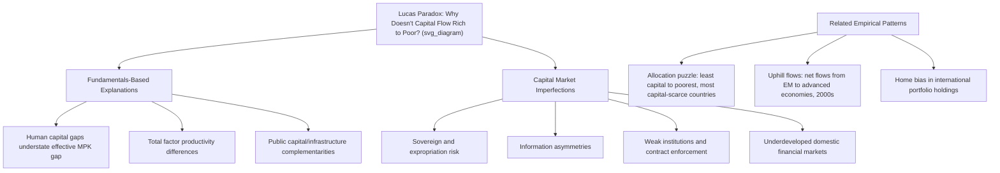

## The Lucas Paradox and Capital Flows to Developing Countries

### Overview

The Lucas Paradox, named after economist Robert Lucas following his influential 1990 paper "Why Doesn't Capital Flow from Rich to Poor Countries?", describes the empirical puzzle that capital does not flow from capital-abundant rich countries to capital-scarce poor countries at the scale predicted by standard neoclassical growth theory. Basic diminishing-returns logic implies poor countries, with less capital per worker, should offer much higher returns to capital and thus attract large inflows — yet observed patterns show far smaller flows to developing economies than theory predicts, and in some periods and specifications, net capital flows have moved in the "wrong" direction, from poorer to richer countries (a related phenomenon sometimes called "uphill capital flows"). This puzzle is foundational to the modern literature on capital account liberalization, financial globalization, and global imbalances.

### The Neoclassical Prediction

**Key Points**

- In a standard neoclassical (Solow-style) growth framework, the marginal product of capital (MPK) is a decreasing function of the capital-to-labor ratio, holding technology constant. Formally, for a Cobb-Douglas production function $Y = AK^{\alpha}L^{1-\alpha}$, the marginal product of capital is:

$$MPK = \alpha A \left(\frac{L}{K}\right)^{1-\alpha}$$

- Since developing countries have much lower capital-to-labor ratios ($K/L$) than rich countries, holding total factor productivity $A$ constant, this implies developing countries should exhibit substantially higher marginal returns to capital.
- Lucas's original 1990 back-of-envelope calculation, comparing India and the United States using standard capital-share and output-ratio assumptions, implied the marginal product of capital in India should be roughly 58 times higher than in the United States — a differential so large that under frictionless capital mobility, one would expect overwhelming capital flows toward India (and, by extension, other developing economies) until returns equalized.
- Under this logic, in a world of free capital mobility, poor countries should run persistent current account deficits (financed by capital inflows) while accumulating capital rapidly, converging toward rich-country capital-labor ratios and income levels — a strong theoretical prediction of **convergence**.

### The Empirical Puzzle

**Key Points**

- Observed cross-border capital flows to developing countries have historically been far smaller, relative to the scale predicted by simple neoclassical models, and considerably more concentrated among a subset of "emerging market" economies rather than spread broadly across the developing world.
- Many of the poorest countries — those with theoretically the highest capital scarcity and thus highest predicted returns — have historically received the least foreign capital relative to their capital-scarcity gap, a pattern sometimes termed **"allocation puzzle."**
- In certain periods (notably documented in research on the 2000s), aggregate net capital flows among developing and emerging economies have flowed **from** faster-growing, capital-scarce economies (e.g., China) **to** the capital-abundant United States, primarily through large purchases of US Treasury and agency securities — the reverse direction predicted by the simple neoclassical model, and a pattern closely related to (though analytically distinct from) the global imbalances/"savings glut" discussion in the 2008 Global Financial Crisis case study.
- [Inference] This "uphill flows" pattern is generally attributed by economists to a combination of reserve accumulation motives (self-insurance against sudden stops, informed heavily by the 1997-98 Asian Financial Crisis experience), export-oriented exchange rate management, and the depth/safety of US financial markets as a destination for official reserve assets — rather than being interpreted as evidence against capital scarcity itself in these economies.

### Lucas's Proposed Explanations

Lucas's original 1990 paper proposed two broad categories of explanation, which remain the organizing framework for subsequent literature:

**1. Differences in Fundamentals**

- **Human capital differences**: If poor countries have systematically lower levels of human capital (education, skills, health) complementing physical capital, the effective productivity of physical capital investment is lower than a naive capital-labor ratio comparison suggests — meaning the "true" MPK gap is smaller than the simple calculation implies.
- **Total factor productivity (TFP) differences**: If $A$ (technology/institutional efficiency) differs systematically and is lower in developing economies, the MPK gap shrinks correspondingly; much of later growth-accounting literature attributes a large share of cross-country income differences to TFP gaps rather than pure capital-labor ratio differences.
- **Public capital and infrastructure**: Physical capital productivity depends on complementary public infrastructure (electricity, transport, telecommunications, legal/institutional infrastructure); underinvestment in these complements reduces the effective return to private physical capital investment even where nominal capital scarcity is high.

**2. Capital Market Imperfections**

- **Sovereign risk and expropriation risk**: The risk of outright default, capital controls, or asset expropriation reduces the risk-adjusted expected return to foreign investors below the theoretical gross MPK, discouraging inflows despite genuinely high underlying returns.
- **Information asymmetries**: Foreign investors possess less information about developing-country firms, institutions, and governance quality than domestic investors, creating an effective risk premium and preference for domestic or "closer" investment destinations — related to the broader "home bias" puzzle in international finance.
- **Institutional quality and contract enforcement**: Weak property rights, unreliable legal enforcement, and political instability directly reduce the effective (risk-adjusted, expropriation-adjusted) return available to foreign capital, independent of the "raw" physical capital scarcity.
- **Underdeveloped financial markets**: Shallow domestic financial markets increase the cost and difficulty of channeling foreign capital into productive investment, and limit the availability of local hedging and risk-management instruments for foreign investors.

### Diagram: Explanations for the Lucas Paradox

### Subsequent Empirical Literature

**Key Points**

- Later research (notably by economists including Alwyn Young and Robert Hall/Charles Jones in the 1990s growth-accounting literature) provided substantial empirical support for the view that **TFP differences, not just capital-labor ratio differences, explain a large share of cross-country income gaps**, lending indirect support to Lucas's fundamentals-based explanation category.
- Research using **risk-adjusted return measures** (rather than raw accounting MPK calculations) generally finds a smaller, though not eliminated, gap between rich and poor country capital returns — suggesting capital market imperfections (risk premia) account for a meaningful portion, though not necessarily all, of the puzzle.
- The **"allocation puzzle"** literature (associated with work by economists including Pierre-Olivier Gourinchas and Olivier Jeanne in the 2000s-2010s) specifically documents that even among fast-growing developing economies, capital flows are not well-correlated with productivity growth in the way simple theory predicts — some of the fastest-growing developing economies (notably China during much of the 2000s) were **net capital exporters** rather than importers, a pattern that appears to somewhat contradict even a "quality-adjusted" version of the neoclassical prediction and has motivated additional explanations centered on precautionary saving, financial market underdevelopment constraining domestic investment absorption, and exchange rate/reserve policy choices.
- [Inference] More recent literature has increasingly emphasized that the "paradox" may be less puzzling once **financial frictions specific to weak domestic financial systems** are properly modeled — if a developing country's own financial system cannot efficiently channel available savings (domestic or foreign) into high-return investment projects, simply removing capital account restrictions would not necessarily produce the convergence outcome the frictionless neoclassical model predicts, since the domestic capital allocation mechanism itself remains a binding constraint.

### The "Uphill Flows" Pattern in Detail

**Key Points**

- Beginning roughly in the early-to-mid 2000s and persisting through the pre-2008 GFC period, several rapidly growing emerging economies — most prominently China, but also including various oil-exporting economies — ran large current account surpluses and accumulated substantial foreign exchange reserves, predominantly invested in US Treasury and agency debt.
- This reserve accumulation is generally explained by a combination of: (1) precautionary self-insurance motives following the 1997-98 Asian Financial Crisis, in which countries with insufficient reserves faced severe adjustment costs; (2) export-oriented growth strategies requiring exchange rate management (limiting currency appreciation to preserve export competitiveness, which mechanically requires central bank purchases of foreign assets); and (3) underdeveloped domestic financial markets in the surplus countries themselves, limiting the capacity to channel high domestic savings into domestic investment or into diversified private outward investment, leaving official reserve accumulation in safe advanced-economy assets as the primary practical outlet.
- This pattern directly links to the **global saving glut hypothesis** discussed in the 2008 Global Financial Crisis case study — the "uphill" direction of these flows is, in effect, a large-scale, policy-driven manifestation of the Lucas Paradox rather than a simple contradiction of underlying capital-scarcity logic in the recipient (US) economy, since the flows were primarily official/reserve-driven rather than private-sector return-seeking investment.

### Policy and Theoretical Implications

**Key Points**

- The Lucas Paradox provides an important theoretical caveat to the simple "benefits of capital account liberalization" case (see the dedicated case study on that topic): if capital market imperfections (rather than simply legal restrictions) are the primary reason capital does not flow to developing countries, then removing capital controls alone may not be sufficient to generate the predicted convergence benefits — complementary institutional, financial-sector, and governance reforms may be necessary preconditions.
- This reframes capital account liberalization policy discussions away from a narrow "open vs. closed" framing and toward a broader question of what underlying frictions (information, institutional, financial-sector) must be addressed for liberalization to produce its theoretically predicted benefits — directly reinforcing the sequencing arguments discussed in the capital account liberalization case study.
- The paradox also has implications for growth theory more broadly: it is frequently cited as evidence against simple, unconditional convergence predictions from basic neoclassical growth models, and in favor of "conditional convergence" frameworks in which convergence occurs primarily among countries with sufficiently similar institutional, human capital, and policy characteristics.

### Illustrative Comparison Table

| Explanation Category | Mechanism | Predicted Effect on Observed Flows | Degree of Empirical Support |
| --- | --- | --- | --- |
| Human capital gaps | Lower effective capital productivity in poor countries | Reduces "true" MPK gap, smaller predicted flows | Moderate-to-strong |
| TFP differences | Lower technology/institutional efficiency | Reduces "true" MPK gap | Strong (growth-accounting literature) |
| Sovereign/expropriation risk | Risk premium reduces risk-adjusted return | Discourages inflows despite high gross MPK | Moderate |
| Information asymmetry/home bias | Higher perceived risk, monitoring costs | Discourages inflows, favors domestic/regional investment | Moderate |
| Institutional quality | Weak contract enforcement, property rights | Discourages long-term/FDI-type inflows specifically | Strong |
| Reserve accumulation/exchange rate policy | Policy-driven "uphill" official flows | Can reverse net flow direction at aggregate level | Strong (for specific 2000s episode) |

### Related Concepts and Distinctions

**Key Points**

- The Lucas Paradox should be distinguished from the **Feldstein-Horioka puzzle** (the empirical observation that domestic saving and domestic investment rates are highly correlated across countries, more than a fully integrated global capital market would predict) — a related but conceptually distinct finding about capital mobility more broadly, rather than specifically about the direction of rich-to-poor flows.
- It should also be distinguished from the **"allocation puzzle"**, which specifically concerns the poor correlation between capital flows and productivity growth *within* the developing/emerging world, rather than the aggregate rich-versus-poor flow direction that is Lucas's original focus.
- The paradox connects directly to **home bias in international portfolio investment** (the empirical tendency of investors to hold a disproportionate share of domestic assets relative to what standard portfolio theory would predict), which is sometimes analyzed as a related manifestation of similar underlying frictions (information asymmetry, institutional risk, currency risk).

**Related Topics**

- The Feldstein-Horioka puzzle and international capital mobility measurement
- The "allocation puzzle" and capital flows within emerging markets
- Global saving glut hypothesis and global imbalances (linked to the 2008 GFC case study)
- Growth accounting and total factor productivity (TFP) differences across countries
- Conditional convergence in neoclassical and endogenous growth theory
- Home bias in international portfolio investment
- Sovereign risk premia and country risk pricing
- Benefits and risks of capital account liberalization (related case study)
- Sequencing of financial sector development and capital account opening