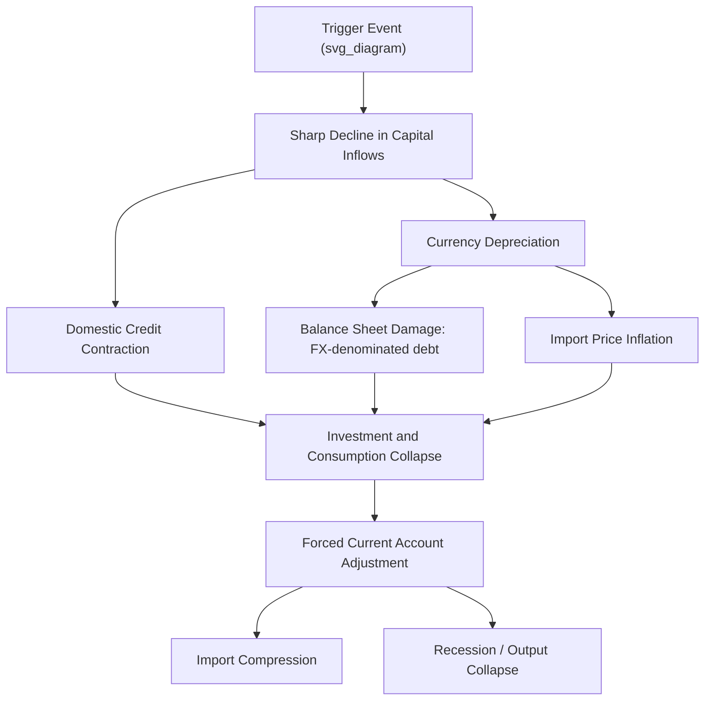

## Sudden Stops and Capital Flow Reversals

### Overview

A "sudden stop" refers to an abrupt, large, and largely unanticipated reduction or reversal in net capital inflows to a country, typically accompanied by sharp currency depreciation, a collapse in domestic credit availability, and a severe contraction in economic activity. The term was coined by economist Guillermo Calvo in the context of Latin American and Asian emerging-market crises of the 1990s, drawing on a banker's aphorism ("it is not the speed that kills, it's the sudden stop") to emphasize that the abruptness of a reversal, not merely the level of prior capital inflow, is the primary source of economic damage. Sudden stops are the core empirical and theoretical mechanism underlying nearly every major emerging-market financial crisis of the past several decades, including the 1997-98 Asian Financial Crisis discussed elsewhere in this chapter.

### Formal Definition and Identification

**Key Points**

- The academic literature (following Calvo, and formalized further by economists including Calvo, Izquierdo, and Mejía in the 2000s) generally identifies a sudden stop empirically as a large, sharp decline in net capital inflows — often operationalized as a decline in the capital/financial account balance (or gross inflows) of at least one to two standard deviations below its historical mean within a short window (commonly one year or less).
- A sudden stop is conceptually distinct from a gradual, anticipated capital flow slowdown: the defining feature is the **speed and magnitude of the reversal relative to historical volatility**, not simply a negative capital flow episode per se.
- Sudden stops are frequently associated with, but analytically distinguishable from, related phenomena: **currency crises** (sharp nominal depreciation), **banking crises** (domestic financial-sector distress), and **sovereign debt crises** (default or restructuring) — in practice these often occur together ("twin" or "triple" crises), but a sudden stop specifically refers to the capital-flow-quantity phenomenon.

### The Balance-of-Payments Mechanics of a Sudden Stop

**Key Points**

- By balance-of-payments identity, the current account balance must be financed by the (negative of the) capital/financial account balance. When capital inflows abruptly stop or reverse, a country that had been running a current account deficit (financed by those inflows) must undergo a rapid, often forced, adjustment:

$$CA_t + KA_t = 0$$

Where $CA_t$ is the current account balance and $KA_t$ is the capital/financial account balance (net capital inflows) in period $t$, ignoring reserve changes and errors/omissions for simplicity.

- If $KA_t$ falls sharply (a sudden stop), $CA_t$ must adjust correspondingly — typically forced to move sharply toward surplus (or a smaller deficit) through some combination of: (1) a compression of imports (via recession-driven demand contraction and/or currency depreciation raising import prices), (2) a boost to exports (via depreciation-driven competitiveness gains, though often with a lag — the "J-curve" effect), and (3) drawdown of official foreign exchange reserves to smooth the transition.
- This forced, rapid current account adjustment is the direct transmission mechanism from a capital-flow shock to a real-economy recession — the sudden stop is a capital-account phenomenon, but its costs are realized primarily through the current account adjustment and associated domestic demand contraction it necessitates.

### Diagram: The Sudden Stop Transmission Mechanism

### Triggers of Sudden Stops

**Key Points**

- **External/global triggers ("push factors")**: Increases in advanced-economy interest rates (raising the relative attractiveness of safe developed-market assets and increasing the cost of dollar-denominated emerging-market debt service), global risk-aversion shocks (e.g., the 1998 Russian default/LTCM episode, described in the dedicated case study, which triggered emerging-market contagion despite limited direct linkages), and commodity price shocks affecting commodity-exporting economies.
- **Domestic/country-specific triggers ("pull factors")**: Deteriorating fiscal or current account fundamentals, banking-sector fragility revelations, political instability, or a loss of confidence in exchange rate regime sustainability (as in Thailand's 1997 baht devaluation, detailed in the Asian Financial Crisis case study).
- **Contagion-driven triggers**: A sudden stop in one country can trigger sudden stops elsewhere through common-creditor effects (international banks and funds facing losses or margin calls in one market reduce exposure broadly across similar markets, regardless of individual country fundamentals) or "wake-up call" contagion (investors reassess risk across a perceived asset class — e.g., "emerging Asia" — following a shock to one member).
- [Inference] Empirical research on sudden stops generally finds that a combination of external and domestic factors best explains the timing and severity of episodes — countries with weaker fundamentals (higher short-term external debt, larger current account deficits, lower reserve buffers) are more vulnerable to a given external shock, but the shock itself is frequently traceable to a common global trigger affecting many countries simultaneously, consistent with the observed clustering of sudden stop episodes across countries and time.

### Vulnerability Factors: What Makes a Sudden Stop More Likely and More Severe

**Key Points**

- **Composition of capital inflows**: Economies financed predominantly through short-term bank lending and portfolio debt are markedly more vulnerable than those financed through FDI, since short-term liabilities require frequent rollover and can be withdrawn rapidly (directly connecting to the capital account liberalization sequencing discussion elsewhere in this chapter).
- **Currency and maturity mismatches**: Domestic firms/banks holding foreign-currency liabilities against domestic-currency revenue streams suffer amplified balance-sheet damage when a sudden stop triggers currency depreciation — a central mechanism in "third-generation" crisis models and directly relevant to the "original sin" hypothesis (the structural inability of many emerging markets to borrow internationally in their own currency).
- **Exchange rate regime**: Countries maintaining pegged or heavily managed exchange rates are often more vulnerable to sudden, discrete adjustment when a peg becomes unsustainable, compared to countries with more flexible regimes that can absorb pressure through continuous, smaller exchange rate movements rather than a single large discrete devaluation.
- **Reserve adequacy**: Larger foreign exchange reserve buffers relative to short-term external debt (formalized in metrics such as the **Greenspan-Guidotti rule**, which suggests reserves should cover at least 100% of short-term external debt) provide a buffer allowing a country to smooth adjustment and signal credibility to markets, reducing self-fulfilling panic risk.
- **Fiscal space**: Countries with lower public debt and stronger fiscal positions have more capacity to respond countercyclically (e.g., fiscal stimulus, bank recapitalization) during a sudden stop rather than being forced into procyclical austerity.
- **Financial sector health**: Well-capitalized, well-regulated domestic banking systems are better able to absorb the credit contraction associated with a sudden stop without a full-blown banking crisis compounding the currency/capital account shock.

### Self-Fulfilling Dynamics and Multiple Equilibria

**Key Points**

- Sudden stops are frequently analyzed using **multiple-equilibria models** in the tradition of "second-generation" currency crisis theory (see the Asian Financial Crisis case study): if enough investors believe a sudden stop is imminent, their collective withdrawal of capital can itself trigger the very outcome they feared, even if underlying fundamentals were not so weak as to make a reversal inevitable in the absence of the panic itself.
- This self-fulfilling feature helps explain why sudden stops are frequently characterized by only limited advance warning in market pricing (e.g., sovereign spreads or currency forward rates) before the event, and why crisis severity often appears disproportionate to the apparent pre-crisis deterioration in observable fundamentals — a pattern also discussed in the "fundamentals versus panic" debate in the Asian Financial Crisis case study.
- The **coordination problem** among creditors (each individual lender has an incentive to withdraw first if they suspect others will do so, even if collectively all lenders would be better off rolling over their claims) is structurally analogous to a bank run, applied to a sovereign or national-level external financing context rather than a single depository institution.

### Policy Responses to Sudden Stops

**Key Points**

- **Reserve deployment**: Central banks typically draw down foreign exchange reserves to smooth currency depreciation and provide dollar liquidity to the domestic banking system during the acute phase of a sudden stop.
- **Interest rate policy dilemma**: Raising domestic interest rates can help defend the currency and signal commitment to macroeconomic stability (reducing the depreciation-driven balance sheet damage channel), but simultaneously deepens the domestic recession by raising borrowing costs — a genuine policy trade-off extensively debated in the context of the IMF's Asian Financial Crisis program conditionality (see that case study).
- **Exchange rate flexibility**: Allowing the currency to depreciate (rather than exhausting reserves defending an unsustainable peg) can facilitate faster external adjustment via improved export competitiveness, though this benefit must be weighed against balance-sheet damage where currency mismatches are significant.
- **IMF and multilateral emergency financing**: Emergency balance-of-payments support (standby arrangements, precautionary credit lines) can help bridge the financing gap created by a sudden stop, though often accompanied by conditionality that has itself been the subject of significant policy debate (see Asian Financial Crisis and European Sovereign Debt Crisis case studies).
- **Regional and bilateral financial safety nets**: Post-Asian Financial Crisis institutional developments such as the Chiang Mai Initiative Multilateralization (CMIM) and central bank currency swap lines (as deployed extensively by the Federal Reserve during the 2008 GFC, detailed in that case study) provide additional, faster-disbursing liquidity backstops that can help prevent a capital flow slowdown from escalating into a full sudden stop.
- **Capital flow management measures**: As discussed in the capital account liberalization case study, targeted CFMs (on inflows during boom periods, or, more controversially, temporary controls on outflows during acute crisis phases, as Malaysia employed in 1998) have been used both preventively and as crisis-response tools.

### Illustrative Historical Episodes

| Episode | Year(s) | Key Trigger | Distinguishing Features |
| --- | --- | --- | --- |
| Mexican Peso ("Tequila") Crisis | 1994-95 | Political instability, peso overvaluation, short-term dollar-linked debt (Tesobonos) | Early, influential sudden stop case; US/IMF rescue package |
| Asian Financial Crisis | 1997-98 | Thai baht peg collapse; common-creditor contagion | Twin currency-banking crises; see dedicated case study |
| Russian Default/LTCM contagion | 1998 | Russian GKO default; global flight to quality | Contagion to countries with limited direct Russia exposure; see dedicated case study |
| Argentine Crisis | 2001-02 | Currency board (convertibility plan) collapse, fiscal unsustainability | Sovereign default; abandonment of hard peg |
| 2008 GFC emerging-market spillover | 2008-09 | Global deleveraging, dollar funding freeze | Sudden stop affected EMs broadly despite no direct subprime linkage; see 2008 GFC case study |
| "Taper Tantrum" | 2013 | Anticipated Fed tapering of QE (Bernanke congressional testimony) | Sharp but comparatively short-lived EM capital outflow episode; illustrates push-factor sensitivity |

### The "Taper Tantrum" as a Modern Illustrative Case

**Example**

In May-June 2013, Federal Reserve Chairman Ben Bernanke's congressional testimony signaling a possible future reduction ("tapering") in the pace of quantitative easing asset purchases triggered a sharp, rapid sell-off in emerging-market currencies and bonds (particularly in countries with large current account deficits at the time, including India, Indonesia, Brazil, Turkey, and South Africa — sometimes grouped under the informal label "Fragile Five"). [Inference] This episode is widely used pedagogically as a modern, comparatively contained illustration of sudden-stop-like dynamics driven overwhelmingly by an external push factor (anticipated advanced-economy monetary tightening) rather than a domestic trigger, and is frequently cited as empirical support for the "Global Financial Cycle" framework's emphasis on advanced-economy monetary policy as a dominant driver of emerging-market capital flow volatility, though the episode was notably less severe and shorter-lived than the 1997-98 or 2008 episodes, in part reflecting generally larger reserve buffers and more flexible exchange rate regimes adopted by many emerging markets in the intervening years.

### Analytical Distinctions: Sudden Stops vs. Related Concepts

**Key Points**

- A sudden stop concerns the **quantity** of capital flows (a sharp decline in inflow volume); this is distinct from, though often coincides with, a **currency crisis** (a price phenomenon — sharp depreciation) and a **sovereign debt crisis** (a default/restructuring event) — a single episode may exhibit any combination of these three, and the twin/triple crisis terminology in the literature reflects this frequent co-occurrence.
- A sudden stop should also be distinguished from ordinary capital flow **volatility** or cyclicality: the term specifically denotes an episode that is statistically extreme relative to a country's own historical experience, not routine fluctuation in flow volume.

**Related Topics**

- The Mexican Peso ("Tequila") Crisis of 1994-95
- The Argentine currency board collapse (2001-02)
- The 2013 "Taper Tantrum" and Fed policy spillovers
- The Global Financial Cycle and push vs. pull factors in capital flows
- The "original sin" hypothesis and currency mismatch
- Reserve adequacy metrics (Greenspan-Guidotti rule) and self-insurance
- Twin and triple crises: currency, banking, and sovereign debt interactions
- Capital flow management measures as crisis prevention tools
- The 1997-98 Asian Financial Crisis (foundational case study)